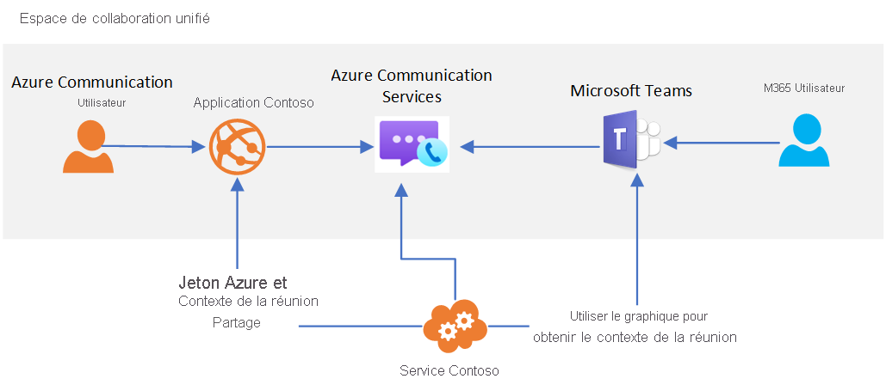

# Interopérabilité de Teams

> [!IMPORTANT]
> Pour activer/désactiver l’[interopérabilité des locataires Teams](../concepts/teams-interop.md), remplissez [ce formulaire](https://forms.office.com/Pages/ResponsePage.aspx?id=v4j5cvGGr0GRqy180BHbR21ouQM6BHtHiripswZoZsdURDQ5SUNQTElKR0VZU0VUU1hMOTBBMVhESS4u).

Azure Communication Services peut être utilisé pour créer des expériences de réunion personnalisées qui interagissent avec Microsoft Teams. Les utilisateurs de vos solutions Communication Services peuvent interagir avec des participants Teams via l’audio, la vidéo, la conversation et le partage d’écran.

L’interopérabilité avec Teams vous permet de créer des applications personnalisées qui connectent des utilisateurs à des réunions Teams. Les utilisateurs de vos applications personnalisées n’ont pas besoin d’avoir des identités Azure Active Directory ou des licences Teams pour bénéficier de cette fonctionnalité. C’est idéal pour réunir de façon transparente des employés (qui peuvent être familiarisés avec Teams) et des utilisateurs externes (par le biais d’une expérience d’application personnalisée). Par exemple :

1. Les employés utilisent Teams pour planifier une réunion 
1. Les détails des réunions sont partagés avec des utilisateurs externes via votre application personnalisée.
   * **En utilisant l’API Graph** Votre application Communication Services personnalisée utilise les API Microsoft Graph pour accéder aux détails de la réunion à partager. 
   * **En utilisant d’autres options** Par exemple, le lien de votre réunion peut être copié à partir de votre calendrier dans Microsoft Teams.
1. Les utilisateurs externes utilisent votre application personnalisée pour rejoindre la réunion Teams (via les bibliothèques de client Communication Services Calling et Chat).

L’architecture générale de ce cas d’usage se présente comme suit : 

Tandis que certaines fonctionnalités de réunion de Teams comme la main levée, le mode Ensemble et les salles pour petit groupe sont disponibles seulement pour les utilisateurs Teams, votre application personnalisée a accès aux principales fonctionnalités audio, vidéo, conversation et partage d’écran de la réunion. La conversation de réunion sera accessible à votre utilisateur d’application personnalisée pendant l’appel. Il ne pourra pas envoyer ou recevoir de messages avant de rejoindre ou de quitter l’appel. 

Quand un utilisateur Communication Services rejoint la réunion Teams, le nom complet fourni par le biais de la bibliothèque de client Calling est présenté aux utilisateurs Teams. Sinon, l’utilisateur Communication Services est traité comme un utilisateur anonyme dans Teams.  Votre application personnalisée doit envisager l’authentification des utilisateurs et d’autres mesures de sécurité pour protéger les réunions Teams. Pensez à ce que cela implique en terme de sécurité si vous autorisez les utilisateurs anonymes à rejoindre des réunions et utilisez le [Guide sur la sécurité de Teams](/microsoftteams/teams-security-guide#addressing-threats-to-teams-meetings) pour configurer les fonctionnalités disponibles pour les utilisateurs anonymes.

L’interopérabilité entre Communication Services et Teams est actuellement en préversion privée. Quand elle sera en disponibilité générale, les utilisateurs Communication Services sont traités comme des « utilisateurs avec accès externe ». Pour plus d’informations sur l’accès externe, consultez [Appeler, converser et collaborer avec des personnes extérieures à votre organisation dans Microsoft Teams](/microsoftteams/communicate-with-users-from-other-organizations).

Les utilisateurs Communication Services peuvent rejoindre les réunions Teams planifiées tant que les participations anonymes sont autorisées dans les [paramètres de la réunion](/microsoftteams/meeting-settings-in-teams).

## Teams dans les clouds gouvernementaux (GCC)
L’interopérabilité d’Azure Communication Services n’est pour l’instant pas compatible avec les déploiement Teams utilisant des [clouds gouvernementaux (GCC) Microsoft 365](/MicrosoftTeams/plan-for-government-gcc). 

## Étapes suivantes

> [!div class="nextstepaction"]
> [Joindre votre application d’appel à une réunion Teams](../quickstarts/voice-video-calling/get-started-teams-interop.md)