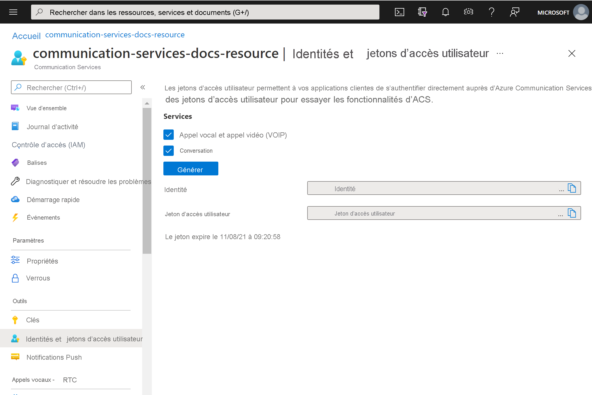

# <a name="quickstart-quickly-create-azure-communication-services-access-tokens-for-testing"></a>Démarrage rapide : Créer rapidement des jetons d’accès Azure Communication Services à des fins de test

Dans l’extension Communication Services du [portail Azure](https://portal.azure.com), vous pouvez générer une identité et un jeton d’accès Communication Services. Vous pouvez ainsi éviter de créer un service d’authentification, ce qui vous permet de tester plus facilement les exemples d’applications et des scénarios de développement simples. Cette fonctionnalité est destinée à la validation et aux tests à petite échelle et ne doit pas être utilisée pour des scénarios de production. Pour le code de production, reportez-vous au [démarrage rapide relatif à la création de jetons d’accès](../access-tokens.md).

L’outil présente le comportement de ```Identity SDK``` dans une expérience utilisateur simple. Les jetons et les identités créés à l’aide de cet outil suivent les mêmes comportements et règles que s’ils avaient été créés à l’aide de ```Identity SDK```.  Par exemple, les jetons d’accès expirent après 24 heures.

## <a name="prerequisites"></a>Prérequis

- Une [ressource Azure Communication Services](../create-communication-resource.md)

## <a name="create-the-access-tokens"></a>Créer les jetons d’accès

Dans le [portail Azure](https://portal.azure.com), accédez au panneau **Identités et jetons d’accès utilisateur** de votre ressource Communication Services. 

Choisissez l’étendue des jetons d’accès. Vous pouvez sélectionner aucun, un ou plusieurs. Cliquez sur **Générer**.


Vous verrez qu’une identité et un jeton d’accès utilisateur correspondant sont générés. Vous pouvez copier ces chaînes et les utiliser dans les [exemples d’applications](../../samples/overview.md) et d’autres scénarios de test.



## <a name="next-steps"></a>Étapes suivantes


Vous voudrez peut-être aussi :

 - [Découvrir l’authentification](../../concepts/authentication.md)
 - [En savoir plus sur l’architecture client et serveur](../../concepts/client-and-server-architecture.md)
