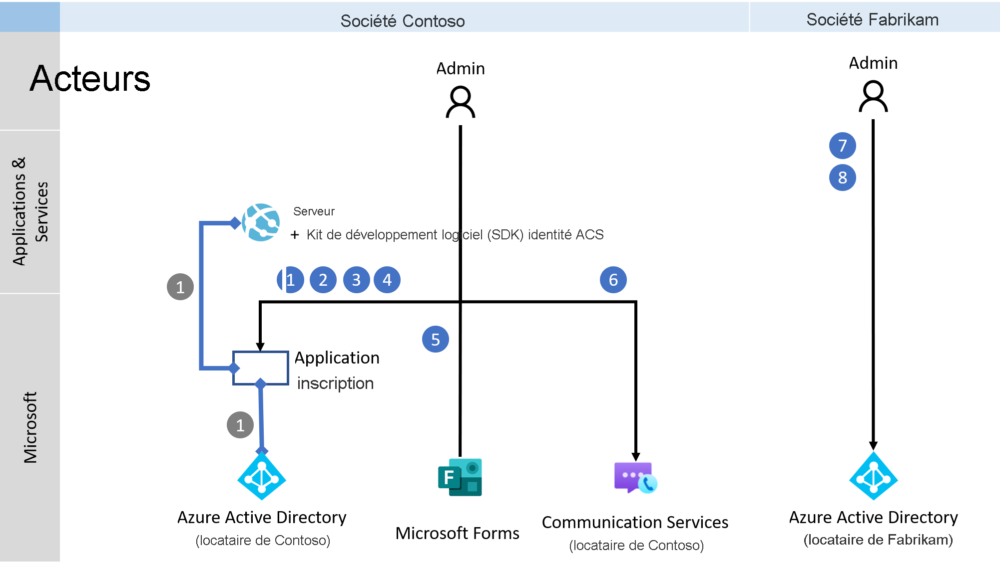
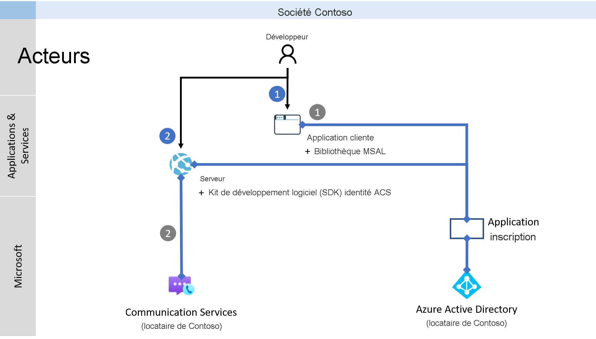
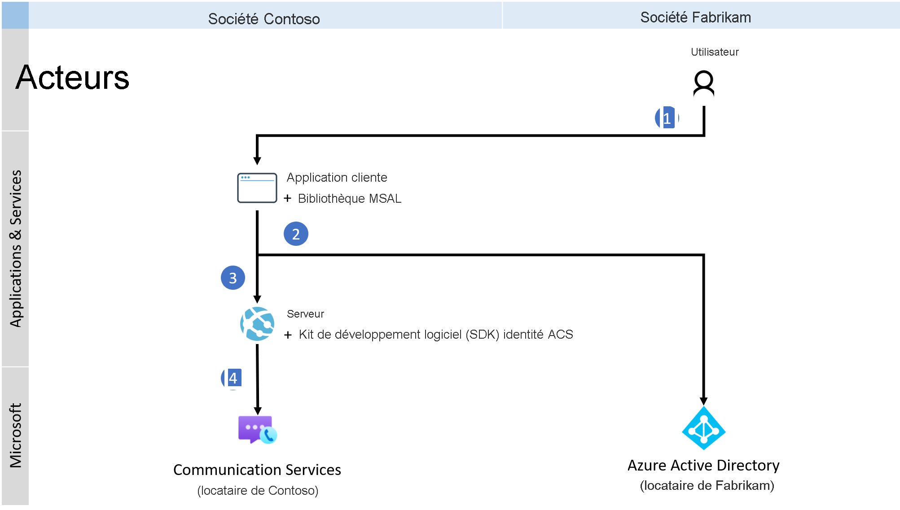

# <a name="quickstart-set-up-and-manage-teams-access-tokens"></a>Démarrage rapide : Configurer et gérer des jetons d’accès Teams

> [!IMPORTANT]
> Pour activer ou désactiver l’expérience de point de terminaison personnalisé Teams, [complétez et envoyez ce formulaire](https://forms.office.com/r/B8p5KqCH19).

Dans ce guide de démarrage rapide, vous allez créer une application console .NET pour authentifier un utilisateur Microsoft 365 en utilisant la bibliothèque d’authentification Microsoft (MSAL) et en récupérant un jeton utilisateur Azure Active Directory (Azure AD). Vous échangerez ensuite ce jeton contre un jeton d’accès Teams avec le kit SDK Azure Communication Services Identity. Le jeton d’accès Teams peut ensuite être utilisé par le kit SDK Communication Services Calling pour créer un point de terminaison personnalisé Teams.

> [!NOTE]
> Quand vous êtes dans un environnement de production, nous vous recommandons d’implémenter ce mécanisme d’échange dans les services back-end, car les demandes d’échange sont signées avec un secret.

## <a name="prerequisites"></a>Prérequis
- Compte Azure avec un abonnement actif. [Créez un compte gratuitement](https://azure.microsoft.com/free/?WT.mc_id=A261C142F).
- Une ressource Azure Communication Services active et la chaîne de connexion. Pour plus d’informations, consultez [Créer une ressource Azure Communication Services](./create-communication-resource.md).
- Activez une expérience de point de terminaison personnalisé Teams en [complétant et en envoyant ce formulaire](https://forms.office.com/r/B8p5KqCH19).
- Une instance d’Azure Active Directory avec des utilisateurs dotés d’une licence Teams.

## <a name="introduction"></a>Introduction

Les identités Teams sont liées aux locataires dans Azure Active Directory. Votre application peut être utilisée par les utilisateurs du même locataire ou d’un autre. Dans ce guide de démarrage rapide, vous allez utiliser un cas d’usage multilocataire avec plusieurs acteurs : utilisateurs, développeurs et administrateurs des entreprises fictives Contoso et Fabrikam. Dans ce cas d’usage, Contoso est une société qui crée une solution SaaS (software as a service) pour Fabrikam. 

Les sections suivantes vous guident tout au long des étapes destinées aux administrateurs, développeurs et utilisateurs. Les diagrammes illustrent le cas d’usage mutualisé. Si vous utilisez un seul locataire, exécutez toutes les étapes de Contoso et de Fabrikam dans un seul locataire.

## <a name="administrator-actions"></a>Actions de l’administrateur

Le rôle Administrateur dispose d’autorisations étendues dans Azure AD. Les membres de ce rôle peuvent configurer des ressources et lire des informations à partir du portail Azure. Dans le diagramme suivant, vous pouvez voir toutes les actions qui doivent être exécutées par les administrateurs.



1. L’administrateur Contoso crée ou sélectionne une *application* existante dans Azure Active Directory. La propriété *Types de comptes pris en charge* définit si les utilisateurs de différents locataires peuvent s’authentifier auprès de l’application. La propriété *URI de redirection* redirige une demande d’authentification réussie vers le *serveur* Contoso.
1. L’administrateur Contoso étend le manifeste de l’application avec l’autorisation VoIP Communication Services. 
1. L’administrateur Contoso autorise le flux client public pour l’application.
1. L’administrateur Contoso peut éventuellement effectuer une mise à jour.
1. L’administrateur Contoso active l’expérience en [complétant et en envoyant ce formulaire](https://forms.office.com/r/B8p5KqCH19).
1. L’administrateur Contoso crée ou sélectionne des services de communication existants, destinés à être utilisés pour l’authentification des demandes d’échange. Les jetons utilisateur Azure AD sont échangés contre des jetons d’accès Teams. Pour plus d’informations, consultez [Créer et gérer des ressources Communication Services](./create-communication-resource.md).
1. L’administrateur Fabrikam configure un nouveau principal de service pour Communication Services dans le locataire Fabrikam.
1. L’administrateur Fabrikam accorde l’autorisation VoIP Communication Services à l’application Contoso. Cette étape n’est nécessaire que si l’application Contoso n’est pas vérifiée. 

### <a name="step-1-create-an-azure-ad-application-registration-or-select-an-azure-ad-application"></a>Étape 1 : Créer une inscription d’application Azure AD ou sélectionner une application Azure AD 

Les utilisateurs doivent être authentifiés auprès des applications Azure AD avec l’autorisation VoIP Azure Communication Services. Si vous ne disposez pas d’une application que vous souhaitez utiliser pour ce guide de démarrage rapide, vous pouvez créer une inscription d’application. 

Les paramètres d’application suivants influent sur l’expérience :
- La propriété *Types de comptes pris en charge* définit si l’application est monolocataire (« comptes au sein de cet annuaire organisationnel uniquement ») ou multilocataire (« comptes au sein de n’importe quel annuaire organisationnel »). Pour ce scénario, vous pouvez utiliser une configuration multilocataire.
- *URI de redirection* définit l’URI où la demande d’authentification est redirigée après authentification. Pour ce scénario, vous pouvez utiliser **Client public/natif (mobile et bureau)** et entrer **`http://localhost`** comme URI.

Pour des informations plus détaillées, consultez [Inscrire une application auprès de la plateforme d’identités Microsoft](../../active-directory/develop/quickstart-register-app.md#register-an-application). 

Quand l’application est inscrite, un identificateur s’affiche dans la vue d’ensemble. Cet identificateur, *ID d’application (client)* , est utilisé dans les étapes suivantes :

### <a name="step-2-allow-public-client-flows"></a>Étape 2 : Autoriser les flux clients publics

Dans le volet **Authentification** de votre application, vous pouvez voir une plateforme configurée pour le *Client public/natif (mobile et bureau)* avec l’URI de redirection pointant vers *localhost*. En bas du volet se trouve un bouton bascule *Autoriser les flux clients publics*, qui, pour ce guide démarrage rapide, doit être défini sur **Oui**.

### <a name="step-3-optional-update-the-publisher-domain"></a>Étape 3 : (Facultatif) Mettre à jour le domaine d’éditeur 
Dans le volet **Personnalisation**, vous pouvez mettre à jour votre domaine d’éditeur pour l’application. Cela est utile dans le cas d’une application mutualisée, où l’application est marquée comme vérifiée par Azure. Pour plus d’informations, consultez [Configurer un domaine d’éditeur d’application](../../active-directory/develop/howto-configure-publisher-domain.md).

### <a name="step-4-define-the-communication-services-voip-permission-in-the-application"></a>Étape 4 : Définir l’autorisation VoIP Communication Services dans l’application

Accédez aux détails de l’application, sélectionnez le volet **Manifeste**, puis recherchez la propriété *requiredResourceAccess*. Il s’agit d’un tableau d’objets qui définissent les autorisations de l’application. Étendez le manifeste avec les autorisations VoIP pour l’instance Communication Services de l’application principale. Ajoutez l’objet suivant au tableau :

> [!NOTE] 
> Ne changez pas les GUID dans l’extrait de code, car ils identifient de manière unique l’application et les autorisations.

```json
{
   "resourceAppId": "1fd5118e-2576-4263-8130-9503064c837a",
   "resourceAccess": [
      {
         "id": "31f1efa3-6f54-4008-ac59-1bf1f0ff9958",
         "type": "Scope"
      }
   ]
}
```

Pour conserver les modifications, sélectionnez **Enregistrer**. Vous pouvez maintenant voir l’autorisation *VoIP Azure Communication Services* dans le volet **Autorisations de l’API**.

### <a name="step-5-enable-a-custom-teams-endpoint-experience-for-the-application"></a>Étape 5 : Activer une expérience de point de terminaison personnalisé Teams pour l’application

Pour activer l’expérience de point de terminaison personnalisé Teams pour l’application, l’administrateur Azure AD [complète et envoie ce formulaire](https://forms.office.com/r/B8p5KqCH19).

### <a name="step-6-create-or-select-a-communication-services-resource"></a>Étape 6 : Créer ou sélectionner une ressource Communication Services

Votre ressource Communication Services est utilisée pour authentifier toutes les demandes d’échange de jetons utilisateur Azure AD contre des jetons d’accès Teams. Vous pouvez déclencher cet échange avec le SDK Communication Services Identity, que vous pouvez authentifier avec une clé d’accès ou en utilisant le contrôle d’accès en fonction du rôle (RBAC) Azure. Vous pouvez récupérer la clé d’accès dans le portail Azure ou en configurant Azure RBAC dans le volet **Contrôle d’accès (IAM)** .

Si vous souhaitez créer des ressources Communication Services, consultez [Créer et gérer des ressources Communication Services](./create-communication-resource.md).

### <a name="step-7-set-up-a-communication-services-service-principal"></a>Étape 7 : Configurer un principal de service Communication Services

Pour activer une expérience de point de terminaison personnalisé Teams dans le locataire Fabrikam, l’administrateur Azure AD Fabrikam doit configurer un principal de service nommé Azure Communication Services avec l’ID d’application *1fd5118e-2576-4263-8130-9503064c837a*. Si vous ne voyez pas cette application dans le volet **Applications d’entreprise** d’Azure Active Directory, vous devez l’ajouter manuellement.

L’administrateur Azure AD Fabrikam se connecte au locataire Azure via PowerShell. 

> [!NOTE]
> Dans la commande suivante, remplacez [Tenant_ID] par l’ID de votre locataire, que vous trouverez dans le portail Azure, dans la page de présentation de l’instance Azure AD.

```azurepowershell
Connect-AzureAD -TenantId "[Tenant_ID]"
```

Si vous recevez une erreur « commande introuvable », cela signifie que le module AzureAD n’est pas installé dans PowerShell. Fermez PowerShell, puis rouvrez-le en tant qu’administrateur. Vous pouvez maintenant installer le package AzureAD en exécutant la commande suivante :

```azurepowershell
Install-Module AzureAD
```

Une fois connecté et authentifié auprès du portail Azure, configurez le principal Communication Services en exécutant la commande suivante : 

> [!NOTE]
> Le paramètre AppId fait référence aux ressources Communication Services de l’application principale. Ne changez pas cette valeur.

```azurepowershell
New-AzureADServicePrincipal -AppId "1fd5118e-2576-4263-8130-9503064c837a"
```

### <a name="step-8-provide-administrator-consent"></a>Étape 8 : Fournir le consentement de l’administrateur

Si l’application Contoso n’est pas vérifiée, l’administrateur Azure AD doit accorder l’autorisation à l’application Contoso pour VoIP Communication Services. L’administrateur Azure AD Fabrikam fournit son consentement par le biais d’une URL unique. 

Pour construire une URL de consentement d’administrateur, l’administrateur Azure AD Fabrikam effectue les opérations suivantes :

1. Dans l’URL *https://login.microsoftonline.com/{Tenant_ID}/adminconsent?client_id={Application_ID}* , l’administrateur remplace {Tenant_ID} par l’ID du locataire Fabrikam et remplace {Application_ID} par l’ID de l’application Contoso.
1. L’administrateur se connecte et accorde des autorisations pour le compte de l’organisation.

Dans le locataire Fabrikam, le principal de service de l’application Contoso est créé si le consentement est accordé. L’administrateur Fabrikam peut examiner le consentement dans Azure AD en procédant comme suit :

1. Connectez-vous au portail Azure en tant qu’administrateur.
1. Accédez à Azure Active Directory.
1. Dans le volet **Applications d’entreprise**, définissez le filtre **Type d’application** sur **Toutes les applications**.
1. Dans le champ de filtrage des applications, entrez le nom de l’application Contoso.
1. Sélectionnez **Appliquer**.
1. Sélectionnez le principal de service en utilisant le nom requis. 
1. Accédez au volet **Autorisations**.

Vous pouvez voir que l’état de l’autorisation VoIP Azure Communication Services est *Accordé pour {Directory_name}* .

## <a name="developer-actions"></a>Actions du développeur

Le développeur Contoso doit configurer l’*application cliente* pour authentifier les utilisateurs. Le développeur doit ensuite créer un point de terminaison sur le *serveur* back-end pour traiter le jeton utilisateur Azure AD après redirection. Une fois reçu, le jeton utilisateur Azure AD est échangé contre le jeton d’accès Teams et retourné à l’*application cliente*. 

Les actions requises du développeur sont présentées dans le diagramme suivant :



1. Le développeur Contoso configure la bibliothèque MSAL pour authentifier l’utilisateur de l’application qui a été créée par l’administrateur pour l’autorisation VoIP Communication Services.
1. Le développeur Contoso initialise le SDK Communication Services Identity et échange le jeton utilisateur Azure AD entrant contre le jeton d’accès Teams par le biais du SDK. Le jeton d’accès Teams est ensuite retourné à l’*application cliente*.

En utilisant la bibliothèque d’authentification Microsoft, les développeurs peuvent acquérir des jetons utilisateur Azure AD à partir du point de terminaison de la plateforme d’identités Microsoft afin d’authentifier les utilisateurs et d’accéder aux API web sécurisées. Elle peut être utilisée pour fournir un accès sécurisé à Communication Services. La bibliothèque MSAL prend en charge de nombreuses architectures et plateformes d’application différentes, notamment .NET, JavaScript, Java, Python, Android et iOS.

Pour plus d’informations sur la configuration des environnements dans la documentation publique, consultez [Vue d’ensemble de la bibliothèque d’authentification Microsoft](../../active-directory/develop/msal-overview.md).

> [!NOTE]
> Les sections suivantes expliquent comment échanger le jeton d’accès Azure AD contre le jeton d’accès Teams pour l’application console dans .NET.

### <a name="create-a-new-application"></a>Créer une application

Dans une fenêtre de console (par exemple cmd, PowerShell ou Bash), utilisez la commande `dotnet new` pour créer une application console avec le nom `TeamsAccessTokensQuickstart`. Cette commande crée un projet C# simple nommé « Hello World » avec un seul fichier source : *Program.cs*.

```console
dotnet new console -o TeamsAccessTokensQuickstart
```

Remplacez votre répertoire par le dossier d’application que vous venez de créer, puis utilisez la commande `dotnet build` pour compiler votre application.

```console
cd TeamsAccessTokensQuickstart
dotnet build
```
#### <a name="install-the-package"></a>Installer le package
Alors que vous êtes toujours dans le répertoire de l’application, installez le package de la bibliothèque Azure Communication Services Identity pour .NET en utilisant la commande `dotnet add package`.

```console
dotnet add package Azure.Communication.Identity
dotnet add package Microsoft.Identity.Client
```

#### <a name="set-up-the-app-framework"></a>Configurer le framework d’application

À partir du répertoire du projet, procédez comme suit :

1. Ouvrez le fichier *Program.cs* dans un éditeur de texte.
1. Ajoutez une directive `using` pour inclure les espaces de noms suivants : 
    - Azure.Communication
    - Azure.Communication.Identity
    - Microsoft.Identity.Client
1. Mettez à jour la déclaration de la méthode `Main` pour prendre en charge le code `async`.

Pour commencer, utilisez le code suivant :

```csharp
using System;
using System.Text;
using Azure.Communication;
using Azure.Communication.Identity;
using Microsoft.Identity.Client;

namespace TeamsAccessTokensQuickstart
{
    class Program
    {
        static async System.Threading.Tasks.Task Main(string[] args)
        {
            Console.WriteLine("Azure Communication Services – Teams access tokens quickstart");

            // Quickstart code goes here
        }
    }
}
```

### <a name="step-1-receive-the-azure-ad-user-token-via-the-msal-library"></a>Étape 1 : Recevoir le jeton utilisateur Azure AD par le biais de la bibliothèque MSAL

Utilisez la bibliothèque MSAL pour authentifier les utilisateurs auprès d’Azure AD pour l’application Contoso avec l’autorisation VoIP Communication Services. Configurez le client pour l’application Contoso (*paramètre applicationId*) dans le cloud public (*paramètre authority*). Le jeton utilisateur Azure AD sera renvoyé à l’URI de redirection (*paramètre redirectUri*). Les informations d’identification sont extraites de la fenêtre contextuelle interactive, qui s’ouvre dans votre navigateur par défaut.

> [!NOTE] 
> L’URI de redirection doit correspondre à la valeur définie dans l’application. Consultez la première étape du Guide de l’administrateur pour savoir comment configurer l’URI de redirection.

```csharp
const string applicationId = "Contoso's_Application_ID";
const string authority = "https://login.microsoftonline.com/common";
const string redirectUri = "http://localhost";

var client = PublicClientApplicationBuilder
                .Create(applicationId)
                .WithAuthority(authority)
                .WithRedirectUri(redirectUri)
                .Build();

const string scope = "https://auth.msft.communication.azure.com/VoIP";

var aadUserToken = await client.AcquireTokenInteractive(new[] { scope }).ExecuteAsync();

Console.WriteLine("\nAuthenticated user: " + aadUserToken.Account.Username);
Console.WriteLine("AAD user token expires on: " + aadUserToken.ExpiresOn);
```

La variable *aadUserToken* contient désormais un jeton utilisateur Azure AD valide, qui sera utilisé pour l’échange.

### <a name="step-2-exchange-the-azure-ad-user-token-for-the-teams-access-token"></a>Étape 2 : Échanger le jeton utilisateur Azure AD contre le jeton d’accès Teams

Le jeton utilisateur Azure AD valide authentifie les utilisateurs auprès d’Azure AD pour l’application principale avec l’autorisation VoIP Communication Services. Le code suivant est utilisé par le SDK Communication Services Identity pour faciliter l’échange du jeton utilisateur Azure AD contre le jeton d’accès Teams.

> [!NOTE]
> Dans le code suivant, remplacez la valeur « \<Connection-String> » par une chaîne de connexion valide, ou utilisez Azure RBAC pour l’authentification. Pour plus d’informations, consultez [Démarrage rapide : Créer et gérer des jetons d’accès](./access-tokens.md).

```csharp
var identityClient = new CommunicationIdentityClient("<Connection-String>");
var teamsAccessToken = identityClient.ExchangeTeamsToken(aadUserToken.AccessToken);

Console.WriteLine("\nTeams access token expires on: " + teamsAccessToken.Value.ExpiresOn);
```

Si toutes les conditions requises sont remplies, vous obtenez un jeton d’accès Teams qui est valide pendant 24 heures.

#### <a name="run-the-code"></a>Exécuter le code
Exécutez l’application à partir de votre répertoire d’application avec la commande `dotnet run`.

```console
dotnet run
```

La sortie de l’application décrit chaque action terminée :

```console
Azure Communication Services - Teams access tokens quickstart

Authenticated user: john.smith@contoso.com
Azure AD user token expires on: 6/10/2021 10:13:17 AM +00:00

Teams access token expires on: 6/11/2021 9:13:18 AM +00:00
```

## <a name="user-actions"></a>Actions utilisateur

L’utilisateur représente les utilisateurs Fabrikam de l’application Contoso. L’expérience utilisateur est présentée dans le diagramme suivant :



1. L’utilisateur Fabrikam utilise l’*application cliente* Contoso et est invité à s’authentifier.
1. L’*application cliente* Contoso utilise la bibliothèque MSAL pour authentifier l’utilisateur auprès du locataire Azure AD Fabrikam pour l’application Contoso avec l’autorisation VoIP Communication Services. 
1. L’authentification est redirigée vers le *serveur* comme défini dans la propriété *URI de redirection* dans MSAL et l’application Contoso.
1. Le *serveur* Contoso échange le jeton utilisateur Azure AD contre le jeton d’accès Teams en utilisant le SDK Communication Services Identity et renvoie le jeton d’accès Teams à l’*application cliente*.

Moyennant un jeton d’accès Teams valide dans l’*application cliente*, les développeurs peuvent intégrer le SDK Communication Services Calling et créer un point de terminaison personnalisé Teams.

## <a name="next-steps"></a>Étapes suivantes

Dans ce démarrage rapide, vous avez appris comment :

> [!div class="checklist"]
> * Créer et configurer une application dans Azure AD.
> * Utiliser la bibliothèque MSAL pour émettre un jeton utilisateur Azure AD.
> * Utiliser le SDK Communication Services Identity pour échanger le jeton utilisateur Azure AD contre un jeton d’accès Teams.

Découvrez les concepts suivants :

- [Point de terminaison personnalisé Teams](../concepts/teams-endpoint.md)
- [Interopérabilité de Teams](../concepts/teams-interop.md)