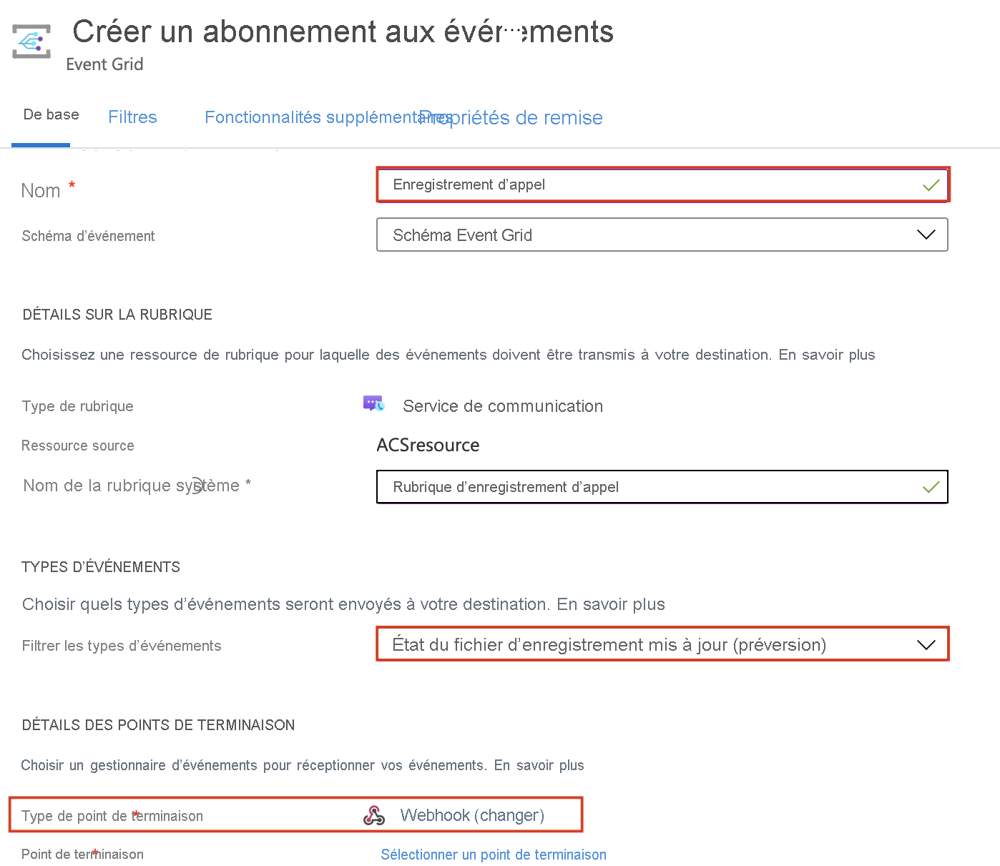

# <a name="record-and-download-calls-with-event-grid"></a>Enregistrer et télécharger des appels avec Event Grid

[!INCLUDE [Private Preview Notice](../../includes/private-preview-include.md)]

Faites vos premiers pas avec Azure Communication Services en enregistrant vos appels Communication Services à l’aide d’Azure Event Grid.

## <a name="prerequisites"></a>Prérequis
- Compte Azure avec un abonnement actif. [Créez un compte gratuitement](https://azure.microsoft.com/free/?WT.mc_id=A261C142F).
- Une ressource Communication Services active. [Créez une ressource Communication Services](../create-communication-resource.md?pivots=platform-azp&tabs=windows).
- Le package NuGet [`Microsoft.Azure.EventGrid`](https://www.nuget.org/packages/Microsoft.Azure.EventGrid/).

## <a name="create-a-webhook-and-subscribe-to-the-recording-events"></a>Créer un webhook et s’abonner aux événements d’enregistrement
Nous utiliserons des *webhooks* et des *événements* pour faciliter l’enregistrement des appels et les téléchargements de fichiers multimédias. 

Nous allons tout d’abord créer un webhook. Votre ressource Communication Services utilisera Event Grid pour notifier ce webhook lorsque l’événement `recording` sera déclenché, et il l’avertira de nouveau lorsque le fichier multimédia enregistré sera prêt à être téléchargé.

Vous pouvez écrire votre propre webhook personnalisé pour recevoir ces notifications d’événements. Il est important que ce webhook réponde aux messages entrants avec le code de validation pour abonner correctement le webhook auprès du service d’événements.

```csharp
[HttpPost]
public async Task<ActionResult> PostAsync([FromBody] object request)
  {
   //Deserializing the request 
    var eventGridEvent = JsonConvert.DeserializeObject<EventGridEvent[]>(request.ToString())
        .FirstOrDefault();
    var data = eventGridEvent.Data as JObject;

    // Validate whether EventType is of "Microsoft.EventGrid.SubscriptionValidationEvent"
    if (string.Equals(eventGridEvent.EventType, EventTypes.EventGridSubscriptionValidationEvent, StringComparison.OrdinalIgnoreCase))
   {
        var eventData = data.ToObject<SubscriptionValidationEventData>();
        var responseData = new SubscriptionValidationResponseData
        {
            ValidationResponse = eventData.ValidationCode
        };
        if (responseData.ValidationResponse != null)
        {
            return Ok(responseData);
        }
    }

    // Implement your logic here.
    ...
    ...
  }
```

Le code ci-dessus dépend du package NuGet `Microsoft.Azure.EventGrid`. Pour en savoir plus sur la validation du point de terminaison Event Grid, consultez la [documentation sur la validation des points de terminaison](../../../event-grid/receive-events.md#endpoint-validation)

Nous abonnerons ensuite ce webhook à l’événement `recording` :

1. Dans votre ressource Azure Communication Services, sélectionnez le volet `Events`.
2. Sélectionnez `Event Subscription` comme illustré ci-dessous.

3. Configurez l’abonnement à un événement et sélectionnez `Call Recording File Status Update` en tant que `Event Type`. Sélectionnez `Webhook` en tant que `Endpoint type`.

4. Entrez l’URL de votre webhook dans `Subscriber Endpoint`.


Votre webhook sera désormais averti à chaque fois que votre ressource Communication Services sera utilisée pour enregistrer un appel.

## <a name="notification-schema"></a>Schéma de notification
Lorsque l’enregistrement sera disponible au téléchargement, votre ressource Communication Services émettra une notification avec le schéma d’événement suivant. Les ID de document de l’enregistrement peuvent être récupérés à partir des champs `documentId` de chaque `recordingChunk`.

```json
{
    "id": string, // Unique guid for event
    "topic": string, // Azure Communication Services resource id
    "subject": string, // /recording/call/{call-id}
    "data": {
        "recordingStorageInfo": {
            "recordingChunks": [
                {
                    "documentId": string, // Document id for retrieving from AMS storage
                    "index": int, // Index providing ordering for this chunk in the entire recording
                    "endReason": string, // Reason for chunk ending: "SessionEnded", "ChunkMaximumSizeExceeded”, etc.
                }
            ]
        },
        "recordingStartTime": string, // ISO 8601 date time for the start of the recording
        "recordingDurationMs": int, // Duration of recording in milliseconds
        "sessionEndReason": string // Reason for call ending: "CallEnded", "InitiatorLeft”, etc.
    },
    "eventType": string, // "Microsoft.Communication.RecordingFileStatusUpdated"
    "dataVersion": string, // "1.0"
    "metadataVersion": string, // "1"
    "eventTime": string // ISO 8601 date time for when the event was created
}

```

## <a name="download-the-recorded-media-files"></a>Télécharger les fichiers multimédias enregistrés

Une fois que nous obtenons l’ID de document du fichier que nous voulons télécharger, nous appelons les API Azure Communication Services ci-dessous pour télécharger les métadonnées et les données multimédias enregistrées en utilisant l’authentification HMAC.

La taille maximale du fichier d’enregistrement est de 1,5 Go. Lorsque cette taille de fichier est dépassée, l’enregistreur fractionne automatiquement les données multimédias enregistrées en plusieurs fichiers.

Le client doit être en mesure de télécharger tous les fichiers multimédias avec une seule requête. En cas de problème, le client peut réessayer avec un en-tête de plage pour éviter de retélécharger les segments qui ont déjà été téléchargés.

Pour télécharger les données multimédias enregistrées : 
- Méthode : `GET` 
- URL : https://contoso.communication.azure.com/recording/download/{documentId}?api-version=2021-04-15-preview1

Pour télécharger les métadonnées multimédias enregistrées : 
- Méthode : `GET` 
- URL : https://contoso.communication.azure.com/recording/download/{documentId}/metadata?api-version=2021-04-15-preview1


### <a name="authentication"></a>Authentification
Pour télécharger les métadonnées et les données multimédias enregistrées, utilisez l’authentification HMAC qui permet d’authentifier la requête auprès des API Azure Communication Services.

Créez un `HttpClient` et ajoutez les en-têtes nécessaires à l’aide de `HmacAuthenticationUtils` fourni ci-dessous :

```csharp
  var client = new HttpClient();

  // Set Http Method
  var method = HttpMethod.Get;
  StringContent content = null;

  // Build request
  var request = new HttpRequestMessage
  {
      Method = method, // Http GET method
      RequestUri = new Uri(<Download_Recording_Url>), // Download recording Url
      Content = content // content if required for POST methods
  };

  // Question: Why do we need to pass String.Empty to CreateContentHash() method?
  // Answer: In HMAC authentication, the hash of the content is one of the parameters used to generate the HMAC token.
  // In our case our recording download APIs are GET methods and do not have any content/body to be passed in the request. 
  // However in this case we still need the SHA256 hash for the empty content and hence we pass an empty string. 


  string serializedPayload = string.Empty;

  // Hash the content of the request.
  var contentHashed = HmacAuthenticationUtils.CreateContentHash(serializedPayload);

  // Add HMAC headers.
  HmacAuthenticationUtils.AddHmacHeaders(request, contentHashed, accessKey, method);

  // Make a request to the Azure Communication Services APIs mentioned above
  var response = await client.SendAsync(request).ConfigureAwait(false);
```

#### <a name="hmacauthenticationutils"></a>HmacAuthenticationUtils 
Les utilitaires ci-après peuvent servir à gérer votre workflow HMAC.

**Créer un hachage de contenu**

```csharp
public static string CreateContentHash(string content)
{
    var alg = SHA256.Create();

    using (var memoryStream = new MemoryStream())
    using (var contentHashStream = new CryptoStream(memoryStream, alg, CryptoStreamMode.Write))
    {
        using (var swEncrypt = new StreamWriter(contentHashStream))
        {
            if (content != null)
            {
                swEncrypt.Write(content);
            }
        }
    }

    return Convert.ToBase64String(alg.Hash);
}
```

**Ajouter des en-têtes HMAC**

```csharp
public static void AddHmacHeaders(HttpRequestMessage requestMessage, string contentHash, string accessKey)
{
    var utcNowString = DateTimeOffset.UtcNow.ToString("r", CultureInfo.InvariantCulture);
    var uri = requestMessage.RequestUri;
    var host = uri.Authority;
    var pathAndQuery = uri.PathAndQuery;

    var stringToSign = $"{requestMessage.Method}\n{pathAndQuery}\n{utcNowString};{host};{contentHash}";
    var hmac = new HMACSHA256(Convert.FromBase64String(accessKey));
    var hash = hmac.ComputeHash(Encoding.ASCII.GetBytes(stringToSign));
    var signature = Convert.ToBase64String(hash);
    var authorization = $"HMAC-SHA256 SignedHeaders=date;host;x-ms-content-sha256&Signature={signature}";

    requestMessage.Headers.Add("x-ms-content-sha256", contentHash);
    requestMessage.Headers.Add("Date", utcNowString);
    requestMessage.Headers.Add("Authorization", authorization);
}
```

## <a name="clean-up-resources"></a>Nettoyer les ressources
Si vous voulez nettoyer et supprimer un abonnement Communication Services, vous pouvez supprimer la ressource ou le groupe de ressources. La suppression du groupe de ressources efface également les autres ressources qui y sont associées. Apprenez-en davantage sur le [nettoyage des ressources](../create-communication-resource.md?pivots=platform-azp&tabs=windows#clean-up-resources).


## <a name="next-steps"></a>Étapes suivantes
Pour plus d’informations, consultez les articles suivants :

- Consultez notre [exemple d’appel web](../../samples/web-calling-sample.md).
- Apprenez-en davantage sur les [fonctionnalités du SDK Calling](./calling-client-samples.md?pivots=platform-web)
- Apprenez-en davantage sur le [fonctionnement des appels](../../concepts/voice-video-calling/about-call-types.md)
