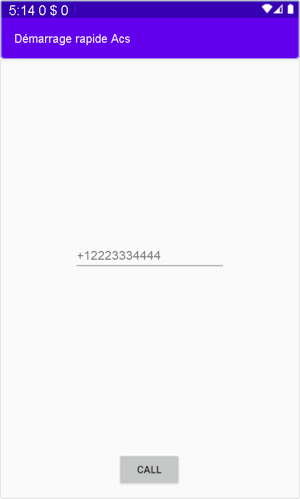

[!INCLUDE [Emergency Calling Notice](../../../../includes/emergency-calling-notice-include.md)]

> [!NOTE]
> Vous trouverez le code finalisé pour ce guide de démarrage rapide sur [GitHub](https://github.com/Azure-Samples/communication-services-android-quickstarts/tree/main/Add%20Telephone%20Calling).

## <a name="prerequisites"></a>Prérequis

- Compte Azure avec un abonnement actif. [Créez un compte gratuitement](https://azure.microsoft.com/free/?WT.mc_id=A261C142F). 
- Une ressource Communication Services déployée. [Créer une ressource Communication Services](../../../create-communication-resource.md)
- Numéro de téléphone acquis dans la ressource Communication Services. [Comment obtenir un numéro de téléphone](../../../telephony-sms/get-phone-number.md).
- Un `User Access Token` pour activer le client d’appel. Pour en savoir plus, consultez [Comment obtenir un `User Access Token`](../../../access-tokens.md)
- Suivez le guide de démarrage rapide pour [prendre en main l’ajout des appels à votre application](../../getting-started-with-calling.md)

### <a name="prerequisite-check"></a>Vérification du prérequis

- Pour voir les numéros de téléphone associés à votre ressource Communication Services, connectez-vous au [portail Azure](https://portal.azure.com/), localisez votre ressource Communication Services, puis ouvrez l’onglet **Phone Numbers** (Numéros de téléphone) dans le volet de navigation gauche.

## <a name="setting-up"></a>Configuration

### <a name="add-pstn-functionality-to-your-app"></a>Ajouter la fonctionnalité RTCP à votre application

Ajoutez le type `PhoneNumber` à votre application en modifiant **MainActivity.Java** :


```java
import com.azure.android.communication.common.PhoneNumberIdentifier;
```

<!--
> [!TBD]
> Namespace based on input from Komivi Agbakpem. But it does not correlates with other use namespaces in Calling Quickstart. E.g: "com.azure.communication.calling.CommunicationUserIdentifier" or "com.azure.communication.common.client.CommunicationTokenCredential". Double-chek this.
-->

## <a name="start-a-call-to-phone"></a>Démarrer un appel téléphonique

Spécifiez le numéro de téléphone que vous avez acquis depuis votre ressource Communication Services. Celui-ci sera utilisé pour démarrer l’appel :

> [!WARNING]
> Notez que les numéros de téléphone doivent être fournis au format standard international E.164. (par exemple +12223334444)

Modifiez le gestionnaire d’événements `startCall()`dans **MainActivity.Java**, afin qu’il gère les appels téléphoniques :

```java
    private void startCall() {
        EditText calleePhoneView = findViewById(R.id.callee_id);
        String calleePhone = calleePhoneView.getText().toString();
        PhoneNumberIdentifier callerPhone = new PhoneNumberIdentifier("+12223334444");
        StartCallOptions options = new StartCallOptions();
        options.setAlternateCallerId(callerPhone);
        options.setVideoOptions(new VideoOptions(null));
        call = agent.startCall(
                getApplicationContext(),
                new PhoneNumberIdentifier[] {new PhoneNumberIdentifier(calleePhone)},
                options);
    }
```

## <a name="launch-the-app-and-call-the-echo-bot"></a>Lancer l’application et appeler le bot d’écho

L’application peut maintenant être lancée à l’aide du bouton « Run App » de la barre d’outils (Maj+F10). Vous pouvez passer un appel téléphonique en fournissant un numéro de téléphone dans le champ texte ajouté et en cliquant sur le bouton **APPELER**.
> [!WARNING]
> Notez que les numéros de téléphone doivent être fournis au format standard international E.164. (par exemple +12223334444)


