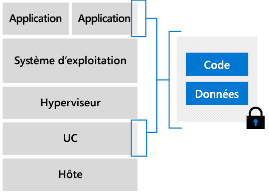

# Vue d’ensemble des machines virtuelles d’informatique confidentielle Azure

Azure est le premier fournisseur de cloud à proposer l’informatique confidentielle dans un environnement virtualisé. Nous avons développé des machines virtuelles qui agissent comme une couche d’abstraction entre le matériel et votre application. Vous pouvez exécuter des charges de travail à grande échelle et avec des options de redondance et de disponibilité.  

## Machines virtuelles compatibles avec Intel SGX

Dans les machines virtuelles d’informatique confidentielle Azure, une partie du matériel du processeur est réservée à une partie du code et des données de votre application. Cette partie restreinte est l’enclave. 

L’infrastructure d’informatique confidentielle Azure se compose actuellement d’une référence SKU spécialisée de machines virtuelles. Ces machines virtuelles s’exécutent sur des processeurs Intel avec Software Guard Extension (Intel SGX). [Intel SGX](https://intel.com/sgx) est le composant qui nous permet de renforcer la protection pour mettre en œuvre l’informatique confidentielle. 

Aujourd’hui, Azure propose la [série DCsv2](https://docs.microsoft.com/azure/virtual-machines/dcv2-series) qui exploite la technologie Intel SGX pour permettre la création d’enclaves basées sur le matériel. Vous pouvez donc créer des applications basées sur des enclaves sécurisées et les exécuter dans la série DCsv2 de machines virtuelles pour protéger les données et le code de votre application en cours d’utilisation. 

[Apprenez-en davantage](virtual-machine-solutions.md) sur le déploiement de machines virtuelles d’informatique confidentielle Azure avec des enclaves approuvées basées sur un matériel.

## Enclaves

Les enclaves sont les parties sécurisées du processeur et de la mémoire d’un matériel. Il n’existe aucun moyen de consulter les données ou le code à l’intérieur de l’enclave, même avec un débogueur. Si du code non fiable tente de modifier le contenu dans la mémoire de l’enclave, l’environnement est désactivé et les opérations sont refusées.

Une enclave est similaire à une boîte sécurisée. Vous placez le code et les données chiffrés dans la boîte noire. De l’extérieur, vous ne voyez rien. Vous donnez à l’enclave une clé pour déchiffrer les données, puis les données sont traitées et rechiffrées avant d’être envoyées hors de l’enclave.

Chaque enclave a une taille définie de cache de pages chiffrées (EPC), qui détermine la quantité de mémoire que peut contenir chaque enclave. Les machines virtuelles DCsv2 de plus grande taille ont davantage de mémoire EPC. Pour obtenir le nombre maximal d’EPC par taille de machine virtuelle, lisez la page [Spécifications DCsv2](https://docs.microsoft.com/azure/virtual-machines/dcv2-series).

### Développement d’applications à exécuter dans des enclaves
Quand vous développez des applications, vous pouvez utiliser des [outils logiciels](application-development.md) pour protéger des parties de votre code et de vos données dans l’enclave. Ces outils garantissent qu’aucune personne extérieure à l’environnement approuvé ne peut consulter ou modifier votre code et vos données. 

## Étapes suivantes
- [Lisez les meilleures pratiques](virtual-machine-solutions.md) pour le déploiement de solutions sur des machines virtuelles d’informatique confidentielle Azure.
- [Déployer une machine virtuelle de série DCsv2](quick-create-portal.md)
- [Développer une application reconnaissant les enclaves](application-development.md) à l’aide du Kit de développement logiciel (SDK) OE