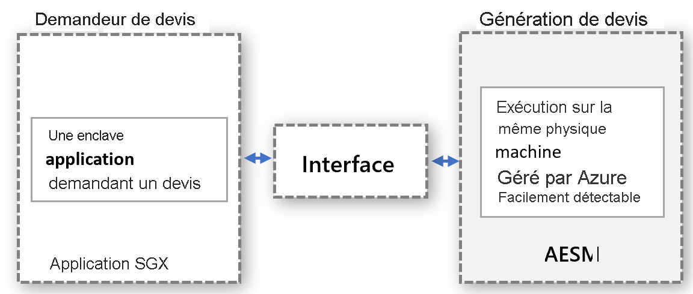

# <a name="platform-software-management-with-sgx-quote-helper-daemon-set-preview"></a>Gestion des logiciels de plateforme avec le DaemonSet SGX Quote Helper (préversion)

Les [applications de l’enclave](confidential-computing-enclaves.md) qui effectuent une attestation à distance doivent générer une déclaration, appelée QUOTE. Cette QUOTE fournit une preuve cryptographique de l’identité et de l’état de l’application, ainsi que de l’environnement où s’exécute l’enclave. La génération de la QUOTE nécessite des composants logiciels de confiance qui font partie des composants logiciels de la plateforme Intel (PSW).

## <a name="overview"></a>Vue d’ensemble
 
Intel prend en charge deux modes d’attestation dans le cadre de la génération de la QUOTE :
- **intraprocessus (in-proc)**  : les composants logiciels de confiance sont hébergés au sein du processus d’application de l’enclave.

- **hors processus (out-of-proc)**  : les composants logiciels de confiance sont hébergés en dehors de l’application de l’enclave.
 
Les applications SGX créées avec le SDK Open Enclave utilisent par défaut le mode d’attestation intraprocessus. Les applications SGX acceptent le mode hors processus, mais nécessitent en plus un hébergement et une exposition des composants requis, comme l’AESM (Architectural Enclave Service Manager), externes à l’application.

L’emploi de cette fonctionnalité est **fortement recommandé** du fait qu’elle augmente le temps d’activité de vos applications enclavées durant les mises à jour de la plateforme Intel ou celles du pilote DCAP.

Pour activer cette fonctionnalité sur un cluster AKS, modifiez la commande add --enable-sgxquotehelper dans l’interface CLI lors de l’activation du module complémentaire d’informatique confidentielle. Des instructions détaillées faisant appel à l’interface CLI sont disponibles [ici](confidential-nodes-aks-get-started.md) : 

```azurecli-interactive
# Create a new AKS cluster with system node pool with Confidential Computing addon enabled and SGX Quote Helper
az aks create -g myResourceGroup --name myAKSCluster --generate-ssh-keys --enable-addon confcom --enable-sgxquotehelper
```

## <a name="why-and-what-are-the-benefits-of-out-of-proc"></a>Quels sont les avantages du mode hors processus ? Pour quelles raisons ?

-   Aucune mise à jour n’est requise pour les composants PSW de génération de QUOTE pour chaque application conteneurisée : Avec le mode hors processus, les propriétaires de conteneur n’ont pas besoin de gérer les mises à jour dans leur conteneur. À la place, ils se reposent sur l’interface du fournisseur qui appelle le service centralisé en dehors du conteneur, lequel est ensuite mis à jour et géré par le fournisseur.

-   Vous n’avez pas à vous soucier des échecs d’attestation provoqués par des composants PSW obsolètes : La génération de QUOTE fait appel aux composants logiciels de confiance QE (Quoting Enclave) et PCE (Provisioning Certificate Enclave), qui font partie de la base TCB (Trusted Computing Base). Ces composants logiciels doivent être à jour pour respecter les exigences d’attestation. Comme c’est le fournisseur qui gère les mises à jour de ces composants, les clients n’auront jamais à s’occuper des échecs d’attestation dus aux composants logiciels de confiance devenus obsolètes dans leur conteneur.

-   Utilisation optimisée de la mémoire EPC. Avec le mode d’attestation intraprocessus, chaque application enclavée doit instancier la copie des composants QE et PCE pour l’attestation à distance. Avec le mode d’attestation hors processus, le conteneur n’a pas besoin d’héberger ces enclaves et, par conséquent, il ne consomme pas de mémoire d’enclave du quota du conteneur.

-   Protection contre l’application du mode noyau. Quand le pilote SGX est chargé dans le noyau Linux, une enclave peut se voir attribuer un privilège plus élevé. Ce privilège donne à l’enclave la possibilité d’appeler le composant PCE, entraînant l’arrêt de l’application exécutée en mode intraprocessus dans l’enclave. Par défaut, les enclaves n’obtiennent pas cette autorisation. L’attribution de ce privilège à une application enclavée nécessite de modifier le processus d’installation de l’application. Cela est facile dans le mode hors processus, car le fournisseur du service qui gère les demandes hors processus s’assurera que le service est installé avec ce privilège.

-   Vous n’avez pas besoin de vérifier la compatibilité descendante avec PSW et DCAP. Les mises à jour des composants PSW de génération de QUOTE sont validées pour la compatibilité descendante par le fournisseur avant leur application. Cela permet de mieux détecter les problèmes de compatibilité en amont et de les résoudre avant de déployer les mises à jour pour les charges de travail confidentielles.

## <a name="how-does-the-out-of-proc-attestation-mode-work-for-confidential-workloads-scenario"></a>Comment le mode d’attestation hors processus fonctionne-t-il dans un scénario de charges de travail confidentielles ?

La conception générale suit le modèle où le demandeur de QUOTE et la génération de QUOTE sont exécutés séparément, mais sur le même ordinateur physique. La génération de QUOTE s’effectue de manière centralisée et répond aux demandes de QUOTE provenant de toutes les entités. L’interface doit être correctement définie et détectable pour permettre à chaque entité de faire une demande de QUOTE.



Le modèle abstrait ci-dessus convient au scénario de charge de travail confidentielle, en tirant parti du service AESM déjà disponible. L’AESM est conteneurisé et déployé en tant que DaemonSet dans le cluster Kubernetes. Kubernetes s’assure qu’une seule instance d’un conteneur de service AESM, incluse dans un pod, soit déployée sur chaque nœud d’agent. Le nouveau DaemonSet SGX Quote aura une dépendance sur le DaemonSet sgx-device-plugin, car le conteneur de service AESM aura besoin de la mémoire EPC dans sgx-device-plugin pour lancer les enclaves QE et PCE.

Chaque conteneur doit activer la génération de QUOTE hors processus en définissant la variable d’environnement **SGX_AESM_ADDR=1** au moment de la création. Le conteneur doit également inclure le package libsgx-quote-ex qui est chargé de rediriger la demande vers le socket de domaine UNIX par défaut.

Une application peut continuer d’utiliser l’attestation intraprocessus comme avant, mais elle ne peut pas utiliser simultanément l’attestation hors processus et l’attestation intraprocessus. L’infrastructure hors processus est disponible par défaut et consomme des ressources.

## <a name="sample-implementation"></a>Exemple d’implémentation

Le fichier docker ci-dessous est un exemple d’application basée sur Open Enclave. Ajoutez la variable d’environnement SGX_AESM_ADDR=1 dans le fichier docker ou définissez-la dans le fichier de déploiement. Consultez l’exemple ci-dessous pour les détails du fichier docker et du fichier YAML de déploiement. 

  > [!Note] 
  > Le package **libsgx-quote-ex** d’Intel doit être inclus dans le conteneur d’application pour que l’attestation hors processus fonctionne correctement.
    
```yaml
# Refer to Intel_SGX_Installation_Guide_Linux for detail
FROM ubuntu:18.04 as sgx_base
RUN apt-get update && apt-get install -y \
    wget \
    gnupg

# Add the repository to sources, and add the key to the list of
# trusted keys used by the apt to authenticate packages
RUN echo "deb [arch=amd64] https://download.01.org/intel-sgx/sgx_repo/ubuntu bionic main" | tee /etc/apt/sources.list.d/intel-sgx.list \
    && wget -qO - https://download.01.org/intel-sgx/sgx_repo/ubuntu/intel-sgx-deb.key | apt-key add -
# Add Microsoft repo for az-dcap-client
RUN echo "deb [arch=amd64] https://packages.microsoft.com/ubuntu/18.04/prod bionic main" | tee /etc/apt/sources.list.d/msprod.list \
    && wget -qO - https://packages.microsoft.com/keys/microsoft.asc | apt-key add -

FROM sgx_base as sgx_sample
RUN apt-get update && apt-get install -y \
    clang-7 \
    libssl-dev \
    gdb \
    libprotobuf10 \
    libsgx-dcap-ql \
    libsgx-quote-ex \
    az-dcap-client \
    open-enclave
WORKDIR /opt/openenclave/share/openenclave/samples/remote_attestation
RUN . /opt/openenclave/share/openenclave/openenclaverc \
    && make build
# this sets the flag for out of proc attestation mode. alternatively you can set this flag on the deployment files
ENV SGX_AESM_ADDR=1 

CMD make run
```
Le mode d’attestation hors processus peut également être défini dans le fichier YAML de déploiement, comme indiqué ci-dessous.

```yaml
apiVersion: batch/v1
kind: Job
metadata:
  name: sgx-test
spec:
  template:
    spec:
      containers:
      - name: sgxtest
        image: <registry>/<repository>:<version>
        env:
        - name: SGX_AESM_ADDR
          value: 1
        resources:
          limits:
            kubernetes.azure.com/sgx_epc_mem_in_MiB: 10
        volumeMounts:
        - name: var-run-aesmd
          mountPath: /var/run/aesmd
      restartPolicy: "Never"
      volumes:
      - name: var-run-aesmd
        hostPath:
          path: /var/run/aesmd
```

## <a name="next-steps"></a>Étapes suivantes
[Provisionner des nœuds confidentiels (de série DCsv2) sur AKS](./confidential-nodes-aks-get-started.md)

[Démarrer rapidement avec des exemples de conteneurs confidentiels](https://github.com/Azure-Samples/confidential-container-samples)

[Liste des références SKU DCsv2](../virtual-machines/dcv2-series.md)

<!-- LINKS - external -->
[Azure Attestation]: ../attestation/index.yml


<!-- LINKS - internal -->
[DC Virtual Machine]: /confidential-computing/virtual-machine-solutions
