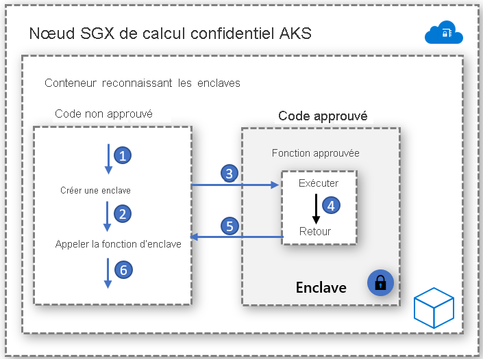

# Conteneurs reconnaissant les enclaves

Une enclave est une région de mémoire protégée qui garantit la confidentialité des données utilisées et du code exécuté. Il s’agit d’une instance d’un environnement TEE (Trusted Execution Environment) sécurisé par le matériel. Les nœuds d’informatique confidentielle sur AKS utilisent [Intel Software Guard Extensions (SGX)](https://software.intel.com/sgx) pour créer des enclaves isolées dans les nœuds entre chaque application conteneur.

Comme les machines virtuelles Intel SGX, les applications conteneur développées pour s’exécuter dans des enclaves ont deux composants :

- Un composant non fiable (appelé hôte) et
- Un composant fiable (appelé enclave)

L’architecture des applications conteneurs reconnaissant les enclaves permet un contrôle maximal de l’implémentation tout en maintenant un faible niveau d’encombrement du code dans l’enclave. Avec moins de code qui s’exécute dans l’enclave, vous réduisez les zones de surface d’attaque.   

## Activateurs

### Ouvrir le kit SDK des enclaves
Open Enclave SDK est une bibliothèque open source non dépendante du matériel destinée au développement d’applications en C et C++ qui utilisent des environnements TEE (Trusted Execution Environment) basés sur le matériel. L’implémentation actuelle assure la prise en charge d’Intel SGX ainsi qu’une prise en charge d’[OP-TEE OS sur Arm TrustZone](https://optee.readthedocs.io/en/latest/general/about.html) en préversion.

Démarrer [ici](https://github.com/openenclave/openenclave/tree/master/docs/GettingStartedDocs) avec une application conteneur basée sur Open Enclave

### Intel SGX SDK
Intel fournit un SDK qui permet de créer des applications SGX pour les charges de travail de conteneurs Linux et Windows. Les conteneurs Windows ne sont actuellement pas pris en charge par les nœuds d’informatique confidentielle AKS.

Démarrer [ici](https://software.intel.com/content/www/us/en/develop/topics/software-guard-extensions/sdk.html) avec des applications basées sur Intel SGX

### CCF (Confidential Consortium Framework)
Le CCF (Confidential Consortium Framework) est un framework open source qui permet de créer une nouvelle catégorie d’applications sécurisées, hautement disponibles et performantes qui utilisent essentiellement des ressources informatiques et données multipartites. CCF permet la mise en place de réseaux confidentiels à grande échelle capables de répondre à des besoins métier critiques. Ce framework accélère l’adoption par l’entreprise et en production des technologies informatiques de blockchain et multipartites en consortium.

Démarrer [ici](https://github.com/Microsoft/CCF) avec l’informatique confidentielle Azure et CCF

### Inférence confidentielle avec le Runtime ONNX

Le Runtime ONNX basé sur une enclave open source établit un canal sécurisé entre le client et le service d’inférence, empêchant ainsi la demande et la réponse de sortir de l’enclave sécurisée. 

Cette solution vous permet d’implémenter un modèle Machine Learning entraîné et de l’exécuter de manière confidentielle tout en sécurisant les échanges entre le client et le serveur au moyen d’une attestation et de vérifications. 

Démarrer [ici](https://aka.ms/confidentialinference) avec le modèle Machine Learning lift-and-shift pour le Runtime ONNX

### Edgeless RT

Edgeless RT est un projet open source qui s’appuie sur le SDK Open Enclave. Il ajoute la prise en charge de Go et de fonctionnalités C++ supplémentaires. Démarrez avec une simple application Go confidentielle à l’aide de votre environnement VS Code usuel [ici](https://github.com/edgelesssys/edgelessrt). Pour les applications Edgeless sur AKS, suivez les instructions [ici](https://github.com/edgelesssys/edgelessrt/blob/master/docs/ERTAzureAKSDeployment.md).

## Exemples d’implémentations basées sur des conteneurs

[Exemples Azure de conteneurs reconnaissant les enclaves sur AKS](https://github.com/Azure-Samples/confidential-computing/tree/main/containersamples)

<!-- LINKS - external -->
[Azure Attestation](../attestation/overview.md)

<!-- LINKS - internal -->
[Machine virtuelle DC](./virtual-machine-solutions.md)
[Conteneurs confidentiels](./confidential-containers.md)