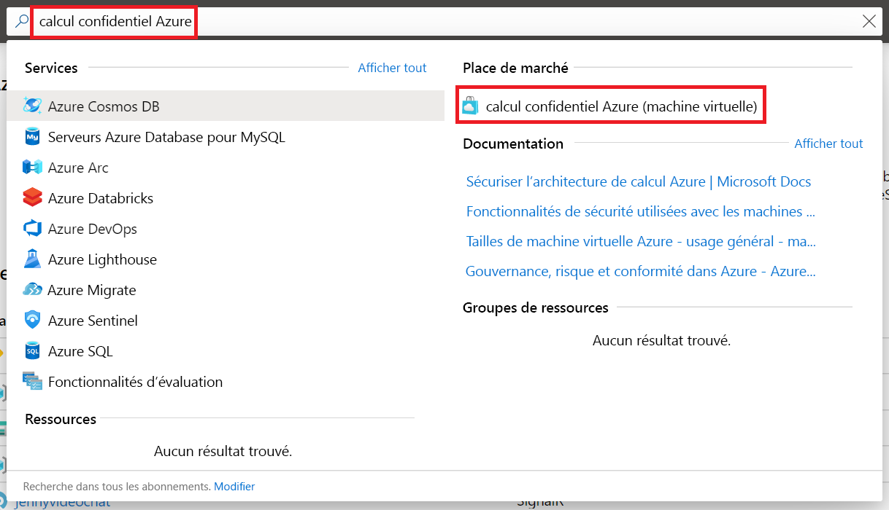
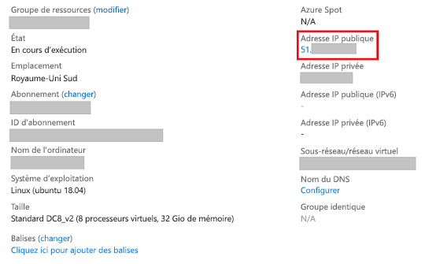

# <a name="quickstart-deploy-an-azure-confidential-computing-vm-in-the-marketplace"></a>Démarrage rapide : Déployer une machine virtuelle d’informatique confidentielle Azure dans la Place de marché

Découvrez comment commencer à utiliser l’informatique confidentielle Azure avec la Place de marché Azure pour créer une machine virtuelle reposant sur Intel SGX. Vous installerez ensuite le kit SDK Open Enclave pour configurer votre environnement de développement. 

Ce tutoriel est recommandé si vous souhaitez démarrer rapidement le déploiement d’une machine virtuelle d’informatique confidentielle. Les machines virtuelles fonctionnent sur du matériel spécialisé et nécessitent des entrées de configuration spécifiques pour fonctionner comme prévu. L’offre de la Place de marché décrite dans ce guide de démarrage rapide facilite le déploiement en restreignant les entrées utilisateur.

Si vous souhaitez déployer une machine virtuelle d’informatique confidentielle avec une configuration plus personnalisée, suivez les [étapes de déploiement d’une machine virtuelle d’informatique confidentielle dans le portail Azure](quick-create-portal.md).

## <a name="prerequisites"></a>Prérequis

Si vous n’avez pas d’abonnement Azure, [créez un compte](https://azure.microsoft.com/pricing/purchase-options/pay-as-you-go/) avant de commencer.

> [!NOTE]
> Les comptes associés à un essai gratuit n’ont pas accès aux machines virtuelles utilisées dans ce tutoriel. Effectuez une mise à niveau vers un abonnement avec paiement à l’utilisation.

## <a name="sign-in-to-azure"></a>Connexion à Azure

1. Connectez-vous au [portail Azure](https://portal.azure.com/).

1. Dans la barre de recherche située en haut, tapez **Informatique confidentielle Azure**.

1. Sélectionnez **Informatique confidentielle Azure (machine virtuelle)** dans la section **Place de marché**. 

        

1. Dans la page d’arrivée du déploiement de l’informatique confidentielle Azure, sélectionnez **Créer**.
 

## <a name="configure-your-virtual-machine"></a>Configurer votre machine virtuelle

1. Sous l’onglet **De base**, sélectionnez votre **Abonnement** et votre **Groupe de ressources**. Votre groupe de ressources doit être vide pour pouvoir y déployer une machine virtuelle à partir de ce modèle.

1. Tapez ou sélectionnez les valeurs suivantes :

   * **Région** : sélectionnez la région Azure qui vous convient.

        > [!NOTE]
        > Les machines virtuelles d’informatique confidentielle fonctionnent uniquement sur du matériel spécialisé disponible dans des régions spécifiques. Pour connaître les régions prenant en charge les machines virtuelles de la série DCsv2, consultez la [liste des produits disponibles par région](https://azure.microsoft.com/global-infrastructure/services/?products=virtual-machines).
    
    * **Choisir une image** : Sélectionnez une image. Si vous souhaitez suivre ce didacticiel spécifique, sélectionnez Ubuntu 18.04 (2e génération). Sinon, vous serez redirigé vers des procédures appropriées ci-dessous. 

    * Dans **Nom de la machine virtuelle**, entrez le nom de votre nouvelle machine virtuelle.

    * **Type d'authentification** : Sélectionnez **Clé publique SSH** si vous créez une machine virtuelle Linux. 

         > [!NOTE]
         > Vous pouvez choisir d’utiliser une clé publique SSH ou un mot de passe pour l’authentification. L’utilisation d’une clé SSH est plus sécurisée. Pour savoir comment générer une clé SSH, consultez [Créer des clés SSH sur Linux et Mac pour les machines virtuelles Linux dans Azure](../virtual-machines/linux/mac-create-ssh-keys.md).

    * **Nom d’utilisateur** : indiquez le nom d’administrateur pour la machine virtuelle.

    * **Clé publique SSH** : le cas échéant, entrez votre clé publique RSA.
    
    * **Mot de passe** : le cas échéant, entrez votre mot de passe pour l’authentification.
 
1. Sélectionnez le bouton **Suivant : Paramètres de machine virtuelle** en bas de l’écran.

    > [!IMPORTANT]
    > Patientez pendant la mise à jour de la page. Vous *ne devriez pas* voir un message indiquant que les machines virtuelles d’informatique confidentielle de la série DCsv2 sont disponibles dans un nombre limité de régions. Si ce message persiste, revenez à la page précédente et sélectionnez une région dans laquelle la série DCsv2 est disponible.

1. Pour **changer la taille**, choisissez une machine virtuelle dotée de capacités d’informatique confidentielle dans le sélecteur de taille. 

    > [!TIP]
    > Vous devriez voir les tailles **DC1s_v2**, **DC2s_v2**, **DC4s_V2** et **DC8_v2**. Seules ces tailles de machines virtuelles prennent actuellement en charge l’informatique confidentielle. [Plus d’informations](virtual-machine-solutions.md)

1. **Type de disque du système d’exploitation** : sélectionnez un type de disque.

1. **Réseau virtuel** : créez-en un ou choisissez une ressource existante.

1. **Sous-réseau** : créez-en un ou choisissez une ressource existante.

1. **Sélectionner des ports d’entrée publics** : choisissez **SSH(Linux)/RDP(Windows)** . Dans ce guide de démarrage rapide, cette étape est nécessaire pour se connecter à la machine virtuelle et terminer la configuration du SDK Open Enclave. 

1. Laissez la case **Diagnostics de démarrage**, décochée pour ce guide de démarrage rapide. 

1. Sélectionnez **Revoir + créer**.

1. Dans le volet **Vérifier + créer**, sélectionnez **Créer**.

> [!NOTE]
> Si vous avez déployé une machine virtuelle Linux, passez à la section suivante de ce tutoriel. Si vous avez déployé une machine virtuelle Windows, [suivez cette procédure pour vous connecter à votre machine virtuelle Windows](../virtual-machines/windows/connect-logon.md), puis [installez le SDK OE sur Windows](https://github.com/openenclave/openenclave/blob/master/docs/GettingStartedDocs/install_oe_sdk-Windows.md).


## <a name="connect-to-the-linux-vm"></a>Se connecter à la machine virtuelle Linux

Si vous utilisez déjà un interpréteur de commandes BASH, connectez-vous à la machine virtuelle Azure à l’aide de la commande **SSH**. Dans la commande suivante, remplacez le nom d’utilisateur et l’adresse IP de la machine virtuelle pour vous connecter à votre machine virtuelle Linux.

```bash
ssh azureadmin@40.55.55.555
```

Vous trouverez l’adresse IP publique de votre machine virtuelle dans le portail Azure, sous la section Vue d’ensemble de votre machine virtuelle.



Si vous êtes sous Windows et que vous n’avez pas d’interpréteur de commandes BASH, installez un client SSH, tel que PuTTY.

1. [Téléchargez et installez PuTTY](https://www.chiark.greenend.org.uk/~sgtatham/putty/download.html).

1. Exécutez PuTTY.

1. À l’écran de configuration de PuTTY, entrez l’adresse IP publique de votre machine virtuelle.

1. Sélectionnez **Open** (Ouvrir) et entrez votre nom d’utilisateur et votre mot de passe lorsque vous y êtes invité.

Pour en savoir plus la connexion aux machines virtuelles Linux, consultez [Création d’une machine virtuelle Linux sur Azure à l’aide du portail](../virtual-machines/linux/quick-create-portal.md).

> [!NOTE]
> Si vous voyez une alerte de sécurité PuTTY relative à la clé d’hôte du serveur non mise en cache dans le Registre, choisissez parmi les options suivantes. Si vous faites confiance à cet ordinateur hôte, sélectionnez **Yes** (Oui) pour ajouter la clé à la mémoire cache de PuTTy et poursuivre la connexion. Si vous souhaitez vous connecter une seule fois, sans ajouter la clé dans le cache, sélectionnez **No** (Non). Si vous ne faites pas confiance à cet ordinateur hôte, sélectionnez **Cancel** (Annuler) pour abandonner la connexion.

## <a name="install-the-open-enclave-sdk-oe-sdk"></a>Installer le SDK Open Enclave (SDK OE) <a id="Install"></a>

Suivez les instructions pas à pas pour installer le [SDK OE](https://github.com/openenclave/openenclave) sur votre machine virtuelle de la série DCsv2 exécutant une image Ubuntu 18.04 LTS Gen 2. 

Si votre machine virtuelle s’exécute sur Ubuntu 16.04 LTS Gen 2, vous devez suivre les [instructions d’installation pour Ubuntu 16.04](https://github.com/openenclave/openenclave/blob/master/docs/GettingStartedDocs/install_oe_sdk-Ubuntu_16.04.md). 

#### <a name="1-configure-the-intel-and-microsoft-apt-repositories"></a>1. Configurer les dépôts APT Intel et Microsoft

```bash
echo 'deb [arch=amd64] https://download.01.org/intel-sgx/sgx_repo/ubuntu bionic main' | sudo tee /etc/apt/sources.list.d/intel-sgx.list
wget -qO - https://download.01.org/intel-sgx/sgx_repo/ubuntu/intel-sgx-deb.key | sudo apt-key add -

echo "deb http://apt.llvm.org/bionic/ llvm-toolchain-bionic-7 main" | sudo tee /etc/apt/sources.list.d/llvm-toolchain-bionic-7.list
wget -qO - https://apt.llvm.org/llvm-snapshot.gpg.key | sudo apt-key add -

echo "deb [arch=amd64] https://packages.microsoft.com/ubuntu/18.04/prod bionic main" | sudo tee /etc/apt/sources.list.d/msprod.list
wget -qO - https://packages.microsoft.com/keys/microsoft.asc | sudo apt-key add -
```

#### <a name="2-install-the-intel-sgx-dcap-driver"></a>2. Installer le pilote Intel SGX DCAP

```bash
sudo apt update
sudo apt -y install dkms
wget https://download.01.org/intel-sgx/sgx-dcap/1.4/linux/distro/ubuntuServer18.04/sgx_linux_x64_driver_1.21.bin -O sgx_linux_x64_driver.bin
chmod +x sgx_linux_x64_driver.bin
sudo ./sgx_linux_x64_driver.bin
```

> [!WARNING]
> Utilisez la dernière version du pilote Intel SGX DCAP disponible sur le [site SGX d’Intel](https://01.org/intel-software-guard-extensions/downloads).

#### <a name="3-install-the-intel-and-open-enclave-packages-and-dependencies"></a>3. Installer les packages et dépendances Intel et Open Enclave

```bash
sudo apt -y install clang-7 libssl-dev gdb libsgx-enclave-common libsgx-enclave-common-dev libprotobuf10 libsgx-dcap-ql libsgx-dcap-ql-dev az-dcap-client open-enclave
```

> [!NOTE] 
> Cette étape installe également le package [az-dcap-client](https://github.com/microsoft/azure-dcap-client) qui est nécessaire pour effectuer une attestation distante dans Azure.

#### <a name="4-verify-the-open-enclave-sdk-install"></a>4. **Vérifier l’installation du SDK Open Enclave**

Consultez [Utilisation du SDK Open Enclave](https://github.com/openenclave/openenclave/blob/master/docs/GettingStartedDocs/Linux_using_oe_sdk.md) sur GitHub pour vérifier et utiliser le SDK installé.

## <a name="clean-up-resources"></a>Nettoyer les ressources

Dès que vous n’en avez plus besoin, vous pouvez supprimer le groupe de ressources, la machine virtuelle et toutes les ressources associées. 

Sélectionnez le groupe de ressources de la machine virtuelle, puis sélectionnez **Supprimer**. Confirmez le nom du groupe de ressources pour terminer la suppression des ressources.

## <a name="next-steps"></a>Étapes suivantes

Dans ce guide de démarrage rapide, vous avez déployé une machine virtuelle d’informatique confidentielle et installé le SDK Open Enclave. Pour plus d’informations sur les machines virtuelles d’informatique confidentielle sur Azure, consultez [Solutions sur les machines virtuelles](virtual-machine-solutions.md). 

Découvrez comment créer des applications d’informatique confidentielle en accédant aux exemples du SDK Open Enclave sur GitHub. 

> [!div class="nextstepaction"]
> [Création d’exemples de SDK Open Enclave](https://github.com/openenclave/openenclave/blob/master/samples/README.md)
