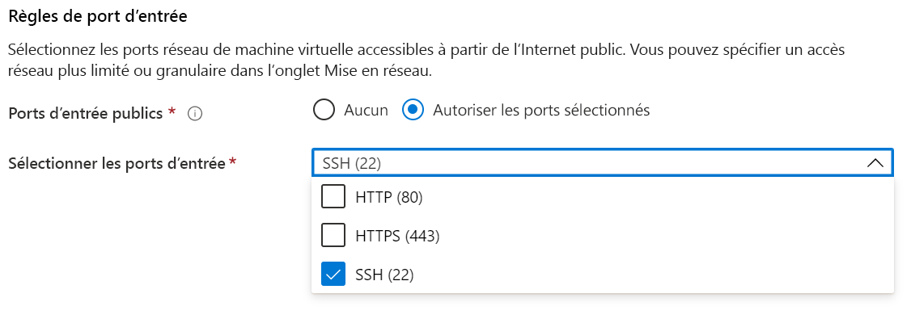

# <a name="quickstart-deploy-an-azure-confidential-computing-vm-in-the-marketplace"></a>Démarrage rapide : Déployer une machine virtuelle d’informatique confidentielle Azure dans la Place de marché

Découvrez comment commencer à utiliser l’informatique confidentielle Azure avec le portail Azure pour créer une machine virtuelle reposant sur Intel SGX. Vous pouvez également tester une application enclave créée à l’aide du SDK Open Enclave. 

Nous vous recommandons de suivre ce tutoriel si vous souhaitez déployer une machine virtuelle d’informatique confidentielle avec une configuration du modèle. Dans le cas contraire, nous vous recommandons d’utiliser le [portail ou l’interface CLI](quick-create-portal.md) pour suivre le déroulement standard du déploiement d’une machine virtuelle Azure.

## <a name="prerequisites"></a>Prérequis

Si vous n’avez pas d’abonnement Azure, [créez un compte](https://azure.microsoft.com/pricing/purchase-options/pay-as-you-go/) avant de commencer.

> [!NOTE]
> Les comptes associés à un essai gratuit n’ont pas accès aux machines virtuelles utilisées dans ce tutoriel. Veuillez passer à un abonnement avec paiement à l’utilisation.


## <a name="sign-in-to-azure"></a>Connexion à Azure

1. Connectez-vous au [portail Azure](https://portal.azure.com/).

1. En haut, sélectionnez **Créer une ressource**.

1. Dans le volet **Prise en main** par défaut, recherchez **Informatique confidentielle Azure (machine virtuelle)** .

1. Cliquez sur le modèle **Informatique confidentielle Azure (machine virtuelle)** .

    

1. Dans la page d’arrivée Machine virtuelle, sélectionnez **Créer**.


## <a name="configure-a-confidential-computing-virtual-machine"></a>Configurer une machine virtuelle d’informatique confidentielle

1. Dans l’onglet **Informations de base**, sélectionnez votre **Abonnement** et votre **Groupe de ressources** (le groupe doit être vide pour déployer ce modèle).

1. Dans **Nom de la machine virtuelle**, indiquez le nom de votre nouvelle machine virtuelle.

1. Tapez ou sélectionnez les valeurs suivantes :

   * **Région** : sélectionnez la région Azure qui vous convient.

        > [!NOTE]
        > Les machines virtuelles d’informatique confidentielle fonctionnent uniquement sur du matériel spécialisé disponible dans des régions spécifiques. Pour connaître les régions prenant en charge les machines virtuelles de la série DCsv2, consultez la [liste des produits disponibles par région](https://azure.microsoft.com/global-infrastructure/services/?products=virtual-machines).

1. Configurez l’image du système d’exploitation à utiliser pour votre machine virtuelle. Cette configuration prend uniquement en charge les déploiements d’images et de machines virtuelles Gen 2.

    * **Choisir une image** : pour ce tutoriel, sélectionnez Ubuntu 18.04 LTS (Gen 2). Vous pouvez également sélectionner Windows Server Datacenter 2019, Windows Server Datacenter 2016 ou Ubuntu 16.04 LTS. Dans ce cas, vous serez redirigé en conséquence dans ce tutoriel.
   
1. Sous l’onglet Informations de base, renseignez ce qui suit :

   * **Type d'authentification** : Sélectionnez **Clé publique SSH** si vous créez une machine virtuelle Linux. 

        > [!NOTE]
        > Vous pouvez choisir d’utiliser une clé publique SSH ou un mot de passe pour l’authentification. L’utilisation d’une clé SSH est plus sécurisée. Pour savoir comment générer une clé SSH, consultez [Créer des clés SSH sur Linux et Mac pour les machines virtuelles Linux dans Azure](../virtual-machines/linux/mac-create-ssh-keys.md).

    * **Nom d’utilisateur** : indiquez le nom d’administrateur pour la machine virtuelle.

    * **Clé publique SSH** : le cas échéant, entrez votre clé publique RSA.
    
    * **Mot de passe** : le cas échéant, entrez votre mot de passe pour l’authentification.
    
1. Sous l’onglet « Paramètres de machine virtuelle », renseignez ce qui suit :

   * Choisir la taille de référence (SKU) de machine virtuelle
   * Si vous avez choisi une machine virtuelle **DC1s_v2**, **DC2s_v2** ou **DC4s_V2**, optez pour un type de disque **SSD Standard** ou **SSD Premium**. Pour la machine virtuelle **DC8_v2**, vous pouvez uniquement choisir **SSD standard** comme type de disque.

   * **Ports d’entrée publics** : choisissez **Autoriser les ports sélectionnés**, puis sélectionnez **SSH (22)** et **HTTP (80)** dans la liste **Sélectionner les ports d’entrée publics**. Si vous déployez une machine virtuelle Windows, sélectionnez **HTTP (80)** et **RDP (3389)** . Dans ce démarrage rapide, cette étape est nécessaire pour se connecter à la machine virtuelle.
   
    >[!Note]
    > Autoriser les ports RDP/SSH n’est pas recommandé pour les déploiements de production.  

     


1. Choisissez l’option **Surveillance**, si nécessaire.

1. Sélectionnez **Revoir + créer**.

1. Dans le volet **Vérifier + créer**, sélectionnez **Créer**.

> [!NOTE]
> Si vous avez déployé une machine virtuelle Linux, passez à la section suivante de ce tutoriel. Si vous avez déployé une machine virtuelle Windows, [suivez cette procédure pour vous connecter à votre machine virtuelle Windows](../virtual-machines/windows/connect-logon.md).


## <a name="connect-to-the-linux-vm"></a>Se connecter à la machine virtuelle Linux

Si vous utilisez déjà un interpréteur de commandes BASH, connectez-vous à la machine virtuelle Azure à l’aide de la commande **SSH**. Dans la commande suivante, remplacez le nom d’utilisateur et l’adresse IP de la machine virtuelle pour vous connecter à votre machine virtuelle Linux.

```bash
ssh azureadmin@40.55.55.555
```

Vous trouverez l’adresse IP publique de votre machine virtuelle dans le portail Azure, sous la section Vue d’ensemble de votre machine virtuelle.

:::image type="content" source="media/quick-create-portal/public-ip-virtual-machine.png" alt-text="Adresse IP dans le portail Azure":::

Si vous êtes sous Windows et que vous n’avez pas d’interpréteur de commandes BASH, installez un client SSH, tel que PuTTY.

1. [Téléchargez et installez PuTTY](https://www.chiark.greenend.org.uk/~sgtatham/putty/download.html).

1. Exécutez PuTTY.

1. À l’écran de configuration de PuTTY, entrez l’adresse IP publique de votre machine virtuelle.

1. Sélectionnez **Open** (Ouvrir) et entrez votre nom d’utilisateur et votre mot de passe lorsque vous y êtes invité.

Pour en savoir plus la connexion aux machines virtuelles Linux, consultez [Création d’une machine virtuelle Linux sur Azure à l’aide du portail](../virtual-machines/linux/quick-create-portal.md).

> [!NOTE]
> Si vous voyez une alerte de sécurité PuTTY relative à la clé d’hôte du serveur non mise en cache dans le Registre, choisissez parmi les options suivantes. Si vous faites confiance à cet ordinateur hôte, sélectionnez **Yes** (Oui) pour ajouter la clé à la mémoire cache de PuTTy et poursuivre la connexion. Si vous souhaitez vous connecter une seule fois, sans ajouter la clé dans le cache, sélectionnez **No** (Non). Si vous ne faites pas confiance à cet ordinateur hôte, sélectionnez **Cancel** (Annuler) pour abandonner la connexion.

## <a name="intel-sgx-drivers"></a>Pilotes Intel SGX

> [!NOTE]
> Les pilotes Intel SGX font déjà partie des images de la galerie Azure Ubuntu et Windows. Aucune installation spéciale des pilotes n’est requise. Vous pouvez également mettre à jour les pilotes existants fournis dans les images en consultant la [liste des pilotes Intel SGX DCAP](https://01.org/intel-software-guard-extensions/downloads).

## <a name="optional-testing-enclave-apps-built-with-open-enclave-sdk-oe-sdk"></a>Facultatif : test des applications enclave créées avec le SDK Open Enclave SDK (OE SDK) <a id="Install"></a>

Suivez les instructions pas à pas pour installer le [SDK OE](https://github.com/openenclave/openenclave) sur votre machine virtuelle de la série DCsv2 exécutant une image Ubuntu 18.04 LTS Gen 2. 

Si votre machine virtuelle s’exécute sur Ubuntu 18.04 LTS Gen 2, vous devez suivre les [instructions d’installation pour Ubuntu 18.04](https://github.com/openenclave/openenclave/blob/master/docs/GettingStartedDocs/install_oe_sdk-Ubuntu_18.04.md).


> [!NOTE]
> Les pilotes Intel SGX font déjà partie des images de la galerie Azure Ubuntu et Windows. Aucune installation spéciale des pilotes n’est requise. Vous pouvez également mettre à jour les pilotes existants fournis dans les images.

## <a name="clean-up-resources"></a>Nettoyer les ressources

Dès que vous n’en avez plus besoin, vous pouvez supprimer le groupe de ressources, la machine virtuelle et toutes les ressources associées. 

Sélectionnez le groupe de ressources de la machine virtuelle, puis sélectionnez **Supprimer**. Confirmez le nom du groupe de ressources pour terminer la suppression des ressources.

## <a name="next-steps"></a>Étapes suivantes

Dans ce guide de démarrage rapide, vous avez déployé une machine virtuelle d’informatique confidentielle et installé le SDK Open Enclave. Pour plus d’informations sur les machines virtuelles d’informatique confidentielle sur Azure, consultez [Solutions sur les machines virtuelles](virtual-machine-solutions.md). 

Découvrez comment créer des applications d’informatique confidentielle en accédant aux exemples du SDK Open Enclave sur GitHub. 

> [!div class="nextstepaction"]
> [Création d’exemples de SDK Open Enclave](https://github.com/openenclave/openenclave/blob/master/samples/README.md)
