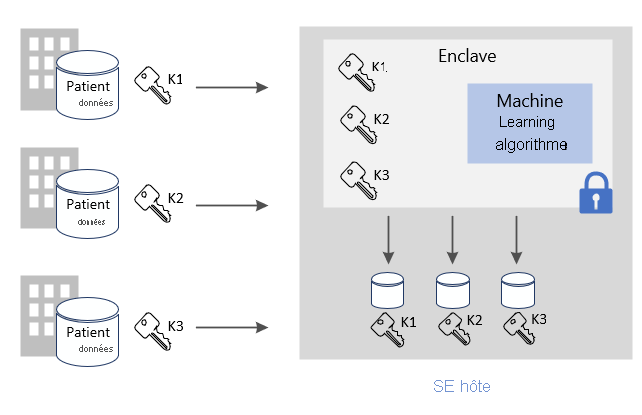
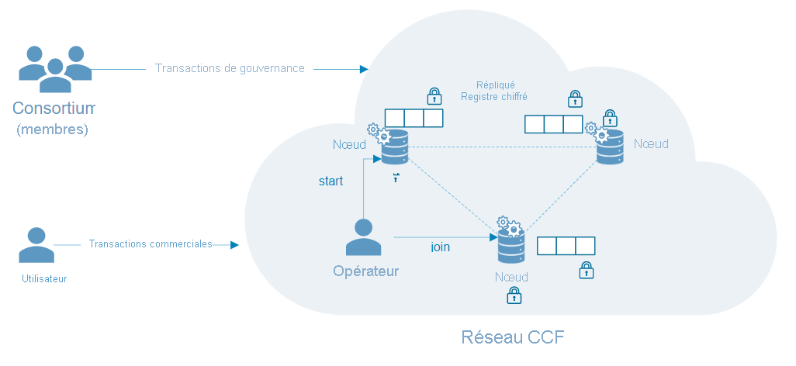

# Scénarios courants pour l’informatique confidentielle Azure

Cet article présente plusieurs scénarios courants pour l’informatique confidentielle Azure. Les recommandations de cet article constituent le point de départ du développement de votre application à l’aide de services et de frameworks d’informatique confidentielle. 

Après avoir lu cet article, vous serez en mesure de répondre aux questions suivantes :

- Quels sont les scénarios pour l’informatique confidentielle Azure ?
- Quels sont les avantages d’utiliser l’informatique confidentielle Azure dans un scénario multipartite ?
- Quels sont les avantages d’utiliser l’informatique confidentielle Azure par rapport à un réseau blockchain ?

## Sécuriser le traitement multipartite
L’informatique confidentielle Azure vous permet de traiter des données issues de plusieurs sources sans exposer les données d’entrée à d’autres parties. Ce type de traitement sécurisé convient à beaucoup de scénarios, comme la lutte contre le blanchiment d’argent, la détection des fraudes et l’analyse confidentielle des données de santé.

Les différentes sources peuvent charger leurs données dans une seule et même enclave sur une machine virtuelle. Une partie demande à l’enclave d’effectuer des opérations de calcul ou de traitement sur les données. Aucune partie (pas même celle qui exécute l’analyse) ne peut voir les données d’une autre partie qui ont été chargées dans l’enclave. 

Dans un environnement informatique sécurisé multipartite, les données chiffrées sont chargées dans l’enclave, puis l’enclave déchiffre ces données à l’aide d’une clé, les analyse, génère un résultat et renvoie un résultat chiffré qu’une partie peut déchiffrer avec la clé désignée. 

**Protection des données en cours d’utilisation** 
- Utilisez une machine virtuelle de série DCsv2 sur Azure avec la prise en charge Intel SGX activée. Ces machines virtuelles sont activées avec des environnements TEE (Trusted Execution Environment) qui sécurisent et isolent certaines portions des données et du code de votre application.
- Utilisez un SDK prenant en charge les enclaves pour créer une enclave au sein de la machine virtuelle. Les données qui sont à l’intérieur de l’enclave ne sont exposées à personne, pas même au fournisseur de la machine virtuelle. Les données dans l’enclave sont chiffrées par la prise en charge matérielle.
    - Par exemple, vous pouvez utiliser le [SDK OE](https://github.com/openenclave/openenclave) pour le traitement côté serveur. 

**Protection des données en transit** 
- Utilisez le TLS attesté comme canal sécurisé pour garantir la sécurité des données en transit.
- Le client s’assure que les données sont envoyées uniquement au même serveur, qui est protégé par l’enclave. 

**Protection des données au repos**
- Utilisez des magasins de données protégés et sécurisés pour garantir la sécurité des données au repos. 

### Lutte contre le blanchiment d’argent
Dans cet exemple de traitement multipartite, plusieurs banques partagent des données entre elles sans exposer les données personnelles de leurs clients. Les banques lancent les analyses convenues sur le jeu de données sensibles combinées. L’analytique sur le jeu de données agrégées peut détecter les mouvements d’argent d’un utilisateur entre plusieurs banques, sans que celles-ci aient accès aux données des unes et des autres.

Grâce à l’informatique confidentielle, ces établissements financiers peuvent augmenter les taux de détection des fraudes, lutter contre les problèmes de blanchiment d’argent, réduire les faux positifs et poursuivre l’apprentissage à partir de jeux de données plus volumineux. 

### Développement de médicaments dans le secteur de la santé
Les établissements de santé alimentent des jeux de données médicales privés pour participer en partenariat à l’entraînement d’un modèle Machine Learning. Chaque établissement a uniquement accès au jeu de données qui lui appartient. Aucun autre établissement ni même le fournisseur de cloud ne peut voir les données ou le modèle d’entraînement. 

Tous les établissements bénéficient du modèle entraîné. L’enrichissement du modèle avec plus de données a permis de rendre le modèle plus juste. Chaque établissement ayant contribué à l’entraînement du modèle peut utiliser le modèle et obtenir des résultats utiles. 

## Blockchain

Un réseau blockchain est un réseau de nœuds décentralisé. Les nœuds sont exécutés et gérés par des opérateurs ou des validateurs dans le but de garantir l’intégrité et d’atteindre un consensus sur l’état du réseau. Les nœuds eux-mêmes sont des réplicas de registres et sont utilisés pour le suivi des transactions blockchain. Chaque nœud dispose d’une copie complète de l’historique des transactions, ce qui garantit l’intégrité et la disponibilité dans un réseau distribué.

Les technologies blockchain sollicitant l’informatique confidentielle peuvent se servir de la protection basée sur le matériel pour assurer la confidentialité des données et la sécurisation des calculs. Dans certains cas, le registre est entièrement chiffré pour protéger l’accès aux données. Parfois, la transaction elle-même peut se produire dans un module de calcul à l’intérieur de l’enclave au sein du nœud.

### CCF (Confidential Consortium Framework)
[CCF](https://www.microsoft.com/research/project/confidential-consortium-framework/) est un exemple de framework blockchain distribué qui repose sur l’informatique confidentielle Azure. Lancé par Microsoft Research, ce framework exploite la puissance des environnements d’exécution fiable (les TEE) pour créer un réseau d’enclaves distantes à des fins d’attestation. Les nœuds peuvent s’exécuter au niveau supérieur des machines virtuelles Azure (de [série DCsv2](confidential-computing-enclaves.md)) et exploiter l’infrastructure de l’enclave. Avec les protocoles d’attestation, les utilisateurs du blockchain peuvent vérifier l’intégrité d’un nœud CCF et contrôler efficacement l’ensemble du réseau. 

Dans le framework CCF, le registre décentralisé stocke les modifications enregistrées dans un magasin clé-valeur qui est répliqué sur tous les nœuds du réseau. Chacun de ces nœuds exécute un moteur de transaction qui peut être déclenché par les utilisateurs du blockchain sur TLS. Quand vous déclenchez un point de terminaison, vous mutez le magasin clé-valeur. Avant que la modification chiffrée soit enregistrée dans le registre décentralisé, elle doit être acceptée par un certain nombre de nœuds pour atteindre un consensus. 

## Étapes suivantes
[Déployez](quick-create-marketplace.md) une machine virtuelle de série DCsv2.

