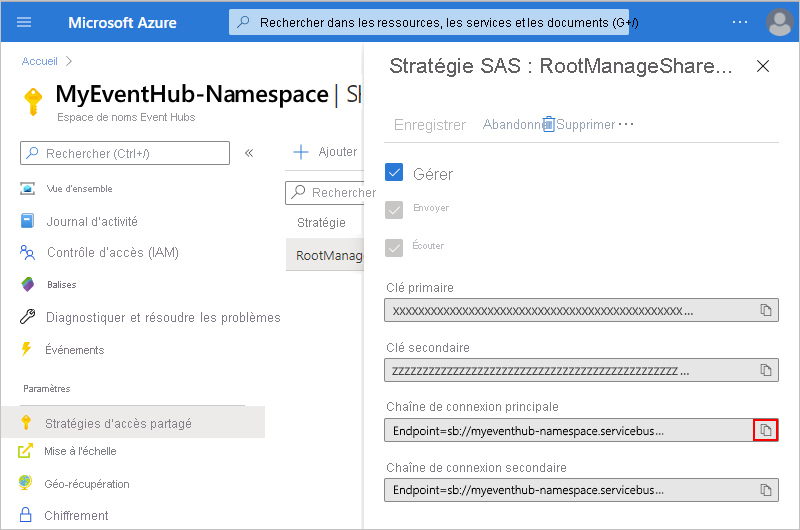
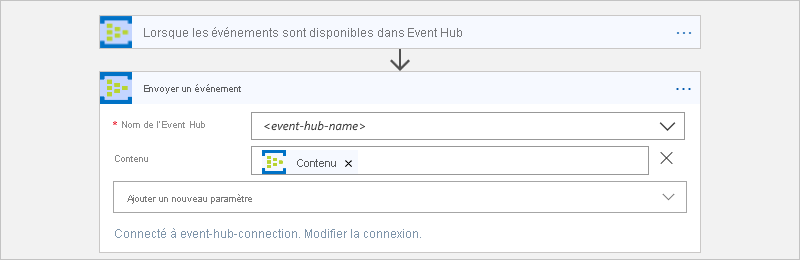
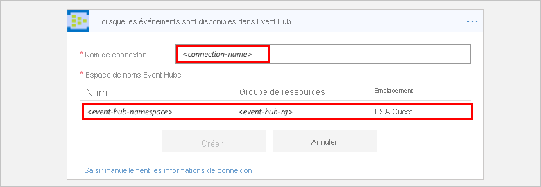
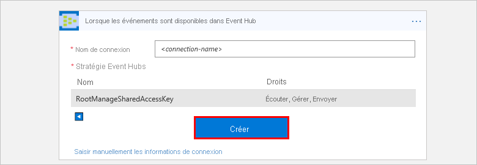

# Surveillez, recevez et envoyez des événements avec Azure Event Hubs et Azure Logic Apps

Cet article explique comment vous pouvez surveiller et gérer les événements envoyés à [Azure Event Hubs](../event-hubs/event-hubs-about.md) depuis une application logique à l’aide du connecteur Azure Event Hubs. De cette façon, vous pouvez créer des applications logiques qui automatisent les tâches et les flux de travail pour vérifier, envoyer et recevoir des événements à partir de votre hub d’événements. Pour obtenir des informations techniques spécifiques aux connecteurs, consultez la [documentation de référence du connecteur Azure Event Hubs](/connectors/eventhubs/)</a>.

## Prérequis

* Un compte et un abonnement Azure. Si vous n’avez pas d’abonnement Azure, [inscrivez-vous pour bénéficier d’un compte Azure gratuit](https://azure.microsoft.com/free/). 

* Un [espace de noms Azure Event Hubs et un hub d’événements](../event-hubs/event-hubs-create.md)

* L’application logique à partir de laquelle vous souhaitez accéder à votre hub d’événements. Pour démarrer votre application logique avec un déclencheur Azure Event Hubs, vous avez besoin d’une [application logique vide](../logic-apps/quickstart-create-first-logic-app-workflow.md).
Si vous débutez avec les applications logiques, consultez [Qu’est-ce qu’Azure Logic Apps ?](../logic-apps/logic-apps-overview.md) et [Démarrage rapide : Créer votre première application logique](../logic-apps/quickstart-create-first-logic-app-workflow.md).

## Vérifier les autorisations et obtenir la chaîne de connexion

Pour vous assurer que votre application logique peut accéder à votre hub d’événements, vérifiez vos autorisations et obtenez la chaîne de connexion pour votre espace de noms Event Hubs.

1. Connectez-vous au [portail Azure](https://portal.azure.com).

1. Accédez à votre *espace de noms* Event Hubs, et non à un hub d’événements spécifique. 

1. Dans le menu de l’espace de noms, sous **Paramètres**, sélectionnez **Stratégies d’accès partagé**. Sous **Revendications**, vérifiez que vous disposez des autorisations **Gérer** pour cet espace de noms.

   

1. Si vous souhaitez pouvoir entrer manuellement vos informations de connexion par la suite, obtenez la chaîne de connexion pour votre espace de noms Event Hubs.

   1. Sous **Stratégie**, choisissez **RootManageSharedAccessKey**.

   1. Trouvez la chaîne de connexion de la clé primaire. Choisissez le bouton Copier et enregistrez la chaîne de connexion pour l’utiliser plus tard.

      

      > [!TIP]
      > Pour vérifier que votre chaîne de connexion est bien associée à votre espace de noms Event Hubs ou à un hub d’événements spécifique, assurez-vous que la chaîne de connexion ne contient pas le paramètre `EntityPath`. Si vous trouvez ce paramètre, la chaîne de connexion est dédiée à une « entité » Event Hub spécifique et ne peut pas être utilisée avec votre application logique.

1. Passez maintenant à [Ajouter un déclencheur Event Hubs](#add-trigger) ou [Ajouter une action Event Hubs](#add-action).

## Ajouter un déclencheur Event Hubs

Dans Azure Logic Apps, chaque application logique doit démarrer avec un [déclencheur](../logic-apps/logic-apps-overview.md#logic-app-concepts), qui s’active lorsqu’un événement spécifique se produit ou lorsqu’une condition particulière est remplie. Chaque fois que le déclencheur s’active, le moteur Logic Apps crée une instance d’application logique et lance l’exécution du flux de travail de votre application.

Cet exemple montre comment vous pouvez démarrer un flux de travail d’application logique lorsque de nouveaux événements sont envoyés à votre hub d’événements. 

> [!NOTE]
> Tous les déclencheurs Event Hub sont des déclencheurs *d’interrogation longue*, ce qui signifie que le déclencheur traite tous les événements, puis attend 30 secondes par partition le temps qu’un plus grand nombre d’événements s’affichent dans votre Event Hub. Par conséquent, si le déclencheur est configuré avec quatre partitions, ce délai peut prendre jusqu’à deux minutes avant que le déclencheur ne termine d’interroger toutes les partitions. Si aucun événement n’est reçu dans ce délai, l’exécution du déclencheur est ignorée. Dans le cas contraire, le déclencheur poursuit la lecture des événements jusqu’à ce que votre hub d’événements soit vide. La prochaine interrogation de déclencheur est basée sur l’intervalle de récurrence que vous spécifiez dans les propriétés du déclencheur.

1. Dans le portail Azure ou Visual Studio, créez une application logique vide, qui ouvre le Concepteur d'applications logiques. Cet exemple utilise le portail Azure.

1. Dans la zone de recherche, entrez « hubs d’événements » en tant que filtre. Dans la liste des déclencheurs, sélectionnez ce déclencheur : **When events are available in Event Hub (Lorsque les événements sont disponibles dans un hub Event Hubs) - Event Hubs**

   

1. Si vous êtes invité à entrer les informations de connexion, [créez votre connexion Event Hubs maintenant](#create-connection). 

1. Dans le déclencheur, fournissez des informations sur l’Event Hub que vous souhaitez surveiller. Pour plus de propriétés, ouvrez la liste **Ajouter un nouveau paramètre**. La sélection d'un paramètre ajoute cette propriété à la carte de déclencheur.

   

   | Propriété | Obligatoire | Description |
   |----------|----------|-------------|
   | **Nom de l’Event Hub** | Oui | Nom du hub Event Hubs que vous souhaitez surveiller |
   | **Type de contenu** | Non | Type de contenu de l’événement. Par défaut, il s’agit de `application/octet-stream`. |
   | **Nom du groupe de consommateurs** | Non | [Nom du groupe de consommateurs Event Hub](../event-hubs/event-hubs-features.md#consumer-groups) pour la lecture d’événements. Si ce champ n’est pas spécifié, le groupe de consommateurs par défaut est utilisé. |
   | **Nombre d’événements maximum** | Non | Nombre maximal d’événements. Le déclencheur retourne entre 1 et le nombre d’événements spécifié par cette propriété. |
   | **Intervalle** | Oui | Nombre entier positif qui décrit la fréquence à laquelle le flux de travail s’exécute en fonction de la fréquence |
   | **Fréquence** | Oui | Unité de temps à utiliser pour la récurrence |
   ||||

   **Propriétés supplémentaires**

   | Propriété | Obligatoire | Description |
   |----------|----------|-------------|
   | **Schéma du contenu** | Non | Schéma du contenu au format JSON pour les événements qui sont lus à partir de l’Event Hub. Par exemple, si vous spécifiez le schéma de contenu, vous pouvez déclencher l'application logique uniquement pour les événements qui correspondent au schéma. |
   | **Clé de partition minimum** | Non | Entrez l’ID de [partition](../event-hubs/event-hubs-features.md#partitions) minimum à lire. Par défaut, toutes les partitions sont lues. |
   | **Clé de partition maximum** | Non | Entrez l’ID de [partition](../event-hubs/event-hubs-features.md#partitions) maximum à lire. Par défaut, toutes les partitions sont lues. |
   | **Fuseau horaire** | Non | S’applique uniquement quand vous spécifiez une heure de début, car ce déclencheur n’accepte pas le décalage UTC. Sélectionnez le fuseau horaire à appliquer. 
Pour plus d’informations, consultez [Créer et exécuter des tâches et des workflows récurrents avec Azure Logic Apps](../connectors/connectors-native-recurrence.md). |
   | **Heure de début** | Non | Fournissez une heure de début au format suivant : 
AAAA-MM-JJThh:mm:ss si vous sélectionnez un fuseau horaire
-ou-
AAAA-MM-JJThh:mm:ssZ si vous ne sélectionnez pas de fuseau horaire
Pour plus d’informations, consultez [Créer et exécuter des tâches et des workflows récurrents avec Azure Logic Apps](../connectors/connectors-native-recurrence.md). |
   ||||

1. Une fois terminé, dans la barre d’outils du concepteur, choisissez **Enregistrer**.

1. Continuez maintenant à ajouter une ou plusieurs actions à votre application logique pour les tâches à effectuer avec les résultats du déclencheur. 

   Par exemple, pour filtrer les événements basés sur une valeur spécifique, telle qu’une catégorie, vous pouvez ajouter une condition pour que l’action **Envoyer un événement** envoie uniquement les événements qui répondent à votre condition. 

## Ajouter une action Event Hubs

Dans Azure Logic Apps, une [action](../logic-apps/logic-apps-overview.md#logic-app-concepts) est une étape de votre flux de travail qui suit un déclencheur ou une autre action. Pour cet exemple, l’application logique démarre avec un déclencheur Event Hubs qui recherche de nouveaux événements dans votre hub d'événements.

1. Dans le portail Azure ou Visual Studio, ouvrez votre application logique dans le Concepteur d’applications logiques. Cet exemple utilise le portail Azure.

1. Sous le déclencheur ou l’action, choisissez **Nouvelle étape**.

   Pour ajouter une action entre des étapes, déplacez votre souris sur la flèche de connexion. 
   Cliquez sur le signe plus ( **+** ) qui s’affiche, puis sélectionnez **Ajouter une action**.

1. Dans la zone de recherche, entrez « hubs d’événements » en tant que filtre.
Dans la liste des actions, sélectionnez cette action : **Envoyer un événement - Event Hubs**

   

1. Si vous êtes invité à entrer les informations de connexion, [créez votre connexion Event Hubs maintenant](#create-connection). 

1. Dans l'action, fournissez des informations sur les événements que vous souhaitez envoyer. Pour plus de propriétés, ouvrez la liste **Ajouter un nouveau paramètre**. La sélection d'un paramètre ajoute cette propriété à la carte action.

   

   | Propriété | Obligatoire | Description |
   |----------|----------|-------------|
   | **Nom de l’Event Hub** | Oui | Event Hub où vous voulez envoyer l’événement |
   | **Contenu** | Non | Le contenu pour l’événement que vous souhaitez envoyer |
   | **Propriétés** | Non | Les valeurs et les propriétés de l’application à envoyer |
   | **Clé de partition** | Non | ID [partition](../event-hubs/event-hubs-features.md#partitions) auquel envoyer l’événement |
   ||||

   Par exemple, vous pouvez envoyer la sortie de votre déclencheur Event Hubs à un autre Event Hub :

   

1. Une fois terminé, dans la barre d’outils du concepteur, choisissez **Enregistrer**.

## Se connecter à votre hub d'événements

[!INCLUDE [Create connection general intro](../../includes/connectors-create-connection-general-intro.md)] 

1. Lorsque vous êtes invité à entrer des informations de connexion, fournissez les précisions suivantes :

   | Propriété | Obligatoire | Valeur | Description |
   |----------|----------|-------|-------------|
   | **Nom de connexion** | Oui | <*connection-name*> | Nom à créer pour votre connexion |
   | **Espace de noms Event Hubs** | Oui | <*event-hubs-namespace*> | Sélectionnez l’espace de noms Event Hubs que vous souhaitez utiliser. |
   |||||  

   Par exemple :

   

   Pour entrer manuellement la chaîne de connexion, sélectionnez **Entrer manuellement les informations de connexion**. 
   Découvrez [comment trouver votre chaîne de connexion](#permissions-connection-string).

2. Sélectionnez la stratégie Event Hubs à utiliser, si elle n’est pas déjà sélectionnée. Choisissez **Créer**.

   

3. Après avoir créé votre connexion, poursuivez avec [Ajouter un déclencheur Event Hubs](#add-trigger) ou [Ajouter une action Event Hubs](#add-action).

## Référence de connecteur

Pour plus d’informations techniques, telles que les déclencheurs, actions et limites, comme décrit dans le fichier Swagger du connecteur, consultez la [page de référence du connecteur](/connectors/eventhubs/).

> [!NOTE]
> Pour les applications logiques utilisées dans un [environnement de service d’intégration (ISE)](../logic-apps/connect-virtual-network-vnet-isolated-environment-overview.md), la version de ce connecteur avec l’étiquette ISE applique les [limites de messages de l’ISE](../logic-apps/logic-apps-limits-and-config.md#message-size-limits) à la place.

## Étapes suivantes

* En savoir plus sur les autres [connecteurs d’applications logiques](../connectors/apis-list.md)
