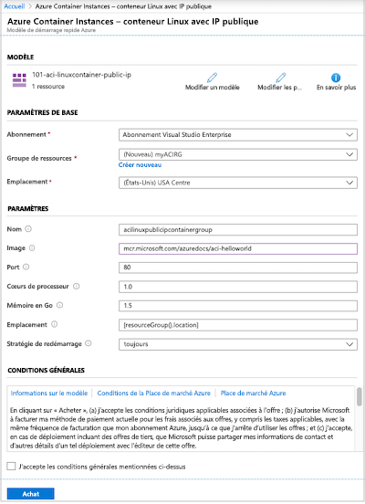
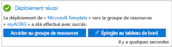
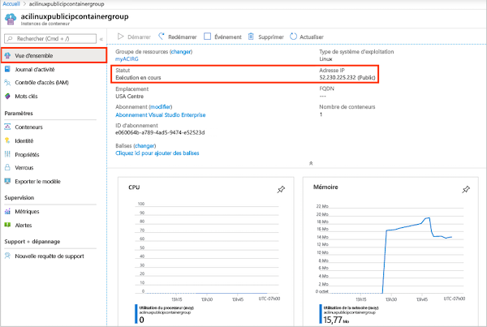
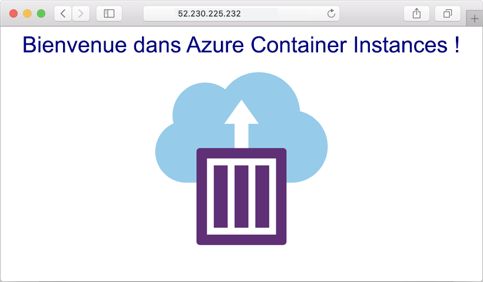
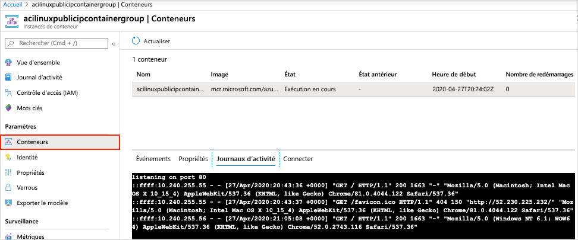

# Démarrage rapide : Déployer une instance de conteneur dans Azure à l’aide d’un modèle Resource Manager

Utilisez Azure Container Instances pour exécuter, facilement et rapidement, des conteneurs Docker serverless dans Azure. Déployez une application sur une instance de conteneur à la demande lorsque vous n’avez pas besoin d’une plateforme d’orchestration de conteneur complète telle qu’Azure Kubernetes Service. Dans ce guide de démarrage rapide, vous utilisez un modèle Resource Manager (Azure Resource Manager) pour déployer un conteneur Docker isolé et mettre son application web à disposition avec une adresse IP publique.

[!INCLUDE [About Azure Resource Manager](../../includes/resource-manager-quickstart-introduction.md)]

Si votre environnement remplit les prérequis et que vous êtes déjà familiarisé avec l’utilisation des modèles ARM, sélectionnez le bouton **Déployer sur Azure**. Le modèle s’ouvre dans le portail Azure.

## Prérequis

Si vous n’avez pas d’abonnement Azure, créez un compte [gratuit](https://azure.microsoft.com/free/) avant de commencer.

## Vérifier le modèle

Le modèle utilisé dans ce démarrage rapide est tiré des [modèles de démarrage rapide Azure](https://azure.microsoft.com/resources/templates/101-aci-linuxcontainer-public-ip/).

:::code language="json" source="~/quickstart-templates/101-aci-linuxcontainer-public-ip/azuredeploy.json":::

La ressource suivante est définie dans le modèle :

* **[Microsoft.ContainerInstance/containerGroups](/azure/templates/microsoft.containerinstance/containergroups)**  : créer un groupe de conteneurs Azure. Ce modèle définit un groupe composé d’une instance de conteneur unique.

Vous trouverez d’autres exemples de modèles Azure Container Instances dans la [galerie de modèles de démarrage rapide](https://azure.microsoft.com/resources/templates/?resourceType=Microsoft.Containerinstance&pageNumber=1&sort=Popular).

## Déployer le modèle

 1. Cliquez sur l’image ci-après pour vous connecter à Azure et ouvrir un modèle. Le modèle crée un registre et un réplica dans une autre localisation.

    

 2. Sélectionnez ou entrez les valeurs suivantes.

    * **Abonnement** : sélectionnez un abonnement Azure.
    * **Groupe de ressources** : sélectionnez **Créer**, entrez un nom unique pour le groupe de ressources, puis sélectionnez **OK**.
    * **Emplacement** : sélectionnez un emplacement pour le groupe de ressources. Exemple : **USA Centre**.
    * **Nom** : acceptez le nom généré pour l’instance, ou entrez un nom.
    * **Image** : acceptez le nom d’image par défaut. Cet exemple d’image Linux contient une petite application web écrite en Node.js qui se présente sous la forme d’une page HTML statique. 

    Acceptez les valeurs par défaut pour les autres propriétés.

    Passez en revue les conditions générales. Si vous acceptez, sélectionnez **J’accepte les termes et conditions mentionnés ci-dessus**.

    

 3. Une fois l’instance créée avec succès, vous recevez une notification :

    

 Le portail Azure est utilisé pour déployer le modèle. Outre le portail Azure, vous pouvez utiliser Azure PowerShell, l’interface Azure CLI et l’API REST. Pour découvrir d’autres méthodes de déploiement, consultez [Déployer des modèles](../azure-resource-manager/templates/deploy-cli.md).

## Vérifier les ressources déployées

Utilisez le portail Azure ou un outil tel que l’[interface de ligne de commande Azure](container-instances-quickstart.md) pour passer en revue les propriétés de l’instance de conteneur.

1. Dans le portail, recherchez Instances de conteneur, puis sélectionnez l’instance de conteneur que vous avez créée.

1. Dans la page **Vue d’ensemble**, notez l’**État** de l’instance et son **Adresse IP**.

    

2. Une fois que son état est *En cours d’exécution*, accédez à l’adresse IP dans votre navigateur. 

    

### Afficher les journaux d’activité du conteneur

Il est utile d’afficher les journaux d’activité d’une instance de conteneur pour résoudre des problèmes liés au conteneur ou à l’application qu’il exécute.

Pour voir les journaux du conteneur, sous **Paramètres**, sélectionnez **Conteneurs** > **Journaux**. Vous devez normalement voir la requête HTTP GET générée quand vous affichez l’application dans votre navigateur.

## Nettoyer les ressources

Quand vous avez terminé avec le conteneur, dans la page **Vue d’ensemble** de l’instance de conteneur, sélectionnez **Supprimer**. Quand vous y êtes invité, confirmez la suppression.

## Étapes suivantes

Dans ce guide de démarrage rapide, vous avez créé une instance de conteneur Azure à partir d’une image Microsoft publique. Si vous voulez créer une image conteneur et la déployer à partir d’un registre de conteneurs Azure privé, passez au didacticiel Azure Container Instances.

> [!div class="nextstepaction"]
> [Tutoriel : Créer une image conteneur à déployer sur Azure Container Instances](./container-instances-tutorial-prepare-app.md)

Pour obtenir un tutoriel pas à pas vous guidant tout au long du processus de création d’un modèle, consultez :

> [!div class="nextstepaction"]
> [Tutoriel : Créer et déployer votre premier modèle Resource Manager](../azure-resource-manager/templates/template-tutorial-create-first-template.md)