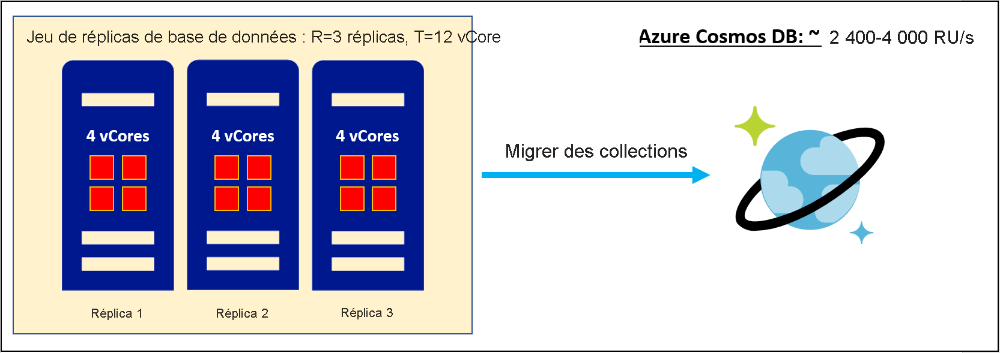
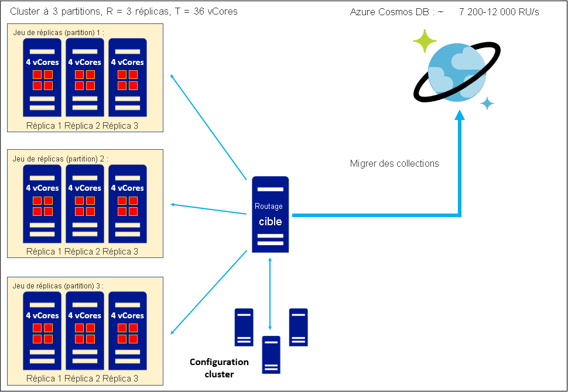
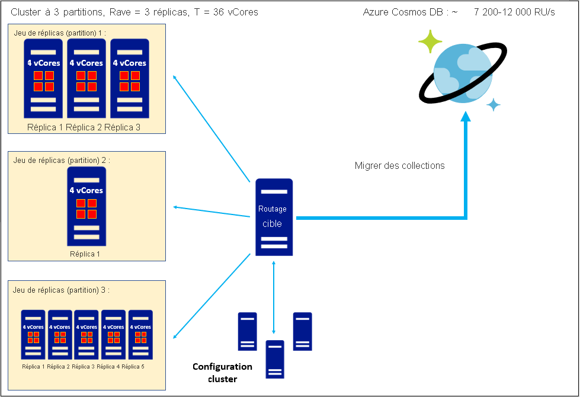

# Convertir le nombre de vCores ou de processeurs virtuels dans votre base de données non relationnelle en unités de requête par seconde (RU/s) Azure Cosmos DB
[!INCLUDE[appliesto-sql-api](includes/appliesto-sql-api.md)]
[!INCLUDE[appliesto-mongodb-api](includes/appliesto-mongodb-api.md)]

Cet article explique comment estimer les unités de requête par seconde (RU/s) Azure Cosmos DB quand vous envisagez de migrer des données, mais que vous ne connaissez que le nombre total de vCores ou de processeurs virtuels dans le ou les jeux de réplicas de votre base de données existante. Quand vous migrez un ou plusieurs jeux de réplicas vers Azure Cosmos DB, chaque collection contenue dans ces jeux de réplicas est stockée sous la forme d’une collection Azure Cosmos DB constituée d’un cluster partitionné avec un facteur de réplication de 4x. Pour en savoir plus sur notre architecture, consultez ce [Guide de partitionnement et de mise à l’échelle](partitioning-overview.md). Les unités de requête constituent la façon dont la capacité de débit est provisionnée sur une collection. Pour en savoir plus, vous pouvez [consulter le guide des unités de requête](request-units.md) et le [guide de provisionnement](set-throughput.md) du unités de requête par seconde (RU/s). Quand vous migrez une collection, Azure Cosmos DB provisionne suffisamment de partitions pour traiter vos unités de requête provisionnées et stocker vos données. Par conséquent, l’estimation des RU/s de collections est une étape importante dans la définition de l’étendue de votre patrimoine de données Azure Cosmos DB planifié avant la migration. Sur la base de notre expérience avec des milliers de clients, nous avons constaté que cette formule nous permet d’obtenir une estimation des unités de requête/seconde de base à partir de vCores ou de processeurs virtuels : 

`
Provisioned RU/s = C*T/R
`

* *T* : nombre total de vCores et/ou de processeurs virtuels dans votre ou vos jeux de réplicas de base de données **contenant des données**. 
* *R* : facteur de réplication de votre ou vos jeux de réplicas **contenant des données** existants. 
* *C* : nombre d’unités de requête/seconde provisionnées recommandé par vCore ou processeur virtuel. Cette valeur est dérivée de l’architecture d’Azure Cosmos DB :
    * *C = 600 RU/s/vCore* pour l’API SQL Azure Cosmos DB
    * *C = 1 000 RU/s/vCore* pour l’API Azure Cosmos DB pour MongoDB v4.0
    * Les estimations de *C* pour l’API Cassandra, l’API Gremlin ou d’autres API ne sont pas disponibles actuellement

Les valeurs de *C* sont fournies ci-dessus. ***T* doit être déterminé en examinant le nombre de vCores ou de processeurs virtuels dans chaque ensemble de réplicas comportant des données de votre base de données existante, et en les additionnant pour obtenir le total**. Si vous ne pouvez pas estimer *T*, envisagez de suivre notre [guide de l’estimation des RU/s à l’aide du planificateur de capacité Azure Cosmos DB](estimate-ru-with-capacity-planner.md) plutôt que le présent guide. *T* ne doit pas inclure de *vCores* ou de *processeurs virtuels* associés au serveur de routage ou au cluster de configuration de votre base de données existante, s’il comprend ces composants. 

Pour *R*, nous vous recommandons de connecter le facteur de réplication moyen de vos jeux de réplicas de base de données. Si cette information n’est pas disponible, *R* = 3 est une bonne règle de base. 

Les API d’interopérabilité Azure Cosmos DB s’exécutent parallèlement à l’API SQL et implémentent leurs propres architectures uniques. Par conséquent, l’API Azure Cosmos DB pour MongoDB v4.0 a une valeur *C* différente de l’API SQL Azure Cosmos DB.

## Exemple concret : Estimer les RU/s pour la migration d’un jeu de réplicas unique

Prenons l’exemple d’un jeu de réplicas unique avec un facteur de réplication de *R=3* basé sur une référence SKU de serveur à quatre cœurs. Alors
* *T* = 12 vCores
* *R* = 3

Les unités de requête recommandées pour l’API SQL Azure Cosmos DB sont alors

`
Provisioned RU/s, SQL API = (600 RU/s/vCore) * (12 vCores) / (3) = 2,400 RU/s
`

Et les unités de requête recommandées pour l’API Azure Cosmos DB pour MongoDB sont

`
Provisioned RU/s, API for MongoDB = (1,000 RU/s/vCore) * (12 vCores) / (3) = 4,000 RU/s
`

## Exemple concret : Estimer les RU/s lors de la migration d’un cluster de jeux de réplicas homogènes

Prenons l’exemple d’un cluster partitionné et répliqué comprenant trois jeux de réplicas, chacun avec le facteur de réplication 3, où chaque serveur est une référence SKU à quatre cœurs. Alors
* *T* = 36 vCores
* *R* = 3

Les unités de requête recommandées pour l’API SQL Azure Cosmos DB sont alors

`
Provisioned RU/s, SQL API = (600 RU/s/vCore) * (36 vCores) / (3) = 7,200 RU/s
`

Et les unités de requête recommandées pour l’API Azure Cosmos DB pour MongoDB sont

`
Provisioned RU/s, API for MongoDB = (1,000 RU/s/vCore) * (36 vCores) / (3) = 12,000 RU/s
`

## Exemple concret : Estimer les RU/s lors de la migration d’un cluster de jeux de réplicas hétérogènes

Prenons l’exemple d’un cluster partitionné et répliqué comprenant trois jeux de réplicas, dans lesquels chaque serveur est basé sur une référence SKU à quatre cœurs. Les jeux de réplicas sont « hétérogènes » dans le sens où chacun a un facteur de réplication différent : 3x, 1x et 5x, respectivement. L’approche recommandée consiste à utiliser le facteur de réplication moyen lors du calcul des unités de requête. Alors
* *T* = 36 vCores
* *Ravg* = (3+1+5)/3 = 3

Les unités de requête recommandées pour l’API SQL Azure Cosmos DB sont alors

`
Provisioned RU/s, SQL API = (600 RU/s/vCore) * (36 vCores) / (3) = 7,200 RU/s
`

Et les unités de requête recommandées pour l’API Azure Cosmos DB pour MongoDB sont

`
Provisioned RU/s, API for MongoDB = (1,000 RU/s/vCore) * (36 vCores) / (3) = 12,000 RU/s
`

## Conseils pour obtenir l’estimation des RU/s la plus précise

*Migration à partir d’une base de données gérée dans le cloud :* Si vous utilisez actuellement une base de données gérée dans le cloud, ces services semblent souvent être provisionnés en unités de *vCores* ou de *processeurs virtuels* (en d’autres termes, *T*), mais en fait, le nombre de cœurs que vous provisionnez définit la valeur *vCores/réplica* ou *processeurs virtuels/réplica* (*T/R*) pour un jeu de réplicas à *R* nœuds. Le nombre réel de cœurs est *R* fois supérieur à que ce que vous avez provisionné explicitement. Nous vous recommandons de déterminer si cette description s’applique à votre base de données gérée dans le cloud actuelle et, si c’est le cas, vous devez multiplier le nombre nominal de *vCores* ou de *processeurs virtuels* provisionnés par *R* afin d’obtenir une estimation exacte de *T*.

*Différence entre les vCores et les processeurs virtuels :* Dans cet article, nous traitons les termes « vCore » et « processeur virtuel » comme des synonymes. Par conséquent, *C* comprend des unités de *RU/s/vCore* ou de *RU/s/processeur virtuel*, sans distinction. Toutefois, dans la pratique, cette simplification peut ne pas être exacte dans certains cas. Ces termes peuvent avoir des significations différentes. Par exemple, si vos processeurs physiques prennent en charge l’hyperthreading, il est possible que *1 processeur virtuel = 2 vCores* ou autre. En général, la relation *vCore*/*processeur virtuel* est tributaire du matériel et nous vous recommandons de chercher quelle est la relation sur votre matériel de cluster existant, et de déterminer si votre calcul de cluster est provisionné en termes de *vCores* ou de *processeurs virtuels*. Si les termes *processeur virtuel* et *vCore* ont des significations différentes sur votre matériel, nous vous recommandons de traiter les estimations ci-dessus de *C* comme si vous aviez des unités de *RU/s/vCore* et, si nécessaire, de convertir *T* de processeur virtuel en vCore en utilisant le facteur de conversion approprié pour votre matériel.

## Récapitulatif

L’estimation des RU/s à partir de *vCores* ou de *processeurs virtuels* nécessite la collecte d’informations concernant le nombre total de *vCores*/*processeurs virtuels* et le facteur de réplication du ou des jeux de réplicas de votre base de données existante. Vous pouvez ensuite utiliser des relations connues entre les *vCores*/*processeurs virtuels* et le débit pour estimer les unités de requête par seconde (RU/s) Azure Cosmos DB. La recherche de cette estimation des unités de requête est une étape importante dans l’anticipation de l’échelle de votre patrimoine de données Azure Cosmos DB après la migration.

Le tableau ci-dessous récapitule la relation entre les *vCores* et les *processeurs virtuels* pour l’API SQL Azure Cosmos DB et l’API pour MongoDB v4.0 :

| vCores | RU/s (API SQL)  (Facteur de réplication=3) | RU/s (API pour MongoDB v4.0)  (Facteur de réplication=3) |
|-------------|----------------|------------------|
| 3           | 600            |            1 000  |
| 6           | 1200            |            2000  |
| 12           | 2 400            |            4000  |
| 24           | 4 800            |            8000  |
| 48           | 9 600            |            16000  |
| 96           | 19 200            |            32000  |
| 192           | 38400            |            64 000  |
| 384           | 76 800            |            128000  |

## Étapes suivantes
* [Découvrir les tarifs Azure Cosmos DB](https://azure.microsoft.com/pricing/details/cosmos-db/)
* [Découvrir comment planifier et gérer les coûts pour Azure Cosmos DB](plan-manage-costs.md)
* [Examiner les options de migration vers Azure Cosmos DB](cosmosdb-migrationchoices.md)
* [Migrer vers l’API SQL Azure Cosmos DB](import-data.md)
* [Planifier votre migration vers l’API Azure Cosmos DB pour MongoDB](mongodb/pre-migration-steps.md). Ce document contient des liens vers différents outils de migration que vous pouvez utiliser une fois que vous avez terminé la planification.

[regions]: https://azure.microsoft.com/regions/