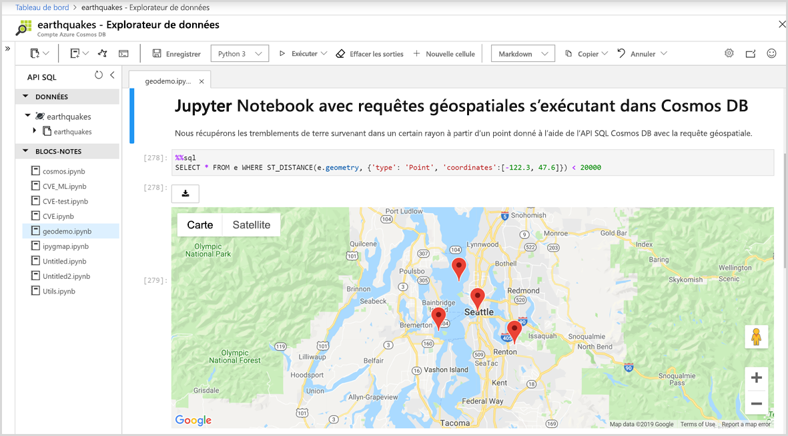

# Prise en charge des notebooks Jupyter intégrés dans Azure Cosmos DB (préversion)

Jupyter Notebook est une application web open source qui vous permet de créer et de partager des documents contenant du code en direct, des équations, des visualisations et du texte narratif. Azure Cosmos DB prend en charge les notebooks Jupyter intégrés pour toutes les API telles que Cassandra, MongoDB, SQL, Gremlin et Table. La prise en charge de blocs-notes intégrée pour toutes les API et tous les modèles de données Azure Cosmos DB vous permet d’exécuter les requêtes de manière interactive. Les notebooks Jupyter s’exécutent dans les comptes Azure Cosmos et permettent aux développeurs d’effectuer une exploration des données, un nettoyage des données, des transformations de données, des simulations numériques, une modélisation statistique, une visualisation des données et du Machine Learning.

Les notebooks Jupyter offrent des fonctions magiques qui étendent les fonctionnalités du noyau par la prise en charge de commandes supplémentaires. Cosmos magic est une commande qui étend les fonctionnalités du noyau Python dans Jupyter Notebook pour vous permettre d’exécuter des requêtes d’API Azure Cosmos SQL en plus d’Apache Spark. Vous pouvez facilement combiner des requêtes d’API Python et SQL pour interroger et visualiser des données à l’aide de bibliothèques de visualisation complètes intégrées aux commandes de rendu.
Le portail Azure intègre en mode natif l’expérience des notebook Jupyter aux comptes Azure Cosmos, comme indiqué dans l’image suivante :

## Avantages des notebooks Jupyter

À l’origine, les notebooks Jupyter ont été développés pour les applications de science des données écrites en Python et R. Toutefois, ils peuvent être utilisés de différentes façons pour différents types de projets, notamment les suivants :

* ***Visualisations de données :** Les notebooks Jupyter vous permettent de visualiser des données sous la forme d’un notebook partagé qui restitue un jeu de données sous forme graphique. Le notebook Jupyter vous permet de créer des visualisations, de les partager et d’autoriser des changements interactifs du code partagé et du jeu de données.

* **Partage du code :** Les services comme GitHub fournissent des méthodes pour partager du code, mais ils sont en grande partie non interactifs. Avec un notebook Jupyter, vous pouvez voir le code, l’exécuter, puis afficher les résultats directement dans le portail Azure.

* **Interactions en direct avec le code :** Le code des notebook Jupyter est dynamique. Il peut être modifié et réexécuté de façon incrémentielle en temps réel. Les notebooks peuvent également incorporer des contrôles utilisateur (par exemple, des curseurs ou des champs d’entrée de texte) qui peuvent être utilisés comme sources d’entrée pour le code, comme démonstrations ou comme preuves de concepts (POC).

* **Documentation des exemples de code et des résultats de l’exploration des données :** Si vous avez un bloc de code et que vous voulez expliquer ligne par ligne comment il fonctionne dans Azure Cosmos DB, avec une sortie en temps réel tout au long de la procédure, vous pouvez l’incorporer dans un notebook Jupyter. Le code reste entièrement fonctionnel. Vous pouvez ajouter l’interactivité et la documentation en même temps.

* **Commandes Cosmos magic :** Dans les notebooks Jupyter, vous pouvez utiliser des commandes magic personnalisées pour Azure Cosmos DB afin de faciliter l’informatique interactive. Par exemple, la commande magic %%sql qui permet d’interroger un conteneur Cosmos à l’aide de l’API SQL directement dans un notebook.

* **Environnement « tout dans un emplacement unique » :** Les notebooks Jupyter combinent du code, du texte enrichi, des images, des vidéos, des animations, des équations mathématiques, des tracés, des cartes, des figures interactives, des widgets et des interfaces graphiques utilisateur dans un document unique.

## Composants d’un notebook Jupyter

Les notebooks Jupyter peuvent inclure plusieurs types de composants, chacun étant organisé en blocs discrets :

* **Texte et code HTML :** il est possible d’insérer à tout moment dans le document du texte brut ou du texte annoté dans la syntaxe Markdown afin de générer du code HTML. Le style CSS peut également être inclus inline ou ajouté au modèle utilisé pour générer le notebook.

* **Code et sortie :** les notebooks Jupyter prennent en charge le code Python. Les résultats du code exécuté s’affichent immédiatement après les blocs de code. De plus, les blocs de code peuvent être exécutés plusieurs fois dans l’ordre de votre choix.

* **Visualisations :** le graphisme et les graphiques peuvent être générés à partir du code, à l’aide de modules tels que Matplotlib, Plotly ou Bokeh. Comme pour la sortie, ces visualisations s’affichent inline en regard du code qui les génère.

* **Multimédia :** étant donné que le notebook Jupyter est basé sur la technologie web, il peut afficher tous les types de contenu multimédia pris en charge dans une page web. Vous pouvez les inclure dans un notebook en tant qu’éléments HTML, ou vous pouvez les générer programmatiquement à l’aide du module `IPython.display`.

* **Données :** les données des conteneurs Azure Cosmos et les résultats des requêtes peuvent être importés programmatiquement dans un notebook Jupyter. Par exemple, en incluant du code dans le notebook pour interroger les données à l’aide de l’une des API Cosmos DB ou d’Apache Spark intégré en mode natif.

## Étapes suivantes

Pour bien démarrer avec les notebooks Jupyter intégrés dans Azure Cosmos DB, consultez les articles suivants :

* [Activer les notebooks dans un compte Azure Cosmos](enable-notebooks.md)
* [Utiliser les fonctionnalités et commandes des notebooks](use-notebook-features-and-commands.md)

