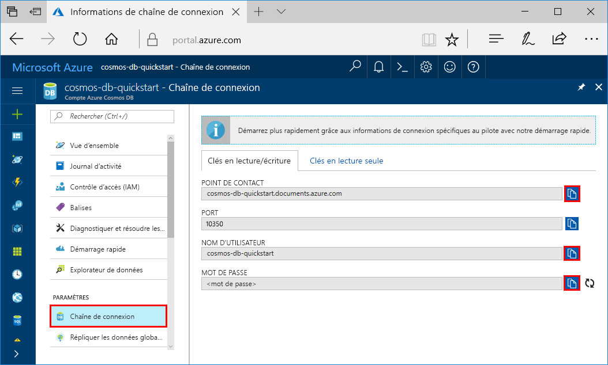
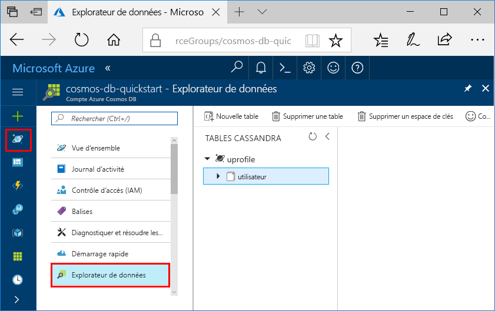

# <a name="quickstart-build-a-java-app-to-manage-azure-cosmos-db-cassandra-api-data"></a>Démarrage rapide : Créer une application Java pour gérer les données de l’API Cassandra d’Azure Cosmos DB

> [!div class="op_single_selector"]
> * [.NET](create-cassandra-dotnet.md)
> * [Java](create-cassandra-java.md)
> * [Node.JS](create-cassandra-nodejs.md)
> * [Python](create-cassandra-python.md)
>  

Ce guide de démarrage rapide montre comment utiliser Java et [l’API Cassandra](cassandra-introduction.md) Azure Cosmos DB pour créer une application de profil en clonant un exemple de GitHub. Ce guide de démarrage rapide vous montre également comment utiliser le portail Azure web pour créer un compte Azure Cosmos DB.

Azure Cosmos DB est le service de base de données multi-modèle de Microsoft distribué à l’échelle mondiale. Vous pouvez rapidement créer et interroger des bases de données de documents, de tables, de paires clé/valeur et de graphes, lesquelles bénéficient toutes des fonctionnalités de distribution mondiale et de mise à l’échelle horizontale d’Azure Cosmos DB. 

## <a name="prerequisites"></a>Conditions préalables requises

[!INCLUDE [quickstarts-free-trial-note](../../includes/quickstarts-free-trial-note.md)] Vous pouvez également [essayer Azure Cosmos DB gratuitement](https://azure.microsoft.com/try/cosmosdb/) sans abonnement Azure, ni frais ni engagement.

Par ailleurs, vous devez avoir :

* [Kit de développement Java (JDK), version 8](https://aka.ms/azure-jdks)
    * Veillez à définir la variable d’environnement JAVA_HOME pour qu’elle pointe vers le dossier dans lequel le JDK est installé.
* [Téléchargement](https://maven.apache.org/download.cgi) et [installation](https://maven.apache.org/install.html) d’une archive binaire [Maven](https://maven.apache.org/)
    * Sur Ubuntu, vous pouvez exécuter `apt-get install maven` pour installer Maven.
* [Git](https://www.git-scm.com/)
    * Sur Ubuntu, vous pouvez exécuter `sudo apt-get install git` pour installer Git.

## <a name="create-a-database-account"></a>Création d’un compte de base de données

Pour pouvoir créer une base de données de documents, vous devez créer un compte Cassandra avec Azure Cosmos DB.

[!INCLUDE [cosmos-db-create-dbaccount-cassandra](../../includes/cosmos-db-create-dbaccount-cassandra.md)]

## <a name="clone-the-sample-application"></a>Clonage de l’exemple d’application

À présent, travaillons sur le code. Nous allons maintenant cloner une application Cassandra à partir de GitHub, configurer la chaîne de connexion et l’exécuter. Vous verrez combien il est facile de travailler par programmation avec des données. 

1. Ouvrez une invite de commandes. Créez un dossier nommé `git-samples`. Ensuite, fermez l’invite de commandes.

    ```bash
    md "C:\git-samples"
    ```

2. Ouvrez une fenêtre de terminal git comme Git Bash et utilisez la commande `cd` pour accéder au nouveau dossier d’installation pour l’exemple d’application.

    ```bash
    cd "C:\git-samples"
    ```

3. Exécutez la commande suivante pour cloner l’exemple de référentiel : Cette commande crée une copie de l’exemple d’application sur votre ordinateur.

    ```bash
    git clone https://github.com/Azure-Samples/azure-cosmos-db-cassandra-java-getting-started.git
    ```

## <a name="review-the-code"></a>Vérifier le code

Cette étape est facultative. Si vous voulez savoir comment le code crée les ressources de base de données, vous pouvez consulter les extraits de code suivants. Sinon, vous pouvez passer à l’étape [Mise à jour de votre chaîne de connexion](#update-your-connection-string). Tous ces extraits de code sont tirés du fichier *src/main/java/com/azure/cosmosdb/cassandra/util/CassandraUtils.java*.  

* L’hôte, le port, le nom d’utilisateur, le mot de passe et les options SSL de Cassandra sont définis. Les informations sur la chaîne de connexion viennent de la page Chaîne de connexion du portail Azure.

   ```java
   cluster = Cluster.builder().addContactPoint(cassandraHost).withPort(cassandraPort).withCredentials(cassandraUsername, cassandraPassword).withSSL(sslOptions).build();
   ```

* Le `cluster` se connecte à l’API Cassandra Azure Cosmos DB et retourne une session à accéder.

    ```java
    return cluster.connect();
    ```

Les extraits de code suivants sont tous extraits du fichier *src/main/java/com/azure/cosmosdb/cassandra/repository/UserRepository.java*.

* Créez un espace de clé.

    ```java
    public void createKeyspace() {
        final String query = "CREATE KEYSPACE IF NOT EXISTS uprofile WITH replication = {'class': 'SimpleStrategy', 'replication_factor': '3' } ";
        session.execute(query);
        LOGGER.info("Created keyspace 'uprofile'");
    }
    ```

* Créez une table.

   ```java
   public void createTable() {
        final String query = "CREATE TABLE IF NOT EXISTS uprofile.user (user_id int PRIMARY KEY, user_name text, user_bcity text)";
        session.execute(query);
        LOGGER.info("Created table 'user'");
   }
   ```

* Insérez des entités utilisateur à l’aide d’un objet d’instruction préparé.

    ```java
    public PreparedStatement prepareInsertStatement() {
        final String insertStatement = "INSERT INTO  uprofile.user (user_id, user_name , user_bcity) VALUES (?,?,?)";
        return session.prepare(insertStatement);
    }

    public void insertUser(PreparedStatement statement, int id, String name, String city) {
        BoundStatement boundStatement = new BoundStatement(statement);
        session.execute(boundStatement.bind(id, name, city));
    }
    ```

* Faites une requête pour obtenir les informations de tous les utilisateurs.

    ```java
   public void selectAllUsers() {
        final String query = "SELECT * FROM uprofile.user";
        List<Row> rows = session.execute(query).all();

        for (Row row : rows) {
            LOGGER.info("Obtained row: {} | {} | {} ", row.getInt("user_id"), row.getString("user_name"), row.getString("user_bcity"));
        }
    }
    ```

* Faites une requête pour obtenir les informations d’un seul utilisateur.

    ```java
    public void selectUser(int id) {
        final String query = "SELECT * FROM uprofile.user where user_id = 3";
        Row row = session.execute(query).one();

        LOGGER.info("Obtained row: {} | {} | {} ", row.getInt("user_id"), row.getString("user_name"), row.getString("user_bcity"));
    }
    ```

## <a name="update-your-connection-string"></a>Mise à jour de votre chaîne de connexion

Maintenant, retournez dans le portail Azure afin d’obtenir les informations de votre chaîne de connexion et de les copier dans l’application. Les détails de la chaîne de connexion permettent à votre application de communiquer avec votre base de données hébergée.

1. Dans le [portail Azure](https://portal.azure.com/), sélectionnez **Chaîne de connexion**. 

    

2. Utilisez le  à droite de l’écran pour copier la valeur POINT DE CONTACT.

3. Ouvrez le fichier `config.properties` à partir du dossier `C:\git-samples\azure-cosmosdb-cassandra-java-getting-started\java-examples\src\main\resources`. 

3. Collez la valeur POINT DE CONTACT à partir du portail sur `<Cassandra endpoint host>` à la ligne 2.

    La ligne 2 du fichier config.properties doit désormais ressembler à 

    `cassandra_host=cosmos-db-quickstart.cassandra.cosmosdb.azure.com`

3. Revenez au portail et copiez la valeur NOM D’UTILISATEUR. Collez la valeur NOM D’UTILISATEUR à partir du portail sur `<cassandra endpoint username>` à la ligne 4.

    La ligne 4 du fichier config.properties doit désormais ressembler à 

    `cassandra_username=cosmos-db-quickstart`

4. Revenez au portail et copiez la valeur MOT DE PASSE. Collez la valeur MOT DE PASSE à partir du portail sur `<cassandra endpoint password>` à la ligne 5.

    La ligne 5 du fichier config.properties doit désormais ressembler à 

    `cassandra_password=2Ggkr662ifxz2Mg...==`

5. Sur la ligne 6, si vous voulez utiliser un certificat SSL spécifique, remplacez `<SSL key store file location>` par l’emplacement du certificat SSL. Si aucune valeur n’est renseignée, c’est le certificat JDK installé dans <JAVA_HOME>/jre/lib/security/cacerts qui est utilisé. 

6. Si vous avez modifié la ligne 6 pour utiliser un certificat SSL spécifique, mettez à jour la ligne 7 pour utiliser le mot de passe de ce certificat. 

7. Enregistrez le fichier `config.properties`.

## <a name="run-the-java-app"></a>Exécuter l’application Java

1. Dans la fenêtre de terminal git, ouvrez (`cd`) le dossier `azure-cosmosdb-cassandra-java-getting-started\java-examples`.

    ```git
    cd "C:\git-samples\azure-cosmosdb-cassandra-java-getting-started\java-examples"
    ```

2. Dans la fenêtre de terminal git, utilisez la commande suivante pour générer le fichier `cosmosdb-cassandra-examples.jar`.

    ```git
    mvn clean install
    ```

3. Dans la fenêtre de terminal git, exécutez la commande suivante pour démarrer l’application Java.

    ```git
    java -cp target/cosmosdb-cassandra-examples.jar com.azure.cosmosdb.cassandra.examples.UserProfile
    ```

    La fenêtre de terminal affiche des notifications indiquant que l’espace de clé et la table sont créés. Elle sélectionne et retourne ensuite tous les utilisateurs dans la table et affiche la sortie, avant de sélectionner une ligne par ID et d’afficher sa valeur.  

    Appuyez sur **CTRL + C** pour arrêter l’exécution du programme et fermer la fenêtre de console.

4. Dans le portail Azure, ouvrez **l’Explorateur de données** pour interroger, modifier et utiliser ces nouvelles données. 

    

## <a name="review-slas-in-the-azure-portal"></a>Vérification des contrats SLA dans le portail Azure

[!INCLUDE [cosmosdb-tutorial-review-slas](../../includes/cosmos-db-tutorial-review-slas.md)]

## <a name="clean-up-resources"></a>Nettoyer les ressources

[!INCLUDE [cosmosdb-delete-resource-group](../../includes/cosmos-db-delete-resource-group.md)]

## <a name="next-steps"></a>Étapes suivantes

Dans ce guide de démarrage rapide, vous avez appris à créer un compte Azure Cosmos DB, une base de données Cassandra et un conteneur à l’aide de l’Explorateur de données, puis à exécuter une application pour effectuer la même opération par programme. Vous pouvez maintenant importer des données supplémentaires dans votre conteneur Azure Cosmos. 

> [!div class="nextstepaction"]
> [Importer des données Cassandra dans Azure Cosmos DB](cassandra-import-data.md)
