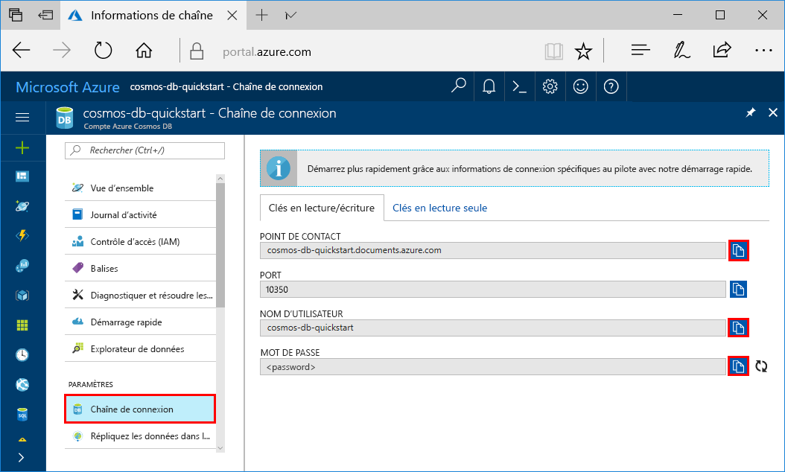
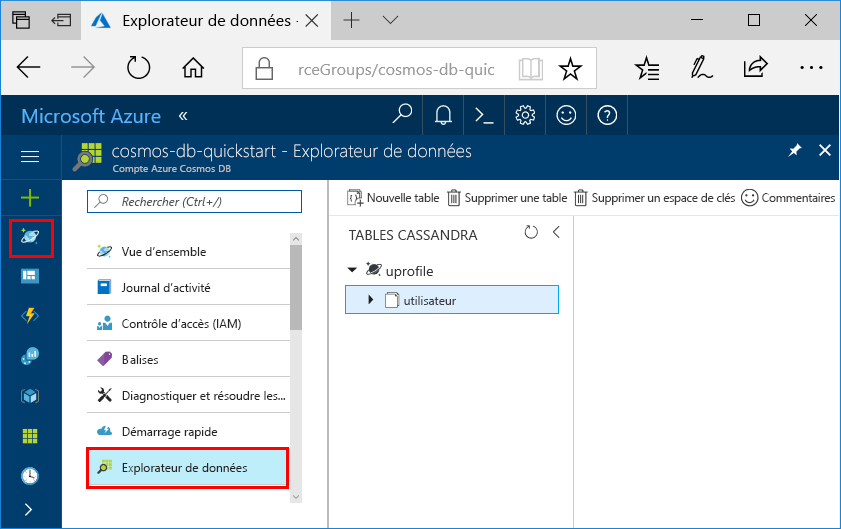

# <a name="quickstart-build-a-cassandra-app-with-nodejs-sdk-and-azure-cosmos-db"></a>Démarrage rapide : Créer une application Cassandra avec le SDK Node.js et Azure Cosmos DB

> [!div class="op_single_selector"]
> * [.NET](create-cassandra-dotnet.md)
> * [.NET Core](create-cassandra-dotnet-core.md)
> * [Java v3](create-cassandra-java.md)
> * [Java v4](create-cassandra-java-v4.md)
> * [Node.JS](create-cassandra-nodejs.md)
> * [Python](create-cassandra-python.md)
>  

Dans ce guide de démarrage rapide, vous allez créer un compte d’API Cassandra Azure Cosmos DB et utiliser une application Node.js Cassandra clonée à partir de GitHub pour créer une base de données et un conteneur Cassandra. Azure Cosmos DB est un service de base de données multimodèle qui vous permet de créer et interroger rapidement des bases de données de documents, de tables, de paires clé/valeur et de graphes avec des capacités de distribution mondiale et de mise à l’échelle horizontale.

## <a name="prerequisites"></a>Prérequis

[!INCLUDE [quickstarts-free-trial-note](../../includes/quickstarts-free-trial-note.md)] Vous pouvez également [essayer Azure Cosmos DB gratuitement](https://azure.microsoft.com/try/cosmosdb/) sans abonnement Azure, ni frais ni engagement.

Par ailleurs, vous devez avoir :
* [Node.js](https://nodejs.org/dist/v0.10.29/x64/node-v0.10.29-x64.msi) version v0.10.29 ou ultérieure
* [Git](https://git-scm.com/)

## <a name="create-a-database-account"></a>Création d’un compte de base de données

Pour pouvoir créer une base de données de documents, vous devez créer un compte Cassandra avec Azure Cosmos DB.

[!INCLUDE [cosmos-db-create-dbaccount-cassandra](../../includes/cosmos-db-create-dbaccount-cassandra.md)]

## <a name="clone-the-sample-application"></a>Clonage de l’exemple d’application

Nous allons maintenant cloner une application API Cassandra à partir de GitHub, configurer la chaîne de connexion et l’exécuter. Vous pouvez constater à quel point il est facile de travailler par programmation avec des données. 

1. Ouvrez une invite de commandes. Créez un dossier nommé `git-samples`. Ensuite, fermez l’invite de commandes.

    ```bash
    md "C:\git-samples"
    ```

2. Ouvrez une fenêtre de terminal git, comme git bash. Utilisez la commande `cd` pour ouvrir le nouveau dossier d’installation de l’exemple d’application.

    ```bash
    cd "C:\git-samples"
    ```

3. Exécutez la commande suivante pour cloner l’exemple de référentiel : Cette commande crée une copie de l’exemple d’application sur votre ordinateur.

    ```bash
    git clone https://github.com/Azure-Samples/azure-cosmos-db-cassandra-nodejs-getting-started.git
    ```

## <a name="review-the-code"></a>Vérifier le code

Cette étape est facultative. Si vous voulez savoir comment le code crée les ressources de base de données, vous pouvez consulter les extraits de code suivants. Les extraits de code sont tous tirés du fichier `uprofile.js` dans le dossier `C:\git-samples\azure-cosmos-db-cassandra-nodejs-getting-started`. Sinon, vous pouvez passer à l’étape [Mise à jour de votre chaîne de connexion](#update-your-connection-string). 

* Les valeurs de nom d’utilisateur et de mot de passe ont été définies en utilisant la page de chaîne de connexion du portail Azure. `path\to\cert` fournit le chemin d’un certificat X509. 

   ```javascript
   var ssl_option = {
        cert : fs.readFileSync("path\to\cert"),
        rejectUnauthorized : true,
        secureProtocol: 'TLSv1_2_method'
        };
   const authProviderLocalCassandra = new cassandra.auth.PlainTextAuthProvider(config.username, config.password);
   ```

* Le `client` est initialisé avec les informations contactPoint. Le contactPoint est récupéré à partir du portail Azure.

    ```javascript
    const client = new cassandra.Client({contactPoints: [config.contactPoint], authProvider: authProviderLocalCassandra, sslOptions:ssl_option});
    ```

* Le `client` se connecte à l’API Cassandra Azure Cosmos DB.

    ```javascript
    client.connect(next);
    ```

* Un espace de clés est créé.

    ```javascript
    function createKeyspace(next) {
        var query = "CREATE KEYSPACE IF NOT EXISTS uprofile WITH replication = {\'class\': \'NetworkTopologyStrategy\', \'datacenter1\' : \'1\' }";
        client.execute(query, next);
        console.log("created keyspace");    
  }
    ```

* Une table est créée.

   ```javascript
   function createTable(next) {
    var query = "CREATE TABLE IF NOT EXISTS uprofile.user (user_id int PRIMARY KEY, user_name text, user_bcity text)";
        client.execute(query, next);
        console.log("created table");
   },
   ```

* Des entités clé/valeur sont insérées.

    ```javascript
        function insert(next) {
            console.log("\insert");
            const arr = ['INSERT INTO  uprofile.user (user_id, user_name , user_bcity) VALUES (1, \'AdrianaS\', \'Seattle\')',
                        'INSERT INTO  uprofile.user (user_id, user_name , user_bcity) VALUES (2, \'JiriK\', \'Toronto\')',
                        'INSERT INTO  uprofile.user (user_id, user_name , user_bcity) VALUES (3, \'IvanH\', \'Mumbai\')',
                        'INSERT INTO  uprofile.user (user_id, user_name , user_bcity) VALUES (4, \'IvanH\', \'Seattle\')',
                        'INSERT INTO  uprofile.user (user_id, user_name , user_bcity) VALUES (5, \'IvanaV\', \'Belgaum\')',
                        'INSERT INTO  uprofile.user (user_id, user_name , user_bcity) VALUES (6, \'LiliyaB\', \'Seattle\')',
                        'INSERT INTO  uprofile.user (user_id, user_name , user_bcity) VALUES (7, \'JindrichH\', \'Buenos Aires\')',
                        'INSERT INTO  uprofile.user (user_id, user_name , user_bcity) VALUES (8, \'AdrianaS\', \'Seattle\')',
                        'INSERT INTO  uprofile.user (user_id, user_name , user_bcity) VALUES (9, \'JozefM\', \'Seattle\')'];
            arr.forEach(element => {
            client.execute(element);
            });
            next();
        },
    ```

* Requête pour obtenir toutes les valeurs de clé.

    ```javascript
        function selectAll(next) {
            console.log("\Select ALL");
            var query = 'SELECT * FROM uprofile.user';
            client.execute(query, function (err, result) {
            if (err) return next(err);
            result.rows.forEach(function(row) {
                console.log('Obtained row: %d | %s | %s ',row.user_id, row.user_name, row.user_bcity);
            }, this);
            next();
            });
        },
    ```  
    
* Requête pour obtenir une paire clé-valeur.

    ```javascript
        function selectById(next) {
            console.log("\Getting by id");
            var query = 'SELECT * FROM uprofile.user where user_id=1';
            client.execute(query, function (err, result) {
            if (err) return next(err);
            result.rows.forEach(function(row) {
                console.log('Obtained row: %d | %s | %s ',row.user_id, row.user_name, row.user_bcity);
            }, this);
            next();
            });
        }
    ```  

## <a name="update-your-connection-string"></a>Mise à jour de votre chaîne de connexion

Maintenant, retournez dans le portail Azure afin d’obtenir les informations de votre chaîne de connexion et de les copier dans l’application. La chaîne de connexion permet à votre application de communiquer avec votre base de données hébergée.

1. Dans votre compte Azure Cosmos DB, sur le [portail Azure](https://portal.azure.com/), sélectionnez **Chaîne de connexion**. 

    Utilisez le  à droite de l’écran pour copier la valeur supérieure, c’est-à-dire le POINT DE CONTACT.

    

2. Ouvrez le fichier `config.js` . 

3. Collez la valeur POINT DE CONTACT à partir du portail sur `<FillMEIN>` à la ligne 4.

    La ligne 4 doit maintenant ressembler à 

    `config.contactPoint = "cosmos-db-quickstarts.cassandra.cosmosdb.azure.com:10350"`

4. Copiez la valeur NOM D’UTILISATEUR à partir du portail et collez-la sur `<FillMEIN>` à la ligne 2.

    La ligne 2 doit maintenant ressembler à 

    `config.username = 'cosmos-db-quickstart';`
    
5. Copiez la valeur MOT DE PASSE à partir du portail et collez-la sur `<FillMEIN>` à la ligne 3.

    La ligne 3 doit maintenant ressembler à

    `config.password = '2Ggkr662ifxz2Mg==';`

6. Enregistrez le fichier `config.js`.
    
## <a name="use-the-x509-certificate"></a>Utiliser le certificat X509

1. Téléchargez le certificat racine Baltimore CyberTrust localement à partir de [https://cacert.omniroot.com/bc2025.crt](https://cacert.omniroot.com/bc2025.crt). Renommez le fichier avec l’extension de fichier `.cer`.

   Le certificat a le numéro de série `02:00:00:b9` et l’empreinte digitale SHA1 `d4🇩🇪20:d0:5e:66:fc:53:fe:1a:50:88:2c:78:db:28:52:ca:e4:74`.

2. Ouvrez `uprofile.js` et changez le `path\to\cert` pour pointer vers votre nouveau certificat.

3. Enregistrez `uprofile.js`.

> [!NOTE]
> Si vous rencontrez une erreur liée au certificat dans les étapes ultérieures et que vous êtes sur une machine Windows, assurez-vous d’avoir suivi le processus approprié pour convertir un fichier .crt au format .cer de Microsoft ci-dessous.
> 
> Double-cliquez sur le fichier .crt pour l’ouvrir dans la page du certificat. 
>
> 
>
> Dans l’Assistant Certificat, appuyez sur Suivant. Sélectionnez X.509 encodé en base 64 (.cer), puis Suivant.
>
> 
>
> Sélectionnez Parcourir (pour rechercher une destination) et tapez un nom de fichier.
> Sélectionnez Suivant, puis Terminé.
>
> Vous devez maintenant avoir un fichier .cer au bon format. Vérifiez que le chemin dans `uprofile.js` pointe vers ce fichier.

## <a name="run-the-nodejs-app"></a>Exécuter l’application Node.js

1. Dans la fenêtre de terminal git, vérifiez que vous êtes bien dans l’exemple de répertoire que vous avez cloné précédemment :

    ```bash
    cd azure-cosmos-db-cassandra-nodejs-getting-started
    ```

2. Exécutez `npm install` pour installer les modules npm requis.

3. Exécutez `node uprofile.js` pour démarrer votre application Node.

4. Vérifiez que les résultats sont corrects à partir de la ligne de commande.

    

    Appuyez sur CTRL+C pour arrêter l’exécution du programme et fermer la fenêtre de console. 

5. Dans le portail Azure, ouvrez **l’Explorateur de données** pour interroger, modifier et utiliser ces nouvelles données. 

     

## <a name="review-slas-in-the-azure-portal"></a>Vérification des contrats SLA dans le portail Azure

[!INCLUDE [cosmosdb-tutorial-review-slas](../../includes/cosmos-db-tutorial-review-slas.md)]

## <a name="clean-up-resources"></a>Nettoyer les ressources

[!INCLUDE [cosmosdb-delete-resource-group](../../includes/cosmos-db-delete-resource-group.md)]

## <a name="next-steps"></a>Étapes suivantes

Dans ce guide de démarrage rapide, vous avez découvert comment créer un compte Azure Cosmos DB avec l’API Cassandra et exécuter une application Node.js Cassandra qui crée une base de données et un conteneur Cassandra. Vous pouvez maintenant importer des données supplémentaires dans votre compte Azure Cosmos DB. 

> [!div class="nextstepaction"]
> [Importer des données Cassandra dans Azure Cosmos DB](cassandra-import-data.md)