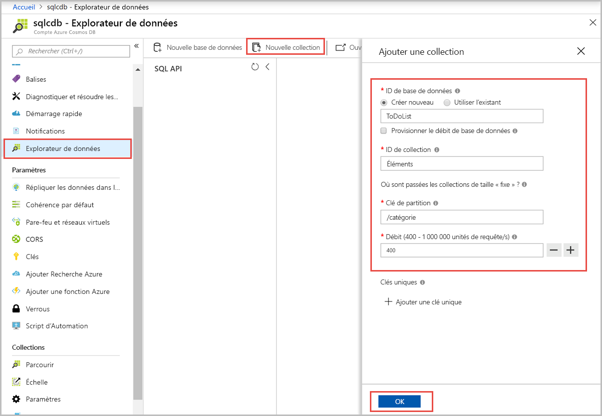
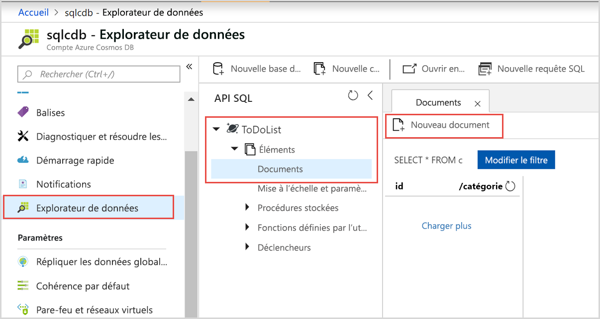
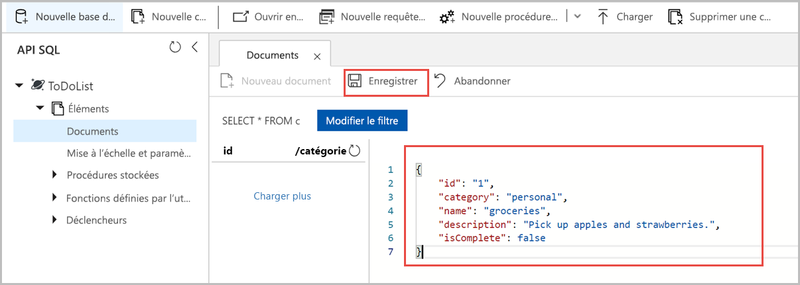

# <a name="quickstart-create-an-azure-cosmos-account-database-container-and-items-from-the-azure-portal"></a>Démarrage rapide : Créer un compte, une base de données, un conteneur et des éléments Azure Cosmos à partir du portail Azure

> [!div class="op_single_selector"]
> * [Azure portal](create-cosmosdb-resources-portal.md)
> * [.NET](create-sql-api-dotnet.md)
> * [Java](create-sql-api-java.md)
> * [Node.JS](create-sql-api-nodejs.md)
> * [Python](create-sql-api-python.md)
> * [Xamarin](create-sql-api-xamarin-dotnet.md)
>  

Azure Cosmos DB est le service de base de données multi-modèle de Microsoft distribué à l’échelle mondiale. Vous pouvez utiliser Azure Cosmos DB pour créer et interroger rapidement des bases de données de paires clé/valeur, des bases de données de documents et des bases de données de graphes, qui bénéficient toutes des fonctionnalités de distribution mondiale et de mise à l’échelle horizontale au cœur même d’Azure Cosmos DB. 

Ce guide de démarrage rapide montre comment utiliser le portail Azure pour créer un compte d’[API SQL](sql-api-introduction.md) Azure Cosmos DB, comment créer une base de données de documents et un conteneur, et comment ajouter des données au conteneur. 

## <a name="prerequisites"></a>Prérequis

Un abonnement Azure ou un compte d’essai gratuit Azure Cosmos DB
- [!INCLUDE [quickstarts-free-trial-note](../../includes/quickstarts-free-trial-note.md)] 

- [!INCLUDE [cosmos-db-emulator-docdb-api](../../includes/cosmos-db-emulator-docdb-api.md)]  

<a id="create-account"></a>
## <a name="create-an-azure-cosmos-db-account"></a>Création d’un compte Azure Cosmos DB

[!INCLUDE [cosmos-db-create-dbaccount](../../includes/cosmos-db-create-dbaccount.md)]

<a id="create-container-database"></a>
## <a name="add-a-database-and-a-container"></a>Ajouter une base de données et un conteneur 

Vous pouvez utiliser l’Explorateur de données du portail Azure pour créer une base de données et un conteneur. 

1.  Dans la page de votre compte Azure Cosmos DB, sur la gauche, sélectionnez **Explorateur de données**, puis **Nouveau conteneur**. 
    
    Vous devrez peut-être faire défiler vers la droite pour voir la fenêtre **Ajouter un conteneur**.
    
    
    
1.  Dans le volet **Ajouter un conteneur**, entrez les paramètres du nouveau conteneur.
    
    |Paramètre|Valeur suggérée|Description
    |---|---|---|
    |**ID de base de données**|ToDoList|Entrez *ToDoList* pour le nom de la nouvelle base de données. Les noms de base de données doivent comporter entre 1 et 255 caractères, et ne peuvent pas contenir les caractères `/, \\, #, ?`, ni un espace de fin. Cochez l’option **Provisionner le débit de base de données** qui vous permet de partager le débit provisionné pour la base de données entre tous les conteneurs au sein de la base de données. Cette option permet également de réduire les coûts. |
    |**Débit**|400|Laissez le débit sur 400 unités de requête par seconde (RU/s). Si vous souhaitez réduire la latence, vous pourrez augmenter le débit par la suite.| 
    |**ID de conteneur**|Éléments|Entrez *Éléments* comme nom de votre nouveau conteneur. Les ID de conteneur sont soumis aux mêmes exigences en termes de caractères que les noms de base de données.|
    |**Clé de partition**| /category| L’exemple décrit dans cet article utilise */category* comme clé de partition.|

    
    Pour cet exemple, n’ajoutez pas de **Clés uniques**. Les clés uniques vous permettent d’ajouter une couche d’intégrité des données à la base de données en garantissant que chaque clé de partition contient des valeurs uniques. Pour plus d’informations, consultez [Clés uniques dans Azure Cosmos DB](unique-keys.md).
    
1.  Sélectionnez **OK**. L’Explorateur de données présente la nouvelle base de données et le conteneur que vous avez créé.

## <a name="add-data-to-your-database"></a>Ajouter des données à votre base de données

Ajoutez des données à votre nouvelle base de données à l’aide de l’Explorateur de données.

1. Dans l’**Explorateur de données**, développez la base de données **ToDoList**, puis développez le conteneur **Éléments**. Ensuite, sélectionnez **Éléments**, puis sélectionnez **Nouvel élément**. 
   
   
   
1. Ajoutez la structure suivante au document, sur la droite du volet **Documents** :

     ```json
     {
         "id": "1",
         "category": "personal",
         "name": "groceries",
         "description": "Pick up apples and strawberries.",
         "isComplete": false
     }
     ```

1. Sélectionnez **Enregistrer**.
   
   
   
1. Sélectionnez à nouveau **Nouveau document** puis créez et enregistrez un autre document avec un `id` unique, ainsi que les propriétés et valeurs souhaitées. Vos documents peuvent avoir la structure de votre choix, car Azure Cosmos DB n’impose aucun schéma à vos données.

## <a name="query-your-data"></a>Interroger vos données

[!INCLUDE [cosmos-db-create-sql-api-query-data](../../includes/cosmos-db-create-sql-api-query-data.md)] 

## <a name="clean-up-resources"></a>Nettoyer les ressources

[!INCLUDE [cosmosdb-delete-resource-group](../../includes/cosmos-db-delete-resource-group.md)]

## <a name="next-steps"></a>Étapes suivantes

Dans ce démarrage rapide, vous avez appris à créer un compte Azure Cosmos DB, ainsi qu’à créer une base de données et un conteneur à l’aide de l’Explorateur de données. Vous pouvez maintenant importer des données supplémentaires dans votre compte Azure Cosmos DB. 

> [!div class="nextstepaction"]
> [Importer des données dans Azure Cosmos DB](import-data.md)
