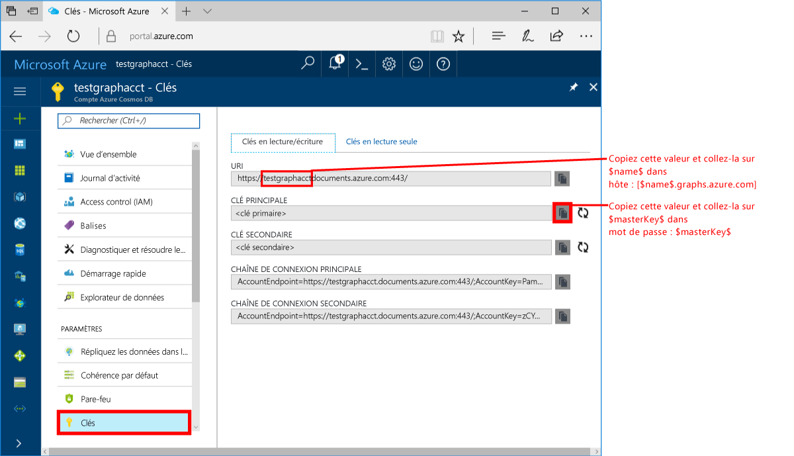
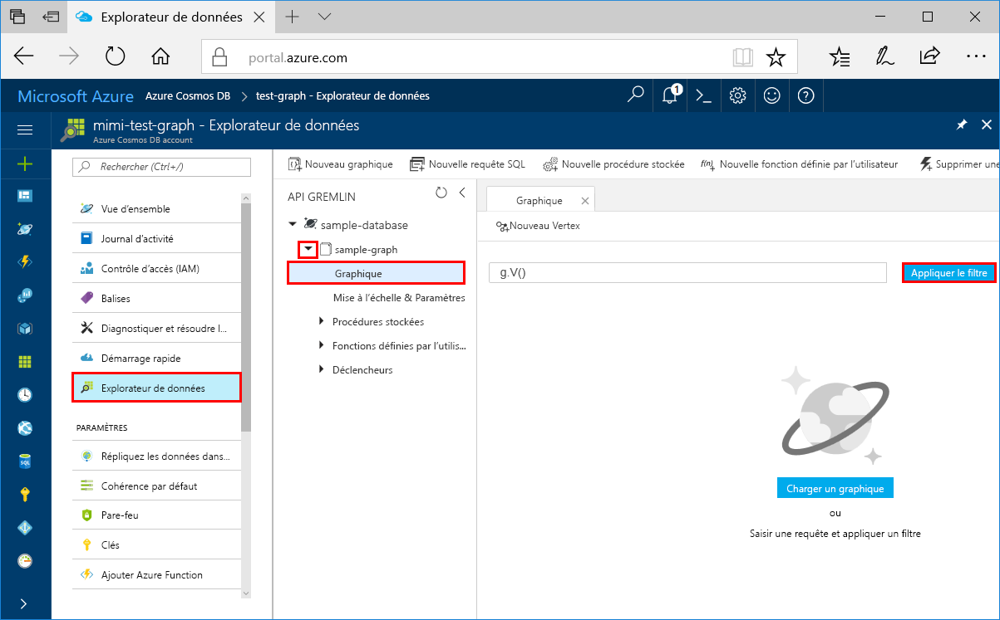
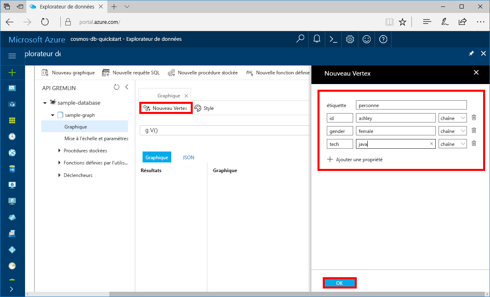
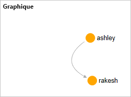

# <a name="azure-cosmos-db-create-a-graph-database-using-java-and-the-azure-portal"></a>Azure Cosmos DB : Créer une base de données de graphe avec Java et le portail Azure

> [!div class="op_single_selector"]
> * [Console Gremlin](create-graph-gremlin-console.md)
> * [.NET](create-graph-dotnet.md)
> * [Java](create-graph-java.md)
> * [Node.JS](create-graph-nodejs.md)
> * [Python](create-graph-python.md)
> * [PHP](create-graph-php.md)
>  

Azure Cosmos DB est le service de base de données multi-modèle de Microsoft distribué à l’échelle mondiale. Avec Azure Cosmos DB, vous pouvez rapidement créer et interroger des bases de données de documents, tables et graphiques gérées. 

Ce guide de démarrage rapide crée une base de données de graphiques simple à l’aide des outils du portail Azure pour Azure Cosmos DB. Ce guide vous indique également comment créer rapidement une application console Java au moyen d’une base de données [API Gremlin](graph-introduction.md) en utilisant le pilote [Apache TinkerPop](https://tinkerpop.apache.org/). Les instructions de ce guide de démarrage rapide s’appliquent à tous les systèmes d’exploitation pouvant exécuter Java. Avec ce guide de démarrage rapide, vous saurez comment créer et modifier des graphiques dans l’interface utilisateur ou par programme, selon la méthode que vous préférez. 

## <a name="prerequisites"></a>Prérequis
[!INCLUDE [quickstarts-free-trial-note](../../includes/quickstarts-free-trial-note.md)]

Par ailleurs :

* [Java Development Kit (JDK) 1.7+](https://aka.ms/azure-jdks)
    * Sur Ubuntu, exécutez `apt-get install default-jdk` pour installer le JDK.
    * Veillez à définir la variable d’environnement JAVA_HOME pour qu’elle pointe vers le dossier dans lequel le JDK est installé.
* [Téléchargement](https://maven.apache.org/download.cgi) et [installation](https://maven.apache.org/install.html) d’une archive binaire [Maven](https://maven.apache.org/)
    * Sur Ubuntu, vous pouvez exécuter `apt-get install maven` pour installer Maven.
* [Git](https://www.git-scm.com/)
    * Sur Ubuntu, vous pouvez exécuter `sudo apt-get install git` pour installer Git.

## <a name="create-a-database-account"></a>Création d’un compte de base de données

Pour être en mesure de créer une base de données de graphiques, vous devez avoir préalablement créé un compte de base de données (Graphique) Gremlin avec Azure Cosmos DB.

[!INCLUDE [cosmos-db-create-dbaccount-graph](../../includes/cosmos-db-create-dbaccount-graph.md)]

## <a name="add-a-graph"></a>Ajout d’un graphique

[!INCLUDE [cosmos-db-create-graph](../../includes/cosmos-db-create-graph.md)]

## <a name="clone-the-sample-application"></a>Clonage de l’exemple d’application

À présent, travaillons sur le code. Nous allons cloner une application API Gremlin à partir de GitHub, configurer la chaîne de connexion et l’exécuter. Vous verrez combien il est facile de travailler par programmation avec des données.  

1. Ouvrez une invite de commandes, créez un nouveau dossier nommé git-samples, puis fermez l’invite de commandes.

    ```bash
    md "C:\git-samples"
    ```

2. Ouvrez une fenêtre de terminal git comme Git Bash et utilisez la commande `cd` pour accéder à un dossier d’installation pour l’exemple d’application.  

    ```bash
    cd "C:\git-samples"
    ```

3. Exécutez la commande suivante pour cloner l’exemple de référentiel : Cette commande crée une copie de l’exemple d’application sur votre ordinateur. 

    ```bash
    git clone https://github.com/Azure-Samples/azure-cosmos-db-graph-java-getting-started.git
    ```

## <a name="review-the-code"></a>Vérifier le code

Cette étape est facultative. Pour savoir comment les ressources de base de données sont créées dans le code, vous pouvez examiner les extraits de code suivants. Sinon, vous pouvez passer à l’étape [Mise à jour de votre chaîne de connexion](#update-your-connection-information).

Les extraits de code suivants sont tirés du fichier C:\git-samples\azure-cosmos-db-graph-java-getting-started\src\GetStarted\Program.java.

* Le `Client` Gremlin est initialisé à partir de la configuration dans le fichier C:\git-samples\azure-cosmos-db-graph-java-getting-started\src\remote.yaml.

    ```java
    cluster = Cluster.build(new File("src/remote.yaml")).create();
    ...
    client = cluster.connect();
    ```

* Une série d’étapes Gremlin sont exécutées à l’aide de la méthode `client.submit`.

    ```java
    ResultSet results = client.submit(gremlin);

    CompletableFuture<List<Result>> completableFutureResults = results.all();
    List<Result> resultList = completableFutureResults.get();

    for (Result result : resultList) {
        System.out.println(result.toString());
    }
    ```

## <a name="update-your-connection-information"></a>Mise à jour de vos informations de connexion

Maintenant, retournez dans le portail Azure afin d’obtenir vos informations de connexion et de les copier dans l’application. Ces paramètres permettent à votre application de communiquer avec votre base de données hébergée.

1. Dans le [portail Azure](https://portal.azure.com/), cliquez sur **Clés**. 

    Copiez la première partie de la valeur de l’URI.

    
2. Ouvrez le fichier src/remote.yaml et collez la valeur d’ID unique sur `$name$` dans `hosts: [$name$.graphs.azure.com]`.

    La ligne 1 du fichier remote.yaml doit maintenant ressembler à la ligne suivante : 

    `hosts: [test-graph.graphs.azure.com]`

3. Remplacez `graphs` par `gremlin.cosmosdb` dans la valeur `endpoint`. (Si vous avez créé votre compte de base de données de graphiques avant le 20 décembre 2017, n’apportez aucune modification à la valeur de point de terminaison et passez à l’étape suivante.)

    La valeur de point de terminaison doit maintenant ressembler à ceci :

    `"endpoint": "https://testgraphacct.gremlin.cosmosdb.azure.com:443/"`

4. Dans le portail Azure, utilisez le bouton de copie pour copier la CLÉ PRIMAIRE, puis collez-la sur `$masterKey$` dans `password: $masterKey$`.

    La ligne 4 du fichier remote.yaml doit maintenant ressembler à la ligne suivante : 

    `password: 2Ggkr662ifxz2Mg==`

5. Modifiez la ligne 3 du fichier remote.yaml en remplaçant

    `username: /dbs/$database$/colls/$collection$`

    to 

    `username: /dbs/sample-database/colls/sample-graph`

    Si vous avez utilisé un nom unique pour votre exemple de base de données ou de graphique, mettez à jour les valeurs comme nécessaire.

6. Enregistrez le fichier remote.yaml.

## <a name="run-the-console-app"></a>Exécution de l’application console

1. Dans la fenêtre de terminal git, exécutez la commande `cd` pour accéder au dossier azure-cosmos-db-graph-java-getting-started.

    ```git
    cd "C:\git-samples\azure-cosmos-db-graph-java-getting-started"
    ```

2. Dans la fenêtre de terminal git, utilisez la commande suivante pour installer les packages Java requis.

   ```
   mvn package
   ```

3. Dans la fenêtre de terminal git, utilisez la commande suivante pour démarrer l’application Java.
    
    ```
    mvn exec:java -D exec.mainClass=GetStarted.Program
    ```

    La fenêtre de terminal affiche les vertex ajoutés au graphique. 
    
    Si vous rencontrez des erreurs de délai d’expiration, vérifiez que vous avez correctement mis à jour les informations de connexion dans [Mise à jour de vos informations de connexion](#update-your-connection-information) et essayez également de réexécuter la dernière commande. 
    
    Une fois le programme terminé, appuyez sur Entrée, puis rebasculez vers le portail Azure dans votre navigateur Internet. 

<a id="add-sample-data"></a>
## <a name="review-and-add-sample-data"></a>Examiner et ajouter des exemples de données

Vous pouvez à présent revenir à l’Explorateur de données et voir les vertex ajoutés au graphique, ainsi qu’ajouter des points de données supplémentaires.

1. Cliquez sur **Explorateur de données**, développez **sample-graph**, cliquez sur **Graphique**, puis cliquez sur **Appliquer un filtre**. 

   

2. Dans la liste **Résultats**, observez les nouveaux utilisateurs ajoutés au graphique. Sélectionnez **ben** et notez que l’utilisateur est connecté à robin. Vous pouvez glisser-déplacez les vertex, effectuer un zoom avant et arrière à l’aide de la roulette de la souris et augmenter la taille du graphique avec la double flèche. 

   

3. Nous allons à présent ajouter quelques nouveaux utilisateurs. Cliquez sur le bouton **New Vertex (Nouveau vertex)** pour ajouter des données à votre graphique.

   

4. Dans la zone d’étiquette, entrez *personne*.

5. Cliquez sur **Ajouter une propriété** pour ajouter chacune des propriétés suivantes. Notez que vous pouvez créer des propriétés uniques pour chaque personne dans votre graphique. Seule la clé id est obligatoire.

    key|value|Notes
    ----|----|----
    id|ashley|Identificateur unique du vertex. Si vous ne spécifiez aucun id, le système en génère un pour vous.
    gender|female| 
    tech | java | 

    > [!NOTE]
    > Dans ce Démarrage rapide, vous créez une collection non partitionnée. Toutefois, si vous créez une collection partitionnée en spécifiant une clé de partition lors de la création de la collection, vous devez inclure la clé de partition en tant que clé dans chaque nouveau vertex. 

6. Cliquez sur **OK**. Vous pouvez avoir besoin d’agrandir votre écran pour voir apparaître le bouton **OK** au bas de l’écran.

7. Cliquez de nouveau sur **New Vertex (Nouveau vertex)** et ajoutez un nouvel utilisateur supplémentaire. 

8. Entrez l’étiquette *person*.

9. Cliquez sur **Ajouter une propriété** pour ajouter chacune des propriétés suivantes :

    key|value|Notes
    ----|----|----
    id|rakesh|Identificateur unique du vertex. Si vous ne spécifiez aucun id, le système en génère un pour vous.
    gender|male| 
    school|MIT| 

10. Cliquez sur **OK**. 

11. Cliquez sur le bouton **Appliquer un filtre** avec le filtre par défaut `g.V()` pour afficher toutes les valeurs dans le graphique. Tous les utilisateurs apparaissent désormais dans la liste **Résultats**. 

    À mesure que vous ajoutez d’autres données, vous pouvez utiliser des filtres pour limiter les résultats renvoyés. Par défaut, l’Explorateur de données utilise `g.V()` pour récupérer tous les vertex dans un graphique. Vous pouvez choisir une autre [requête de graphique](tutorial-query-graph.md) comme `g.V().count()` pour retourner le nombre total de vertex dans le graphique au format JSON. Si vous avez modifié le filtre, choisissez de nouveau le filtre `g.V()` et cliquez sur **Appliquer un filtre** pour afficher de nouveau l’ensemble des résultats.

12. À présent, vous pouvez connecter rakesh et ashley. Vérifiez que **ashley** est bien sélectionné dans la liste **Résultats**, puis cliquez sur  en regard de **Cibles** dans la partie inférieure droite de l’écran. Vous devrez peut-être élargir la fenêtre pour voir le bouton.

   

13. Dans la zone **Cible**, tapez *rakesh*. Dans la zone **Edge label** (Étiquette de relation), tapez *knows*, puis cochez la case.

   

14. À présent, sélectionnez **rakesh** dans la liste des résultats et vérifiez qu’ashley et rakesh sont connectés. 

   

   Ainsi s’achève la portion de ce didacticiel consacrée à la création de ressources. Vous pouvez continuer à ajouter des vertex à votre graphique, modifier les vertex existants ou modifier les requêtes. Nous allons à présent examiner les métriques fournies par Azure Cosmos DB et nettoyer les ressources. 

## <a name="review-slas-in-the-azure-portal"></a>Vérification des contrats SLA dans le portail Azure

[!INCLUDE [cosmosdb-tutorial-review-slas](../../includes/cosmos-db-tutorial-review-slas.md)]

## <a name="clean-up-resources"></a>Supprimer des ressources

[!INCLUDE [cosmosdb-delete-resource-group](../../includes/cosmos-db-delete-resource-group.md)]

## <a name="next-steps"></a>Étapes suivantes

Dans ce guide de démarrage rapide, vous avez appris à créer un compte Azure Cosmos D, à créer un graphique à l’aide de l’Explorateur de données et à exécuter une application. Vous pouvez maintenant générer des requêtes plus complexes et implémenter une logique de traversée de graphique puissante, à l’aide de Gremlin. 

> [!div class="nextstepaction"]
> [Interroger à l’aide de Gremlin](tutorial-query-graph.md)

