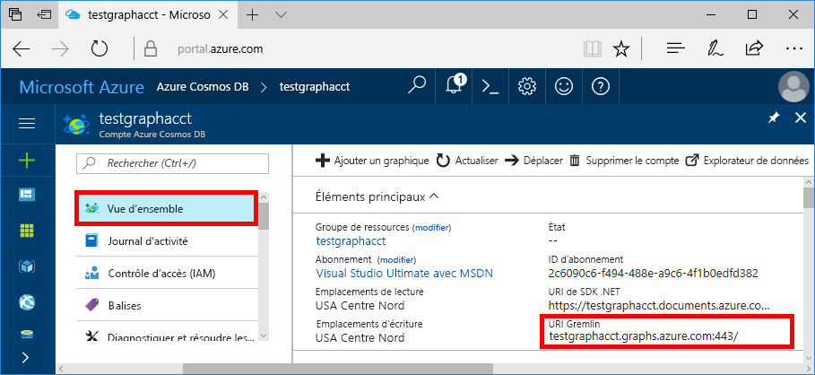
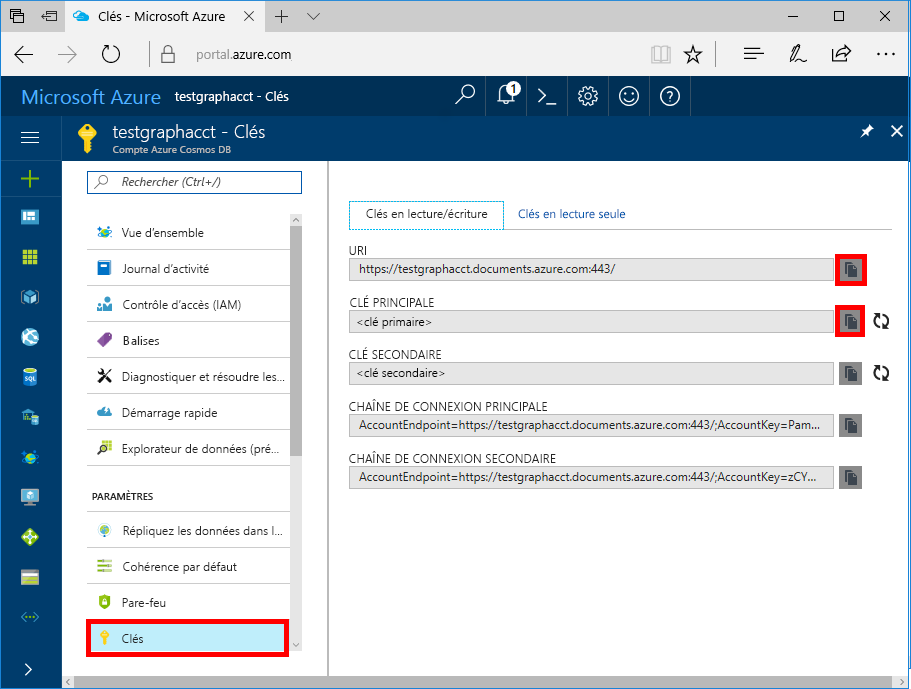

# <a name="quickstart-build-a-nodejs-application-by-using-azure-cosmos-db-gremlin-api-account"></a>Démarrage rapide : Créer une application Node.js à l’aide du compte de l’API Gremlin Azure Cosmos DB

> [!div class="op_single_selector"]
> * [Console Gremlin](create-graph-gremlin-console.md)
> * [.NET](create-graph-dotnet.md)
> * [Java](create-graph-java.md)
> * [Node.JS](create-graph-nodejs.md)
> * [Python](create-graph-python.md)
> * [PHP](create-graph-php.md)
>  

Azure Cosmos DB est le service de base de données multi-modèle distribué mondialement de Microsoft. Rapidement, vous avez la possibilité de créer et d’interroger des documents, des paires clé/valeur, et des bases de données orientées graphe, profitant tous de la distribution à l’échelle mondiale et des capacités de mise à l’échelle horizontale au cœur d’Azure Cosmos DB. 

Ce guide de démarrage rapide explique comment créer un compte, une base de données et un graphe [API Gremlin](graph-introduction.md) Azure Cosmos DB à l’aide du Portail Azure. Par la suite, vous allez créer et exécuter une application console en utilisant le pilote [Gremlin Node.js](https://www.npmjs.com/package/gremlin) open-source.

## <a name="prerequisites"></a>Prérequis

Avant de pouvoir exécuter cet exemple, vous devez posséder les composants requis suivants :
* [Node.js](https://nodejs.org/en/) version 0.10.29 ou supérieure
* [Git](https://git-scm.com/)

[!INCLUDE [quickstarts-free-trial-note](../../includes/quickstarts-free-trial-note.md)]

## <a name="create-a-database-account"></a>Création d’un compte de base de données

[!INCLUDE [cosmos-db-create-dbaccount-graph](../../includes/cosmos-db-create-dbaccount-graph.md)]

## <a name="add-a-graph"></a>Ajout d’un graphique

[!INCLUDE [cosmos-db-create-graph](../../includes/cosmos-db-create-graph.md)]

## <a name="clone-the-sample-application"></a>Clonage de l’exemple d’application

À présent, nous allons cloner une application API Gremlin à partir de GitHub, configurer la chaîne de connexion et l’exécuter. Vous verrez combien il est facile de travailler par programmation avec des données. 

1. Ouvrez une invite de commandes, créez un nouveau dossier nommé git-samples, puis fermez l’invite de commandes.

    ```bash
    md "C:\git-samples"
    ```

2. Ouvrez une fenêtre de terminal git comme Git Bash et utilisez la commande `cd` pour accéder au nouveau dossier d’installation pour l’exemple d’application.

    ```bash
    cd "C:\git-samples"
    ```

3. Exécutez la commande suivante pour cloner l’exemple de référentiel : Cette commande crée une copie de l’exemple d’application sur votre ordinateur.

    ```bash
    git clone https://github.com/Azure-Samples/azure-cosmos-db-graph-nodejs-getting-started.git
    ```

3. Ouvrez le fichier de solution dans Visual Studio. 

## <a name="review-the-code"></a>Vérifier le code

Cette étape est facultative. Pour savoir comment les ressources de base de données sont créées dans le code, vous pouvez examiner les extraits de code suivants. Sinon, vous pouvez passer à l’étape [Mise à jour de votre chaîne de connexion](#update-your-connection-string). 

Tous les extraits de code suivants proviennent du fichier app.js.

* Le client Gremlin est créé.

    ```javascript
    const authenticator = new Gremlin.driver.auth.PlainTextSaslAuthenticator(
        `/dbs/${config.database}/colls/${config.collection}`, 
        config.primaryKey
    )


    const client = new Gremlin.driver.Client(
        config.endpoint, 
        { 
            authenticator,
            traversalsource : "g",
            rejectUnauthorized : true,
            mimeType : "application/vnd.gremlin-v2.0+json"
        }
    );

    ```

  Les configurations sont toutes dans `config.js`, que nous allons modifier dans la [section suivante](#update-your-connection-string).

* Plusieurs fonctions sont définies pour exécuter différentes opérations Gremlin. Voici l’une d’entre elles :

    ```javascript
    function addVertex1()
    {
        console.log('Running Add Vertex1'); 
        return client.submit("g.addV(label).property('id', id).property('firstName', firstName).property('age', age).property('userid', userid).property('pk', 'pk')", {
                label:"person",
                id:"thomas",
                firstName:"Thomas",
                age:44, userid: 1
            }).then(function (result) {
                    console.log("Result: %s\n", JSON.stringify(result));
            });
    }
    ```

* Chaque fonction exécute une méthode `client.execute` avec un paramètre de chaîne de requête Gremlin. Voici un exemple d’exécution de `g.V().count()` :

    ```javascript
    function countVertices()
    {
        console.log('Running Count');
        return client.submit("g.V().count()", { }).then(function (result) {
            console.log("Result: %s\n", JSON.stringify(result));
        });
    }
    ```

* À la fin du fichier, toutes les méthodes sont appelées. Le code suivant va les exécuter les unes après les autres :

    ```javascript
    client.open()
    .then(dropGraph)
    .then(addVertex1)
    .then(addVertex2)
    .then(addEdge)
    .then(countVertices)
    .catch((err) => {
        console.error("Error running query...");
        console.error(err)
    }).then((res) => {
        client.close();
        finish();
    }).catch((err) => 
        console.error("Fatal error:", err)
    );
    ```


## <a name="update-your-connection-string"></a>Mise à jour de votre chaîne de connexion

1. Ouvrez le fichier config.js. 

2. Dans le fichier config.js, renseignez la clé `config.endpoint` avec la valeur **URI Gremlin** dans la page **Vue d’ensemble** du portail Azure. 

    `config.endpoint = "https://<your_Gremlin_account_name>.gremlin.cosmosdb.azure.com:443/";`

    

3. Dans le fichier config.js, renseignez la valeur config.primaryKey avec la valeur de la **Clé primaire** à partir de la page **Clés** du portail Azure. 

    `config.primaryKey = "PRIMARYKEY";`

   

4. Entrez le nom de la base de données et le nom du graphique (conteneur) pour la valeur de config.database et de config.collection. 

Voici un exemple de ce à quoi votre fichier config.js terminé doit ressembler :

```javascript
var config = {}

// Note that this must not have HTTPS or the port number
config.endpoint = "https://testgraphacct.gremlin.cosmosdb.azure.com:443/"; 
config.primaryKey = "Pams6e7LEUS7LJ2Qk0fjZf3eGo65JdMWHmyn65i52w8ozPX2oxY3iP0yu05t9v1WymAHNcMwPIqNAEv3XDFsEg==";
config.database = "graphdb"
config.collection = "Persons"

module.exports = config;
```

## <a name="run-the-console-app"></a>Exécution de l’application console

1. Ouvrez une fenêtre de terminal et remplacez l’élément par le répertoire d’installation pour le fichier package.json inclus dans le projet (via la commande `cd`).

2. Exécutez `npm install` pour installer les modules npm requis, y compris `gremlin`.

3. Exécutez `node app.js` sur un terminal pour démarrer votre application Node.

## <a name="browse-with-data-explorer"></a>Navigation avec l’Explorateur de données

Vous pouvez maintenant revenir à l’Explorateur de données, dans le portail Azure, pour afficher, modifier, interroger et manipuler vos nouvelles données graphiques.

Dans l’Explorateur de données, la nouvelle base de données apparaît dans le volet **Graphique**. Développez la base de données, suivie du conteneur, puis sélectionnez **Graphe**.

Les données générées par l’exemple d’application s’affichent dans le volet suivant de l’onglet **Graphe** lorsque vous sélectionnez **Appliquer un filtre**.

Essayez de renseigner `g.V()` avec `.has('firstName', 'Thomas')` pour tester le filtre. Notez que la valeur respecte la casse.

## <a name="review-slas-in-the-azure-portal"></a>Vérification des contrats SLA dans le portail Azure

[!INCLUDE [cosmosdb-tutorial-review-slas](../../includes/cosmos-db-tutorial-review-slas.md)]

## <a name="clean-up-your-resources"></a>Nettoyage des ressources

[!INCLUDE [cosmosdb-delete-resource-group](../../includes/cosmos-db-delete-resource-group.md)]

## <a name="next-steps"></a>Étapes suivantes

Dans cet article, vous avez appris à créer un compte Azure Cosmos DB, à créer un graphe à l’aide de l’Explorateur de données et à exécuter une application. Vous pouvez maintenant générer des requêtes plus complexes et implémenter une logique de traversée de graphique puissante, à l’aide de Gremlin. 

> [!div class="nextstepaction"]
> [Interroger à l’aide de Gremlin](tutorial-query-graph.md)
