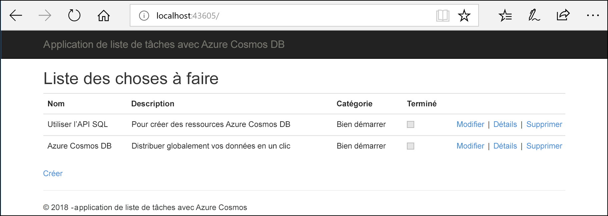
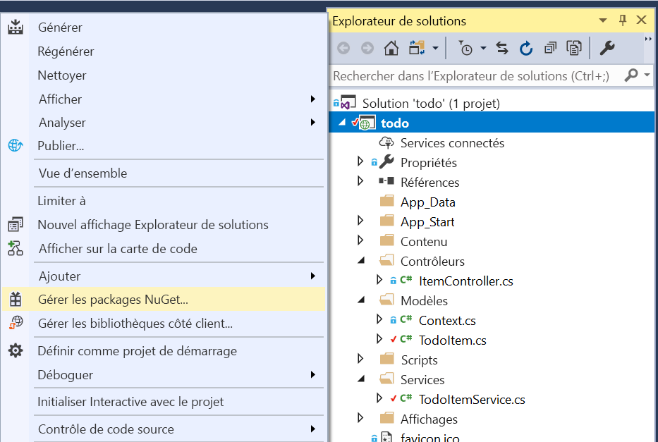
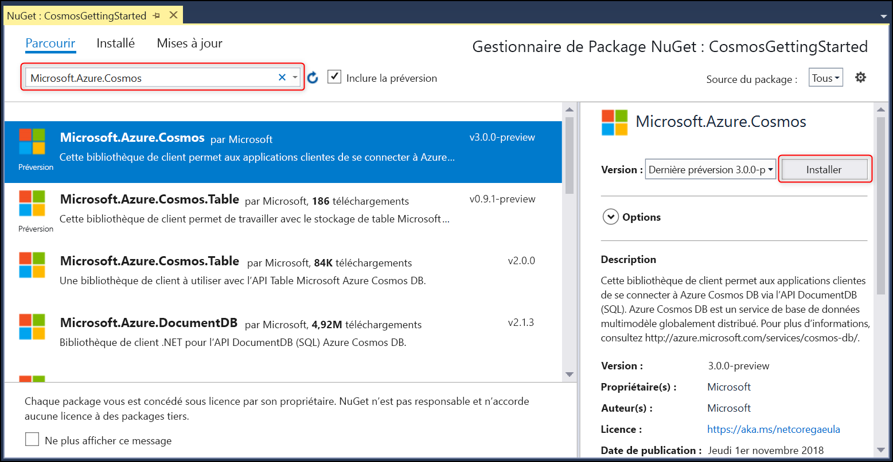

# <a name="quickstart-build-an-aspnet-web-app-using-azure-cosmos-db-sql-api-account"></a>Démarrage rapide : Générer une application web ASP.NET à l’aide du compte d’API SQL Azure Cosmos DB

> [!div class="op_single_selector"]
> * [.NET (préversion)](create-sql-api-dotnet-preview.md)
> * [.NET](create-sql-api-dotnet.md)
> * [Java](create-sql-api-java.md)
> * [Node.JS](create-sql-api-nodejs.md)
> * [Python](create-sql-api-python.md)
> * [Xamarin](create-sql-api-xamarin-dotnet.md)
>  
> 

Azure Cosmos DB est le service de base de données multi-modèle et hautement disponible de Microsoft distribué à l’échelle mondiale. Rapidement, vous avez la possibilité de créer et d’interroger des documents, des paires clé/valeur, et des bases de données orientées graphe, profitant tous de la distribution à l’échelle mondiale et des capacités de mise à l’échelle horizontale au cœur d’Azure Cosmos DB. 

Ce guide de démarrage rapide explique comment créer un compte d’[API SQL](sql-api-introduction.md) Azure Cosmos DB, une base de données et un conteneur à l’aide du portail Azure. Vous allez ensuite développer et déployer une application web de liste de tâches ASP.NET, basée sur l’[API .NET SQL](sql-api-sdk-dotnet.md), comme illustré par la capture d’écran suivante. 

Ce guide de démarrage rapide utilise la version 3.0+ du SDK .NET Azure Cosmos DB. 



## <a name="prerequisites"></a>Prérequis

Si vous n’avez pas encore installé Visual Studio 2019, vous pouvez télécharger et utiliser la version **gratuite** [Visual Studio 2019 Community Edition](https://www.visualstudio.com/downloads/). Veillez à activer la charge de travail **Développement Azure** lors de l’installation de Visual Studio.

[!INCLUDE [quickstarts-free-trial-note](../../includes/quickstarts-free-trial-note.md)] 
[!INCLUDE [cosmos-db-emulator-docdb-api](../../includes/cosmos-db-emulator-docdb-api.md)]  

<a id="create-account"></a>
## <a name="create-a-database-account"></a>Création d’un compte de base de données

[!INCLUDE [cosmos-db-create-dbaccount-preview](../../includes/cosmos-db-create-dbaccount-preview.md)]

<a id="create-collection"></a>
## <a name="add-a-collection"></a>Ajouter une collection

[!INCLUDE [cosmos-db-create-collection-preview](../../includes/cosmos-db-create-collection-preview.md)]

<a id="add-sample-data"></a>
## <a name="add-sample-data"></a>Ajouter un exemple de données

[!INCLUDE [cosmos-db-create-sql-api-add-sample-data](../../includes/cosmos-db-create-sql-api-add-sample-data.md)]

## <a name="query-your-data"></a>Interroger vos données

[!INCLUDE [cosmos-db-create-sql-api-query-data](../../includes/cosmos-db-create-sql-api-query-data.md)]

## <a name="clone-the-sample-application"></a>Clonage de l’exemple d’application

À présent, travaillons sur le code. Clonons une [application d’API SQL à partir de GitHub](https://github.com/Azure-Samples/cosmos-dotnet-todo-app), configurons la chaîne de connexion et exécutons-la. 

1. Ouvrez une invite de commandes, créez un nouveau dossier nommé git-samples, puis fermez l’invite de commandes.

    ```bash
    md "C:\git-samples"
    ```

2. Ouvrez une fenêtre de terminal git comme Git Bash et utilisez la commande `cd` pour accéder au nouveau dossier d’installation pour l’exemple d’application.

    ```bash
    cd "C:\git-samples"
    ```

3. Exécutez la commande suivante pour cloner l’exemple de référentiel : Cette commande crée une copie de l’exemple d’application sur votre ordinateur.

    ```bash
    git clone https://github.com/Azure-Samples/cosmos-dotnet-todo-app.git
    ```

4. Ouvrez le fichier de solution **todo.sln** dans Visual Studio. 

## <a name="review-the-code"></a>Vérifier le code

Cette étape est facultative. Pour savoir comment les ressources de base de données sont créées dans le code, vous pouvez examiner les extraits de code suivants. Sinon, vous pouvez passer à l’étape [Mise à jour de votre chaîne de connexion](#update-your-connection-string). 

Notez que si vous avez déjà utilisé la version précédente du SDK Python, vous connaissez peut-être les termes « collection » et « document ». Étant donné qu’Azure Cosmos DB prend en charge plusieurs modèles d’API, les versions postérieures à la version 3.0 du kit SDK .NET utilisent les termes génériques « conteneur » et « élément ». Un conteneur peut être une collection, un graphique ou une table. Un élément peut être un document, arête/sommet ou ligne, et correspond au contenu à l’intérieur d’un conteneur. [Apprenez-en davantage sur les bases de données, les conteneurs et les éléments.](databases-containers-items.md)

Tous les extraits de code suivants proviennent du fichier ToDoItemService.cs.

* Le CosmosClient est initialisé sur les lignes 68-69.

    ```csharp
    CosmosConfiguration config = new CosmosConfiguration(Endpoint, PrimaryKey);
    client = new CosmosClient(config);
    ```

* Une nouvelle base de données est créée à la ligne 71.

    ```csharp
    CosmosDatabase database = await client.Databases.CreateDatabaseIfNotExistsAsync(DatabaseId);
    ```

* Un nouveau conteneur est créé à la ligne 72 avec la clé de partition « /category ».

    ```csharp
    CosmosContainer container = await database.Containers.CreateContainerIfNotExistsAsync(ContainerId, "/category");
    ```

## <a name="update-your-connection-string"></a>Mise à jour de votre chaîne de connexion

Maintenant, retournez dans le portail Azure afin d’obtenir les informations de votre chaîne de connexion et de les copier dans l’application.

1. Dans le [Portail Azure](https://portal.azure.com/), dans votre compte Azure Cosmos DB, dans le volet de navigation de gauche, sélectionnez **Clés**, puis **Clés en lecture-écriture**. Vous utiliserez les boutons Copier sur le côté droit de l’écran pour copier l’URI et la clé primaire dans le fichier web.config à l’étape suivante.

    

2. Dans Visual Studio, ouvrez le fichier **web.config**. 

3. Copiez votre valeur d’URI à partir du portail (à l’aide du bouton Copier) et définissez-la comme valeur de la clé ``endpoint`` dans le fichier web.config. 

    `<add key="endpoint" value="FILLME" />`

4. Ensuite, copiez votre valeur de CLÉ PRIMAIRE à partir du portail et définissez-la comme valeur de ``primarykey`` dans web.config. 

    `<add key="primaryKey" value="FILLME" />`
    
5. Ensuite, mettez à jour la valeur de base de données et de conteneur pour qu’elle corresponde au nom de la base de données et du conteneur que vous avez créés précédemment. Vous venez de mettre à jour votre application avec toutes les informations nécessaires pour communiquer avec Azure Cosmos DB. 

    `<add key="database" value="Tasks" />`

    `<add key="container" value="Items" />`
    
## <a name="run-the-web-app"></a>Exécuter l’application web

1. Dans l’**Explorateur de solutions**, cliquez avec le bouton droit sur votre nouveau projet d’application console, qui se trouve sous votre solution Visual Studio, puis cliquez sur **Gérer les packages NuGet**.
    
    
1. Sous l’onglet **NuGet**, cliquez sur **Parcourir** et tapez **Microsoft.Azure.Cosmos** dans la zone de recherche.
1. Dans les résultats, recherchez **Microsoft.Azure.Cosmos** et cliquez sur **Installer**.
   L’ID de package de la bibliothèque cliente d’API SQL Azure Cosmos DB est [Microsoft Azure Cosmos DB Client Library](https://www.nuget.org/packages/Microsoft.Azure.Cosmos/).

   

    Si vous obtenez un message concernant la vérification des modifications apportées à la solution, cliquez sur **OK**. Si vous obtenez un message concernant l’acceptation de la licence, cliquez sur **J’accepte**.

1. Appuyez sur Ctrl + F5 pour exécuter l’application. Votre application s’affiche dans votre navigateur. 

1. Cliquez sur **Créer** dans le navigateur et créez quelques tâches dans votre application To-Do. Vous devez également voir les tâches que vous avez créées dans [Ajouter des exemples de données](#add-sample-data).

   

Vous pouvez maintenant revenir à l’Explorateur de données et voir, interroger, modifier et utiliser ces nouvelles données. 

## <a name="review-slas-in-the-azure-portal"></a>Vérification des contrats SLA dans le portail Azure

[!INCLUDE [cosmosdb-tutorial-review-slas](../../includes/cosmos-db-tutorial-review-slas.md)]

## <a name="clean-up-resources"></a>Supprimer des ressources

[!INCLUDE [cosmosdb-delete-resource-group](../../includes/cosmos-db-delete-resource-group.md)]

## <a name="next-steps"></a>Étapes suivantes

Dans ce guide de démarrage rapide, vous avez appris à créer un compte Azure Cosmos DB, à créer un conteneur et à y ajouter des éléments à l’aide de l’Explorateur de données, et à exécuter une application web. Vous pouvez maintenant importer des données supplémentaires à votre compte Cosmos DB. 

> [!div class="nextstepaction"]
> [Importer des données dans Azure Cosmos DB](import-data.md)


