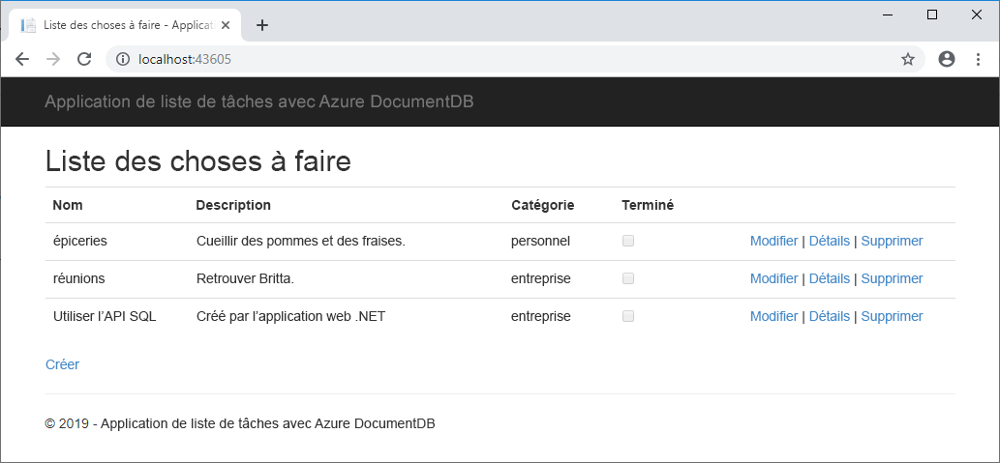

# <a name="quickstart-build-a-net-web-app-with-azure-cosmos-db-using-the-sql-api-and-the-azure-portal"></a>Démarrage rapide : Développer une application web .NET avec Azure Cosmos DB à l’aide de l’API SQL et du portail Azure

Azure Cosmos DB est le service de base de données multi-modèle de Microsoft distribué à l’échelle mondiale. Rapidement, vous avez la possibilité de créer et d’interroger des documents, des paires clé/valeur, et des bases de données orientées graphe, profitant tous de la distribution à l’échelle mondiale et des capacités de mise à l’échelle horizontale au cœur d’Azure Cosmos DB. 

Ce guide de démarrage rapide explique comment créer, à l’aide du portail Azure, un compte d’[API SQL](sql-api-introduction.md) Azure Cosmos DB, une base de données de documents, ainsi qu’une collection. Vous allez ensuite développer et déployer une application web de liste de tâches, basée sur [l’API .NET SQL](sql-api-sdk-dotnet.md), comme illustré par la capture d’écran suivante. 



## <a name="prerequisites"></a>Prérequis


Si vous n’avez pas encore installé Visual Studio 2017, vous pouvez télécharger et utiliser la version **gratuite** [Visual Studio 2017 Community Edition](https://www.visualstudio.com/downloads/). Veillez à activer **le développement Azure** lors de l’installation de Visual Studio.

[!INCLUDE [quickstarts-free-trial-note](../../includes/quickstarts-free-trial-note.md)] 
[!INCLUDE [cosmos-db-emulator-docdb-api](../../includes/cosmos-db-emulator-docdb-api.md)]  

<a id="create-account"></a>
## <a name="create-a-database-account"></a>Création d'un compte de base de données

[!INCLUDE [cosmos-db-create-dbaccount](../../includes/cosmos-db-create-dbaccount.md)]

<a id="create-collection"></a>
## <a name="add-a-collection"></a>Ajouter une collection

[!INCLUDE [cosmos-db-create-collection](../../includes/cosmos-db-create-collection.md)]

<a id="add-sample-data"></a>
## <a name="add-sample-data"></a>Ajouter un exemple de données

[!INCLUDE [cosmos-db-create-sql-api-add-sample-data](../../includes/cosmos-db-create-sql-api-add-sample-data.md)]

## <a name="query-your-data"></a>Interroger vos données

[!INCLUDE [cosmos-db-create-sql-api-query-data](../../includes/cosmos-db-create-sql-api-query-data.md)]

## <a name="clone-the-sample-application"></a>Clonage de l’exemple d’application

À présent, travaillons sur le code. Nous allons cloner une application API SQL à partir de GitHub, configurer la chaîne de connexion et l’exécuter. Vous verrez combien il est facile de travailler par programmation avec des données. 

1. Ouvrez une invite de commandes, créez un nouveau dossier nommé git-samples, puis fermez l’invite de commandes.

    ```bash
    md "C:\git-samples"
    ```

2. Ouvrez une fenêtre de terminal git comme Git Bash et utilisez la commande `cd` pour accéder au nouveau dossier d’installation pour l’exemple d’application.

    ```bash
    cd "C:\git-samples"
    ```

3. Exécutez la commande suivante pour cloner l’exemple de référentiel : Cette commande crée une copie de l’exemple d’application sur votre ordinateur.

    ```bash
    git clone https://github.com/Azure-Samples/documentdb-dotnet-todo-app.git
    ```

4. Ouvrez le fichier de solution todo dans Visual Studio. 

## <a name="review-the-code"></a>Vérifier le code

Cette étape est facultative. Pour savoir comment les ressources de base de données sont créées dans le code, vous pouvez examiner les extraits de code suivants. Sinon, vous pouvez passer à l’étape [Mise à jour de votre chaîne de connexion](#update-your-connection-string). 

Tous les extraits de code suivants proviennent du fichier DocumentDBRepository.cs.

* Le DocumentClient est initialisé à la ligne 76.

    ```csharp
    client = new DocumentClient(new Uri(ConfigurationManager.AppSettings["endpoint"]), ConfigurationManager.AppSettings["authKey"]);
    ```

* Une nouvelle base de données est créée à la ligne 91.

    ```csharp
    await client.CreateDatabaseAsync(new Database { Id = DatabaseId });
    ```

* Une nouvelle collection est créée à la ligne 110.

    ```csharp
    await client.CreateDocumentCollectionAsync(
        UriFactory.CreateDatabaseUri(DatabaseId),
        new DocumentCollection
            {
               Id = CollectionId
            },
        new RequestOptions { OfferThroughput = 400 });
    ```

## <a name="update-your-connection-string"></a>Mise à jour de votre chaîne de connexion

Maintenant, retournez dans le portail Azure afin d’obtenir les informations de votre chaîne de connexion et de les copier dans l’application.

1. Dans le [portail Azure](http://portal.azure.com/), dans votre compte Azure Cosmos DB, dans le volet de navigation de gauche, cliquez sur **Clés**, puis sur **Clés en lecture-écriture**. Vous utiliserez les boutons Copier sur le côté droit de l’écran pour copier l’URI et la clé primaire dans le fichier web.config à l’étape suivante.

    

2. Dans Visual Studio 2017, ouvrez le fichier web.config. 

3. Copiez votre valeur URI à partir du portail (à l’aide du bouton Copier) et définissez-la comme la valeur de la clé du point de terminaison dans le fichier web.config. 

    `<add key="endpoint" value="FILLME" />`

4. Puis, copiez votre valeur de clé primaire à partir du portail et définissez-la comme la valeur de la authKey dans web.config. Vous venez de mettre à jour votre application avec toutes les informations nécessaires pour communiquer avec Azure Cosmos DB. 

    `<add key="authKey" value="FILLME" />`
    
## <a name="run-the-web-app"></a>Exécuter l’application web
1. Dans Visual Studio, cliquez avec le bouton droit sur le nom du projet dans l’**Explorateur de solutions**, puis cliquez sur **Gérer les packages NuGet**. 

2. Dans la zone **Parcourir**de NuGet, tapez *DocumentDB*.

3. À partir des résultats, installez la bibliothèque **Microsoft.Azure.DocumentDB**. Cette opération permet d’installer le package Microsoft.Azure.DocumentDB ainsi que toutes les dépendances.

4. Appuyez sur Ctrl + F5 pour exécuter l’application. Votre application s’affiche dans votre navigateur. 

5. Cliquez sur **Créer** dans le navigateur et créer quelques tâches dans votre application To-Do.

   

Vous pouvez dès à présent revenir à l’Explorateur de données et voir la requête, modifier et travailler avec ces nouvelles données. 

## <a name="review-slas-in-the-azure-portal"></a>Vérification des contrats SLA dans le portail Azure

[!INCLUDE [cosmosdb-tutorial-review-slas](../../includes/cosmos-db-tutorial-review-slas.md)]

## <a name="clean-up-resources"></a>Supprimer des ressources

[!INCLUDE [cosmosdb-delete-resource-group](../../includes/cosmos-db-delete-resource-group.md)]

## <a name="next-steps"></a>Étapes suivantes

Dans ce guide de démarrage rapide, vous avez appris à créer un compte Azure Cosmos DB, à créer une collection à l’aide de l’Explorateur de données et à exécuter une application web. Vous pouvez maintenant importer des données supplémentaires à votre compte Cosmos DB. 

> [!div class="nextstepaction"]
> [Importer des données dans Azure Cosmos DB](import-data.md)


