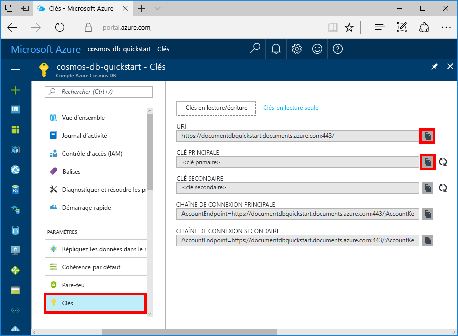

# <a name="quickstart-use-nodejs-to-connect-and-query-data-from-azure-cosmos-db-sql-api-account"></a>Démarrage rapide : Utiliser Node.js pour se connecter à un compte d’API SQL Azure Cosmos DB et interroger ses données

> [!div class="op_single_selector"]
> * [.NET V3](create-sql-api-dotnet.md)
> * [.NET V4](create-sql-api-dotnet-V4.md)
> * [Java](create-sql-api-java.md)
> * [Node.JS](create-sql-api-nodejs.md)
> * [Python](create-sql-api-python.md)
> * [Xamarin](create-sql-api-xamarin-dotnet.md)

Ce guide de démarrage rapide montre comment utiliser une application Node.js pour se connecter au compte d’[API SQL](sql-api-introduction.md) Azure Cosmos DB. Vous pouvez ensuite utiliser des requêtes SQL Azure Cosmos DB pour interroger et gérer des données. L’application Node.js que vous générez dans cet article utilise le [SDK SQL JavaScript](sql-api-sdk-node.md). Ce guide de démarrage rapide utilise la version 2.0 du [SDK JavaScript](https://www.npmjs.com/package/@azure/cosmos).

## <a name="prerequisites"></a>Conditions préalables requises

[!INCLUDE [quickstarts-free-trial-note](../../includes/quickstarts-free-trial-note.md)] 
[!INCLUDE [cosmos-db-emulator-docdb-api](../../includes/cosmos-db-emulator-docdb-api.md)]

* Informations supplémentaires :
    * [Node.js](https://nodejs.org/en/) version v6.0.0 ou ultérieure
    * [Git](https://git-scm.com/)

## <a name="create-a-database"></a>Création d'une base de données 

[!INCLUDE [cosmos-db-create-dbaccount](../../includes/cosmos-db-create-dbaccount.md)]

## <a name="add-a-container"></a>Ajouter un conteneur

[!INCLUDE [cosmos-db-create-collection](../../includes/cosmos-db-create-collection.md)]

## <a name="add-sample-data"></a>Ajouter un exemple de données

[!INCLUDE [cosmos-db-create-sql-api-add-sample-data](../../includes/cosmos-db-create-sql-api-add-sample-data.md)]

## <a name="query-your-data"></a>Interroger vos données

[!INCLUDE [cosmos-db-create-sql-api-query-data](../../includes/cosmos-db-create-sql-api-query-data.md)]

## <a name="clone-the-sample-application"></a>Clonage de l’exemple d’application

À présent, nous allons cloner une application Node.js à partir de GitHub, configurer la chaîne de connexion et l’exécuter.

1. Ouvrez une invite de commandes, créez un nouveau dossier nommé git-samples, puis fermez l’invite de commandes.

    ```bash
    md "C:\git-samples"
    ```

2. Ouvrez une fenêtre de terminal git comme Git Bash et utilisez la commande `cd` pour accéder au nouveau dossier d’installation pour l’exemple d’application.

    ```bash
    cd "C:\git-samples"
    ```

3. Exécutez la commande suivante pour cloner l’exemple de référentiel : Cette commande crée une copie de l’exemple d’application sur votre ordinateur.

    ```bash
    git clone https://github.com/Azure-Samples/azure-cosmos-db-sql-api-nodejs-getting-started.git
    ```

## <a name="review-the-code"></a>Vérifier le code

Cette étape est facultative. Pour savoir comment les ressources de base de données Azure Cosmos sont créées dans le code, vous pouvez examiner les extraits de code suivants. Sinon, vous pouvez passer à l’étape [Mise à jour de votre chaîne de connexion](#update-your-connection-string). 

Notez que si vous êtes familier avec la version précédente du Kit de développement logiciel (SDK) JavaScript, vous avez l’habitude de voir les termes « collection » et « document ». Étant donné qu’Azure Cosmos DB prend en charge [plusieurs modèles d’API](https://docs.microsoft.com/azure/cosmos-db/introduction), la version 2.0 et versions ultérieures du Kit de développement logiciel (SDK) JavaScript utilise les termes génériques « conteneur », qui peut être une collection, un graphique, ou une table, et « élément » pour décrire le contenu du conteneur.

Tous les extraits de code suivants proviennent du fichier **app.js**.

* L’objet `CosmosClient` est initialisé.

    ```javascript
    const client = new CosmosClient({ endpoint, key });
    ```

* Créez une base de données Azure Cosmos.

    ```javascript
    const { database } = await client.databases.createIfNotExists({ id: databaseId });
    ```

* Un nouveau conteneur (collection) est créé dans la base de données.

    ```javascript
    const { container } = await client.database(databaseId).containers.createIfNotExists({ id: containerId });
    ```

* Un élément (document) est créé.

    ```javascript
    const { item } = await client.database(databaseId).container(containerId).items.create(itemBody);
    ```

* Une requête SQL sur JSON est exécutée sur la base de données Famille. La requête retourne tous les enfants de la famille « Anderson ». 

    ```javascript
      const querySpec = {
        query: 'SELECT VALUE r.children FROM root r WHERE r.lastName = @lastName',
        parameters: [
          {
            name: '@lastName',
            value: 'Andersen'
          }
        ]
      }

      const { resources: results } = await client
        .database(databaseId)
        .container(containerId)
        .items.query(querySpec)
        .fetchAll()
      for (var queryResult of results) {
        let resultString = JSON.stringify(queryResult)
        console.log(`\tQuery returned ${resultString}\n`)
      }
    ```    

## <a name="update-your-connection-string"></a>Mise à jour de votre chaîne de connexion

Revenez maintenant au portail Azure pour afficher les détails de la chaîne de connexion de votre compte Azure Cosmos. Copiez la chaîne de connexion dans l’application afin que celle-ci puisse se connecter à votre base de données.

1. Dans le [portail Azure](https://portal.azure.com/), dans votre compte Azure Cosmos, dans le volet de navigation gauche, cliquez sur **Clés**, puis sur **Clés en lecture-écriture**. Vous utiliserez les boutons Copier sur le côté droit de l’écran pour copier l’URI et la clé primaire dans le fichier `config.js` à l’étape suivante.

    

2. Ouvrez le fichier `config.js`. 

3. Copiez la valeur de votre URI dans le portail (à l’aide du bouton Copier) et définissez-la comme valeur de la clé du point de terminaison (Endpoint) dans `config.js`. 

    `config.endpoint = "<Your Azure Cosmos account URI>"`

4. Puis, copiez votre valeur de clé primaire à partir du portail et définissez-la comme la valeur de `config.key` dans `config.js`. Vous venez de mettre à jour votre application avec toutes les informations nécessaires pour communiquer avec Azure Cosmos DB. 

    `config.key = "<Your Azure Cosmos account key>"`
    
## <a name="run-the-app"></a>Exécuter l’application

1. Exécutez `npm install` sur un terminal pour installer les modules npm requis.

2. Exécutez `node app.js` sur un terminal pour démarrer votre application Node.

Vous pouvez maintenant revenir à l’Explorateur de données afin de modifier et d’utiliser ces nouvelles données.

## <a name="review-slas-in-the-azure-portal"></a>Vérification des contrats SLA dans le portail Azure

[!INCLUDE [cosmosdb-tutorial-review-slas](../../includes/cosmos-db-tutorial-review-slas.md)]

## <a name="clean-up-resources"></a>Nettoyer les ressources

[!INCLUDE [cosmosdb-delete-resource-group](../../includes/cosmos-db-delete-resource-group.md)]

## <a name="next-steps"></a>Étapes suivantes

Dans ce guide de démarrage rapide, vous avez appris à créer un compte Azure Cosmos, à créer un conteneur à l’aide de l’Explorateur de données et à exécuter une application. Vous pouvez maintenant importer des données supplémentaires dans votre base de données Azure Cosmos. 

> [!div class="nextstepaction"]
> [Importer des données dans Azure Cosmos DB](import-data.md)


