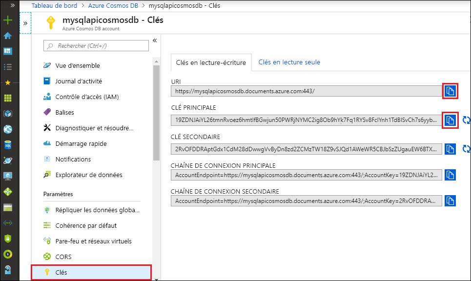

# <a name="quickstart-build-a-python-application-using-an-azure-cosmos-db-sql-api-account"></a>Démarrage rapide : Générer une application Python à l’aide d’un compte d’API SQL Azure Cosmos DB

> [!div class="op_single_selector"]
> * [.NET V3](create-sql-api-dotnet.md)
> * [.NET V4](create-sql-api-dotnet-V4.md)
> * [Java](create-sql-api-java.md)
> * [Node.JS](create-sql-api-nodejs.md)
> * [Python](create-sql-api-python.md)
> * [Xamarin](create-sql-api-xamarin-dotnet.md)

Ce démarrage rapide explique comment créer, à l’aide du portail Azure, un compte [API SQL](sql-api-introduction.md) d’Azure Cosmos DB, une base de données de documents, ainsi qu’un conteneur. Ensuite, vous créez et exécutez une application console à l’aide du kit SDK Python pour [l’API SQL](sql-api-sdk-python.md).

Azure Cosmos DB est le service de base de données multi-modèle de Microsoft distribué à l’échelle mondiale. Vous pouvez rapidement créer et interroger des documents ainsi que des bases de données de clés/valeurs, à colonnes larges et de graphiques. Toutes ces opérations bénéficient de la distribution et la mise à l’échelle d’Azure Cosmos DB.

Ce guide de démarrage rapide utilise la version 4 du [SDK Python](https://pypi.org/project/azure-cosmos/#history).

[!INCLUDE [quickstarts-free-trial-note](../../includes/quickstarts-free-trial-note.md)][!INCLUDE [cosmos-db-emulator-docdb-api](../../includes/cosmos-db-emulator-docdb-api.md)]

## <a name="prerequisites"></a>Prérequis

* [Python 3.6](https://www.python.org/downloads/), avec l’exécutable `python` disponible dans votre `PATH`.
* [Visual Studio Code](https://code.visualstudio.com/)
* [Extension Python pour Visual Studio Code](https://marketplace.visualstudio.com/items?itemName=ms-python.python#overview)

## <a name="create-a-database-account"></a>Création d’un compte de base de données

[!INCLUDE [cosmos-db-create-dbaccount](../../includes/cosmos-db-create-dbaccount.md)]

## <a name="add-a-container"></a>Ajouter un conteneur

[!INCLUDE [cosmos-db-create-collection](../../includes/cosmos-db-create-collection.md)]

## <a name="add-sample-data"></a>Ajouter un exemple de données

[!INCLUDE [cosmos-db-create-sql-api-add-sample-data](../../includes/cosmos-db-create-sql-api-add-sample-data.md)]

## <a name="query-your-data"></a>Interroger vos données

[!INCLUDE [cosmos-db-create-sql-api-query-data](../../includes/cosmos-db-create-sql-api-query-data.md)]

## <a name="clone-the-sample-application"></a>Clonage de l’exemple d’application

Nous allons à présent cloner une application API SQL à partir de GitHub, définir la chaîne de connexion et l’exécuter.

1. Ouvrez une invite de commandes, créez un nouveau dossier nommé git-samples, puis fermez l’invite de commandes.

    ```cmd
    md "git-samples"
    ```
   Si vous utilisez une invite de commandes bash, utilisez plutôt la commande suivante :

   ```bash
   mkdir "git-samples"
   ```

2. Ouvrez une fenêtre de terminal git comme Git Bash et utilisez la commande `cd` pour accéder au nouveau dossier d’installation pour l’exemple d’application.

    ```bash
    cd "git-samples"
    ```

3. Exécutez la commande suivante pour cloner l’exemple de référentiel : Cette commande crée une copie de l’exemple d’application sur votre ordinateur. 

    ```bash
    git clone https://github.com/Azure-Samples/azure-cosmos-db-python-getting-started.git
    ```  

## <a name="update-your-connection-string"></a>Mise à jour de votre chaîne de connexion

Maintenant, retournez dans le portail Azure afin d’obtenir les informations de votre chaîne de connexion et de les copier dans l’application.

1. Sur le [portail Azure](https://portal.azure.com/), dans votre compte Azure Cosmos, dans le volet de navigation gauche, sélectionnez **Clés**. Vous utiliserez les boutons de copie sur le côté droit de l’écran pour copier **l’URI** et la **Clé primaire** dans le fichier `cosmos_get_started.py` à l’étape suivante.

    

2. Ouvrez le fichier `cosmos_get_started.py` dans \git-samples\azure-cosmos-db-python-getting-started dans Visual Studio Code.

3. Copiez la valeur de votre **URI** dans le portail (à l’aide du bouton Copier), puis définissez-la comme valeur de la variable **endpoint** dans ``cosmos_get_started.py``. 

    `endpoint = 'https://FILLME.documents.azure.com',`

4. Ensuite, copiez la valeur de votre **CLÉ PRINCIPALE** à partir du portail et définissez-la comme valeur pour **key** dans ``cosmos_get_started.py``. Vous venez de mettre à jour votre application avec toutes les informations nécessaires pour communiquer avec Azure Cosmos DB. 

    `key = 'FILLME'`

5. Enregistrez le fichier ``cosmos_get_started.py``.

## <a name="review-the-code"></a>Vérifier le code

Cette étape est facultative. En savoir plus sur les ressources de base de données créées dans le code, ou passer directement à [Mettre à jour votre chaîne de connexion](#update-your-connection-string).

Tous les extraits suivants proviennent du fichier `cosmos_get_started.py`.

* Le CosmosClient est initialisé. Veillez à mettre à jour les valeurs de « endpoint » et de « key », comme décrit dans la section [Mettre à jour votre chaîne de connexion](#update-your-connection-string). 

    [!code-python[](~/azure-cosmos-db-python-getting-started/cosmos_get_started.py?name=create_cosmos_client)]

* Une nouvelle base de données est créée.

    [!code-python[](~/azure-cosmos-db-python-getting-started/cosmos_get_started.py?name=create_database_if_not_exists)]

* Un nouveau conteneur est créé, avec 400 RU/s de [débit provisionné](request-units.md). Nous choisissons `lastName` comme [clé de partition](partitioning-overview.md#choose-partitionkey), ce qui nous permet de faire des requêtes efficaces qui filtrent sur cette propriété. 

    [!code-python[](~/azure-cosmos-db-python-getting-started/cosmos_get_started.py?name=create_container_if_not_exists)]

* Certains éléments sont ajoutés au conteneur. Les conteneurs sont une collection d’éléments (des documents JSON) qui peuvent avoir différents schémas. Les méthodes d’assistance ```get_[name]_family_item``` retournent des représentations d’une famille stockées dans Azure Cosmos DB en tant que documents JSON.

    [!code-python[](~/azure-cosmos-db-python-getting-started/cosmos_get_started.py?name=create_item)]

* Les lectures des points (des recherches de valeurs de clés) sont effectuées avec la méthode `read_item`. Nous affichons les [frais en RU (unités de requête)](request-units.md) de chaque opération.
    [!code-python[](~/azure-cosmos-db-python-getting-started/cosmos_get_started.py?name=read_item)]

* Une requête est effectuée avec la syntaxe des requêtes SQL. Étant donné que nous utilisons les valeurs de clé de partition de ```lastName``` dans la clause WHERE, Azure Cosmos DB route cette requête vers les partitions pertinentes, ce qui améliore les performances.

    [!code-python[](~/azure-cosmos-db-python-getting-started/cosmos_get_started.py?name=query_items)]
   
## <a name="run-the-app"></a>Exécution de l'application

1. Dans Visual Studio Code, sélectionnez **Affichage** > **Palette de commandes**. 

2. À l’invite, entrez **Python: Select Interpreter**, puis sélectionnez la version de Python à utiliser.

    Le pied de page dans Visual Studio Code affiche désormais l’interpréteur sélectionné. 

3. Sélectionnez **Affichage** > **Terminal intégré** pour ouvrir le terminal intégré Visual Studio Code.

4. Dans la fenêtre du terminal intégré, vérifiez que vous êtes bien dans le dossier azure-cosmos-db-python-getting-started. Si ce n’est pas le cas, exécutez la commande suivante pour passer au dossier d’exemple. 

    ```cmd
    cd "\git-samples\azure-cosmos-db-python-getting-started"`
    ```

5. Exécutez la commande suivante pour installer le package azure-cosmos. 

    ```python
    pip install --pre azure-cosmos
    ```

    Si vous obtenez une erreur d’accès refusé quand vous tentez d’installer azure-cosmos, vous devrez [exécuter VS Code en tant qu’administrateur](https://stackoverflow.com/questions/37700536/visual-studio-code-terminal-how-to-run-a-command-with-administrator-rights).

6. Exécutez la commande suivante pour exécuter l’exemple, et pour créer et stocker de nouveaux documents dans Azure Cosmos DB.

    ```python
    python cosmos_get_started.py
    ```

7. Pour vérifier que les nouveaux éléments ont été créés et enregistrés, dans le portail Azure, sélectionnez **Explorateur de données** > **AzureSampleFamilyDatabase** > **Éléments**. Regardez les éléments qui ont été créés. Par exemple, voici un exemple de document JSON pour la famille Andersen :

```json
{
    "id": "Andersen-1569479288379",
    "lastName": "Andersen",
    "district": "WA5",
    "parents": [
        {
            "familyName": null,
            "firstName": "Thomas"
        },
        {
            "familyName": null,
            "firstName": "Mary Kay"
        }
    ],
    "children": null,
    "address": {
        "state": "WA",
        "county": "King",
        "city": "Seattle"
    },
    "registered": true,
    "_rid": "8K5qAIYtZXeBhB4AAAAAAA==",
    "_self": "dbs/8K5qAA==/colls/8K5qAIYtZXc=/docs/8K5qAIYtZXeBhB4AAAAAAA==/",
    "_etag": "\"a3004d78-0000-0800-0000-5d8c5a780000\"",
    "_attachments": "attachments/",
    "_ts": 1569479288
}
```

## <a name="review-slas-in-the-azure-portal"></a>Vérification des contrats SLA dans le portail Azure

[!INCLUDE [cosmosdb-tutorial-review-slas](../../includes/cosmos-db-tutorial-review-slas.md)]

## <a name="clean-up-resources"></a>Supprimer des ressources

[!INCLUDE [cosmosdb-delete-resource-group](../../includes/cosmos-db-delete-resource-group.md)]

## <a name="next-steps"></a>Étapes suivantes

Dans ce guide de démarrage rapide, vous avez appris à créer un compte Azure Cosmos, à créer un conteneur à l’aide de l’Explorateur de données et à exécuter une application. Vous pouvez maintenant importer des données supplémentaires à votre compte Cosmos DB. 

> [!div class="nextstepaction"]
> [Importer des données dans Azure Cosmos DB pour l’API SQL](import-data.md)


