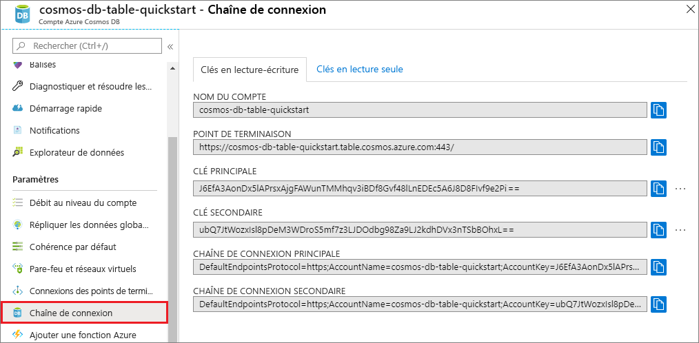

# <a name="quickstart-build-a-table-api-app-with-nodejs-and-azure-cosmos-db"></a>Démarrage rapide : Créer une application d’API Table avec Node.js et Azure Cosmos DB

> [!div class="op_single_selector"]
> * [.NET](create-table-dotnet.md)
> * [Java](create-table-java.md)
> * [Node.JS](create-table-nodejs.md)
> * [Python](create-table-python.md)
> 

Dans ce guide de démarrage rapide, vous allez créer un compte d’API Table Azure Cosmos DB, puis utiliser l’Explorateur de données et une application Node.js clonée à partir de GitHub pour créer des tables et des entités. Azure Cosmos DB est un service de base de données multimodèle qui vous permet de créer et d’interroger rapidement des bases de données de documents, de tables, de paires clé/valeur et de graphes avec des capacités de distribution mondiale et de mise à l’échelle horizontale.

## <a name="prerequisites"></a>Prérequis

- Compte Azure avec un abonnement actif. [Créez-en un gratuitement](https://azure.microsoft.com/free/?ref=microsoft.com&utm_source=microsoft.com&utm_medium=docs&utm_campaign=visualstudio). Vous pouvez également [essayez Azure Cosmos DB gratuitement](https://azure.microsoft.com/try/cosmosdb/) sans abonnement Azure. Vous pouvez aussi utiliser l’[émulateur Azure Cosmos DB](https://aka.ms/cosmosdb-emulator) avec l’URI `https://localhost:8081` et la clé `C2y6yDjf5/R+ob0N8A7Cgv30VRDJIWEHLM+4QDU5DE2nQ9nDuVTqobD4b8mGGyPMbIZnqyMsEcaGQy67XIw/Jw==`.
- [Node.js 0.10.29+](https://nodejs.org/).
- [Git](https://git-scm.com/downloads).

## <a name="create-a-database-account"></a>Création d’un compte de base de données

> [!IMPORTANT] 
> Vous devez créer un compte d’API Table pour utiliser les kits SDK d’API Table mis à la disposition générale. Les comptes d’API Table créés pendant la durée de la préversion ne sont pas pris en charge par les kits SDK mis à la disposition générale.
>

[!INCLUDE [cosmos-db-create-dbaccount-table](../../includes/cosmos-db-create-dbaccount-table.md)]

## <a name="add-a-table"></a>Ajouter une table

[!INCLUDE [cosmos-db-create-table](../../includes/cosmos-db-create-table.md)]

## <a name="add-sample-data"></a>Ajouter un exemple de données

[!INCLUDE [cosmos-db-create-table-add-sample-data](../../includes/cosmos-db-create-table-add-sample-data.md)]

## <a name="clone-the-sample-application"></a>Clonage de l’exemple d’application

À présent, nous allons cloner une application Table à partir de GitHub, configurer la chaîne de connexion et l’exécuter. Vous verrez combien il est facile de travailler par programmation avec des données.

1. Ouvrez une invite de commandes, créez un nouveau dossier nommé git-samples, puis fermez l’invite de commandes.

    ```bash
    md "C:\git-samples"
    ```

2. Ouvrez une fenêtre de terminal git comme Git Bash et utilisez la commande `cd` pour accéder au nouveau dossier d’installation pour l’exemple d’application.

    ```bash
    cd "C:\git-samples"
    ```

3. Exécutez la commande suivante pour cloner l’exemple de référentiel : Cette commande crée une copie de l’exemple d’application sur votre ordinateur.

    ```bash
    git clone https://github.com/Azure-Samples/storage-table-node-getting-started.git
    ```

> [!TIP]
> Pour une procédure pas à pas détaillée sur du code similaire, consultez l’article [Exemple d’API Table Cosmos DB](table-storage-how-to-use-nodejs.md). 

## <a name="review-the-code"></a>Vérifier le code

Cette étape est facultative. Pour savoir comment les ressources de base de données sont créées dans le code, vous pouvez examiner les extraits de code suivants. Sinon, vous pouvez passer à la section [Mise à jour de votre chaîne de connexion](#update-your-connection-string) de ce document.

* Le code suivant montre comment créer une table dans le stockage Azure :

  ```javascript
  storageClient.createTableIfNotExists(tableName, function (error, createResult) {
    if (error) return callback(error);

    if (createResult.isSuccessful) {
      console.log("1. Create Table operation executed successfully for: ", tableName);
    }
  }

  ```

* Le code suivant montre comment insérer des données dans la table :

  ```javascript
  var customer = createCustomerEntityDescriptor("Harp", "Walter", "Walter@contoso.com", "425-555-0101");

  storageClient.insertOrMergeEntity(tableName, customer, function (error, result, response) {
    if (error) return callback(error);

    console.log("   insertOrMergeEntity succeeded.");
  }
  ```

* Le code suivant montre comment interroger les données de la table :

  ```javascript
  console.log("6. Retrieving entities with surname of Smith and first names > 1 and <= 75");

  var storageTableQuery = storage.TableQuery;
  var segmentSize = 10;

  // Demonstrate a partition range query whereby we are searching within a partition for a set of entities that are within a specific range. 
  var tableQuery = new storageTableQuery()
      .top(segmentSize)
      .where('PartitionKey eq ?', lastName)
      .and('RowKey gt ?', "0001").and('RowKey le ?', "0075");
  
  runPageQuery(tableQuery, null, function (error, result) {
  
      if (error) return callback(error);
  
  ```

* Le code suivant montre comment supprimer des données de la table :

  ```javascript
  storageClient.deleteEntity(tableName, customer, function entitiesQueried(error, result) {
      if (error) return callback(error);
  
      console.log("   deleteEntity succeeded.");
  }
  ```
  
## <a name="update-your-connection-string"></a>Mise à jour de votre chaîne de connexion

Maintenant, retournez dans le portail Azure afin d’obtenir les informations de votre chaîne de connexion et de les copier dans l’application. Cette opération permet à votre application de communiquer avec votre base de données hébergée. 

1. Dans votre compte Azure Cosmos DB, sur le [portail Azure](https://portal.azure.com/), sélectionnez **Chaîne de connexion**. 

    

2. Copiez la CHAÎNE DE CONNEXION PRINCIPALE à l’aide du bouton Copier à droite.

3. Ouvrez le fichier *app.config*, puis collez la valeur dans connectionString à la ligne trois. 

    > [!IMPORTANT]
    > Si votre point de terminaison utilise documents.azure.com, cela signifie que vous disposez d’un compte de version préliminaire et que vous devez créer un [nouveau compte d’API Table](#create-a-database-account) à utiliser avec le Kit de développement logiciel (SDK) d’API Table généralement disponible.
    >

3. Enregistrez le fichier *app.config*.

Vous venez de mettre à jour votre application avec toutes les informations nécessaires pour communiquer avec Azure Cosmos DB. 

## <a name="run-the-app"></a>Exécuter l’application

1. Dans la fenêtre de terminal git, exécutez `cd` pour accéder au dossier storage-table-java-getting-started.

    ```
    cd "C:\git-samples\storage-table-node-getting-started"
    ```

2. Exécutez la commande suivante pour installer les modules [azure], [node-uuid], [nconf] et [async] en local et pour enregistrer une entrée leur correspondant dans le fichier *package.json*.

   ```
   npm install azure-storage node-uuid async nconf --save
   ```

2. Dans la fenêtre de terminal git, exécutez les commandes suivantes pour exécuter l’application Node.js.

    ```
    node ./tableSample.js 
    ```

    La fenêtre de console affiche les données de table qui sont ajoutées à la nouvelle base de données de tables dans Azure Cosmos DB.

    Vous pouvez maintenant revenir à l’Explorateur de données et voir, interroger, modifier et utiliser ces nouvelles données. 

## <a name="review-slas-in-the-azure-portal"></a>Vérification des contrats SLA dans le portail Azure

[!INCLUDE [cosmosdb-tutorial-review-slas](../../includes/cosmos-db-tutorial-review-slas.md)]

## <a name="clean-up-resources"></a>Nettoyer les ressources

[!INCLUDE [cosmosdb-delete-resource-group](../../includes/cosmos-db-delete-resource-group.md)]

## <a name="next-steps"></a>Étapes suivantes

Dans ce guide de démarrage rapide, vous avez appris à créer un compte Azure Cosmos DB, à créer une table avec l’Explorateur de données et à exécuter une application Node.js pour ajouter des données de table.  Maintenant, vous pouvez interroger vos données à l’aide de l’API Table.  

> [!div class="nextstepaction"]
> [Importer des données de table dans l’API Table](table-import.md)
