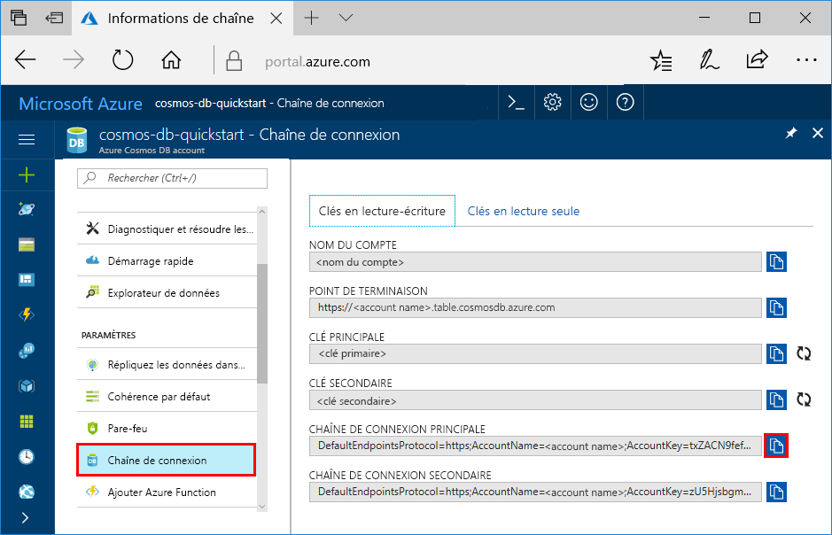

# <a name="quickstart-build-a-table-api-app-with-python-and-azure-cosmos-db"></a>Démarrage rapide : Créer une application d’API Table avec Python et Azure Cosmos DB

> [!div class="op_single_selector"]
> * [.NET](create-table-dotnet.md)
> * [Java](create-table-java.md)
> * [Node.JS](create-table-nodejs.md)
> * [Python](create-table-python.md)
> 

Dans ce guide de démarrage rapide, vous allez créer et gérer un compte d’API Table Azure Cosmos DB à partir du portail Azure et de Visual Studio à l’aide d’une application Python clonée à partir de GitHub. Azure Cosmos DB est un service de base de données multimodèle qui vous permet de créer et d’interroger rapidement des bases de données de documents, de tables, de paires clé/valeur et de graphes avec des capacités de distribution mondiale et de mise à l’échelle horizontale.

## <a name="prerequisites"></a>Prérequis

- Compte Azure avec un abonnement actif. [Créez-en un gratuitement](https://azure.microsoft.com/free/?ref=microsoft.com&utm_source=microsoft.com&utm_medium=docs&utm_campaign=visualstudio). Vous pouvez également [essayez Azure Cosmos DB gratuitement](https://azure.microsoft.com/try/cosmosdb/) sans abonnement Azure. Vous pouvez aussi utiliser l’[émulateur Azure Cosmos DB](https://aka.ms/cosmosdb-emulator) avec l’URI `https://localhost:8081` et la clé `C2y6yDjf5/R+ob0N8A7Cgv30VRDJIWEHLM+4QDU5DE2nQ9nDuVTqobD4b8mGGyPMbIZnqyMsEcaGQy67XIw/Jw==`.
- [Visual Studio 2019](https://www.visualstudio.com/downloads/) avec les charges de travail **Développement Azure** et **Développement Python** sélectionnées durant l’installation. 
- [Git](https://git-scm.com/downloads).

## <a name="create-a-database-account"></a>Création d’un compte de base de données

> [!IMPORTANT] 
> Vous devez créer un compte d’API Table pour utiliser les kits SDK d’API Table mis à la disposition générale. Les comptes d’API Table créés pendant la durée de la préversion ne sont pas pris en charge par les kits SDK mis à la disposition générale.
>

[!INCLUDE [cosmos-db-create-dbaccount-table](../../includes/cosmos-db-create-dbaccount-table.md)]

## <a name="add-a-table"></a>Ajouter une table

[!INCLUDE [cosmos-db-create-table](../../includes/cosmos-db-create-table.md)]

## <a name="add-sample-data"></a>Ajouter un exemple de données

[!INCLUDE [cosmos-db-create-table-add-sample-data](../../includes/cosmos-db-create-table-add-sample-data.md)]

## <a name="clone-the-sample-application"></a>Clonage de l’exemple d’application

À présent, nous allons cloner une application Table à partir de GitHub, configurer la chaîne de connexion et l’exécuter. Vous verrez combien il est facile de travailler par programmation avec des données. 

1. Ouvrez une invite de commandes, créez un nouveau dossier nommé git-samples, puis fermez l’invite de commandes.

    ```bash
    md "C:\git-samples"
    ```

2. Ouvrez une fenêtre de terminal git comme Git Bash et utilisez la commande `cd` pour accéder au nouveau dossier d’installation pour l’exemple d’application.

    ```bash
    cd "C:\git-samples"
    ```

3. Exécutez la commande suivante pour cloner l’exemple de référentiel : Cette commande crée une copie de l’exemple d’application sur votre ordinateur. 

    ```bash
    git clone https://github.com/Azure-Samples/storage-python-getting-started.git
    ```

3. Ouvrez le fichier de solution dans Visual Studio. 

> ![CONSEIL] Pour une procédure pas à pas détaillée sur du code similaire, consultez l’article [Exemple d’API Table Cosmos DB](table-storage-how-to-use-python.md).

## <a name="update-your-connection-string"></a>Mise à jour de votre chaîne de connexion

Maintenant, retournez dans le portail Azure afin d’obtenir les informations de votre chaîne de connexion et de les copier dans l’application. Cette opération permet à votre application de communiquer avec votre base de données hébergée. 

1. Dans votre compte Azure Cosmos DB, sur le [portail Azure](https://portal.azure.com/), sélectionnez **Chaîne de connexion**. 

    

2. Copiez le NOM DU COMPTE en utilisant le bouton situé à droite.

3. Ouvrez le fichier *config.py* et, à partir du portail, collez le NOM DU COMPTE dans la valeur STORAGE_ACCOUNT_NAME de la ligne 19.

4. Revenez au portail et copiez la CLÉ PRIMAIRE.

5. Collez la CLÉ PRIMAIRE à partir du portail dans la valeur STORAGE_ACCOUNT_KEY de la ligne 20.

6. Enregistrez le fichier *config.py*.

## <a name="run-the-app"></a>Exécuter l’application

1. Dans Visual Studio, cliquez avec le bouton droit sur le projet **Explorateur de solutions**.

2. Sélectionnez l’environnement Python actuel, puis cliquez avec le bouton droit.

2. Sélectionnez **Installer le package Python**, puis entrez *azure-storage-table*.

3. Appuyez sur F5 pour exécuter l'application. Votre application s’affiche dans votre navigateur. 

Vous pouvez maintenant revenir à l’Explorateur de données et voir, interroger, modifier et utiliser ces nouvelles données. 

## <a name="review-slas-in-the-azure-portal"></a>Vérification des contrats SLA dans le portail Azure

[!INCLUDE [cosmosdb-tutorial-review-slas](../../includes/cosmos-db-tutorial-review-slas.md)]

## <a name="clean-up-resources"></a>Nettoyer les ressources

[!INCLUDE [cosmosdb-delete-resource-group](../../includes/cosmos-db-delete-resource-group.md)]

## <a name="next-steps"></a>Étapes suivantes

Dans ce guide de démarrage rapide, vous avez appris à créer un compte Azure Cosmos DB, à créer une table à l’aide de l’Explorateur de données et à exécuter une application Python dans Visual Studio pour ajouter des données de table.  Maintenant, vous pouvez interroger vos données à l’aide de l’API Table.  

> [!div class="nextstepaction"]
> [Importer des données de table dans l’API Table](table-import.md)
