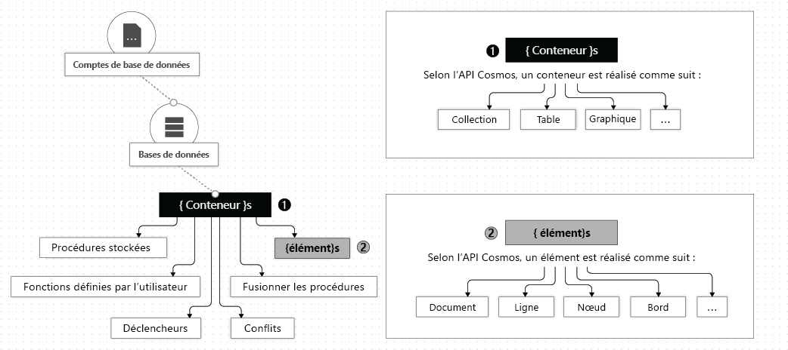

# Utiliser des bases de données, des conteneurs et des éléments dans Azure Cosmos DB

La création d’un [compte Azure Cosmos DB](account-overview.md) dans votre abonnement Azure vous permet d’y gérer des données à l’aide de bases de données, de conteneurs et d’éléments. Cet article décrit chacune de ces entités. 

L’illustration suivante montre la hiérarchie de ces différentes entités dans un compte Azure Cosmos DB :

## Bases de données Azure Cosmos

Vous pouvez créer une ou plusieurs bases de données Azure Cosmos dans votre compte. Une base de données est analogue à un espace de noms. Une base de données est une unité de gestion pour un ensemble de conteneurs Azure Cosmos. Le tableau suivant montre comment une base de données Azure Cosmos est mappée à différentes entités d’API :

| Entité Azure Cosmos | API SQL | API Cassandra | API Azure Cosmos DB pour MongoDB | API Gremlin | API de table |
| --- | --- | --- | --- | --- | --- |
|Base de données Azure Cosmos | Base de données | Espace de clés | Base de données | Base de données | N/D |

> [!NOTE]
> Avec les comptes d’API Table, lorsque vous créez votre première table, une base de données par défaut est automatiquement créée dans votre compte Azure Cosmos.

### Actions effectuées sur une base de données Azure Cosmos

Vous pouvez interagir avec une base de données Azure Cosmos à l’aide des API Azure Cosmos comme décrit dans le tableau suivant :

| Opération | D’Azure CLI | API SQL | API Cassandra | API Azure Cosmos DB pour MongoDB | API Gremlin | API de table |
| --- | --- | --- | --- | --- | --- | --- |
|Énumérer toutes les bases de données| OUI | OUI | Oui (la base de données est mappée sur un espace de clés) | OUI | N/D | N/D |
|Lire le contenu de la base de données| OUI | OUI | Oui (la base de données est mappée sur un espace de clés) | OUI | N/D | N/D |
|Create new database| OUI | OUI | Oui (la base de données est mappée sur un espace de clés) | OUI | N/D | N/D |
|Mettre à jour la base de données| OUI | OUI | Oui (la base de données est mappée sur un espace de clés) | OUI | N/D | N/D |

## Conteneurs Cosmos Azure

Un conteneur Azure Cosmos correspond à l’unité de scalabilité du débit et du stockage provisionnés. Un conteneur est partitionné horizontalement, puis répliqué dans plusieurs régions. Les éléments que vous ajoutez au conteneur, et le débit que vous approvisionnez pour celui-ci, sont automatiquement distribués sur un ensemble de partitions logiques en fonction de la clé de partition. Pour en savoir plus sur le partitionnement et les clés de partition, consultez [Partitionnement des données](partition-data.md). 

Lorsque vous créez un conteneur Azure Cosmos, vous configurez le débit avec l’un des modes suivants :

* Mode **Débit provisionné dédié** : Le débit provisionné pour un conteneur lui est exclusivement réservé ; ce débit est défini par les contrats de niveau de service (SLA). Pour plus d’informations, consultez [Provisionnement du débit sur un conteneur Azure Cosmos](how-to-provision-container-throughput.md).

* Mode **Débit provisionné partagé** : ces conteneurs partagent le débit provisionné avec d’autres conteneurs de la même base de données (à l’exclusion des conteneurs qui ont été configurés pour le débit provisionné dédié). En d’autres termes, le débit provisionné pour la base de données est partagé entre tous les conteneurs « débit partagé ». Pour plus d’informations, consultez [Provisionnement du débit sur une base de données Azure Cosmos](how-to-provision-database-throughput.md).

> [!NOTE]
> Vous pouvez configurer le débit partagé et dédié uniquement lors de la création de la base de données et du conteneur. Pour passer du mode de débit dédié au mode de débit partagé (et inversement) une fois le conteneur créé, vous devez créer un conteneur et migrer les données vers ce nouveau conteneur. Vous pouvez migrer les données à l’aide de la fonctionnalité Flux de modification d’Azure Cosmos DB.

Un conteneur Azure Cosmos peut être mis à l’échelle élastiquement, que vous créiez des conteneurs en utilisant des modes de débit dédiés ou partagés.

Un conteneur Azure Cosmos est un conteneur d’éléments indépendant de tout schéma. Les éléments dans conteneur peuvent avoir des schémas différents. Par exemple, un élément qui représente une personne et un élément qui représente une automobile peuvent être placés dans le *même conteneur*. Par défaut, tous les éléments que vous ajoutez à un conteneur sont automatiquement indexés, sans que vous ayez à effectuer une gestion explicite d’index ou de schéma. Vous pouvez personnaliser le comportement d’indexation en configurant la [stratégie d’indexation](index-overview.md) du conteneur. 

Vous pouvez définir la [durée de vie (TTL)](time-to-live.md) de certains éléments du conteneur Azure Cosmos ou de l’intégralité du conteneur afin de supprimer définitivement ces éléments du système. Azure Cosmos DB supprime automatiquement les éléments lorsque ceux-ci expirent. Cela permet également d’éviter qu’une requête envoyée au conteneur ne retourne des éléments ayant expiré. Pour plus d’informations, consultez [Configurer la durée de vie de votre conteneur](how-to-time-to-live.md).

Vous pouvez utiliser la fonctionnalité [Flux de modification](change-feed.md) pour vous abonner au journal des opérations de chacune des partitions logiques de votre conteneur. Flux de modification fournit le journal de toutes les mises à jour appliquées au conteneur ainsi que les images des éléments avant et après mise à jour. Pour plus d’informations, consultez [Générer des applications réactives en utilisant la fonctionnalité Flux de modification](serverless-computing-database.md). Vous pouvez également configurer la durée de conservation du flux de modification à l’aide de la stratégie de flux de modification du conteneur. 

Vous pouvez inscrire des [procédures stockées, des déclencheurs, des fonctions définies par l’utilisateur](stored-procedures-triggers-udfs.md) et des [procédures de fusion](how-to-manage-conflicts.md) dans votre conteneur Azure Cosmos. 

Vous pouvez spécifier une [contrainte de clé unique](unique-keys.md) dans votre conteneur Azure Cosmos. En créant une stratégie de clé unique, vous garantissez l’unicité d’une ou de plusieurs valeurs par clé de partition logique. Si vous créez un conteneur à l’aide d’une stratégie clé unique, aucun élément nouveau ou mis à jour dont les valeurs dupliquent les valeurs spécifiées par la contrainte de clé unique ne peut être créé. Pour plus d’informations, consultez [Contraintes de clés uniques](unique-keys.md).

Un conteneur Azure Cosmos est spécialisé dans les entités d’API, comme l’illustre le tableau suivant :

| Entité Azure Cosmos | API SQL | API Cassandra | API Azure Cosmos DB pour MongoDB | API Gremlin | API de table |
| --- | --- | --- | --- | --- | --- |
|Conteneur Azure Cosmos | Conteneur | Table | Collection | Graph | Table |

### Propriétés d’un conteneur Azure Cosmos

Un conteneur Azure Cosmos comprend un ensemble de propriétés définies par le système. Selon l’API que vous utilisez, il est possible que certaines propriétés ne soient pas directement exposées. Le tableau suivant répertorie les propriétés définies par le système :

| Propriété définie par le système | Générée par le système ou configurable par l’utilisateur | Objectif | API SQL | API Cassandra | API Azure Cosmos DB pour MongoDB | API Gremlin | API de table |
| --- | --- | --- | --- | --- | --- | --- | --- |
|\_rid | Générée par le système | Identificateur unique du conteneur | OUI | Non | Non | Non | Non |
|\_etag | Générée par le système | Étiquette d’entité utilisée pour le contrôle de l’accès concurrentiel optimiste | OUI | Non | Non | Non | Non |
|\_ts | Générée par le système | Dernière mise à jour de l’horodatage du conteneur | OUI | Non | Non | Non | Non |
|\_self | Générée par le système | URI adressable du conteneur | OUI | Non | Non | Non | Non |
|id | Configurable par l’utilisateur | Nom unique du conteneur défini par l’utilisateur | OUI | OUI | OUI | OUI | OUI |
|indexingPolicy | Configurable par l’utilisateur | Permet de modifier le chemin d’accès de l’index, le type d’index et le mode d’indexation | OUI | Non | Non | Non | OUI |
|timeToLive | Configurable par l’utilisateur | Permet de supprimer automatiquement les éléments d’un conteneur après une période donnée. Pour plus d’informations, consultez [Durée de vie](time-to-live.md). | OUI | Non | Non | Non | OUI |
|changeFeedPolicy | Configurable par l’utilisateur | Utilisé pour lire les modifications apportées aux éléments d’un conteneur. Pour plus d’informations, consultez [Flux de modification](change-feed.md). | OUI | Non | Non | Non | OUI |
|uniqueKeyPolicy | Configurable par l’utilisateur | Utilisée pour garantir l’unicité d’une ou plusieurs valeurs au sein d’une partition logique. Pour plus d’informations, consultez [Contraintes de clé unique](unique-keys.md). | OUI | Non | Non | Non | OUI |

### Actions effectuées sur un conteneur Azure Cosmos

Un conteneur Azure Cosmos prend en charge les opérations suivantes, qui peuvent être effectuées lorsque vous utilisez l’une des API Azure Cosmos :

| Opération | D’Azure CLI | API SQL | API Cassandra | API Azure Cosmos DB pour MongoDB | API Gremlin | API de table |
| --- | --- | --- | --- | --- | --- | --- |
| Énumérer les conteneurs d’une base de données | OUI | OUI | OUI | OUI | N/D | N/D |
| Lire le contenu d’un conteneur | OUI | OUI | OUI | OUI | N/D | N/D |
| Créer un conteneur | OUI | OUI | OUI | OUI | N/D | N/D |
| Mettre à jour un conteneur | OUI | OUI | OUI | OUI | N/D | N/D |
| Supprimer un conteneur | OUI | OUI | OUI | OUI | N/D | N/D |

## Éléments Azure Cosmos

En fonction de l’API que vous utilisez, un élément Azure Cosmos peut représenter un document d’une collection, une ligne de table, un nœud de graphe ou une arête de graphe. Le tableau suivant présente le mappage d’entités d’API vers un élément Azure Cosmos :

| Entité Cosmos | API SQL | API Cassandra | API Azure Cosmos DB pour MongoDB | API Gremlin | API de table |
| --- | --- | --- | --- | --- | --- |
|Élément Azure Cosmos | Document | Ligne | Document | Nœud ou arête | Item |

### Propriétés d’un élément

Chaque élément Azure Cosmos comprend des propriétés définies par le système. Selon l’API que vous utilisez, il est possible que certaines d’entre elles ne soient pas directement exposées.

| Propriété définie par le système | Générée par le système ou configurable par l’utilisateur| Objectif | API SQL | API Cassandra | API Azure Cosmos DB pour MongoDB | API Gremlin | API de table |
| --- | --- | --- | --- | --- | --- | --- | --- |
|\_id | Générée par le système | Identificateur unique de l’élément | OUI | Non | Non | Non | Non |
|\_etag | Générée par le système | Étiquette d’entité utilisée pour le contrôle de l’accès concurrentiel optimiste | OUI | Non | Non | Non | Non |
|\_ts | Générée par le système | Horodatage de la dernière mise à jour de l’élément | OUI | Non | Non | Non | Non |
|\_self | Générée par le système | URI adressable de l’élément | OUI | Non | Non | Non | Non |
|id | Vous pouvez soit utiliser | Nom unique défini par l’utilisateur dans une partition logique. | OUI | OUI | OUI | OUI | OUI |
|Propriétés arbitraires définies par l’utilisateur | Défini par l’utilisateur | Propriétés définies par l’utilisateur représentées sous forme d’API native (notamment JSON, BSON et CQL) | OUI | OUI | OUI | OUI | OUI |

> [!NOTE]
> L’unicité de la `id`propriété est appliqué dans chaque partition logique. Plusieurs documents peuvent avoir la même `id` propriété avec des valeurs de clé de partition différentes.

### Actions possibles sur les éléments

Les éléments Azure Cosmos prennent en charge les opérations suivantes. Vous pouvez utiliser n’importe laquelle des API Azure Cosmos pour effectuer ces opérations.

| Opération | D’Azure CLI | API SQL | API Cassandra | API Azure Cosmos DB pour MongoDB | API Gremlin | API de table |
| --- | --- | --- | --- | --- | --- | --- |
| Insérer, remplacer, supprimer, upsert, lire | Non | OUI | OUI | OUI | OUI | OUI |

## Étapes suivantes

En savoir plus sur ces tâches et concepts :

* [Provisionner du débit sur une base de données Azure Cosmos](how-to-provision-database-throughput.md)
* [Provisionner du débit sur un conteneur Azure Cosmos](how-to-provision-container-throughput.md)
* [Utiliser des partitions logiques](partition-data.md)
* [Configurer la durée de vie d’un conteneur Azure Cosmos](how-to-time-to-live.md)
* [Développer des applications réactives en utilisant un flux de modification](change-feed.md)
* [Configurer une contrainte de clé unique dans votre conteneur Azure Cosmos](unique-keys.md)
