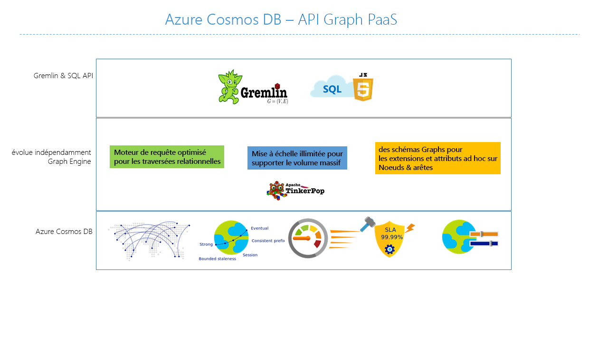
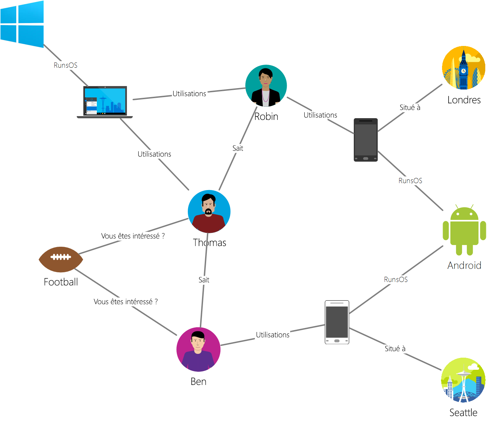

# <a name="introduction-to-azure-cosmos-db-gremlin-api"></a>Présentation d’Azure Cosmos DB : API Gremlin

[Azure Cosmos DB](introduction.md) est le service de base de données multimodèle globalement distribué de Microsoft pour les applications stratégiques. Il s’agit d’une base de données multimodèle qui prend en charge les modèles de données sous forme de documents, de graphes, de valeurs-clés et de familles de colonnes. L’API Gremlin d’Azure Cosmos DB est utilisée pour stocker et exploiter les données de graphe dans un service de base de données complètement managé quelle que soit l’échelle.  



Cet article fournit une vue d’ensemble de l’API Gremlin Azure Cosmos DB, et explique comment l’utiliser pour stocker des graphiques volumineux comportant des milliards de sommets et de bords. Vous pouvez interroger les graphiques avec une latence de quelques millisecondes, et faire évoluer facilement leur structure. L’API Gremlin d’Azure Cosmos DB est basée sur le standard de base de données graphique [Apache TinkerPop](https://tinkerpop.apache.org)  et utilise le langage de requête Gremlin. 

L’API Gremlin d’Azure Cosmos DB combine la puissance des algorithmes de base de données de graphes avec une infrastructure hautement évolutive et gérée pour fournir une solution unique et flexible aux problèmes de données les plus courants associés à l’absence de flexibilité et aux approches relationnelles. 

## <a name="features-of-azure-cosmos-db-graph-database"></a>Fonctionnalités de la base de données de graphes Azure Cosmos DB
 
Azure Cosmos DB est une base de données de graphiques entièrement gérée, qui offre une distribution mondiale, une mise à l’échelle élastique du débit et du stockage, des fonctions d’indexation et d’interrogation automatiques, des niveaux de cohérence ajustables et la prise en charge de la norme TinkerPop. 

Voici les fonctionnalités différenciées offertes par l’API Gremlin d’Azure Cosmos DB :

* **Stockage et débit extensibles de façon élastique**

  Les graphiques dans le monde réel doivent pouvoir augmenter leur échelle au-delà de la capacité d’un serveur unique. Azure Cosmos DB prend en charge les bases de données de graphes horizontalement scalables dont la taille peut être pratiquement illimitée en termes de stockage et de débit provisionné. Au fur et à mesure que l’échelle de la base de données des graphes augmente, les données sont automatiquement réparties à l’aide du [partitionnement graphique](https://docs.microsoft.com/azure/cosmos-db/graph-partitioning).

* **Réplication multirégion**

  Azure Cosmos DB peut répliquer automatiquement vos données de graphes dans n’importe quelle région Azure du monde entier. La réplication mondiale simplifie le développement d’applications qui exigent un accès global aux données. En plus de minimiser la latence de lecture et d’écriture quel que soit l’emplacement géographique, Azure Cosmos DB offre un mécanisme de basculement régional automatique qui peut assurer la continuité de votre application dans les rares cas d’une interruption de service dans une région. 

* **Requêtes et traversées rapides avec la norme de requête graphique la plus largement adoptée**

  Stockez des sommets et des arêtes hétérogènes, et interrogez-les par le biais d’une syntaxe Gremlin familière. Gremlin est un langage de requête fonctionnel impératif dont l’interface riche permet d’implémenter des algorithmes graphiques courants. 
  
  Azure Cosmos DB autorise les requêtes enrichies en temps réel et les traversées sans qu’il soit nécessaire de spécifier des indicateurs de schéma, des index secondaires ou des vues. Pour en savoir plus, consultez [Interroger des graphes à l’aide de Gremlin](gremlin-support.md).

* **Base de données de graphes complètement managée**

  Ne vous souciez plus de gérer les ressources de base de données et d’ordinateur. La plupart des plateformes de bases de données de graphes existantes dépendent des limites de leur infrastructure et nécessitent souvent un degré élevé de maintenance pour assurer leur fonctionnement. 
  
  En tant que service complètement managé, Cosmos DB élimine la nécessité de gérer les machines virtuelles, de mettre à jour les logiciels d’exécution, de gérer le partitionnement ou la réplication, et de vous préoccuper des mises à niveau complexes de la couche Données. Chaque graphique est automatiquement sauvegardé et protégé contre les défaillances régionales. Ces garanties permettent aux développeurs de se concentrer sur la création de valeur applicative plutôt que sur l’exploitation et la gestion de leurs bases de données de graphes. 

* **Indexation automatique**

  Par défaut, Azure Cosmos DB indexe automatiquement toutes les propriétés des nœuds et des arêtes du graphe et n’attend ou ne nécessite aucun schéma ou création d’index secondaires. En savoir plus sur [l’indexation dans Azure Cosmos DB](https://docs.microsoft.com/azure/cosmos-db/index-overview) 

* **Compatibilité avec Apache TinkerPop**

  Azure Cosmos DB prend en charge la [norme open source Apache TinkerPop](https://tinkerpop.apache.org/). La norme Tinkerpop dispose d’un vaste écosystème d’applications et de bibliothèques qui peuvent être facilement intégrées avec l’API Gremlin d’Azure Cosmos DB. 

* **Niveaux de cohérence ajustables**

  Azure Cosmos DB fournit cinq niveaux de cohérence bien définis pour obtenir le bon compromis entre la cohérence et les performances de votre application. Pour les requêtes et les opérations de lecture, Azure Cosmos DB propose cinq niveaux de cohérence distincts : Fort, En fonction de l’obsolescence, Par session, Préfixe cohérent et Éventuel. Ces niveaux de cohérence bien définis et granulaires vous permettent de trouver un bon compromis entre cohérence, disponibilité et latence. Pour plus d’informations, consultez [Niveaux de cohérence des données paramétrables dans Azure Cosmos DB](consistency-levels.md).

## <a name="scenarios-that-can-use-gremlin-api"></a>Scénarios susceptibles d’utiliser l’API Gremlin
Voici quelques scénarios où la prise en charge des graphes par Azure Cosmos DB peut être utile :

* **Réseaux sociaux/Client 365**

  En associant des données sur vos clients et leurs interactions avec d’autres personnes, vous pouvez développer des expériences personnalisées, prédire le comportement des clients ou connecter entre elles des personnes ayant les mêmes intérêts. Azure Cosmos DB peut servir à gérer des réseaux sociaux et à suivre les données et les préférences des clients.

* **Moteurs de recommandation**

  Ce scénario est couramment utilisé dans le secteur de la vente au détail. En associant des informations sur les produits, les utilisateurs et les interactions des utilisateurs (achats, navigation ou notation d’un article), vous pouvez générer des recommandations personnalisées. Azure Cosmos DB, avec sa faible latence, sa mise à l’échelle élastique et sa prise en charge native des graphes, est idéal pour ces scénarios.

* **Géospatial**

  De nombreuses applications dans les secteurs des télécommunications, de la logistique et de la planification de voyages nécessitent de trouver un lieu intéressant dans une zone donnée, ou de rechercher l’itinéraire le plus court/optimal entre deux lieux. Azure Cosmos DB constitue une solution naturelle à ces problèmes.

* **Internet des objets**

  Avec le réseau et les connexions entre les appareils IoT modélisés sous forme de graphe, vous pouvez obtenir un meilleur aperçu de l’état de vos appareils et ressources. Vous pouvez aussi découvrir comment les modifications apportées à une partie du réseau peuvent potentiellement en affecter une autre partie.

## <a name="introduction-to-graph-databases"></a>Présentation des bases de données de graphes
Les données telles qu’elles apparaissent dans le monde réel sont naturellement connectées. La modélisation traditionnelle des données consiste à définir les entités séparément et à calculer leurs relations au moment de l’exécution. Bien que ce modèle présente des avantages, la gestion des données hautement connectées peut s’avérer difficile avec ses contraintes.  

En fait, une approche de base de données de graphes repose sur des relations persistantes dans la couche de stockage, ce qui optimise les opérations de récupération de graphiques. L’API Gremlin d’Azure Cosmos DB prend en charge le [modèle de graphique de propriétés](https://tinkerpop.apache.org/docs/current/reference/#intro).

### <a name="property-graph-objects"></a>Objets graphiques de propriété

Un [graphique](http://mathworld.wolfram.com/Graph.html) de propriété est une structure composée de [sommets](http://mathworld.wolfram.com/GraphVertex.html) et de [bords](http://mathworld.wolfram.com/GraphEdge.html). Les deux objets peuvent avoir un nombre arbitraire de paires clé-valeur définies en tant que propriétés. 

* **Sommets** – Les sommets désignent des entités discrètes, comme une personne, un lieu ou un événement.

* **Arêtes** – Les arêtes désignent les relations entre les sommets. Par exemple, une personne peut en connaître une autre, être impliquée dans un événement et avoir récemment été dans un lieu. 

* **Properties** – Les propriétés expriment des informations sur les arêtes et les sommets, Les sommets et les bords peuvent comporter un nombre illimité de propriétés qui permettent de décrire et de filtrer les objets dans une requête. Les exemples de propriétés incluent un sommet qui a un nom et un âge, ou une arête, qui peut avoir un horodatage et/ou un poids. 

Les bases de données de graphes sont souvent incluses dans la catégorie de base de données NoSQL, ou non relationnelle, puisqu’il n’y a aucune dépendance envers un schéma ou un modèle de données contraint. Cette absence de schéma permet de modéliser et de stocker naturellement et efficacement les structures connectées. 

### <a name="gremlin-by-example"></a>Gremlin par l’exemple
Nous allons utiliser un exemple de graphe pour comprendre comment les requêtes peuvent être exprimées dans Gremlin. L’illustration suivante montre une application métier qui gère les données sur les utilisateurs, les centres d’intérêt et les appareils sous la forme d’un graphe.  

 

Ce graphe présente les types suivants de *sommet* (appelés « label » dans Gremlin) :

- **Personnes** : le graphique comporte trois personnes (Robin, Thomas et Ben).
- **Centres d’intérêt** : leurs centres d'intérêt, dans cet exemple, le football.
- **Appareils** : les appareils utilisés par ces personnes.
- **Systèmes d’exploitation** : systèmes d'exploitation de ces appareils.

Nous représentons les relations entre ces entités à l’aide des types/labels d’*arête* suivants :

- **Connaît** : par exemple, « Thomas connaît Robin »
- **S’intéresse** : pour représenter les centres d'intérêt des personnes dans notre graphe, par exemple, « Ben s'intéresse au football »
- **ExécuteSE** : l'ordinateur portable exécute le système d'exploitation Windows
- **Utilise** : pour représenter l'appareil qu'une personne utilise. Par exemple, Robin utilise un téléphone Motorola dont le numéro de série est 77

Nous allons exécuter certaines opérations sur ce graphe à l’aide de la [Console Gremlin](https://tinkerpop.apache.org/docs/3.3.2/reference/#gremlin-console). Vous pouvez également effectuer ces opérations à l’aide de pilotes de Gremlin dans la plateforme de votre choix (Java, Node.js, Python ou .NET).  Avant d’examiner ce qui est pris en charge dans Azure Cosmos DB, penchons-nous sur quelques exemples pour vous familiariser avec la syntaxe.

En premier lieu, examinons CRUD. L’instruction Gremlin suivante insère le vertex « Thomas » dans le graphe :

```java
:> g.addV('person').property('id', 'thomas.1').property('firstName', 'Thomas').property('lastName', 'Andersen').property('age', 44)
```

Ensuite, l’instruction Gremlin suivante insère un bord « connaît » entre Thomas et Robin.

```java
:> g.V('thomas.1').addE('knows').to(g.V('robin.1'))
```

La requête suivante renvoie les vertex « personne » dans l’ordre décroissant de leur prénom :
```java
:> g.V().hasLabel('person').order().by('firstName', decr)
```

Les graphes brillent lorsque vous devez répondre aux questions telles que « Quels systèmes d’exploitation les amis de Thomas utilisent-ils ? ». Vous pouvez exécuter la traversée Gremlin qui suit pour obtenir cette information à partir du graphe :

```java
:> g.V('thomas.1').out('knows').out('uses').out('runsos').group().by('name').by(count())
```

## <a name="next-steps"></a>Étapes suivantes
Pour en savoir plus sur la prise en charge des graphiques dans Azure Cosmos DB, consultez :

* Prise en main avec le [tutoriel graphique Azure Cosmos DB](create-graph-dotnet.md).
* Découvrez comment [interroger les graphes dans Azure Cosmos DB à l’aide de Gremlin](gremlin-support.md).
