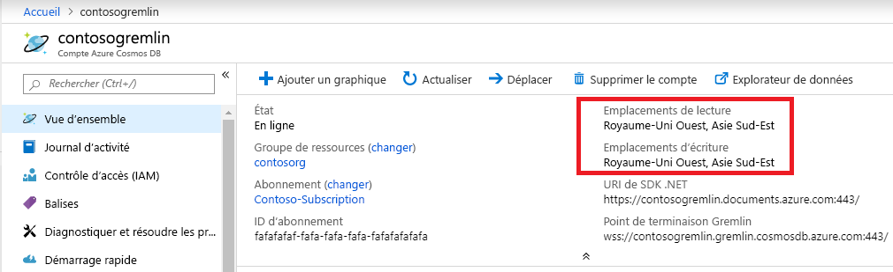

# <a name="regional-endpoints-for-azure-cosmos-db-graph-account"></a>Points de terminaison régionaux pour le compte de graphe Azure Cosmos DB
Comme la base de données de graphes Azure Cosmos DB est [globalement distribuée](distribute-data-globally.md), les applications peuvent utiliser plusieurs points de terminaison de lecture. Les applications qui ont besoin d’un accès en écriture dans plusieurs emplacements doivent activer la fonctionnalité [multimaître](how-to-multi-master.md).

Raisons pour lesquelles choisir plusieurs régions :
1. **Scalabilité de la lecture horizontale** : à mesure que la charge de l’application augmente, il peut être prudent de router le trafic en lecture vers des régions Azure différentes.
2. **Latence plus faible** : vous pouvez réduire la surcharge de latence du réseau de chaque traversée en routant le trafic en lecture et en écriture vers la région Azure la plus proche.

Les exigences en matière de **résidence des données** sont obtenues en définissant une stratégie Azure Resource Manager sur le compte Cosmos DB. Le client peut limiter les régions dans lesquelles Cosmos DB réplique les données.

## <a name="traffic-routing"></a>Routage du trafic

Le moteur de base de données de graphes Cosmos DB s’exécute dans plusieurs régions, chacune contenant plusieurs clusters. Chaque cluster comprend des centaines d’ordinateurs. Le CNAME DNS du compte de graphe Cosmos DB *accountname.gremlin.cosmos.azure.com* se résout en enregistrement DNS A d’un cluster. Une adresse IP unique d’un équilibreur de charge masque la topologie de cluster interne.

Un enregistrement DNS CNAME régional est créé pour chaque région de compte de graphe Cosmos DB. Le format du point de terminaison régional est *accountname-region.gremlin.cosmos.azure.com*. Le segment de région du point de terminaison régional est obtenu en supprimant tous les espaces du nom de la [région Azure](https://azure.microsoft.com/global-infrastructure/regions). Par exemple, la région `"East US 2"` pour le compte de base de données globale `"contoso"` aurait le CNAME DNS *contoso-eastus2.gremlin.cosmos.azure.com*

Le client TinkerPop Gremlin est conçu pour fonctionner avec un seul serveur. L’application peut utiliser un CNAME DNS accessible en écriture global pour le trafic en lecture et en écriture. Les applications qui prennent en charge les régions doivent utiliser un point de terminaison régional pour le trafic en lecture. Utilisez un point de terminaison régional pour le trafic en écriture uniquement si une région spécifique est configurée pour accepter les écritures. 

> [!NOTE]
> Le moteur de graphe Cosmos DB peut accepter une opération d’écriture dans une région en lecture en redirigeant via un proxy le trafic vers une région en écriture. Il n’est pas recommandé d’envoyer des écritures dans une zone en lecture seule car cette opération augmente la latence des traversées et elle sera soumise à des restrictions à l’avenir.

Le CNAME de compte de base de données globale pointe toujours vers une région en écriture valide. Pendant le basculement côté serveur de la région en écriture, Cosmos DB met à jour le CNAME du compte de base de données globale pour pointer vers une nouvelle région. Si l’application ne peut pas gérer le reroutage du trafic après le basculement, elle doit utiliser le CNAME DNS du compte de base de données globale.

> [!NOTE]
> Cosmos DB ne route pas le trafic en fonction de la proximité géographique de l’appelant. Il revient à chaque application de sélectionner la région appropriée en fonction de ses besoins spécifiques.

## <a name="portal-endpoint-discovery"></a>Découverte de points de terminaison du portail

Le panneau Vue d’ensemble du Portail Azure constitue le moyen le plus simple d’obtenir la liste des régions pour le compte de graphe Azure Cosmos DB. Cela fonctionne pour les applications qui ne changent pas souvent de régions ou qui ont un moyen de mettre à jour la liste par le biais de la configuration de l’application.



L’exemple ci-dessous illustre les principes généraux d’accès à un point de terminaison Gremlin régional. L’application doit prendre en compte le nombre de régions auxquelles envoyer le trafic et le nombre de clients Gremlin correspondants à instancier.

```csharp
// Example value: Central US, West US and UK West. This can be found in the overview blade of you Azure Cosmos DB Gremlin Account. 
// Look for Write Locations in the overview blade. You can click to copy and paste.
string[] gremlinAccountRegions = new string[] {"Central US", "West US" ,"UK West"};
string gremlinAccountName = "PUT-COSMOSDB-ACCOUNT-NAME-HERE";
string gremlinAccountKey = "PUT-ACCOUNT-KEY-HERE";
string databaseName = "PUT-DATABASE-NAME-HERE";
string graphName = "PUT-GRAPH-NAME-HERE";

foreach (string gremlinAccountRegion in gremlinAccountRegions)
{
  // Convert preferred read location to the form "[acountname]-[region].gremlin.cosmos.azure.com".
  string regionalGremlinEndPoint = $"{gremlinAccountName}-{gremlinAccountRegion.ToLowerInvariant().Replace(" ", string.Empty)}.gremlin.cosmos.azure.com";

  GremlinServer regionalGremlinServer = new GremlinServer(
    hostname: regionalGremlinEndPoint, 
    port: 443,
    enableSsl: true,
    username: "/dbs/" + databaseName + "/colls/" + graphName,
    password: gremlinAccountKey);

  GremlinClient regionalGremlinClient = new GremlinClient(
    gremlinServer: regionalGremlinServer,
    graphSONReader: new GraphSON2Reader(),
    graphSONWriter: new GraphSON2Writer(),
    mimeType: GremlinClient.GraphSON2MimeType);
}
```

## <a name="sdk-endpoint-discovery"></a>Découverte de points de terminaison de SDK

L’application peut utiliser le [SDK Azure Cosmos DB](sql-api-sdk-dotnet.md) pour découvrir les emplacements de lecture et d’écriture pour le compte de graphe. Ces emplacements peuvent changer à tout moment par le biais d’une reconfiguration manuelle côté serveur ou d’un basculement automatique.

Le SDK TinkerPop Gremlin n’a pas d’API pour découvrir des régions de compte de base de données de graphes Cosmos DB. Les applications qui nécessitent une découverte de points de terminaison du runtime doivent héberger 2 SDK distincts dans l’espace de processus.

```csharp
// Depending on the version and the language of the SDK (.NET vs Java vs Python)
// the API to get readLocations and writeLocations may vary.
IDocumentClient documentClient = new DocumentClient(
    new Uri(cosmosUrl),
    cosmosPrimaryKey,
    connectionPolicy,
    consistencyLevel);

DatabaseAccount databaseAccount = await cosmosClient.GetDatabaseAccountAsync();

IEnumerable<DatabaseAccountLocation> writeLocations = databaseAccount.WritableLocations;
IEnumerable<DatabaseAccountLocation> readLocations = databaseAccount.ReadableLocations;

// Pick write or read locations to construct regional endpoints for.
foreach (string location in readLocations)
{
  // Convert preferred read location to the form "[acountname]-[region].gremlin.cosmos.azure.com".
  string regionalGremlinEndPoint = location
    .Replace("http:\/\/", string.Empty)
    .Replace("documents.azure.com:443/", "gremlin.cosmos.azure.com");
  
  // Use code from the previous sample to instantiate Gremlin client.
}
```

## <a name="next-steps"></a>Étapes suivantes
* [Guide pratique pour gérer le contrôle de comptes de base de données](how-to-manage-database-account.md) dans Azure Cosmos DB
* [Haute disponibilité](high-availability.md) dans Azure Cosmos DB
* [Distribution mondiale avec Azure Cosmos DB - Sous le capot](global-dist-under-the-hood.md)
* [Exemples d’interface Azure CLI](cli-samples.md) pour Azure Cosmos DB
