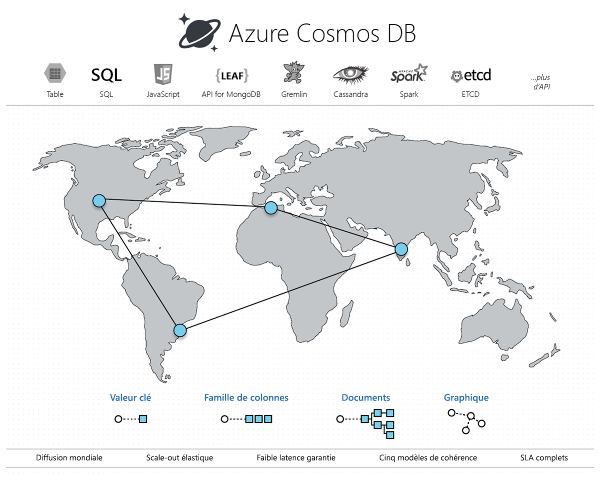

# Bienvenue dans Azure Cosmos DB

Les applications actuelles doivent être hautement réactives et toujours en ligne. Pour obtenir une faible latence et une haute disponibilité, les instances de ces applications doivent être déployées dans des centres de données qui sont proches des utilisateurs. Les applications doivent répondre en temps réel à des changements importants d’utilisation aux heures de pointe, pour stocker des volumes croissants de données et pour rendre ces données disponibles aux utilisateurs en quelques millisecondes.

Azure Cosmos DB est le service de base de données multi-modèle de Microsoft distribué à l’échelle mondiale. En un clic, le service Azure Cosmos DB vous permet de faire évoluer en toute flexibilité et de façon indépendante le débit et le stockage sur n’importe quel nombre de régions géographiques Azure. Vous pouvez en toute flexibilité ajuster le débit le et stockage pour tirer parti d’un accès rapide aux données (moins de 10 millisecondes) à l’aide de votre API favorite parmi SQL, MongoDB, Cassandra, Tables ou Gremlin. Cosmos DB offre des garanties en matière de débit, de latence, de disponibilité et de cohérence avec des [contrats de niveau de service](https://aka.ms/acdbsla) (SLA) complets, ce qu’aucun autre service de base de données ne peut offrir.

Vous pouvez [essayer Azure Cosmos DB gratuitement](https://azure.microsoft.com/try/cosmosdb/) sans abonnement Azure, libre de tous frais et engagements.

> [!div class="nextstepaction"]
> [Essayer gratuitement Azure Cosmos DB](https://azure.microsoft.com/try/cosmosdb/)

## Principaux avantages

### Une distribution mondiale clé en main

Cosmos DB vous permet de générer des applications hautement disponibles et très réactives dans le monde entier. Cosmos DB réplique en toute transparence vos données où que soient les utilisateurs, afin que ces derniers puissent interagir avec le réplica des données le plus proche.

Cosmos DB permet d’ajouter ou de supprimer des régions Azure dans votre compte Cosmos à tout moment, via un clic sur un bouton. Cosmos DB répliquera en toute transparence vos données dans toutes les régions associées à votre compte Cosmos, tandis que votre application restera hautement disponible grâce aux fonctionnalités d’hébergement multiple du service.

Pour plus d’informations, consultez l’article sur la [distribution mondiale](distribute-data-globally.md).

### Toujours actif

Grâce à une intégration approfondie avec l’infrastructure Azure et à une [réplication multimaître transparente](global-dist-under-the-hood.md), Cosmos DB fournit une [haute disponibilité](high-availability.md) de 99,999 % pour les lectures et les écritures. Cosmos DB offre permet également d’appeler par programmation (ou via le portail) le basculement régional de votre compte Cosmos. Cette fonctionnalité permet de s’assurer que, pendant le basculement automatique d’une base de données Cosmos, le reste de votre application est également conçu pour basculer en cas de sinistre régional.

### Extensibilité élastique du débit et du stockage à l’échelon mondial

Conçu avec un partitionnement horizontal transparent et une réplication multimaître, Cosmos DB offre une extensibilité élastique sans précédent pour vos écritures et lectures, partout dans le monde. Vous pouvez passer de façon élastique de milliers à des centaines de millions de requêtes par seconde dans le monde, en un seul appel d’API, et payer uniquement le débit (et le stockage) dont vous avez besoin. Cette fonctionnalité vous aide à gérer les pics inattendus dans vos charges de travail sans devoir effectuer un surprovisionnement. Consultez les articles sur le [partitionnement dans Cosmos DB](partitioning-overview.md), le [débit approvisionné sur les conteneurs et les bases de données](set-throughput.md) et la [mise à l’échelle du débit approvisionné dans le monde entier](scaling-throughput.md).

### Faible latence garantie, au 99e centile, partout dans le monde

À l’aide de Cosmos DB, vous pouvez générer des applications hautement réactives à l’échelle de la planète. Avec son protocole novateur de réplication multimaître et sans verrou, et son [moteur de base de données optimisé pour l’écriture](index-policy.md), Cosmos DB garantit des latences inférieures à 10 millisecondes pour les lectures et les écritures (indexées), au 99e centile, dans le monde entier. Cette fonctionnalité permet l’ingestion soutenue de données et des requêtes très rapides pour des applications hautement réactives.

### Plusieurs choix de cohérence bien définis

Vous n’avez plus à trouver des [compromis extrêmes entre la cohérence, la disponibilité, la latence et la programmabilité](consistency-levels-tradeoffs.md). Le protocole de réplication multimaître de Cosmos DB a été soigneusement conçu pour offrir [cinq choix de cohérence bien définis](consistency-levels.md) (fort, obsolescence limitée, préfixe cohérent, session et éventuel) pour fournir à votre application globalement distribuée un modèle de programmation intuitif, à faible latence et à haute disponibilité.

### Aucune gestion des schémas ou des index

Pour les applications distribuées à l’échelle mondiale, il est particulièrement difficile de garder le schéma de la base de données et les index synchronisés avec le schéma d’une application. Cependant, avec Cosmos DB, vous n’avez plus besoin de gérer les schémas ni les index. Le moteur de base de données est entièrement sans schéma.  Comme aucune gestion de schéma ni d’index n’est requise, vous n’avez pas à vous soucier des temps d’arrêt des applications lors de la migration des schémas. Cosmos DB [indexe automatiquement toutes les données](index-policy.md) (aucun schéma, aucun index requis) et offre des requêtes rapides.

### Service de base de données à toute épreuve

Cosmos DB est un service de base sur Azure. Depuis une décennie, Cosmos DB est utilisé par de nombreux produits Microsoft pour des applications critiques à l’échelle mondiale, notamment Skype, Xbox, Office 365, Azure et bien d’autres. Aujourd’hui, Cosmos DB est un des services à la croissance la plus rapide sur Azure, utilisé par de nombreux clients externes et applications qui ont besoin d’une mise à l’échelle élastique et/ou d’une réplication multimaître, multi-centre de données, multi-région clé en main pour une faible latence et une haute disponibilité, à la fois en lecture et en écriture.

### Omniprésence régionale

Cosmos DB est disponible dans toutes les régions Azure du monde entier, y compris plus de 54 régions dans le cloud public, Azure Chine 21Vianet, Azure Allemagne, Azure Government et Azure Government pour le DoD (ministère de la Défense des États-Unis). Consultez la [présence régionale de Cosmos DB](regional-presence.md).

### Sécurisé par défaut et adapté au monde de l’entreprise

Cosmos DB est certifié pour un [vaste éventail de normes de conformité](compliance.md). En outre, toutes les données dans Cosmos DB sont chiffrées au repos et en mouvement. Cosmos DB fournit une autorisation de niveau ligne et respecte des normes de sécurité strictes.

### Économies substantielles sur le coût total de possession

Étant donné que Cosmos DB est un service entièrement managé, vous n’avez plus à gérer ni à effectuer des déploiements complexes de centre de données et des mises à niveau de votre logiciel de base de données. Vous payez pour le support, les licences et les opérations. Consultez l’[optimisation des coûts avec Cosmos DB](total-cost-ownership.md).

### Contrats de niveau de service complets à la pointe du secteur

Cosmos DB est le seul service à proposer les [meilleurs contrats SLA complets du secteur](https://azure.microsoft.com/support/legal/sla/cosmos-db/) avec une haute disponibilité à 99,999 %, une latence au 99e centile en lecture et en écriture, ainsi qu’un débit et une cohérence garantis.

### Apache Spark + Cosmos DB = analytique opérationnelle à l’échelle mondiale

Vous pouvez exécuter [Spark](spark-connector.md) sur les données stockées dans Cosmos DB. Cette fonctionnalité vous permet d’effectuer des analyses opérationnelles de faible latence à l’échelle mondiale sans impact sur les charges de travail transactionnelles survenant directement sur Cosmos DB.

### Développer des applications pour Cosmos DB à l’aide d’APIs NoSQL populaires

Cosmos DB propose un vaste choix d’API pour mettre à jour et interroger les données stockées dans votre base de données Cosmos. Par défaut, [vous pouvez utiliser SQL](how-to-sql-query.md) pour mettre à jour et interroger les données dans votre base de données Cosmos.

Cosmos DB implémente également les protocoles de transmission [Cassandra](cassandra-introduction.md), [MongoDB](mongodb-introduction.md), [Gremlin](graph-introduction.md) et [Stockage Table Azure](table-introduction.md) directement sur le service. Cela vous permet de pointer les pilotes (et outils) clients pour les API NoSQL couramment utilisées directement vers votre base de données Cosmos. En prenant en charge les protocoles de transmission des API NoSQL couramment utilisées, Cosmos DB permet plusieurs choses :

* Migrer facilement votre application vers Cosmos DB tout en conservant des parties importantes de la logique d’application.
* Préserver la mobilité de votre application et garder votre indépendance vis-à-vis des fournisseurs.
* Obtenir les meilleurs contrats de niveau de service soutenus financièrement pour les API NoSQL courantes. 
* Profiter d’une mise à l’échelle élastique du débit et du stockage approvisionnés pour vos bases de données selon vos besoins, et payer uniquement le débit et le stockage dont vous avez besoin. Vous réaliserez ainsi des économies considérables.

## Les solutions qui profitent des avantages de Azure Cosmos DB

N’importe quelle [application web, mobile, IoT ou de jeux](use-cases.md) qui doit gérer des volumes importants de données, de lectures et d’écritures sur une échelle [globale](distribute-data-globally.md) avec un temps de réponse quasi en temps réel pour une grande variété de données profite de la haute disponibilité, du débit élevé, de la faible latence et de la cohérence ajustable [garanties](https://azure.microsoft.com/support/legal/sla/cosmos-db/) d’Azure Cosmos DB. En savoir plus sur la façon dont Azure Cosmos DB peut s’appliquer à l’[IoT et la télématique](use-cases.md#iot-and-telematics), à la [vente au détail et au marketing](use-cases.md#retail-and-marketing), aux [jeux](use-cases.md#gaming) et [applications Web et mobiles](use-cases.md#web-and-mobile-applications).

## Étapes suivantes

En savoir plus sur les fonctionnalités de [distribution mondiale](distribute-data-globally.md) et de [partitionnement](partitioning-overview.md) de Cosmos DB.

Bien démarrer avec Azure Cosmos DB grâce à l’un de nos guides de démarrage rapide :

* [Prise en main de l’API SQL Azure Cosmos DB](create-sql-api-dotnet.md)
* [Bien démarrer avec l’API Azure Cosmos DB pour MongoDB](create-mongodb-nodejs.md)
* [Prise en main de l’API Cassandra Azure Cosmos DB](create-cassandra-dotnet.md)
* [Prise en main de l’API Gremlin Azure Cosmos DB](create-graph-dotnet.md)
* [Prise en main de l’API Table Azure Cosmos DB](create-table-dotnet.md)

> [!div class="nextstepaction"]
> [Essayez gratuitement Azure Cosmos DB](https://azure.microsoft.com/try/cosmosdb/)
