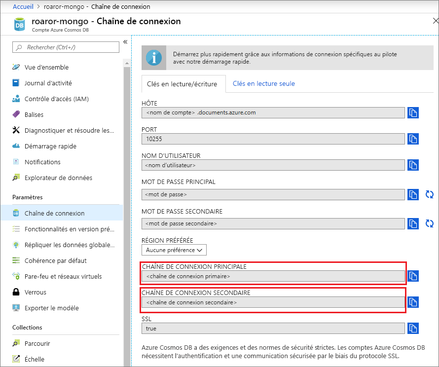
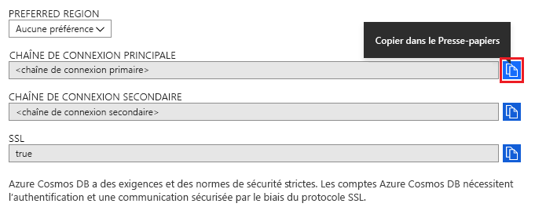
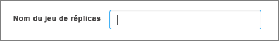

# Utiliser MongoDB Compass pour se connecter à l’API Azure Cosmos DB pour MongoDB 

Ce didacticiel montre comment utiliser [MongoDB Compass](https://www.mongodb.com/products/compass) lorsque vous stockez et/ou gérez des données dans Cosmos DB. Dans cette procédure pas à pas, nous utilisons l’API Azure Cosmos DB pour MongoDB. Pour ceux qui ne connaissent pas Compass, il s’agit d’une interface graphique pour MongoDB. Elle est couramment utilisée pour visualiser les données, exécuter des requêtes ad hoc et gérer les données. 

Cosmos DB est le service de base de données multi-modèle de Microsoft, distribué à l’échelle mondiale. Vous avez la possibilité de créer et d’interroger rapidement des documents, des paires clé/valeur et des bases de données de graphe, profitant tous de la distribution à l’échelle mondiale et des capacités de mise à l’échelle horizontale au cœur de Cosmos DB.

## Conditions préalables 
Pour vous connecter à votre compte Cosmos DB avec Robo 3T, vous devez effectuer les opérations suivantes :

* Télécharger et installer [Compass](https://www.mongodb.com/download-center/compass?jmp=hero)
* Obtenir vos informations de [chaîne de connexion](connect-mongodb-account.md) Cosmos DB

## Connexion à l’API Cosmos DB pour MongoDB 
Pour connecter votre compte Cosmos DB à Compass, vous pouvez suivre les étapes ci-dessous :

1. Récupérez les informations de connexion pour votre compte Cosmos configuré avec l’API Azure Cosmos DB pour MongoDB en suivant les instructions [ici](connect-mongodb-account.md).

    

2. Cliquez sur le bouton intitulé **Copier dans le presse-papiers** à côté de votre **chaîne de connexion principale/secondaire** dans Cosmos DB. Cliquer sur ce bouton copiera votre chaîne de connexion complète dans votre presse-papiers. 

    

3. Ouvrez Compass sur votre ordinateur de bureau/machine, puis cliquez sur **Connexion**, puis **Se connecter à...** . 

4. Compass détecte automatiquement la chaîne de connexion dans le presse-papiers et vous demande si vous souhaitez l’utiliser pour vous connecter. Cliquez sur **Oui** comme le montre la capture d'écran ci-dessous.

    

5. Lorsque vous cliquez sur **Oui** à l’étape précédente, les informations de la chaîne de connexion sont renseignées automatiquement. Supprimez la valeur remplie automatiquement dans **Définir un nom de réplica** pour garantir qu’elle reste vide. 

    

6. En bas de la page, cliquez sur **Se connecter** . Votre compte Cosmos DB et ses bases de données doivent maintenant être visibles dans MongoDB Compass.

## Étapes suivantes

- Découvrez comment [utiliser Studio 3T](mongodb-mongochef.md) avec l’API Azure Cosmos DB pour MongoDB.
- Explorez les [exemples](mongodb-samples.md) MongoDB avec l’API Azure Cosmos DB pour MongoDB.