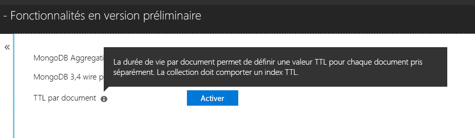

# <a name="expire-data-in-azure-cosmos-db-mongodb-api"></a>Faire expirer des données dans Azure Cosmos DB API MongoDB

La fonctionnalité de durée de vie (TTL) permet à la base de données de faire expirer automatiquement les données. L’API MongoDB utilise des fonctionnalités de durée de vie Azure Cosmos DB. Deux modes sont prises en charge : la définition d’une valeur de durée de vie par défaut sur l’ensemble de la collection et la définition de valeurs de durée de vie individuelles pour chaque document. La logique d’index de durée de vie et les valeurs de durée de vie par document dans l’API MongoDB est la [même que dans Azure Cosmos DB](../cosmos-db/mongodb-indexing.md).

## <a name="ttl-indexes"></a>Index TTL
Pour activer universellement la durée de vie dans une collection, un [« index TTL » (index de durée de vie)](../cosmos-db/mongodb-indexing.md) doit être créé. L’index TTL est un index sur le champ _ts avec une valeur « expireAfterSeconds ».

Exemple :
```JavaScript
globaldb:PRIMARY> db.coll.createIndex({"_ts":1}, {expireAfterSeconds: 10})
{
        "_t" : "CreateIndexesResponse",
        "ok" : 1,
        "createdCollectionAutomatically" : true,
        "numIndexesBefore" : 1,
        "numIndexesAfter" : 4
}
```

La commande dans l’exemple ci-dessus crée un index avec la fonctionnalité de durée de vie. Une fois que l’index est créé, la base de données supprimera automatiquement tous les documents de la collection qui n’ont pas été modifiés au cours des 10 dernières secondes. 

> [!NOTE]
> **_ts** est un champ spécifique de Cosmos DB qui n’est pas accessible à partir des clients MongoDB. Il s’agit d’une propriété (système) réservée qui contient le timestamp de la dernière modification du document.
>
    
En outre, un exemple en C# : 

```csharp
var options = new CreateIndexOptions {ExpireAfter = TimeSpan.FromSeconds(10)}; 
var field = new StringFieldDefinition<BsonDocument>("_ts"); 
var indexDefinition = new IndexKeysDefinitionBuilder<BsonDocument>().Ascending(field); 
await collection.Indexes.CreateOneAsync(indexDefinition, options); 
``` 

## <a name="set-time-to-live-value-for-a-document"></a>Définir la valeur de durée de vie d’un document 
Les valeurs de durée de vie par document sont également prises en charge. Les documents doivent contenir une propriété de niveau racine « ttl » (en minuscules), et un index de durée de vie comme décrit ci-dessus doit avoir été créé pour cette collection. Les valeurs de durée de vie définies sur un document remplaceront la valeur de durée de vie de la collection.

La valeur de durée de vie doit être un Int32. Vous pouvez également utiliser un Int64 tenant dans un Int32, ou un double sans partie décimale tenant dans un Int32. Les valeurs de la propriété de durée de vie qui ne sont pas conformes à ces spécifications sont autorisées, mais pas traités comme une valeur de durée de vie du document explicite.

La valeur de durée de vie pour le document est facultative. Les documents sans valeur de durée de vie peuvent être insérés dans la collection.  Dans ce cas, la valeur de durée de vie de la collection sera respectée. 

Les documents suivants ont des valeurs de durée de vie valides. Une fois que les documents sont insérés, les valeurs de durée de vie des documents remplacent les valeurs de durée de vie de la collection. Par conséquent, les documents seront supprimés après 20 secondes.  

```JavaScript 
globaldb:PRIMARY> db.coll.insert({id:1, location: "Paris", ttl: 20.0}) 
globaldb:PRIMARY> db.coll.insert({id:1, location: "Paris", ttl: NumberInt(20)}) 
globaldb:PRIMARY> db.coll.insert({id:1, location: "Paris", ttl: NumberLong(20)}) 
```

Les documents suivants ont des valeurs de durée de vie non valides. Les documents sont insérés, mais la valeur de durée de vie des documents n’est pas respectée. Par conséquent, les documents seront supprimés après 10 secondes en raison de la valeur de durée de vie de la collection. 

```JavaScript 
globaldb:PRIMARY> db.coll.insert({id:1, location: "Paris", ttl: 20.5}) //TTL value contains non-zero decimal part. 
globaldb:PRIMARY> db.coll.insert({id:1, location: "Paris", ttl: NumberLong(2147483649)}) //TTL value is greater than Int32.MaxValue (2,147,483,648). 
``` 

## <a name="how-to-activate-the-per-document-ttl-feature"></a>Comment activer la fonctionnalité de durée de vie par document
La fonctionnalité de durée de vie par document peut être activée via l’onglet « Fonctionnalités préliminaires » du compte de l’API MongoDB dans le portail Azure.

 

## <a name="next-steps"></a>Étapes suivantes
* [Faire expirer des données dans des collections Azure Cosmos DB automatiquement avec la durée de vie](../cosmos-db/time-to-live.md)
* [Indexation dans Azure Cosmos DB API MongoDB](../cosmos-db/mongodb-indexing.md)
