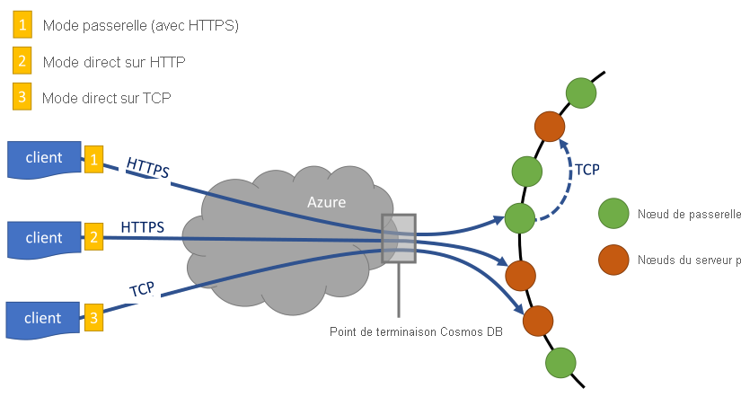
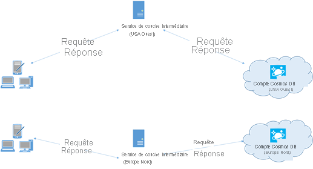

# <a name="performance-tips-for-azure-cosmos-db-and-net"></a>Conseils sur les performances pour Azure Cosmos DB et .NET

> [!div class="op_single_selector"]
> * [Java asynchrone](performance-tips-async-java.md)
> * [Java](performance-tips-java.md)
> * [.NET](performance-tips.md)
> 

Azure Cosmos DB est une base de données distribuée rapide et flexible qui peut être mise à l’échelle en toute transparence avec une latence et un débit garantis. Vous n’avez pas à apporter de modifications d’architecture majeures ou écrire de code complexe pour mettre à l’échelle votre base de données avec Azure Cosmos DB. La réduction et l’augmentation de l’échelle est aussi simple que le passage d’un appel d’API. Pour en savoir plus, voir [Approvisionner le débit d’un conteneur](how-to-provision-container-throughput.md) ou [Approvisionner le débit d’une base de données](how-to-provision-database-throughput.md). Toutefois, étant donné qu’Azure Cosmos DB est accessible par le biais d’appels réseau, vous pouvez apporter des optimisations côté client de manière à atteindre des performances de pointe quand vous utilisez le [SDK SQL .NET](sql-api-sdk-dotnet-standard.md).

Si vous vous demandez comment améliorer les performances de votre base de données, lisez ce qui suit :

## <a name="networking"></a>Mise en réseau
<a id="direct-connection"></a>

1. **Stratégie de connexion : Utiliser le mode de connexion directe**

    La façon dont un client se connecte à Azure Cosmos DB a des conséquences importantes sur les performances, notamment en termes de latence côté client. Il existe deux paramètres de configuration essentiels pour la stratégie de connexion client : le *mode* de connexion et le *protocole* de connexion.  Les deux modes disponibles sont :

   * Mode passerelle
      
     Le mode passerelle est pris en charge sur toutes les plateformes de SDK et est l’option configurée par défaut pour le [SDK Microsoft.Azure.DocumentDB](sql-api-sdk-dotnet.md). Si votre application s’exécute dans un réseau d’entreprise avec des restrictions de pare-feu strictes, le mode passerelle est la meilleure option, car il utilise le port HTTPS standard et un seul point de terminaison. Toutefois, il existe un compromis en termes de performances : le mode passerelle implique un tronçon réseau supplémentaire chaque fois que les données sont lues ou écrites dans Azure Cosmos DB. Étant donné que le mode direct implique moins de tronçons réseaux, les performances sont meilleures. Le mode de connexion de passerelle est également recommandé quand vous exécutez des applications dans les environnements ayant un nombre limité de connexions de socket. 

     Quand vous utilisez le kit SDK dans Azure Functions, en particulier dans un [plan de consommation](../azure-functions/functions-scale.md#consumption-plan), prenez en compte les [limites de connections](../azure-functions/manage-connections.md) actuelles. Dans ce cas, le mode passerelle peut être recommandé si vous utilisez également d’autres clients basés sur HTTP au sein de votre application Azure Functions.

   * Mode direct

     Le mode direct prend en charge la connectivité via les protocoles TCP. Il s’agit du mode de connectivité par défaut si vous utilisez le [SDK Microsoft.Azure.Cosmos/.Net V3](sql-api-sdk-dotnet-standard.md).

     Quand vous utilisez le mode passerelle, Cosmos DB utilise le port 443, et les ports 10250, 10255 et 10256 lors de l’utilisation de l’API pour MongoDB d’Azure Cosmos DB. Le port 10250 est mappé par défaut à une instance MongoDB sans géo-réplication, et les ports 10255/10256 sont mappés à l’instance MongoDB avec la fonctionnalité de géo-réplication. Lors de l’utilisation de TCP en mode direct, en plus des ports de passerelle, vous devez vérifier que la plage de ports comprise entre 10000 et 20000 est ouverte, car Azure Cosmos DB utilise des ports TCP dynamiques. Si ces ports ne sont pas ouverts et que vous essayez d’utiliser le protocole TCP, vous recevez une erreur de type 503 Service indisponible. Le tableau suivant montre les modes de connexion disponibles pour les différentes API et l’utilisateur de ports de service pour chaque API :

     |Mode de connexion  |Protocole pris en charge  |Kits SDK pris en charge  |API/Port de service  |
     |---------|---------|---------|---------|
     |Passerelle  |   HTTPS    |  Tous les kits SDK    |   SQL(443), Mongo(10250, 10255, 10256), Table(443), Cassandra(10350), Graph(443)    |
     |Direct    |     TCP    |  Kit de développement logiciel (SDK) .NET    | Ports dans la plage de 10 000 à 20 000 |

     Azure Cosmos DB fournit un modèle de programmation RESTful simple et ouvert sur HTTPS. De plus, il fournit un protocole TCP très performant qui utilise aussi un modèle de communication RESTful, disponible via le Kit de développement logiciel (SDK) .NET. Le protocole TCP utilise SSL pour l’authentification initiale et le chiffrement du trafic. Pour de meilleures performances, utilisez le protocole TCP lorsque cela est possible.

     Pour le kit SDK V3, le mode de connectivité est configuré lors de la création de l’instance CosmosClient, dans le cadre de CosmosClientOptions. Souvenez-vous que le mode direct est le mode par défaut.

     ```csharp
     var serviceEndpoint = new Uri("https://contoso.documents.net");
     var authKey = "your authKey from the Azure portal";
     CosmosClient client = new CosmosClient(serviceEndpoint, authKey,
     new CosmosClientOptions
     {
        ConnectionMode = ConnectionMode.Gateway // ConnectionMode.Direct is the default
     });
     ```

     Pour le SDK Microsoft.Azure.DocumentDB, le mode de connectivité est configuré lors de la construction de l’instance DocumentClient avec le paramètre ConnectionPolicy. Si le mode direct est utilisé, le protocole peut également être défini dans le paramètre ConnectionPolicy.

     ```csharp
     var serviceEndpoint = new Uri("https://contoso.documents.net");
     var authKey = "your authKey from the Azure portal";
     DocumentClient client = new DocumentClient(serviceEndpoint, authKey,
     new ConnectionPolicy
     {
        ConnectionMode = ConnectionMode.Direct, //ConnectionMode.Gateway is the default
        ConnectionProtocol = Protocol.Tcp
     });
     ```

     Puisque TCP est uniquement pris en charge en mode direct, si le mode passerelle est activé, c’est le protocole HTTPS qui est toujours utilisé pour communiquer avec la passerelle, et la valeur de protocole dans le paramètre ConnectionPolicy est ignorée.

     

2. **Appel d’OpenAsync pour éviter la latence de démarrage lors de la première requête**

    Par défaut, la première requête a une latence plus élevée, car elle doit extraire la table de routage d’adresses. Lors de l’utilisation du [SDK V2](sql-api-sdk-dotnet.md), pour éviter cette latence de démarrage lors de la première requête, vous devez appeler OpenAsync() une seule fois lors de l’initialisation, comme indiqué ci-après.

        await client.OpenAsync();

    > [!NOTE] 
    > La méthode OpenAsync génère des demandes afin d’obtenir la table de routage d’adresses pour tous les conteneurs du compte. Pour les comptes qui ont de nombreux conteneurs, mais dont l’application accède à un sous-ensemble de ces derniers, elle génère un volume de trafic inutile qui ralentit l’initialisation. Ainsi, l’utilisation de la méthode OpenAsync peut s’avérer superflue dans ce scénario, car elle ralentit le démarrage de l’application.

   <a id="same-region"></a>
3. **Colocalisation des clients dans la même région Azure pour les performances**

    Dans la mesure du possible, placez toutes les applications appelant Azure Cosmos DB dans la même région que la base de données Azure Cosmos. Pour une comparaison approximative, les appels à Azure Cosmos DB dans la même région s’effectuent en 1 à 2 ms, mais la latence entre les côtes Ouest et Est des États-Unis est supérieure à 50 ms. Cette latence peut probablement varier d’une requête à l’autre, en fonction de l’itinéraire utilisé par la requête lorsqu’elle passe du client à la limite du centre de données Azure. Pour obtenir la latence la plus faible possible, l’application appelante doit être située dans la même région Azure que le point de terminaison Azure Cosmos DB configuré. Pour obtenir la liste des régions disponibles, voir [Régions Azure](https://azure.microsoft.com/regions/#services).

    
   <a id="increase-threads"></a>
4. **Augmentation du nombre de threads/tâches**

    Étant donné que les appels à Azure Cosmos DB sont effectués sur le réseau, vous devrez peut-être modifier le degré de parallélisme de vos requêtes, afin que l’application cliente attende très peu de temps entre les requêtes. Par exemple, si vous utilisez la [bibliothèque parallèle de tâches](https://msdn.microsoft.com//library/dd460717.aspx) .NET, créez plusieurs centaines de tâches de lecture ou d’écriture dans Azure Cosmos DB.

5. **Activer la mise en réseau accélérée**

   Afin de diminuer la latence et l’instabilité du processeur, nous recommandons que les machines virtuelles clientes soient compatibles avec la mise en réseau accélérée. Consultez les articles [Créer une machine virtuelle Windows avec mise en réseau accélérée](../virtual-network/create-vm-accelerated-networking-powershell.md) ou [Créer une machine virtuelle Linux avec mise en réseau accélérée](../virtual-network/create-vm-accelerated-networking-cli.md) pour activer la mise en réseau accélérée.


## <a name="sdk-usage"></a>Utilisation du kit de développement logiciel (SDK)
1. **Installation du kit de développement logiciel (SDK) le plus récent**

    Les SDK Azure Cosmos DB sont constamment améliorés pour fournir des performances optimales. Consultez les pages du [SDK Azure Cosmos DB](sql-api-sdk-dotnet-standard.md) pour déterminer quel est le SDK le plus récent et passer en revue les améliorations.

2. **Utiliser les API de flux**

    Le SDK [.Net SDK V3](sql-api-sdk-dotnet-standard.md) contient des API de flux qui peuvent recevoir et retourner des données sans sérialisation. 

    Les applications intermédiaires qui ne consomment pas directement les réponses du kit SDK, mais qui les relayent vers d’autres couches Application, peuvent tirer parti des API de flux. Pour obtenir des exemples sur la gestion des flux, consultez les exemples de [gestion d’élément](https://github.com/Azure/azure-cosmos-dotnet-v3/blob/master/Microsoft.Azure.Cosmos.Samples/Usage/ItemManagement).

3. **Utiliser un client Azure Cosmos DB singleton pour la durée de vie de votre application**

    Chaque instance de DocumentClient et CosmosClient est thread-safe et effectue une gestion des connexions efficace et une mise en cache d’adresses quand le mode direct est sélectionné. Pour permettre une gestion des connexions efficace et améliorer les performances par le client SDK, nous vous recommandons d’utiliser une seule instance par AppDomain pour la durée de vie de l’application.

   <a id="max-connection"></a>
4. **Augmentation de System.Net MaxConnections par hôte lors de l’utilisation du mode passerelle**

    Les requêtes Azure Cosmos DB sont effectuées par le biais de HTTPS/REST durant l’utilisation du mode passerelle et sont soumises aux limites de connexion par défaut par nom d’hôte ou adresse IP. Vous devrez peut-être définir MaxConnections sur une valeur plus élevée (100 à 1000) afin que la bibliothèque cliente puisse utiliser plusieurs connexions simultanées à Azure Cosmos DB. Dans le kit de développement logiciel (SDK) .NET 1.8.0 et versions ultérieures, la valeur par défaut pour [ServicePointManager.DefaultConnectionLimit](https://msdn.microsoft.com/library/system.net.servicepointmanager.defaultconnectionlimit.aspx) est 50. Pour modifier la valeur, vous pouvez définir [Documents.Client.ConnectionPolicy.MaxConnectionLimit](https://msdn.microsoft.com/library/azure/microsoft.azure.documents.client.connectionpolicy.maxconnectionlimit.aspx) sur une valeur plus élevée.   
5. **Paramétrage des requêtes parallèles pour les collections partitionnées**

     Le SDK SQL .NET version 1.9.0 et ultérieure prend en charge les requêtes parallèles, qui permettent d’interroger une collection partitionnée en parallèle. Pour plus d’informations, voir les [exemples de code](https://github.com/Azure/azure-documentdb-dotnet/blob/master/samples/code-samples/Queries/Program.cs) concernant l’utilisation des kits SDK. Les requêtes parallèles sont conçues pour améliorer la latence des requêtes et le débit sur leur équivalent série. Les requêtes parallèles fournissent deux paramètres que les utilisateurs peuvent paramétrer en fonction de leurs besoins, (a) MaxDegreeOfParallelism, pour contrôler le nombre maximal de partitions qui peuvent être interrogées en parallèle, et (b) MaxBufferedItemCount, pour contrôler le nombre de résultats pré-extraits.

    (a) ***Réglage du degré de parallélisme\:*** La requête parallèle interroge plusieurs partitions en parallèle. Les données d’une partition individuelle sont toutefois extraites en série dans le cadre de la requête. La définition de `MaxDegreeOfParallelism` dans [SDK V2](sql-api-sdk-dotnet.md) ou de `MaxConcurrency` dans [SDK V3](sql-api-sdk-dotnet-standard.md) sur le nombre de partitions augmente les chances de résultats de la requête, sous réserve que toutes les autres conditions système restent inchangées. Si vous ne connaissez pas le nombre de partitions, vous pouvez définir le degré de parallélisme sur un nombre élevé, et le système sélectionne le minimum (nombre de partitions, entrée fournie par l’utilisateur) comme degré de parallélisme.

    Il est important de noter que les requêtes parallèles produisent de meilleurs résultats si les données sont réparties de manière homogène entre toutes les partitions. Si la collection est partitionnée de telle façon que toutes les données retournées par une requête, ou une grande partie d’entre elles, sont concentrées sur quelques partitions (une partition dans le pire des cas), les performances de la requête sont altérées par ces partitions.

    (b) La requête parallèle ***Tuning MaxBufferedItemCount\:*** pré-extrait les résultats tandis que le lot de résultats courant est en cours de traitement par le client. La pré-extraction permet d’améliorer la latence globale d’une requête. MaxBufferedItemCount est le paramètre utilisé pour limiter le nombre de résultats pré-extraits. La définition du paramètre MaxBufferedItemCount sur le nombre de résultats attendu (ou un nombre plus élevé) permet à la requête d’optimiser la pré-extraction.

    La pré-extraction fonctionne de la même façon, quel que soit le degré de parallélisme, et il existe une seule mémoire tampon pour les données de toutes les partitions.  
6. **Activation de GC côté serveur**

    Réduire la fréquence de Garbage Collection peut aider dans certains cas. Dans .NET, définissez [gcServer](https://msdn.microsoft.com/library/ms229357.aspx) sur true.
7. **Implémentation d’interruption à des intervalles de RetryAfter**

    Lors du test de performances, vous devez augmenter la charge jusqu’à une limite d’un petit nombre de requêtes. En cas de limitation, l’application cliente doit s’interrompre à la limitation pour l’intervalle de nouvelle tentative spécifié sur le serveur Le respect de l’interruption garantit un temps d’attente minimal entre chaque tentative. La prise en charge de la stratégie de nouvelle tentative est incluse dans les versions 1.8.0 et ultérieures du SDK SQL [.NET](sql-api-sdk-dotnet.md) et [Java](sql-api-sdk-java.md), dans les versions 1.9.0 et ultérieures du SDK [Node.js](sql-api-sdk-node.md) et [Python](sql-api-sdk-python.md), et dans toutes les versions prises en charge des SDK [.NET Core](sql-api-sdk-dotnet-core.md). Pour plus d’informations, voir [RetryAfter](https://msdn.microsoft.com/library/microsoft.azure.documents.documentclientexception.retryafter.aspx).
    
    Dans la version 1.19 ou version ultérieure du Kit de développement logiciel (SDK) .NET, un mécanisme permet de consigner des informations de diagnostic supplémentaires et de résoudre les problèmes de latence, comme indiqué dans l’exemple suivant. Vous pouvez consigner la chaîne de diagnostic de requêtes ayant une latence de lecture supérieure. La chaîne de diagnostic capturée vous permet de connaître le nombre de fois où des erreurs 429 ont été rencontrées pour une requête donnée.
    ```csharp
    ResourceResponse<Document> readDocument = await this.readClient.ReadDocumentAsync(oldDocuments[i].SelfLink);
    readDocument.RequestDiagnosticsString 
    ```
    
8. **Augmentation de la taille des instances de votre charge de travail cliente**

    Si vous effectuez des tests à des niveaux de débit élevé (> 50 000 RU/s), l’application cliente peut devenir un goulet d’étranglement en raison du plafonnement sur l’utilisation du processeur ou du réseau. Si vous atteignez ce point, vous pouvez continuer à augmenter le compte Azure Cosmos DB en augmentant la taille des instances de vos applications clientes sur plusieurs serveurs.
9. **Mise en cache d’URI de document pour une latence de lecture plus faible**

    Effectuez une mise en cache des URI de document dès que possible pour garantir la meilleure lecture. Vous devez définir la logique pour mettre en cache l’ID de ressource lorsque vous créez la ressource. Les recherches par ID de ressource sont plus rapides que les recherches par nom. La mise en cache de ces valeurs améliore donc les performances. 

   <a id="tune-page-size"></a>
10. **Réglage de la taille de la page des flux de lecture/requêtes pour de meilleures performances**

   Lors d’une lecture groupée de documents à l’aide de la fonctionnalité de flux de lecture (ReadDocumentFeedAsync) ou lors de l’émission d’une requête SQL, les résultats sont retournés de façon segmentée si le jeu de résultats est trop grand. Par défaut, les résultats sont retournés dans des segments de 100 éléments ou de 1 Mo, selon la limite atteinte en premier.

   Afin de réduire le nombre de boucles réseau nécessaires pour récupérer tous les résultats applicables, vous pouvez augmenter la taille de la page à 1000 résultats à l’aide de l’en-tête de requête [x-ms-max-item-count](https://docs.microsoft.com/rest/api/cosmos-db/common-cosmosdb-rest-request-headers). Si vous avez besoin d’afficher uniquement quelques résultats, (par exemple, si votre interface utilisateur ou API d’application retourne seulement 10 résultats à la fois), vous pouvez également réduire la taille de la page à 10 résultats, afin de baisser le débit consommé pour les lectures et requêtes.

   > [!NOTE] 
   > La propriété maxItemCount ne doit pas être utilisée uniquement à des fins de pagination. Son but principal est d’améliorer les performances des requêtes en réduisant le nombre maximal d’éléments retournés dans une seule page.  

   Vous pouvez également définir la taille de la page à l’aide des SDK Azure Cosmos DB disponibles. La propriété [MaxItemCount](/dotnet/api/microsoft.azure.documents.client.feedoptions.maxitemcount?view=azure-dotnet) dans FeedOptions vous permet de définir le nombre maximal d’éléments à retourner dans l’opération d’énumération. Lorsque la propriété `maxItemCount` est définie sur -1, le kit de développement logiciel (SDK) recherche automatiquement la valeur optimale en fonction de la taille du document. Par exemple :
    
   ```csharp
    IQueryable<dynamic> authorResults = client.CreateDocumentQuery(documentCollection.SelfLink, "SELECT p.Author FROM Pages p WHERE p.Title = 'About Seattle'", new FeedOptions { MaxItemCount = 1000 });
   ```
    
   Lorsqu’une requête est exécutée, les données qui en résultent sont envoyées dans un paquet TCP. Si vous spécifiez une valeur trop faible pour `maxItemCount`, le nombre d’allers-retours requis pour envoyer les données dans le paquet TCP est élevé, ce qui affecte les performances. Par conséquent, si vous ne savez pas quelle valeur définir pour la propriété `maxItemCount`, il est préférable d’affecter la valeur -1 et permettre au kit de développement logiciel (SDK) de choisir la valeur par défaut. 

11. **Augmentation du nombre de threads/tâches**

    Consultez [Augmentation du nombre de threads/tâches](#increase-threads) à la section Mise en réseau.

12. **Utilisation du processus hôte 64 bits**

    Le SDK SQL fonctionne dans un processus hôte 32 bits quand vous utilisez le SDK SQL .NET version 1.11.4 et ultérieures. Toutefois, que si vous utilisez des requêtes entre les partitions, le processus hôte 64 bits est recommandé pour améliorer les performances. Les types d’applications suivants utilisent des processus hôte 32 bits par défaut. Pour les remplacer par des processus 64 bits, procédez comme suit, selon le type de votre application :

    - Pour les applications exécutables, désactivez l’option **Préférer 32 bits** dans la fenêtre **Propriétés du projet**, dans l’onglet **Générer**.

    - Pour les projets basés sur VSTest, cette opération peut être effectuée en sélectionnant **Test**->**Paramètres de test**->**Default Processor Architecture as X64** (Définir l’architecture de processeur par défaut sur X64), à partir de l’option de menu **Visual Studio Test**.

    - Pour les applications web ASP.NET déployées localement, cette opération peut être effectuée en sélectionnant **Utiliser la version 64 bits d’IIS Express pour les sites et les projets Web**, sous **Outils**->**Options**->**Projects and Solutions (Projets et solutions)** ->**Projets Web**.

    - Pour les applications web ASP.NET déployées sur Azure, cette opération peut être effectuée en choisissant la **plate-forme 64 bits** dans les **paramètres de l’application** sur le portail Azure.

## <a name="indexing-policy"></a>Stratégie d’indexation
 
1. **Exclusion des chemins d’accès inutilisés de l’indexation pour des écritures plus rapides**

    La stratégie d’indexation de Cosmos DB vous permet également de spécifier les chemins d’accès de document à inclure ou exclure de l’indexation en tirant parti des chemins d’accès d’indexation (IndexingPolicy.IncludedPaths et IndexingPolicy.ExcludedPaths). L’utilisation des chemins d’accès d’indexation peut offrir des performances d’écriture améliorées et réduire le stockage d’index pour les scénarios dans lesquels les modèles de requête sont connus d’avance, puisque les coûts d’indexation sont directement liés au nombre de chemins d’accès uniques indexés.  Par exemple, le code suivant montre comment exclure une section entière des documents (appelée sous-arborescence) de l’indexation à l’aide du caractère générique « * ».

    ```csharp
    var collection = new DocumentCollection { Id = "excludedPathCollection" };
    collection.IndexingPolicy.IncludedPaths.Add(new IncludedPath { Path = "/*" });
    collection.IndexingPolicy.ExcludedPaths.Add(new ExcludedPath { Path = "/nonIndexedContent/*");
    collection = await client.CreateDocumentCollectionAsync(UriFactory.CreateDatabaseUri("db"), excluded);
    ```

    Pour plus d’informations, consultez [Stratégies d’indexation d’Azure Cosmos DB](index-policy.md).

## <a name="throughput"></a>Débit
<a id="measure-rus"></a>

1. **Mesure et réglage pour réduire l’utilisation d’unités de requête par seconde**

    Azure Cosmos DB propose un riche ensemble d’opérations de base de données, dont les requêtes hiérarchiques et relationnelles avec les fonctions définies par l’utilisateur, les procédures stockées et les déclencheurs, qui fonctionnent toutes au niveau des documents d’une collection de base de données. Le coût associé à chacune de ces opérations varie en fonction du processeur, des E/S et de la mémoire nécessaires à l’exécution de l’opération. Plutôt que de vous soucier de la gestion des ressources matérielles, vous pouvez considérer une unité de demande comme une mesure unique des ressources nécessaires à l’exécution des opérations de base de données et à la réponse à la requête de l’application.

    Le débit est provisionné en fonction du nombre [d’unités de requête](request-units.md) défini pour chaque conteneur. La consommation d’unités de requête est évaluée en fonction d’un taux par seconde. Les applications qui dépassent le taux d’unités de requête configuré pour le conteneur associé sont limitées jusqu’à ce que le taux soit inférieur au niveau configuré pour le conteneur. Si votre application requiert un niveau de débit plus élevé, vous pouvez augmenter le débit en provisionnant des unités de requête supplémentaires. 

    La complexité d’une requête a un impact sur le nombre d’unités de requête consommées pour une opération. Le nombre de prédicats, la nature des prédicats, le nombre de fonctions définies par l’utilisateur et la taille du jeu de données sources ont tous une influence sur le coût des opérations de requête.

    Pour mesurer les frais de l’opération (création, mise à jour ou suppression), inspectez l’en-tête [x-ms-request-charge](https://docs.microsoft.com/rest/api/cosmos-db/common-cosmosdb-rest-response-headers) (ou la propriété RequestCharge équivalente dans ResourceResponse\<T> ou FeedResponse\<T> dans le kit de développement logiciel (SDK) .NET) afin de déterminer le nombre d’unités de requête consommées par ces opérations.

    ```csharp
    // Measure the performance (request units) of writes
    ResourceResponse<Document> response = await client.CreateDocumentAsync(collectionSelfLink, myDocument);
    Console.WriteLine("Insert of document consumed {0} request units", response.RequestCharge);
    // Measure the performance (request units) of queries
    IDocumentQuery<dynamic> queryable = client.CreateDocumentQuery(collectionSelfLink, queryString).AsDocumentQuery();
    while (queryable.HasMoreResults)
         {
              FeedResponse<dynamic> queryResponse = await queryable.ExecuteNextAsync<dynamic>();
              Console.WriteLine("Query batch consumed {0} request units", queryResponse.RequestCharge);
         }
    ```             

    Les frais de la requête retournée dans cet en-tête correspondent à une fraction du débit configuré (c’est-à-dire 2 000 RU/seconde). Par exemple, si la requête ci-dessus renvoie 1000 documents de 1 Ko, le coût de l’opération est de 1 000. Par conséquent, en une seconde, le serveur honore uniquement deux requêtes avant de limiter le taux de requêtes suivantes. Pour plus d’informations, consultez [Unités de requête](request-units.md) et la [calculatrice d’unités de requête](https://www.documentdb.com/capacityplanner).
<a id="429"></a>
2. **Gestion de la limite de taux/du taux de requête trop importants**

    Lorsqu’un client tente de dépasser le débit réservé pour un compte, les performances au niveau du serveur ne sont pas affectées et la capacité de débit n’est pas utilisée au-delà du niveau réservé. Le serveur met fin à la requête de manière préventive avec RequestRateTooLarge (code d’état HTTP 429) et il retourne l’en-tête [x-ms-retry-after-ms](https://docs.microsoft.com/rest/api/cosmos-db/common-cosmosdb-rest-response-headers) indiquant la durée, en millisecondes, pendant laquelle l’utilisateur doit attendre avant de réessayer.

        HTTP Status 429,
        Status Line: RequestRateTooLarge
        x-ms-retry-after-ms :100

    Les kits de développement logiciel (SDK) interceptent tous implicitement cette réponse, respectent l’en-tête retry-after spécifiée par le serveur, puis relancent la requête. La tentative suivante réussira toujours, sauf si plusieurs clients accèdent simultanément à votre compte.

    Si plusieurs clients opèrent simultanément au-delà du taux de requête, le nombre de nouvelles tentatives par défaut actuellement défini sur 9 en interne par le client peut ne pas suffire. Dans ce cas, le client envoie une exception DocumentClientException avec le code d’état 429 à l’application. Le nombre de nouvelles tentatives par défaut peut être modifié en définissant les RetryOptions sur l’instance ConnectionPolicy. Par défaut, la DocumentClientException avec le code d’état 429 est retournée après un temps d’attente cumulé de 30 secondes si la requête continue à fonctionner au-dessus du taux de requête. Cela se produit même lorsque le nombre de nouvelles tentatives actuel est inférieur au nombre maximal de nouvelles tentatives, qu’il s’agisse de la valeur par défaut de 9 ou d’une valeur définie par l’utilisateur.

    Alors que le comportement de nouvelle tentative automatique permet d’améliorer la résilience et la facilité d’utilisation pour la plupart des applications, il peut se révéler contradictoire lors de l’exécution de tests de performances, en particulier lors de la mesure de la latence.  La latence client observée atteindra un pic si l’expérience atteint la limite de serveur et oblige le kit de développement logiciel (SDK) client à effectuer une nouvelle tentative en silence. Pour éviter des pics de latence lors des expériences de performances, mesurez la charge renvoyée par chaque opération et assurez-vous que les requêtes fonctionnent en dessous du taux de requête réservé. Pour plus d’informations, consultez [Unités de requête](request-units.md).
3. **Conception de documents plus petits pour un débit plus élevé**

    Les frais de requête (p. ex. le coût de traitement de requête) d’une opération donnée sont directement liés à la taille du document. Des opérations sur des documents volumineux coûtent plus cher que des opérations sur de petits documents.

## <a name="next-steps"></a>Étapes suivantes
Pour obtenir un exemple d’application permettant d’évaluer Azure Cosmos DB lors de scénarios hautes performances sur quelques ordinateurs clients, consultez [Test des performances et de la mise à l’échelle avec Azure Cosmos DB](performance-testing.md).

En outre, pour en savoir plus sur la conception de votre application pour une mise à l’échelle et de hautes performances, consultez [Partitionnement, clés de partition et mise à l’échelle dans Cosmos DB](partition-data.md).
