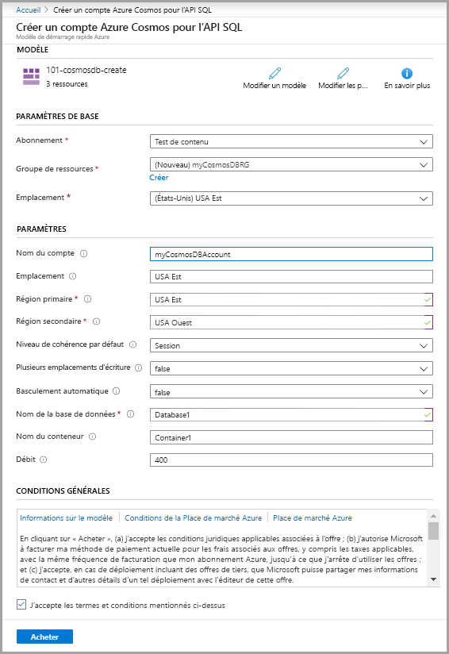
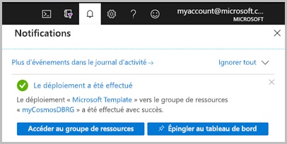

# <a name="quickstart-create-an-azure-cosmos-db-and-a-container-by-using-azure-resource-manager-template"></a>Démarrage rapide : Créer une base de données et un conteneur Azure Cosmos DB avec un modèle Azure Resource Manager

Azure Cosmos DB est le service de base de données multi-modèle de Microsoft distribué à l’échelle mondiale. Vous pouvez utiliser Azure Cosmos DB pour créer et interroger rapidement des bases de données de clés/valeurs, de documents et de graphes. Ce guide de démarrage rapide porte essentiellement sur le processus de déploiement d’un modèle Resource Manager pour créer une base de données Azure Cosmos et un conteneur dans cette base de données. Vous pouvez ensuite stocker des données dans ce conteneur.

[!INCLUDE [About Azure Resource Manager](../../includes/resource-manager-quickstart-introduction.md)]

Si vous n’avez pas d’abonnement Azure, créez un [compte gratuit](https://azure.microsoft.com/free/?WT.mc_id=A261C142F) avant de commencer.

## <a name="prerequisites"></a>Prérequis

Un abonnement Azure ou un compte d’essai gratuit Azure Cosmos DB

- [!INCLUDE [quickstarts-free-trial-note](../../includes/quickstarts-free-trial-note.md)]

- [!INCLUDE [cosmos-db-emulator-docdb-api](../../includes/cosmos-db-emulator-docdb-api.md)]

## <a name="create-an-azure-cosmos-account-database-container"></a>Créer un compte, une base de données et un conteneur Azure Cosmos

### <a name="review-the-template"></a>Vérifier le modèle

Le modèle utilisé dans ce guide de démarrage rapide est tiré des [modèles de démarrage rapide Azure](https://azure.microsoft.com/resources/templates/101-cosmosdb-create/).

:::code language="json" source="~/quickstart-templates/101-cosmosdb-create/azuredeploy.json":::

Trois ressources Azure sont définies dans le modèle :

* [Microsoft.DocumentDB/databaseAccounts](/azure/templates/microsoft.documentdb/databaseaccounts) : Crée un compte Azure Cosmos.

* [Microsoft.DocumentDB/databaseAccounts/sqlDatabases](/azure/templates/microsoft.documentdb/databaseaccounts/sqldatabases) : Crée une base de données Azure Cosmos.

* [Microsoft.DocumentDB/databaseAccounts/sqlDatabases/containers](/azure/templates/microsoft.documentdb/databaseaccounts/sqldatabases/containers) : Crée un conteneur Azure Cosmos.

Vous trouverez d’autres exemples de modèles Azure Cosmos DB dans la [galerie de modèles de démarrage rapide](https://azure.microsoft.com/resources/templates/?resourceType=Microsoft.Documentdb).

### <a name="deploy-the-template"></a>Déployer le modèle

1. Cliquez sur l’image ci-après pour vous connecter à Azure et ouvrir un modèle. Le modèle crée un compte, une base de données et un conteneur Azure Cosmos.

   <a href="https://portal.azure.com/#create/Microsoft.Template/uri/https%3A%2F%2Fraw.githubusercontent.com%2FAzure%2Fazure-quickstart-templates%2Fmaster%2F101-cosmosdb-create%2Fazuredeploy.json"></a>

2. Sélectionnez ou entrez les valeurs suivantes.

   

    Sauf si elles sont spécifiées, utilisez les valeurs par défaut pour créer les ressources Azure Cosmos.

    * **Abonnement** : sélectionnez un abonnement Azure.
    * **Groupe de ressources** : sélectionnez **Créer**, entrez un nom unique pour le groupe de ressources, puis cliquez sur **OK**.
    * **Emplacement** : sélectionnez un emplacement.  Par exemple, **USA Centre**.
    * **Nom du compte** : entrez un nom pour le compte Azure Cosmos. Il doit être globalement unique.
    * **Emplacement** : entrez un emplacement où vous voulez créer votre compte Azure Cosmos. Le compte Azure Cosmos peut être au même emplacement que le groupe de ressources.
    * **Région principale** : Région du réplica principal pour le compte Azure Cosmos.
    * **Région secondaire** : Région du réplica secondaire pour le compte Azure Cosmos.
    * **Nom de la base de données** : Nom de la base de données Azure Cosmos.
    * **Nom du conteneur** : Nom du conteneur Azure Cosmos.
    * **Débit** :  Débit pour le conteneur, la valeur minimale du débit est de 400 RU/s.
    * **J’accepte les termes et conditions mentionnés ci-dessus** : cochez la case.

3. Sélectionnez **Achat**. Une fois que le compte Azure Cosmos a été déployé, vous recevez une notification :

   

Le portail Azure est utilisé pour déployer le modèle. Outre le portail Azure, vous pouvez également utiliser Azure PowerShell, l’interface Azure CLI et l’API REST. Pour découvrir d’autres méthodes de déploiement, consultez [Déployer des modèles](../azure-resource-manager/templates/deploy-powershell.md).

## <a name="validate-the-deployment"></a>Valider le déploiement

Vous pouvez utiliser le portail Azure pour vérifier le compte, la base de données et le conteneur Azure Cosmos, ou bien utiliser le script Azure CLI ou Azure PowerShell suivant pour visualiser le secret créé.

# <a name="cli"></a>[INTERFACE DE LIGNE DE COMMANDE](#tab/CLI)

```azurecli-interactive
echo "Enter your Azure Cosmos account name:" &&
read cosmosAccountName &&
echo "Enter the resource group where the Azure Cosmos account exists:" &&
read resourcegroupName &&
az cosmosdb show -g $resourcegroupName -n $cosmosAccountName
```

# <a name="powershell"></a>[PowerShell](#tab/PowerShell)

```azurepowershell-interactive
$resourceGroupName = Read-Host -Prompt "Enter the resource group name where your Azure Cosmos account exists"
(Get-AzResource -ResourceType "Microsoft.DocumentDB/databaseAccounts" -ResourceGroupName $resourceGroupName).Name
 Write-Host "Press [ENTER] to continue..."
```

---

## <a name="clean-up-resources"></a>Nettoyer les ressources

Si vous prévoyez d’utiliser les démarrages rapides suivants et des tutoriels, il peut être utile de conserver ces ressources.
Si vous n’en avez plus besoin, supprimez le groupe de ressources, ce qui va supprimer le compte Azure Cosmos et les ressources associées. Pour supprimer le groupe de ressources à l’aide d’Azure CLI ou d’Azure PowerShell :

# <a name="cli"></a>[INTERFACE DE LIGNE DE COMMANDE](#tab/CLI)

```azurecli-interactive
echo "Enter the Resource Group name:" &&
read resourceGroupName &&
az group delete --name $resourceGroupName &&
echo "Press [ENTER] to continue ..."
```

# <a name="powershell"></a>[PowerShell](#tab/PowerShell)

```azurepowershell-interactive
$resourceGroupName = Read-Host -Prompt "Enter the Resource Group name"
Remove-AzResourceGroup -Name $resourceGroupName
Write-Host "Press [ENTER] to continue..."
```

---

## <a name="next-steps"></a>Étapes suivantes

Dans ce guide de démarrage rapide, vous avez créé un compte, une base de données et un conteneur Azure Cosmos avec un modèle Azure Resource Manager et vous avez vérifié le déploiement. Pour plus d’informations sur Azure Cosmos DB et Azure Resource Manager, passez aux articles ci-dessous.

- Consultez [Vue d’ensemble d’Azure Cosmos DB](introduction.md)
- En savoir plus sur [Azure Resource Manager](../azure-resource-manager/management/overview.md)
- Obtenez d’autres [Modèles Resource Manager pour Azure Cosmos DB](resource-manager-samples.md)