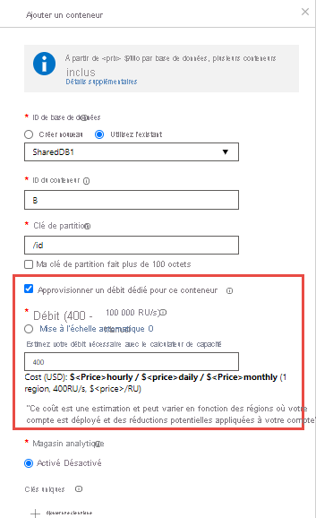

# Approvisionner le débit sur les conteneurs et les bases de données

Une base de données Azure Cosmos est une unité de gestion pour un ensemble de conteneurs. Une base de données se compose d’un ensemble de conteneurs sans schéma. Un conteneur Azure Cosmos est l’unité d’extensibilité pour le stockage et le débit. Un conteneur est partitionné horizontalement sur un ensemble de machines au sein d’une région Azure et réparti entre toutes les régions Azure associées à votre compte Azure Cosmos.

Avec Azure Cosmos DB, vous pouvez configurer le débit selon deux niveaux de granularité :
 
- Conteneurs Cosmos Azure
- Bases de données Azure Cosmos

## Définir le débit sur un conteneur  

Le débit provisionné sur un conteneur Azure Cosmos est exclusivement réservé au conteneur. Le conteneur reçoit en permanence le débit provisionné. Le débit provisionné sur un conteneur est directement associé à des contrats SLA. Pour découvrir comme configurer le débit sur un conteneur, consultez [Provisionnement du débit sur un conteneur Azure Cosmos](how-to-provision-container-throughput.md).

L’option la plus fréquemment utilisée est le paramétrage d’un débit provisionné sur un conteneur. Vous pouvez mettre à l’échelle le débit pour un conteneur de manière élastique en provisionnant une quantité quelconque de débit à l’aide [d’unités de requête (RU)](request-units.md). 

Le débit approvisionné pour un conteneur est réparti uniformément entre ses partitions physiques, et en supposant l’utilisation d’une clé de partition appropriée qui répartit uniformément les partitions logiques entre les partitions physiques, le débit est également réparti uniformément entre tous les partitions logiques du conteneur. Vous ne pouvez pas spécifier sélectivement le débit pour les partitions logiques. Dans la mesure où une ou plusieurs partitions logiques d’un conteneur sont hébergées par une partition physique, les partitions physiques appartiennent exclusivement au conteneur et prennent en charge le débit provisionné sur ce conteneur. 

Si la charge de travail d’une partition logique consomme plus que le débit alloué à cette partition spécifique, vos opérations sont limitées en termes de débit. En cas de limitation, vous pouvez augmenter le débit aprovisionné pour l’intégralité du conteneur ou retenter les opérations. Pour plus d’informations sur le partitionnement, consultez [Partitions logiques](partition-data.md).

Il vous est recommandé de configurer le débit au niveau de la granularité du conteneur pour garantir les performances de ce conteneur.

L’illustration suivante montre comment une partition physique héberge une ou plusieurs partitions logiques d’un conteneur :

## Définir le débit sur une base de données

Quand vous provisionnez le débit sur une base de données Azure Cosmos, il est partagé entre tous les conteneurs (nommés conteneurs de base de données partagée) de la base de données. Sauf si vous avez spécifié un débit provisionné sur des conteneurs spécifiques dans la base de données. Le partage de débit provisionné au niveau de la base de données entre ses conteneurs est analogue à l’hébergement d’une base de données sur un cluster de machines. Tous les conteneurs d’une base de données partageant les ressources disponibles sur une machine, vous ne pouvez pas prévoir les performances d'un conteneur spécifique. Pour découvrir comment configurer le débit provisionné sur une base de données, consultez [Configurer le débit provisionné sur une base de données Azure Cosmos](how-to-provision-database-throughput.md).

Définir le débit sur une base de données Azure Cosmos vous permet de veiller à ce que vous receviez en permanence le débit provisionné pour cette base de données. Tous les conteneurs d’une base de données partageant le débit provisionné, Azure Cosmos DB n’offre pas de garantie de débit prévisible pour un conteneur donné de cette base de données. La portion de débit qu'un conteneur spécifique peut recevoir dépend de ce qui suit :

* Nombre de conteneurs.
* Choix des clés de partition pour différents conteneurs.
* Distribution de la charge de travail entre les différentes partitions logiques des conteneurs 

Il est recommandé de configurer le débit sur une base de données lorsque vous souhaitez partager ce débit entre plusieurs conteneurs, et ne pas le dédier à un conteneur spécifique. 

Les exemples suivants démontrent des situations où il est préférable de provisionner le débit au niveau de la base de données :

* Partager le débit provisionné d'une base de données dans un ensemble de conteneurs est utile dans le cadre d'une application mutualisée. Chaque utilisateur peut être représenté par un conteneur Azure Cosmos distinct.

* Partager le débit provisionné d’une base de données sur un ensemble de conteneurs est utile quand vous migrez une base de données NoSQL (par exemple, MongoDB ou Cassandra) hébergée sur un cluster de machines virtuelles ou de serveurs physiques locaux vers Azure Cosmos DB. Vous pouvez considérer le débit provisionné configuré sur votre base de données Azure Cosmos en tant qu’équivalent logique (mais plus rentable et élastique) de la capacité de calcul de votre cluster MongoDB ou Cassandra.  

Tous les conteneurs créés à l’intérieur d’une base de données avec un débit provisionné doivent être créés avec une [clé de partition](partition-data.md). À un moment donné, le débit alloué à un conteneur au sein d’une base de données est réparti entre toutes les partitions logiques de ce conteneur. En présence de conteneurs partageant un débit provisionné configuré sur une base de données, vous ne pouvez pas appliquer de manière sélective le débit à un conteneur ou une partition logique spécifique. 

Si la charge de travail d'une partition logique consomme plus que le débit alloué à une partition logique spécifique, vos opérations sont limitées en termes de débit. En cas de limitation, vous pouvez augmenter le débit pour l’intégralité de la base de données ou retenter les opérations. Pour plus d’informations sur le partitionnement, consultez [Partitions logiques](partition-data.md).

Les conteneurs dans une base de données à débit partagé partagent le débit (RU/s) alloué à cette base de données. Vous pouvez avoir jusqu’à quatre conteneurs avec un minimum de 400 RU/s sur la base de données. Chaque nouveau conteneur après les quatre premiers nécessite un minimum de 100 RU/s supplémentaires. Par exemple, si vous avec une base de données à débit partagé avec huit conteneurs, le nombre minimal de RU/s sur la base de données sera de 800 RU/s.

> [!NOTE]
> En février 2020, nous avons apporté un changement qui vous permet de bénéficier d'un maximum de 25 conteneurs dans une base de données à débit partagée, afin de mieux partager le débit entre les conteneurs. Après les 25 premiers conteneurs, vous ne pouvez ajouter d'autres conteneurs à la base de données que s'ils sont [approvisionnés avec un débit dédié](#set-throughput-on-a-database-and-a-container) distinct du débit partagé de la base de données. 
Si votre compte Azure Cosmos DB contient déjà une base de données à débit partagée dotée de >= 25 conteneurs, le compte et tous les autres comptes du même abonnement Azure sont exemptés de ce changement. Si vous avez des commentaires ou des questions, n'hésitez pas à [contacter le support produit](https://portal.azure.com/?#blade/Microsoft_Azure_Support/HelpAndSupportBlade). 

Si vos charges de travail impliquent la suppression et la recréation de toutes les collections d’une base de données, il est recommandé de supprimer la base de données vide et de recréer une nouvelle base de données avant la création de la collection. L’illustration suivante montre comment une partition physique peut héberger une ou plusieurs partitions logiques, appartenant à différents conteneurs, au sein d’une base de données :

## Définir le débit sur une base de données et un conteneur

Vous pouvez combiner les deux modèles. Provisionner le débit sur la base de données et le conteneur est autorisé. L’exemple suivant montre comment provisionner le débit sur une base de données et un conteneur Azure Cosmos :

* Vous pouvez créer une base de données Azure Cosmos nommée *« Z »* avec le débit provisionné des unités de requête *« K »* . 
* Créez ensuite cinq conteneurs nommés *A*, *B*, *C*, *D* et *E* dans la base de données. Lors de la création du conteneur B, assurez-vous d’activer **Fournir un débit dédié pour cette option conteneur** et configurez explicitement *"P"* . RU de débit provisionné sur ce conteneur. Notez que vous pouvez configurer le débit partagé et dédié uniquement lors de la création de la base de données et du conteneur. 

   

* Le début des unités de requête *« K »* est partagé entre les quatre conteneurs *A*, *C*, *D*, et *E*. La quantité exacte de débit disponible pour *A*, *C*, *D*, ou *E* varie. Il n’existe pas de contrat SLA correspondant au débit de chaque conteneur individuel.
* Le conteneur nommé *B* est assuré de bénéficier en permanence du débit des unités de requête *« P »* . Il est associé à des contrats SLA.

> [!NOTE]
> Un conteneur avec un débit approvisionné ne peut pas être converti en conteneur de base de données partagée. À l’inverse, un conteneur de base de données partagée ne peut pas être converti pour disposer d’un débit dédié.

## Mise à jour du débit sur une base de données ou un conteneur

Après avoir créé un conteneur Azure Cosmos ou une base de données, vous pouvez mettre à jour le débit provisionné. Il n’y a pas de limite sur le débit maximum que vous pouvez provisionner sur la base de données ou le conteneur. Le [débit provisionné minimal](concepts-limits.md#storage-and-throughput) dépend des facteurs suivants : 

* La taille maximale des données que vous stockez dans le conteneur
* Le débit maximum que vous avez provisionné sur le conteneur
* Le nombre actuel de conteneurs Azure Cosmos dont vous disposez dans une base de données avec débit partagé 

Vous pouvez récupérer le débit minimum d’un conteneur ou d’une base de données par programmation en utilisant les SDK ou visualiser la valeur dans le Portail Microsoft Azure. Lorsque vous utilisez le SDK .NET, la méthode [DocumentClient.ReplaceOfferAsync](https://docs.microsoft.com/dotnet/api/microsoft.azure.documents.client.documentclient.replaceofferasync?view=azure-dotnet) vous permet d’adapter la valeur de débit provisionnée. Lorsque vous utilisez le SDK Java, la méthode [RequestOptions.setOfferThroughput](sql-api-java-samples.md#offer-examples) vous permet d’adapter la valeur de débit provisionnée. 

Lors de l’utilisation du SDK.NET, la méthode [DocumentClient.ReadOfferAsync](https://docs.microsoft.com/dotnet/api/microsoft.azure.documents.client.documentclient.readofferasync?view=azure-dotnet) vous permet de récupérer le débit minimum d’un conteneur ou d’une base de données. 

Vous pouvez à tout moment faire évoluer le débit provisionné d’un conteneur ou d’une base de données. Lorsqu’une opération de mise à l’échelle est effectuée pour augmenter le débit, il peut s’écouler plus de temps en raison des tâches du système pour fournir les ressources nécessaires. Vous pouvez vérifier l’état du fonctionnement de la mise à l’échelle dans le Portail Microsoft Azure ou par programmation à l’aide des SDK. Lorsque vous utilisez le SDK .Net, vous pouvez obtenir l’état du fonctionnement de la mise à l’échelle en utilisant la méthode `DocumentClient.ReadOfferAsync`.

## Comparaison des modèles

|**Paramètre**  |**Débit provisionné sur une base de données**  |**Débit provisionné sur un conteneur**|
|---------|---------|---------|
|Unités de requête minimales |400 (Après les quatre premiers conteneurs, chaque conteneur supplémentaire requiert un minimum de 100 RU par seconde.) |400|
|Unités de requête minimales par conteneur|100|400|
|Unités de requête maximales|Illimitées, sur la base de données.|Illimitées, sur le conteneur.|
|Unités de requête allouées ou disponibles sur un conteneur spécifique|Aucune garantie. Les unités de requête allouées à un conteneur donné dépendent des propriétés. Les propriétés peuvent être le choix de clés de partition des conteneurs qui partagent le débit, la distribution de la charge de travail et le nombre de conteneurs. |Toutes les unités de requête configurées sur le conteneur sont exclusivement réservées à ce conteneur.|
|Stockage maximal pour un conteneur|Illimité.|Illimité.|
|Débit maximal par partition logique d’un conteneur|10 000 RU/s|10 000 RU/s|
|Débit maximal (données + index) par partition logique d’un conteneur|20 Go|20 Go|

## Étapes suivantes

* En savoir plus sur les [partitions logiques](partition-data.md).
* Découvrez comment [approvisionner le débit sur un conteneur Azure Cosmos](how-to-provision-container-throughput.md).
* Découvrez comment [approvisionner le débit sur une base de données Azure Cosmos](how-to-provision-database-throughput.md).

