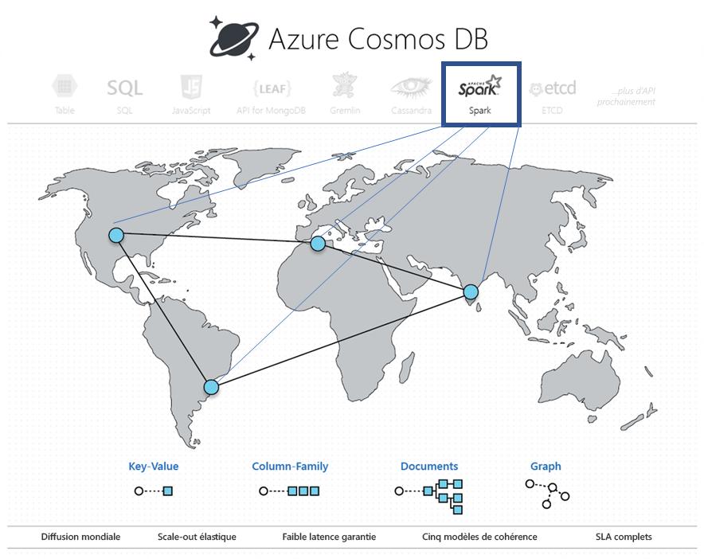

# Analytique opérationnelle intégrée dans Azure Cosmos DB avec Apache Spark (préversion) 

La prise en charge intégrée d’Apache Spark dans Azure Cosmos DB permet d’exécuter des tâches d’analytique à partir d’Apache Spark sur des données stockées dans un compte Azure Cosmos. Gérés de manière native, les travaux Apache Spark s’exécutent directement sur des bases de données Cosmos réparties dans le monde entier. Grâce à ces fonctionnalités, les développeurs, les ingénieurs de données et les chercheurs de données peuvent utiliser Azure Cosmos DB en guise de plateforme de données flexible, évolutive et performante pour exécuter des charges de travail **OLTP et OLAP/HTAP**. 

> [!NOTE]
> La prise en charge intégrée d’Apache Spark dans Azure Cosmos DB est actuellement en préversion limitée. Pour vous inscrire à la préversion, accédez à la page d’[inscription à la préversion](https://portal.azure.com/?feature.customportal=false#create/Microsoft.DocumentDB). 

La prise en charge d’Apache Spark dans Azure Cosmos DB offre les avantages suivants :

* Vous pouvez bénéficier du temps d’analyse le plus court pour les utilisateurs et les données distribués géographiquement.

* Vous pouvez simplifier l’architecture de votre solution et abaisser le [Coût Total de possession](total-cost-ownership.md) (TCO). Le système utilise le plus petit nombre de composants de traitement des données et évite tout déplacement inutile de données entre ceux-ci.

* Il crée une [sécurité](secure-access-to-data.md), une [conformité](compliance.md)et une limite l’audit qui englobent toutes les données gérées.

* Il fournit une analytique d’utilisateur final toujours activée ou [hautement disponible](high-availability.md) adossée à des contrats de niveau de service (SLA) stricts.

 
Grâce à la prise en charge d’Apache Spark dans Azure Cosmos DB, vous pouvez créer et déployer différents types de solutions : modèles d’intelligence artificielle et de Deep Learning, analytique prédictive, recommandations, IoT, vue à 360° des clients, détection des fraudes, analyse des sentiments d’un texte, analyse de parcours de visite, etc. Ces solutions fonctionnent directement sur des données Azure Cosmos DB.

Vous pouvez configurer une tâche ETL de traitement et diffusion en continu dans Azure Cosmos DB, sans avoir à sortir du service de base de données ou à ajouter des services de calcul. Vous pouvez augmenter de façon élastique l’échelle de l’environnement de calcul lorsque vous devez effectuer une tâche ETL, puis réduire l’échelle une fois la tâche terminée.

La prise en charge d’Apache Spark dans Azure Cosmos DB permet de gérer le Machine Learning de manière intégrée dans les runtimes Apache Spark. Les runtimes incluent Spark MLLib, Microsoft Machine Learning pour Spark, Azure Machine Learning et Cognitive Services. Avec ces fonctionnalités, les chercheurs de données, les ingénieurs de données et les analystes de données peuvent créer et rendre opérationnels des modèles de Machine Learning directement dans Azure Cosmos DB, en un rien de temps et à peu de frais.

## Principaux avantages

### Analytique opérationnelle et intelligence artificielle à faible latence distribuées globalement

Avec Apache Spark sur la base de données Azure Cosmos distribuée globalement, vous pouvez désormais bénéficier d’analyses rapides partout dans le monde. Azure Cosmos DB permet d’effectuer des tâches d’**analytique opérationnelle à faible latence distribuée globalement** à une échelle élastique en recourant à trois techniques clés :

* Dans la mesure où votre base de données Azure Cosmos est distribuée globalement, toutes les données sont ingérées localement là où se trouvent leurs producteurs (par exemple, des utilisateurs). Les requêtes sont traitées par rapport aux réplicas locaux les plus proches des producteurs et consommateurs de données, quel que soit l’endroit où ils se trouvent dans le monde. 

* Toutes vos requêtes analytiques sont exécutées directement sur les données stockées indexées dans les partitions de données sans que cela nécessite de déplacement inutile de données. 

* Spark étant colocalisé avec Azure Cosmos DB, les translations intermédiaires et déplacements de données sont moins nombreux, ce qui contribue à améliorer les performances et l’extensibilité.

### Expérience serverless unifiée pour Apache Spark

En tant que base de données multimodèle, Azure Cosmos DB étend désormais sa prise en charge des API OSS en offrant une **expérience serverless unifiée pour Apache Spark** avec des modèles de données sous forme de paires clé-valeur, de documents, de graphiques et de familles de colonnes. Différents modèles de données sont pris en charge à l’aide de MongoDB, de Cassandra, de Gremlin, d’Etcd et d’API SQL, opérant tous sur les mêmes données sous-jacentes. 

Grâce à la prise en charge d’Apache Spark dans Azure Cosmos DB, vous pouvez gérer de manière native les applications écrites en Scala, Python et Java et utiliser plusieurs bibliothèques étroitement intégrées pour SQL. Ces bibliothèques sont ([Spark SQL](https://spark.apache.org/sql/)), Machine Learning (Spark [MLlib](https://spark.apache.org/mllib/)), traitement de flux de données ([Spark Structured Streaming](https://spark.apache.org/streaming/)) et traitement graphique (Spark [GraphFrames]( https://docs.databricks.com/spark/latest/graph-analysis/graphframes/user-guide-python.html)). Ces outils facilitent l’utilisation d’Apache Spark pour de nombreux cas d’usage. Vous n’avez pas à gérer Spark ou les clusters Spark. Vous pouvez utiliser les API Apache Spark et les **blocs-notes Jupyter** bien connus pour l’analytique, et l’API SQL ou toute API NoSQL OSS telle que Cassandra pour le traitement transactionnel des mêmes données sous-jacentes en même temps.

### Aucune gestion des schémas ou des index

À la différence des bases de données analytiques traditionnelles, avec Azure Cosmos DB, les ingénieurs de données et les chercheurs des données n’ont plus besoin de se soucier de la gestion fastidieuse des schémas et des index. Le moteur de base de données dans Azure Cosmos DB ne nécessite aucune gestion de schéma ou d’index explicite, et il est capable d’indexer automatiquement toutes les données qu’il ingère pour traiter rapidement les requêtes Apache Spark. 

### Choix de cohérence

Les tâches Apache Spark étant exécutées dans les partitions de données de votre base de données Azure Cosmos, les requêtes obtiennent les [cinq choix de cohérence bien définis](consistency-levels.md). Ces modèles de cohérence offrent la possibilité de choisir une cohérence stricte afin de produire les résultats les plus précis pour les algorithmes de Machine Learning sans compromettre la latence et la haute disponibilité. 

### Contrats SLA

Les tâches Apache Spark bénéficient des avantages d’Azure Cosmos DB, tels que des [contrats de niveau de service](https://azure.microsoft.com/support/legal/sla/documentdb/v1_1/) (SLA) complets à la pointe du secteur (99,999), sans aucune surcharge liée à la gestion de clusters Apache Spark distincts. Ces contrats de niveau de service englobent le débit, la latence au 99e centile, la cohérence et la haute disponibilité. 

### Charges de travail mixtes

L’intégration d’Apache Spark dans Azure Cosmos DB comble la séparation entre les opérations transactionnelles et analytiques, qui constituait l’une des principales pierres d’achoppement rencontrées par les clients lors de la création d’applications natives dans le cloud à l’échelle globale. 

## Étapes suivantes

* Pour en savoir plus sur les avantages d’Azure Cosmos DB, voir l’article [Vue d’ensemble](introduction.md).
* [Bien démarrer avec l’API Azure Cosmos DB pour MongoDB](mongodb-introduction.md)
* [Prise en main de l’API Cassandra Azure Cosmos DB](cassandra-introduction.md)
* [Prise en main de l’API Gremlin Azure Cosmos DB](graph-introduction.md)
* [Prise en main de l’API Table Azure Cosmos DB](table-introduction.md)

