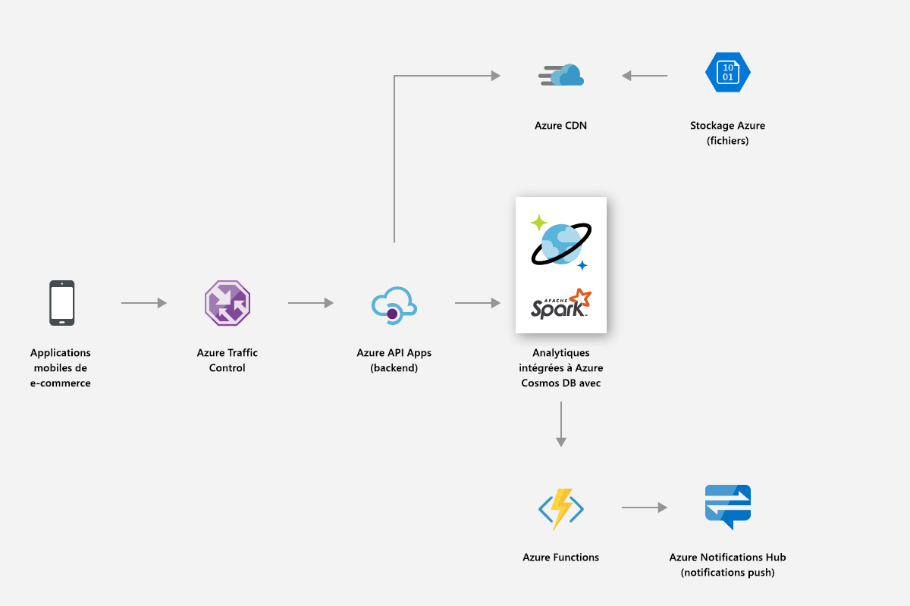
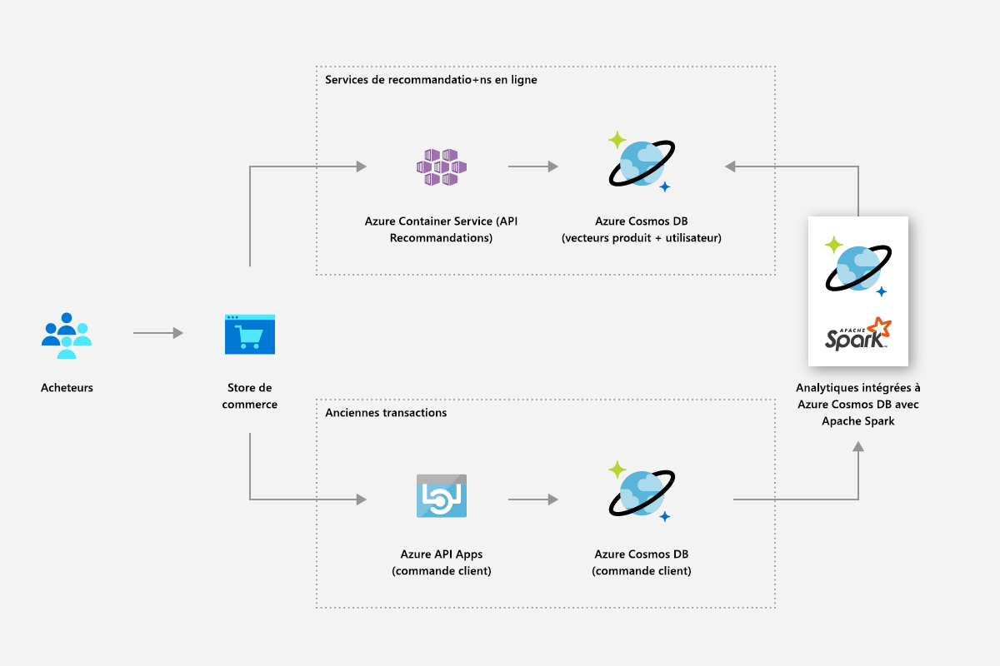
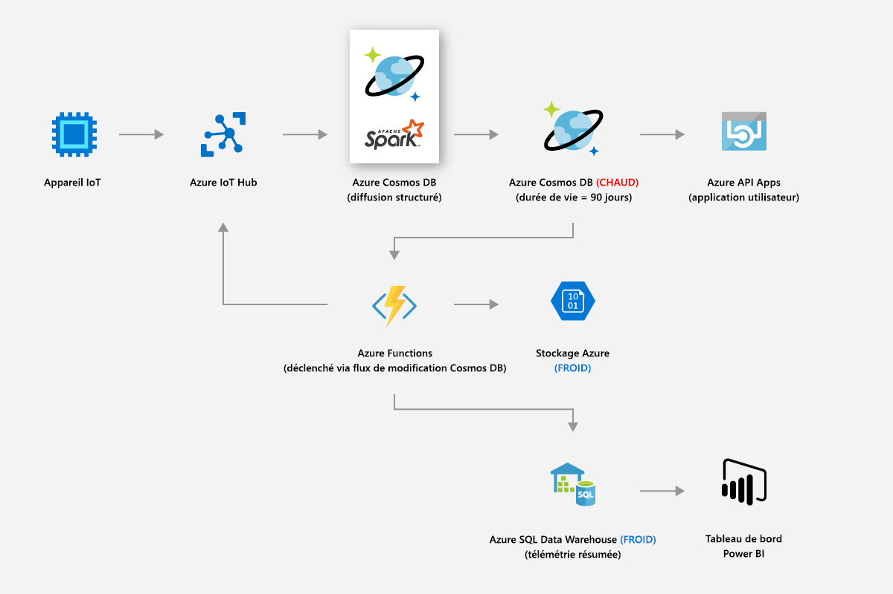
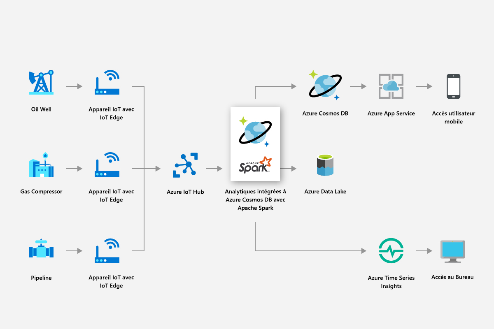
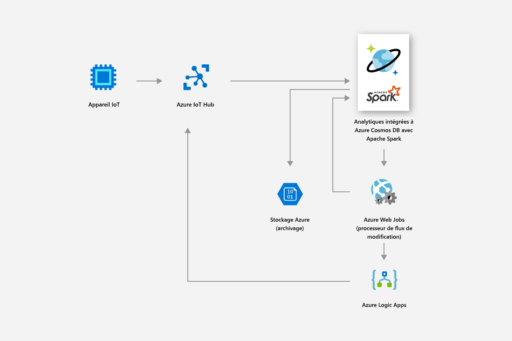
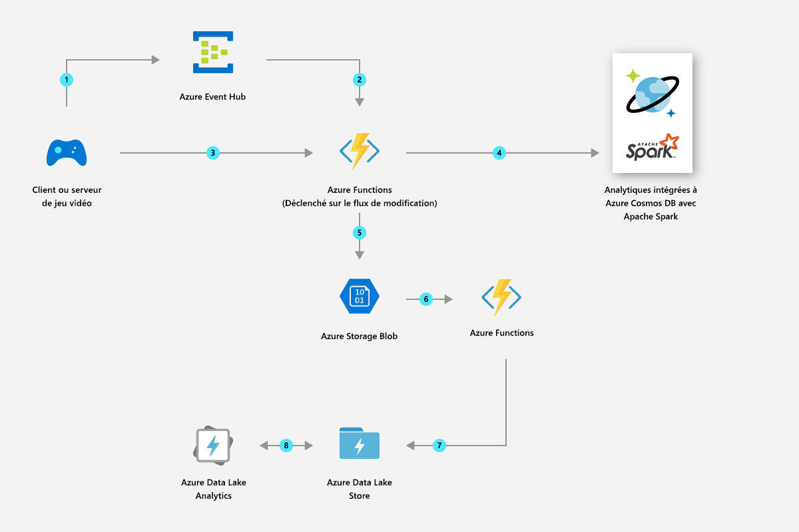

# Analytique opérationnelle intégrée dans Azure Cosmos DB avec Apache Spark (préversion) 

La prise en charge intégrée d’Apache Spark dans Azure Cosmos DB permet d’exécuter des tâches d’analytique à partir d’Apache Spark sur des données stockées dans un compte Azure Cosmos. Gérés de manière native, les travaux Apache Spark s’exécutent directement sur des bases de données Cosmos réparties dans le monde entier. Grâce à ces fonctionnalités, les développeurs, les ingénieurs de données et les chercheurs de données peuvent utiliser Azure Cosmos DB en guise de plateforme de données flexible, évolutive et performante pour exécuter des charges de travail **OLTP et OLAP/HTAP**. 

Le calcul Spark est automatiquement disponible dans toutes les régions Azure associées à votre compte Azure Cosmos. Les travaux Spark utilisent la fonctionnalité multimaître le d’Azure Cosmos DB et peuvent écrire ou exécuter une requête sur les réplicas locaux dans chaque région. 

> [!NOTE]
> La prise en charge intégrée d’Apache Spark dans Azure Cosmos DB est actuellement en préversion limitée. Pour vous inscrire à la préversion, accédez à la [page d’inscription à la préversion](https://portal.azure.com/?feature.customportal=false#create/Microsoft.DocumentDB). 

La prise en charge d’Apache Spark dans Azure Cosmos DB offre les avantages suivants :

* Vous pouvez bénéficier du temps d’analyse le plus court pour les utilisateurs et les données distribués géographiquement.

* Vous pouvez simplifier l’architecture de votre solution et abaisser le [Coût Total de possession](total-cost-ownership.md) (TCO). Le système utilise le plus petit nombre de composants de traitement des données et évite tout déplacement inutile de données entre ceux-ci.

* Il crée une [sécurité](secure-access-to-data.md), une [conformité](compliance.md)et une limite l’audit qui englobent toutes les données gérées.

* Il fournit une analytique d’utilisateur final toujours activée ou [hautement disponible](high-availability.md) adossée à des contrats de niveau de service (SLA) stricts.

 
Grâce à la prise en charge d’Apache Spark dans Azure Cosmos DB, vous pouvez créer et déployer différents types de solutions : modèles d’intelligence artificielle et de Deep Learning, analytique prédictive, recommandations, IoT, vue à 360° des clients, détection des fraudes, analyse des sentiments d’un texte, analyse de parcours de visite, etc. Ces solutions fonctionnent directement sur des données Azure Cosmos DB.

Vous pouvez configurer une tâche ETL de traitement et diffusion en continu dans Azure Cosmos DB, sans avoir à sortir du service de base de données ou à ajouter des services de calcul. Vous pouvez augmenter de façon élastique l’échelle de l’environnement de calcul lorsque vous devez effectuer une tâche ETL, puis réduire l’échelle une fois la tâche terminée.

La prise en charge d’Apache Spark dans Azure Cosmos DB permet de gérer le Machine Learning de manière intégrée dans les runtimes Apache Spark. Les runtimes incluent Spark MLLib, Microsoft Machine Learning pour Spark, Azure Machine Learning et Cognitive Services. Avec ces fonctionnalités, les chercheurs de données, les ingénieurs de données et les analystes de données peuvent créer et rendre opérationnels des modèles de Machine Learning directement dans Azure Cosmos DB, en un rien de temps et à peu de frais.

## Principaux avantages

### Analytique opérationnelle et intelligence artificielle à faible latence distribuées globalement

Avec Apache Spark sur la base de données Azure Cosmos distribuée globalement, vous pouvez désormais bénéficier d’analyses rapides partout dans le monde. Azure Cosmos DB permet d’effectuer des tâches d’**analytique opérationnelle à faible latence distribuée globalement** à une échelle élastique en recourant à trois techniques clés :

* Dans la mesure où votre base de données Azure Cosmos est distribuée globalement, toutes les données sont ingérées localement là où se trouvent leurs producteurs (par exemple, des utilisateurs). Les requêtes sont traitées par rapport aux réplicas locaux les plus proches des producteurs et consommateurs de données, quel que soit l’endroit où ils se trouvent dans le monde. 

* Toutes vos requêtes analytiques sont exécutées directement sur les données stockées indexées dans les partitions de données sans que cela nécessite de déplacement inutile de données. 

* Spark étant colocalisé avec Azure Cosmos DB, les translations intermédiaires et déplacements de données sont moins nombreux, ce qui contribue à améliorer les performances et l’extensibilité.

### Expérience serverless unifiée pour Apache Spark

En tant que base de données multimodèle, Azure Cosmos DB étend désormais sa prise en charge des API OSS en offrant une **expérience serverless unifiée pour Apache Spark** avec des modèles de données sous forme de paires clé-valeur, de documents, de graphiques et de familles de colonnes. Différents modèles de données sont pris en charge à l’aide de MongoDB, de Cassandra, de Gremlin, d’Etcd et d’API SQL, opérant tous sur les mêmes données sous-jacentes. 

Grâce à la prise en charge d’Apache Spark dans Azure Cosmos DB, vous pouvez gérer de manière native les applications écrites en Scala, Python et Java et utiliser plusieurs bibliothèques étroitement intégrées pour SQL. Ces bibliothèques sont ([Spark SQL](https://spark.apache.org/sql/)), Machine Learning (Spark [MLlib](https://spark.apache.org/mllib/)), traitement de flux de données ([Spark Structured Streaming](https://spark.apache.org/streaming/)) et traitement graphique (Spark [GraphFrames]( https://docs.databricks.com/spark/latest/graph-analysis/graphframes/user-guide-python.html)). Ces outils facilitent l’utilisation d’Apache Spark pour de nombreux cas d’usage. Vous n’avez pas à gérer Spark ou les clusters Spark. Vous pouvez utiliser les API Apache Spark et les **blocs-notes Jupyter** bien connus pour l’analytique, et l’API SQL ou toute API NoSQL OSS telle que Cassandra pour le traitement transactionnel des mêmes données sous-jacentes en même temps.

### Aucune gestion des schémas ou des index

À la différence des bases de données analytiques traditionnelles, avec Azure Cosmos DB, les ingénieurs de données et les chercheurs des données n’ont plus besoin de se soucier de la gestion fastidieuse des schémas et des index. Le moteur de base de données dans Azure Cosmos DB ne nécessite aucune gestion de schéma ou d’index explicite, et il est capable d’indexer automatiquement toutes les données qu’il ingère pour traiter rapidement les requêtes Apache Spark. 

### Choix de cohérence

Les tâches Apache Spark étant exécutées dans les partitions de données de votre base de données Azure Cosmos, les requêtes obtiennent les [cinq choix de cohérence bien définis](consistency-levels.md). Ces modèles de cohérence offrent la possibilité de choisir une cohérence stricte afin de produire les résultats les plus précis pour les algorithmes de Machine Learning sans compromettre la latence et la haute disponibilité. 

### Contrats SLA complets

Les tâches Apache Spark bénéficient des avantages d’Azure Cosmos DB, tels que des [contrats de niveau de service](https://azure.microsoft.com/support/legal/sla/documentdb/v1_1/) (SLA) complets à la pointe du secteur (99,999), sans aucune surcharge liée à la gestion de clusters Apache Spark distincts. Ces contrats de niveau de service englobent le débit, la latence au 99e centile, la cohérence et la haute disponibilité. 

### Charges de travail mixtes

L’intégration d’Apache Spark dans Azure Cosmos DB comble la séparation entre les opérations transactionnelles et analytiques, qui constituait l’une des principales pierres d’achoppement rencontrées par les clients lors de la création d’applications natives dans le cloud à l’échelle globale. 

## Scénarios de prise en charge de Spark dans Azure Cosmos DB

### Vente au détail et produits de consommation courante

Vous pouvez utiliser la prise en charge de Spark dans Azure Cosmos DB pour fournir des recommandations et des offres en temps réel. Vous pouvez aider les clients à découvrir les éléments dont ils auront besoin avec des recommandations de personnalisation et de produit en temps réel.

* Vous pouvez utiliser la prise en charge intégrée du Machine Learning fournie par le runtime Apache Spark pour générer des recommandations en temps réel parmi les catalogues de produits.

* Vous pouvez explorer les données de flux de clics, les données d’achats et les données client pour fournir des recommandations ciblées qui procurent une valeur tout au long du cycle de vie.

* Grâce à la fonctionnalité de distribution mondiale d’Azure Cosmos DB, des volumes élevés de données de produits répartis entre les régions peuvent être analysés en quelques millisecondes.

* Vous pouvez obtenir rapidement des informations pour les utilisateurs et les données distribués géographiquement. Vous pouvez améliorer le taux de conversion des promotions en proposant la bonne publicité à l’utilisateur approprié au bon moment.

* Vous pouvez tirer parti de la fonctionnalité de streaming intégrée de Spark pour enrichir les données actives en les combinant à des données client statiques. De cette façon, vous pouvez fournir des publicités plus personnalisées et ciblées en temps réel et dans le contexte de ce que font les clients.

L’illustration suivante montre comment la prise en charge de Spark dans Azure Cosmos DB est utilisée pour optimiser la tarification et les promotions :

L’illustration suivante montre comment la prise en charge de Spark dans Azure Cosmos DB est utilisée dans le moteur de recommandations en temps réel :

### Fabrication et IoT

La plateforme d’analytique intégrée d’Azure Cosmos DB vous permet d’activer l’analyse en temps réel des données IoT à partir de millions d’appareils à l’échelle mondiale. Vous pouvez implémenter des innovations modernes telles que la prédiction de modèles météorologiques, l’analyse prédictive et les optimisations d’énergie.

* Grâce à Azure Cosmos DB, vous pouvez explorer des données telles que des métriques de ressources en temps réel et des facteurs météorologiques, puis appliquer une analytique de grille intelligente pour optimiser les performances des appareils connectés dans le champ. L’analytique de grille intelligente est essentielle au contrôle des coûts d’exploitation, à l’amélioration de la fiabilité de la grille et à la fourniture de services d’énergie personnalisés aux consommateurs.

L’illustration suivante montre comment la prise en charge de Spark dans Azure Cosmos DB est utilisée pour lire des métriques à partir d’appareils IoT et appliquer l’analytique de grille intelligente :

### Maintenance prédictive

* La gestion des ressources telles que les compresseurs utilisés dans les petites plateformes de forage comme dans les plateformes très profondes est un effort complexe. Ces ressources sont situées dans le monde entier et génèrent plusieurs pétaoctets de données. Avec Azure Cosmos DB, vous pouvez créer un pipeline de données prédictif de bout en bout qui utilise le streaming Spark pour traiter de grandes quantités de données de télémétrie de capteur, des parties de ressources de magasins et des données de mappages de capteurs.

* Vous pouvez créer et déployer des modèles de Machine Learning pour prédire les défaillances de ressources avant qu’elles ne se produisent, et émettre des ordres de travail de maintenance avant que la défaillance ne se produise.

L’illustration suivante montre comment la prise en charge de Spark dans Azure Cosmos DB est utilisée pour créer un système de maintenance prédictive :

L’illustration suivante montre comment la prise en charge de Spark dans Azure Cosmos DB est utilisée pour créer un système de diagnostic de véhicule en temps réel :

### Jeux

* Avec la prise en charge intégrée de Spark, Azure Cosmos DB vous permet de créer, de mettre à l’échelle et de déployer facilement une analytique avancée et des modèles de Machine Learning en quelques minutes, afin de créer la meilleure expérience de jeu possible.

* Vous pouvez analyser les données relatives aux joueurs, aux achats et aux comportements afin de créer des offres personnalisées pertinentes et atteindre des taux de conversion élevés.

* Avec le Machine Learning Spark, vous pouvez analyser et obtenir des Insights sur les données de télémétrie de jeu. Vous pouvez diagnostiquer et prévenir les lenteurs de chargement et les problèmes de jeu.

L’illustration suivante montre comment la prise en charge de Spark par Azure Cosmos DB est utilisée dans l’analytique de jeu :

## Prise en charge intégrée des blocs-notes Jupyter

Azure Cosmos DB prend en charge les notebooks Jupyter intégrés pour toutes les API telles que Cassandra, MongoDB, SQL, Gremlin et Table. Les notebooks Jupyter s’exécutent dans les comptes Azure Cosmos et améliorent l’expérience du développeur. La prise en charge de blocs-notes intégrée pour toutes les API et tous les modèles de données Azure Cosmos DB vous permet d’exécuter les requêtes de manière interactive. Vous pouvez également exécuter des modèles Machine Learning et analyser les données stockées dans vos bases de données Azure Cosmos. Avec l’expérience de bloc-notes Jupyter, vous pouvez analyser les données stockées, créer et former des modèles Machine Learning, et effectuer des inférences sur les données dans le portail Azure comme le montre l’illustration ci-dessous :

## Étapes suivantes

* Pour en savoir plus sur les avantages d’Azure Cosmos DB, voir l’article [Vue d’ensemble](introduction.md).
* [Bien démarrer avec l’API Azure Cosmos DB pour MongoDB](mongodb-introduction.md)
* [Bien démarrer avec l’API Cassandra Azure Cosmos DB](cassandra-introduction.md)
* [Bien démarrer avec l’API Gremlin Azure Cosmos DB](graph-introduction.md)
* [Bien démarrer avec l’API Table Azure Cosmos DB](table-introduction.md)

