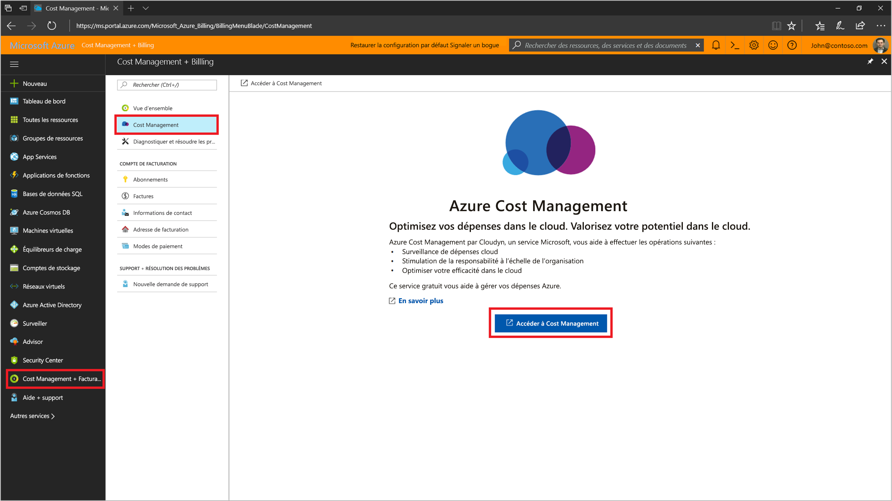
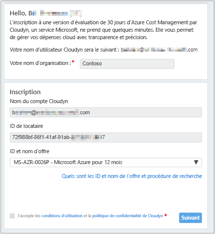
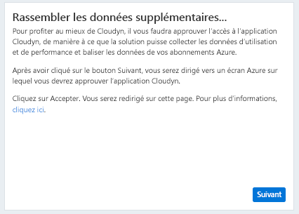
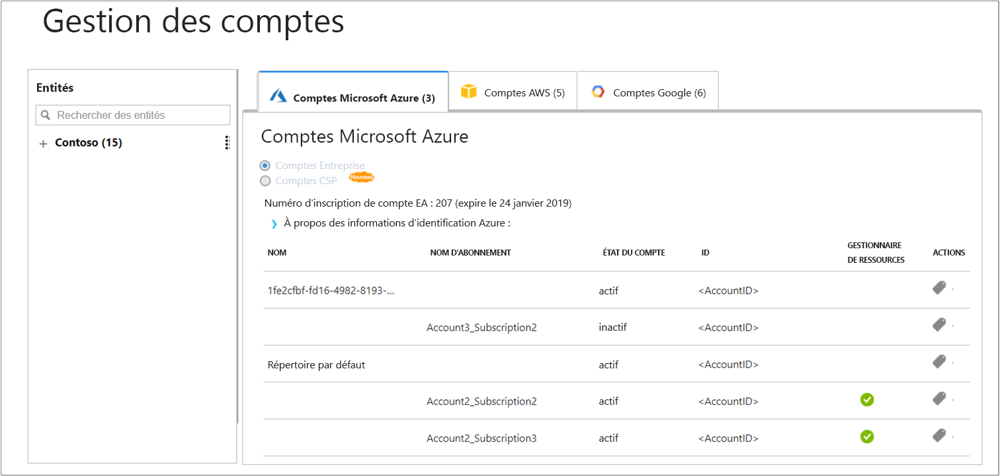

# Inscrire un abonnement Azure individuel et afficher les données de coût

Utilisez votre abonnement Azure pour l’inscrire auprès de Cloudyn. Votre inscription vous donne accès au portail Cloudyn. Ce guide de démarrage rapide décrit le processus d’inscription nécessaire pour créer un abonnement d’évaluation Cloudyn et vous connecter au portail Cloudyn. Il explique également comment afficher immédiatement des données de coût.

## Connexion à Azure

- Connectez-vous au portail Azure sur https://portal.azure.com.

## S’inscrire à Cloudyn

1. Dans le portail Azure, cliquez sur **Gestion des coûts + Facturation** dans la liste des services.
2. Sous **Vue d’ensemble**, cliquez sur **Cloudyn**  
    
3. Dans la page **Gestion des coûts**, cliquez sur **Accéder à Cloudyn** pour ouvrir la page d’inscription de Cloudyn dans une nouvelle fenêtre.
4. Sur la page d’inscription à une évaluation du portail Cloudyn, tapez le nom de votre société, sélectionnez **Azure Individual Subscription Owner** (Propriétaire d’abonnement individuel Azure), puis cliquez sur **Next** (Suivant). Vos nom de compte et ID de client sont automatiquement ajoutés au formulaire.  
    
5. Sélectionnez les **Offer ID - Name** (ID d’offre - Nom) associés à votre abonnement. Si vous ignorez l’ID taux de votre abonnement, vous pouvez consulter votre facture Azure et rechercher **ID d’offre**.
6. Acceptez les conditions d’utilisation, validez vos informations, puis cliquez sur **Next** (Suivant).
7. Dans la page **Gather additional data**, (Collecter des données supplémentaires) cliquez sur **Next** (Suivant) pour autoriser Cloudyn à collecter des données concernant les ressources Azure. Les données collectées incluent les données d’utilisation, de performances, de facturation et de balise de vos abonnements.  
    
8. Votre navigateur vous conduit à la page de connexion à Cloudyn. Connectez-vous avec les informations d’identification de votre abonnement Azure.
9. Cliquez sur **Go to Cloudyn** (Accéder à Cloudyn) pour ouvrir le portail Cloudyn, puis, dans la page **Accounts Management** (gestion des comptes), vous devriez voir les informations de compte de votre abonnement Azure.  
    

Pour regarder la vidéo d’un tutoriel sur l’inscription de votre abonnement Azure, consultez [Finding your Directory GUID and Rate ID for use in Cloudyn](https://youtu.be/PaRjnyaNGMI).

[!INCLUDE [cost-management-create-account-view-data](../../../includes/cost-management-create-account-view-data.md)]

## Étapes suivantes

Dans ce guide de démarrage rapide, vous avez utilisé les informations de votre abonnement Azure pour vous inscrire auprès de Cloudyn. Vous vous êtes également connecté au portail Cloudyn et avez affiché des données de coût. Pour en savoir plus sur Cloudyn, suivez le tutoriel sur Cloudyn.

> [!div class="nextstepaction"]
> [Réviser l’utilisation et les coûts](tutorial-review-usage.md)
