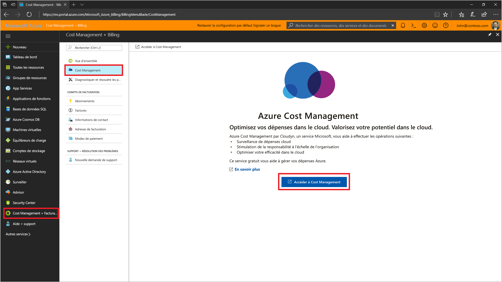
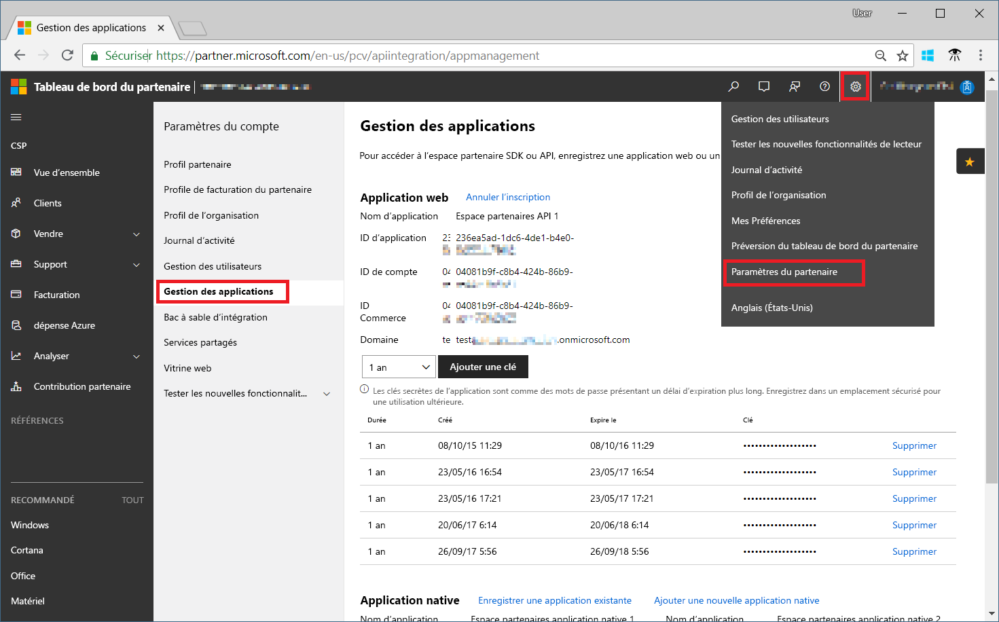
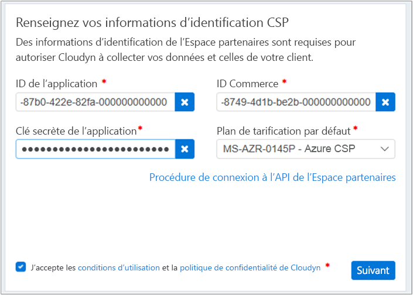

# S’inscrire au programme pour les partenaires CSP et afficher les données de coût

En tant que partenaire CSP, vous pouvez vous inscrire à Cloudyn. Votre inscription vous donne accès au portail Cloudyn. Ce guide de démarrage rapide décrit le processus d’inscription nécessaire pour créer un abonnement d’évaluation Cloudyn et vous connecter au portail Cloudyn. Il explique également comment afficher immédiatement des données de coût.

> [!NOTE]
>
> Seuls les partenaires CSP Direct et les fournisseurs CSP Indirect peuvent effectuer une inscription Cloudyn.
>
> La configuration de l’API Partner Center est nécessaire pour l’authentification et l’accès aux données. Un compte d’administrateur général Partner Center est nécessaire pour provisionner l’accès à l’API.
> Pour plus d’informations, consultez [Se connecter à l’API Espace partenaires](https://msdn.microsoft.com/library/partnercenter/mt709136.aspx).
>
> L’accès à Cloudyn peut être mis à disposition par les revendeurs CSP Indirect une fois que leur fournisseur CSP Indirect s’est inscrit à Cloudyn. Les revendeurs CSP Indirect peuvent ensuite fournir l’accès à Cloudyn aux clients et abonnements Azure.
>
>Cloudyn est conforme au modèle d’application sécurisée de Microsoft. Pour plus d’informations, consultez [Activation du framework de modèle d’application sécurisée](/partner-center/develop/enable-secure-app-model).

## Connexion à Azure

- Connectez-vous au portail Azure sur [https://portal.azure.com](https://portal.azure.com).

## S’inscrire à Cloudyn

1. Dans le portail Azure, cliquez sur **Gestion des coûts + Facturation** dans la liste des services.
2. Sous **Vue d’ensemble**, cliquez sur **Cloudyn**  
    
3. Dans la page **Cloudyn**, cliquez sur **Accéder à Cloudyn** pour ouvrir la page d’inscription de Cloudyn dans une nouvelle fenêtre.
4. Sur la page d’inscription à une évaluation du portail Cloudyn, tapez le nom de votre société, sélectionnez l’option d’**administrateur de programme partenaire CSP Microsoft** et cliquez sur **Suivant**.  
5. Entrez un **ID d’application**, un **ID de commerce** et une **clé secrète d’application**, puis sélectionnez le **plan tarifaire par défaut**. Si vous n’avez pas les informations nécessaires à portée de main, connectez-vous au portail Espace partenaires à l’adresse  [https://partnercenter.microsoft.com](https://partnercenter.microsoft.com) avec votre compte d’administrateur principal et procédez comme suit :
   1. Accédez au **tableau de bord**, cliquez sur le symbole **Paramètres**, sur **Paramètres du partenaire**, puis sur **Gestion des applications**.
   2. Si vous avez déjà créé une application web, ignorez cette étape. Dans le cas contraire, cliquez sur **Ajouter une application Web** dans la section **Application web**.
   3. Copiez l’identificateur unique **ID d’application** à partir de votre application web.
   4. Copiez le GUID de **l’ID de commerce** à partir de votre application web.
   5. Sélectionnez la durée de validité de la clé, à savoir un ou deux ans, selon les besoins. Sélectionnez **Ajouter une clé**, puis copiez et enregistrez la valeur de la clé secrète.  
    
   6. Revenez à la page d’inscription Cloudyn et collez les informations.  
      
6. Acceptez les conditions d’utilisation, puis validez les informations. Cliquez sur **Next** (Suivant) pour autoriser Cloudyn à collecter des données de ressource Azure. Les données collectées incluent les données d’utilisation, de performances, de facturation et de balise de vos abonnements.  
7. L’option pour **inviter d’autres parties prenantes** permet d’ajouter des utilisateurs en tapant leurs adresses e-mail. Lorsque vous avez terminé, cliquez sur **Suivant**. L’ajout de toutes vos données de facturation à Cloudyn prend environ deux heures.
8. Cliquez sur le bouton d’**accès à Cloudyn** pour ouvrir le portail Cloudyn. La page de **gestion des comptes cloud** devrait alors afficher les informations de votre compte CSP inscrit.

## Configurer l’accès CSP indirect dans Cloudyn

Par défaut, l’API Espace partenaires est accessible uniquement aux fournisseurs de solutions Cloud (CSP, Cloud Solution Providers). Toutefois, un fournisseur CSP direct peut configurer l’accès pour ses clients ou partenaires CSP indirects à l’aide de groupes d’entités dans Cloudyn.

Pour activer l’accès pour les partenaires ou clients CSP indirects, suivez les étapes décrites dans [Inscription auprès de Cloudyn](#register-with-cloudyn) pour configurer une inscription d’évaluation. Effectuez les étapes suivantes pour segmenter les données CSP indirectes à l’aide de groupes d’entités Cloudyn. Ensuite, assignez les autorisations utilisateur appropriées pour les groupes d’entités.

1. Créez un groupe d’entités avec les informations fournies dans [Créer des entités](tutorial-user-access.md#create-and-manage-entities).
2. Suivez les étapes fournies dans [Assigning subscriptions to Cost Entities (Affectation d’abonnements à des entités de coût)](https://www.youtube.com/watch?v=d9uTWSdoQYo). Associez le compte du client CSP indirect et ses abonnements Azure à l’entité que vous avez créée.
3. Suivez les étapes fournies dans [Créer un utilisateur avec un accès administrateur](tutorial-user-access.md#create-a-user-with-admin-access) pour créer un compte d’utilisateur avec un accès administrateur. Ensuite, vérifiez que le compte d’utilisateur dispose d’un accès administrateur aux entités spécifiques que vous avez créées pour le compte indirect.

Les partenaires CSP indirects se connectent au portail Cloudyn à l’aide des comptes que vous avez créés pour eux.

[!INCLUDE [cost-management-create-account-view-data](../../../includes/cost-management-create-account-view-data.md)]

## Étapes suivantes

Dans ce guide de démarrage rapide, vous avez utilisé vos informations CSP pour vous inscrire à Cloudyn. Vous vous êtes également connecté au portail Cloudyn et avez affiché des données de coût. Pour en savoir plus sur Cloudyn, suivez le tutoriel sur Cloudyn.

> [!div class="nextstepaction"]
> [Réviser l’utilisation et les coûts](tutorial-review-usage.md)
