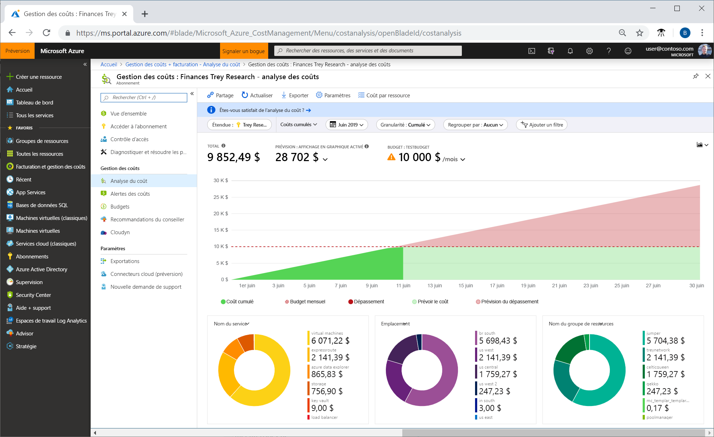
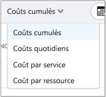
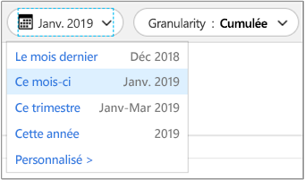
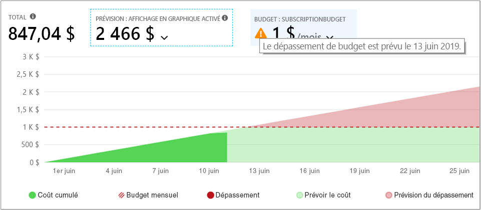
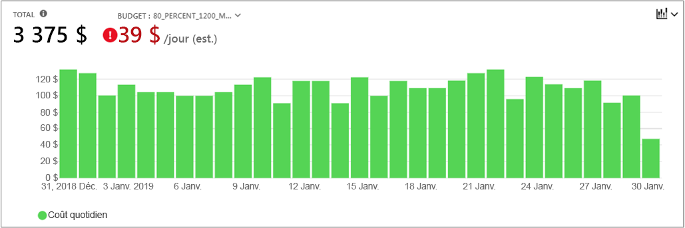
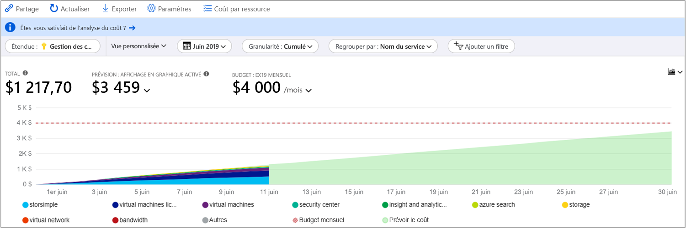
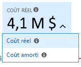
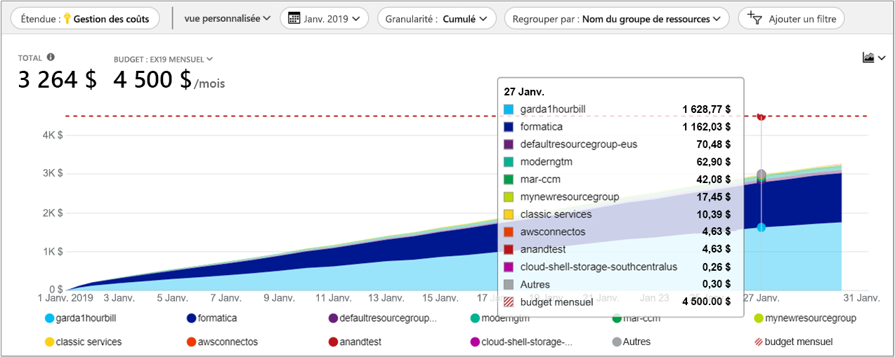
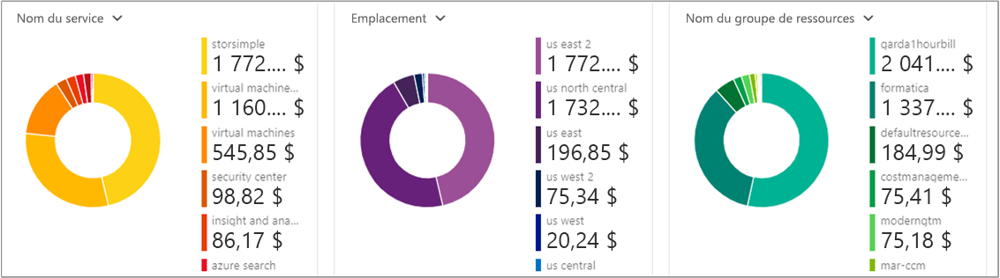
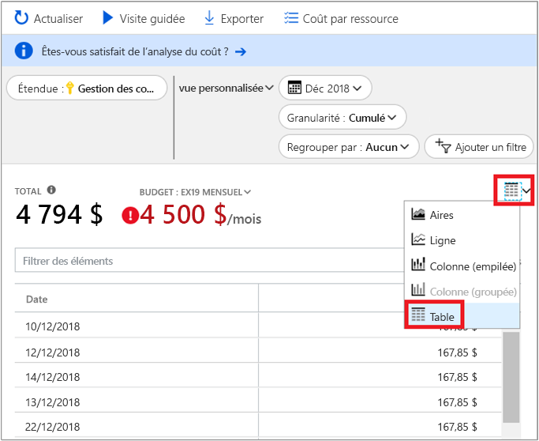

# <a name="quickstart-explore-and-analyze-costs-with-cost-analysis"></a>Démarrage rapide : Explorer et analyser les coûts avec l’analyse du coût

Pour pouvoir contrôler et optimiser vos coûts Azure correctement, vous devez comprendre d’où proviennent les coûts au sein de votre organisation. Il est également utile de connaître le coût de vos services, notamment en fonction des environnements et des systèmes. La visibilité de la totalité des coûts est essentielle pour comprendre avec précision les modèles de dépenses de l’organisation. Les modèles de dépenses peuvent être utilisés pour appliquer des mécanismes de maîtrise des coûts, comme les budgets.

Dans ce guide de démarrage rapide, vous utilisez l’analyse du coût pour explorer et analyser les coûts Azure de votre organisation. Vous pouvez voir les coûts agrégés par l’organisation afin de comprendre d’où ils viennent et d’identifier les tendances de dépenses. Vous pouvez aussi voir les coûts cumulés au fil du temps pour évaluer des tendances mensuelles, trimestrielles ou même annuelles par rapport à un budget. Un budget permet de faire respecter des contraintes financières. Il est aussi utilisé pour voir les coûts de chaque jour ou de chaque mois afin d’isoler les irrégularités dans les dépenses. De plus, vous pouvez télécharger les données du rapport actuel en vue de les analyser de manière plus approfondie ou de les utiliser dans un système externe.

Dans ce guide de démarrage rapide, vous apprenez à :

- Passer en revue les coûts dans l’analyse du coût
- Personnaliser les vues des coûts
- Télécharger les données de l’analyse du coût


## <a name="prerequisites"></a>Prérequis

L’analyse des coûts prend en charge différents types de comptes Azure. Pour accéder à la liste complète des types de comptes pris en charge, voir [Comprendre les données de Cost Management](understand-cost-mgt-data.md). Pour afficher les données de coût, vous avez au minimum besoin d’un accès en lecture pour votre compte Azure.

Pour les clients [Contrat Entreprise (EA)](https://azure.microsoft.com/pricing/enterprise-agreement/), vous devez disposer d’au moins un accès en lecture à une ou plusieurs des étendues suivantes pour afficher les données de coût.

- Compte de facturation
- department
- Compte d’inscription
- Groupe d’administration
- Subscription
- Resource group

Pour plus d’informations sur l’attribution de l’accès aux données Cost Management, consultez [Assigner l’accès aux données](assign-access-acm-data.md).

## <a name="sign-in-to-azure"></a>Connexion à Azure

- Connectez-vous au portail Azure sur https://portal.azure.com.

## <a name="review-costs-in-cost-analysis"></a>Passer en revue les coûts dans l’analyse du coût

Pour examiner vos coûts via la fonctionnalité d’analyse des coûts, ouvrez l’étendue dans le portail Azure et sélectionnez **Analyse du coût** dans le menu. Par exemple, accédez à **Abonnements**, sélectionnez un abonnement dans la liste, puis sélectionnez **Analyse du coût** dans le menu. Utilisez le paramètre **Étendue** pour passer à une autre étendue dans l’analyse des coûts. Pour plus d’informations sur les étendues, consultez [Comprendre et utiliser les étendues](understand-work-scopes.md).

L’étendue que vous sélectionnez est utilisée à travers Cost Management pour consolider les données et contrôler l’accès aux informations sur les coûts. Quand vous utilisez des étendues, vous n’opérez pas une sélection multiple. Au lieu de cela, vous sélectionnez une étendue plus grande qui en regroupe d'autres, puis vous filtrez jusqu'aux portées imbriquées dont vous avez besoin. Il est important de comprendre cette approche, car il est possible que certaines personnes n’aient pas accès à une étendue parente unique qui couvre plusieurs étendues imbriquées.

L’affichage initial de l’analyse du coût inclut les zones suivantes :

**Vue Coûts cumulés** : représente la configuration de la vue Coûts cumulés prédéfinie. Chaque vue comprend les options Plage de dates, Granularité, Regrouper par et Ajouter un filtre. La vue par défaut montre les coûts cumulés pour la période de facturation actuelle. Vous pouvez cependant choisir une autre vue intégrée. Pour plus d’informations, consultez [Personnaliser les vues des coûts](#customize-cost-views).

**Coût réel** : montre le total de l’utilisation et des coûts d’achat pour le mois en cours, tels qu’ils sont comptabilisés et qu’ils apparaissent sur votre facture.

**Prévision** : affiche le total des coûts prévisionnels pour la période de votre choix (l’option de prévision est en préversion).

**Budget** : indique la limite de dépenses planifiée pour l’étendue sélectionnée, si disponible.

**Granularité : Cumulés** : montre le total des dépenses quotidiennes cumulées, en partant du début de la période de facturation. Après avoir [créé un budget](tutorial-acm-create-budgets.md) pour votre compte de facturation ou votre abonnement, vous pouvez rapidement voir la tendance de vos dépenses par rapport au budget. Placez le curseur sur une date pour voir le coût cumulé de cette journée.

**(Graphiques croisés dynamiques (anneau)** – fournissent des tableaux croisés dynamiques où le coût total est détaillé par un ensemble commun de propriétés standard. Ils montrent les coûts, du plus élevé au plus faible, pour le mois en cours. Vous pouvez changer les graphiques croisés dynamiques à tout moment en sélectionnant un critère de croisement différent. Les coûts sont classés par : service (catégorie comptage), localisation (région) et étendue enfant par défaut. Par exemple, les comptes d’inscription sous les comptes de facturation, les groupes de ressources sous les abonnements et les ressources sous les groupes de ressources.



## <a name="customize-cost-views"></a>Personnaliser les vues des coûts

L’analyse des coûts dispose de quatre affichages intégrés, optimisés pour les objectifs les plus courants :

Affichage | Répondre aux questions comme...
--- | ---
Coûts cumulés | Combien ai-je dépensé jusqu’ici ce mois-ci ? Est-ce que je vais respecter mon budget ?
Coûts quotidiens | Y a-t-il eu une augmentation des coûts par jour pour les 30 derniers jours ?
Coût par service | Comment mon utilisation mensuelle a-t-elle varié sur les 3 dernières factures ?
Coût par ressource | Quelles ressources ont été les plus onéreuses jusqu’ici ce mois-ci ?



Toutefois, il existe de nombreux cas où vous avez besoin d’une analyse plus approfondie. La personnalisation démarre en haut de la page, avec la sélection de la date.

L’analyse du coût affiche les données du mois en cours par défaut. Utilisez le sélecteur de date pour passer rapidement à des plages de dates communes. Quelques exemples incluent les sept derniers jours, le mois dernier, l’année en cours ou une plage de dates personnalisée. Les abonnements de paiement à l’utilisation incluent également des plages de dates en fonction de votre période de facturation (qui n’est pas liée au mois calendaire), telles que la période de facturation actuelle ou la dernière facture. Utilisez les liens **< PRÉCÉDENT** et **SUIVANT >** en haut du menu pour accéder respectivement à la période précédente ou suivante. Par exemple, **< PRÉCÉDENT** bascule des sept derniers jours à 8 à 14 jours, puis à 15 à 21 jours.



L’analyse du coût montre les coûts **cumulés** par défaut. Les coûts cumulés incluent tous les coûts de chaque jour plus des jours précédents, pour obtenir une vue en évolution constante de vos coûts quotidiens cumulés. Cette vue est optimisée pour montrer les tendances par rapport à un budget pendant l’intervalle de temps sélectionné.

La vue de graphique de la prévision vous permet d’identifier les dépassements de budget potentiels. Lorsqu’une possibilité de dépassement du budget est détectée, les dépenses excédentaires prévues sont affichées en rouge. Un indicateur s’affiche également dans le graphique. Lorsque vous placez le curseur sur cet indicateur, la date estimée du dépassement de budget s’affiche.



Il existe aussi la vue **quotidienne** qui montre les coûts de chaque jour. La vue quotidienne n’affiche pas de tendance géométrique. Elle est conçue pour montrer les irrégularités comme les pics ou les chutes de dépenses de chaque jour. Si vous avez sélectionné un budget, la vue quotidienne indique aussi une estimation de ce à quoi peut ressembler votre budget quotidien. Quand vos coûts quotidiens sont constamment au-dessus du budget quotidien estimé, vous pouvez vous attendre à exploser votre budget mensuel. Le budget quotidien estimé est simplement un moyen pour vous aider à visualiser votre budget à un niveau inférieur. Si les coûts quotidiens présentent des fluctuations, la comparaison du budget quotidien estimé au budget mensuel est moins précise.

Voici une vue des dépenses récentes jour après jour, où la prévision des dépenses est activée.


Lorsque la prévision des dépenses est activée, vous ne voyez pas les dépenses qui sont prévues. En outre, lorsque vous regardez les coûts des périodes passées, les prévisions ne s’affichent pas non plus.

En général, attendez-vous à voir des données ou des notifications correspondant aux ressources utilisées dans les 8 à 12 heures suivantes.


**Regrouper par** propriétés communes pour ventiler les coûts et d’identifier les principaux contributeurs. Pour regrouper par balises de ressources, par exemple, sélectionnez la clé de balise d’après laquelle vous souhaitez effectuer le regroupement. Les coûts sont ventilés selon la valeur de chaque balise, avec un segment supplémentaire pour les ressources auxquelles cette balise n’a pas été appliquée.

La plupart des [ressources Azure prennent en charge l’étiquetage](../azure-resource-manager/tag-support.md), mais certaines étiquettes ne sont pas disponibles pour la gestion des coûts et la facturation. Par ailleurs, les étiquettes de groupe de ressources ne sont pas prises en charge. Cost Management prend uniquement en charge les étiquettes de ressources à compter de la date à laquelle les étiquettes sont appliquées directement à la ressource. Regardez la vidéo [Comment examiner les stratégies de balises avec Azure Cost Management](https://www.youtube.com/watch?v=nHQYcYGKuyw) pour découvrir comment utiliser la stratégie de balises Azure pour améliorer la visibilité des données de coûts.

Voici une vue des coûts des services Azure pour le mois en cours.



Par défaut, l’analyse des coûts montre tous les coûts liés aux achats et à l’utilisation, tels qu’ils sont comptabilisés et qu’ils apparaissent sur votre facture. C’est ce qu’on appelle également le **coût réel**. L’affichage du coût réel est idéal pour le rapprochement de vos factures. Toutefois, les pics de dépenses peuvent être alarmants si vous surveillez les anomalies liées aux dépenses. Pour aplanir les pics de dépenses causés par les achats de réservation, basculez vers la vue **Coût amorti**. 



La vue Coût amorti répartit les achats de réservation jour par jour et les étale sur toute la durée de la réservation. Par exemple, au lieu de voir un achat d’un montant de 365 $ le 1er janvier, vous verrez un achat de 1 $ chaque jour, du 1er janvier au 31 décembre. En plus de l’amortissement de base, ces coûts sont également réaffectés et associés aux ressources qui ont utilisé la réservation. Par exemple, si cette dépense quotidienne de 1 $ a été répartie sur deux machines virtuelles, vous verrez deux dépenses de 0,50 $ pour la journée. Si une partie de la réservation n’est pas utilisée durant la journée, vous verrez une dépense de 0,50 $ associée à la machine virtuelle applicable, et une autre dépense de 0,50 $ de type `UnusedReservation`. Notez que les coûts liés aux réservations non utilisées ne sont affichés que dans la vue Coût amorti.

Étant donné que la représentation des coûts a changé, il est important de noter que les vues Coût réel et Coût amorti affichent des totaux différents. En règle générale, le coût total d’un achat de réservation étalé sur plusieurs mois diminue lorsque vous affichez les coûts amortis, et les coûts augmentent au cours des mois qui suivent un achat de réservation. L’amortissement est disponible uniquement pour les achats de réservation et ne s’applique pas aux achats effectués sur la Place de marché.

L’image suivante montre les noms des groupes de ressources. Vous pouvez effectuer un regroupement par étiquette pour afficher les coûts totaux en fonction de l’étiquette, ou utiliser la vue **Coût par ressource** pour afficher toutes les étiquettes d’une ressource en particulier.



Lorsque vous regroupez les coûts en fonction d’un attribut spécifique, les 10 principaux contributeurs aux coûts s’affichent dans l’ordre décroissant. S’il y en a plus de 10, les neuf principaux contributeurs aux coûts sont affichés avec un groupe **Autres** qui réunit tous les groupes restants. Lors du regroupement par étiquettes, vous pouvez aussi voir un groupe **Non étiqueté** pour les coûts auxquels la clé d’étiquette n’a pas été appliquée. **Sans balise** est toujours mentionné en dernier, même si les coûts sans balise sont plus élevés que ceux avec balise. Les coûts sans balise font partie du groupe **Autres** s’il y a 10 valeurs de balise ou plus.

Les ressources de machines virtuelles, de réseau et de stockage *classiques* ne partagent pas de données de facturation détaillées. Elles sont fusionnées dans les **services Classic** lors du regroupement des coûts.

Les graphiques croisés dynamiques sous le graphique principal affichent différents regroupements pour vous donner une vue d’ensemble de vos coûts globaux pour la période et les filtres sélectionnés. Sélectionnez une propriété ou une étiquette pour afficher les coûts agrégés d’après n’importe quelle dimension.



Vous pouvez afficher le jeu de données complet pour n’importe quelle vue. Les sélections ou les filtres que vous appliquez ont une incidence sur les données présentées. Pour voir le jeu de données complet, cliquez sur la liste **Type de graphique**, puis cliquez sur l’affichage **Tableau**.




## <a name="understanding-grouping-and-filtering-options"></a>Options de regroupement et de filtrage

Le tableau suivant liste quelques options courantes de regroupement et de filtrage, et indique à quel moment les utiliser.

| Propriété | Quand utiliser |
| --- | --- |
| **Période de facturation** | Pour répartir les coûts mois par mois. Important pour les abonnements avec paiement à l’utilisation et les abonnements Dev/Test qui ne sont pas liés aux mois du calendrier. Les comptes EA/MCA peuvent utiliser les mois du calendrier dans le sélecteur de dates et/ou la granularité mensuelle. |
| **Type de dépense** | Pour décomposer selon le type de dépense : utilisation, achat, remboursement ou réservation non utilisée. Les achats de réservation et les remboursements sont disponibles pour les coûts d’action, mais pas pour les coûts amortis. Les coûts liés aux réservations non utilisées s’affichent uniquement dans la vue Coût amorti. |
| **Cloud** | Pour décomposer les coûts liés à AWS et liés à Azure. Les coûts AWS sont uniquement disponibles dans les groupes d’administration, les comptes de facturation externes et les abonnements externes. |
| **Département** / **Section de facture** | Pour décomposer les coûts par département EA ou par section de facture MCA. Disponible uniquement pour les comptes de facturation EA/MCA et les profils de facturation MCA. |
| **Compte d’inscription** | Pour décomposer les coûts par propriétaire de compte EA. Disponible uniquement pour les départements et les comptes de facturation EA. |
| **Fréquence** | Pour décomposer les coûts selon qu’ils sont uniques, récurrents ou basés sur l’utilisation. |
| **Compteur** | Pour décomposer les coûts d’après le compteur d’utilisation Azure. Disponible uniquement pour l’utilisation Azure. L’utilisation de la Place de marché ainsi que tous les achats s’afficheront comme étant « non spécifiés » ou « non attribués ». |
| **Type d’éditeur** | Pour décomposer les coûts selon qu’ils proviennent d’AWS, d’Azure ou de la Place de marché. |
| **Réservation** | Pour décomposer les coûts par réservation. Toute utilisation qui n’inclut pas de réservation apparaîtra comme « non spécifiée ». |
| **Ressource** | Pour décomposer les coûts par ressource. Tous les achats s’affichent comme étant « non spécifiés » dans la mesure où ils s’appliquent au niveau du compte de facturation EA/Paiement à l’utilisation ou au niveau du profil de facturation MCA.  |
| **Groupe de ressources** | Pour décomposer les coûts par groupe de ressources. Disponible uniquement pour l’utilisation de ressources non classiques. L’utilisation des ressources classiques indiquera « autre » et les achats s’afficheront comme étant « non spécifiés ». |
| **Type de ressource** | Pour décomposer les coûts par type de ressource. Disponible uniquement pour l’utilisation de ressources non classiques. L’utilisation des ressources classiques indiquera « autre » et les achats s’afficheront comme étant « non spécifiés ». |
| **Nom du service** ou **Catégorie du compteur** | Pour décomposer les coûts par service Azure. Disponible uniquement pour l’utilisation Azure. L’utilisation de la Place de marché ainsi que tous les achats s’afficheront comme étant « non spécifiés » ou « non attribués ». |
| **Niveau de service** ou **Sous-catégorie de compteur** | Pour décomposer les coûts par sous-classification du compteur d’utilisation Azure. Disponible uniquement pour l’utilisation Azure. L’utilisation de la Place de marché ainsi que tous les achats s’afficheront comme étant « non spécifiés » ou « non attribués ». |
| **Abonnement** | Pour décomposer les coûts par abonnement. Tous les achats s’affichent comme étant « non spécifiés ». |
| **Tag** | Pour décomposer les coûts par valeur d’étiquette pour une clé d’étiquette spécifique. |

Pour plus d’informations sur ces termes, consultez [Comprendre les termes utilisés dans le fichier Utilisation et frais Azure](../billing/billing-understand-your-usage.md).


## <a name="saving-and-sharing-customized-views"></a>Enregistrement et partage des vues personnalisées

Enregistrez des vues personnalisées et partagez-les avec d’autres utilisateurs en épinglant l’analyse des coûts au tableau de bord du portail Azure, ou en copiant un lien dans l’analyse des coûts. 

Pour épingler l’analyse des coûts, cliquez sur l’icône en forme d’épingle située dans le coin supérieur droit. L’épinglage de l’analyse des coûts enregistre uniquement la vue du chart ou du tableau principal, si celui-ci est sélectionné. Partagez le tableau de bord pour permettre à d’autres utilisateurs d’accéder à la vignette. Notez que seule la configuration du tableau de bord est partagée et que les autres utilisateurs n’auront pas accès aux données sous-jacentes. Si une personne qui n’a pas accès aux coûts accède au tableau de bord partagé, elle verra le message « Accès refusé ».

Pour partager un lien vers l’analyse des coûts, cliquez sur la commande **Partager** située en haut du panneau. Une URL personnalisée s’affiche : c’est celle qui permet d’ouvrir la vue correspondant à l’étendue des données. Si une personne qui n’a pas accès aux coûts obtient l’URL, elle verra le message « Accès refusé ». 

Pour plus d’informations sur l’octroi de l’accès aux coûts pour chaque étendue prise en charge, consultez [Comprendre et utiliser des étendues](understand-work-scopes.md).

## <a name="automation-and-offline-analysis"></a>Automatisation et analyse hors connexion

Il arrive que vous deviez télécharger les données pour les analyser de manière plus approfondie, pour les fusionner avec vos propres données ou pour les intégrer à vos propres systèmes. Cost Management propose des options qui peuvent vous aider dans ces tâches. Pour commencer, si vous avez besoin d’un récapitulatif général ad-hoc, comme ce que vous obtenez lors d’une analyse des coûts, générez la vue dont avez besoin et téléchargez les données en cliquant sur **Exporter** puis en sélectionnant **Télécharger les données au format CSV** ou **Télécharger les données vers Excel**. Le téléchargement vers Excel fournit un contexte supplémentaire au sujet de la vue que vous avez utilisée pour générer le téléchargement (comme l’étendue, la configuration des requêtes, le total ou la date de génération).

Si vous avez besoin du jeu de données complet et non agrégé, téléchargez-le à partir du compte de facturation. Sur le portail, dans la liste des services qui se trouve dans le volet de navigation de gauche, accédez à Gestion des coûts + facturation > (sélectionnez votre compte de facturation si nécessaire) > Utilisation + frais, puis cliquez sur l’icône de téléchargement pour la période de facturation souhaitée.

Si vous avez besoin d’automatiser la récupération des données de coût, la procédure est similaire : Utilisez l’[API Query](/rest/api/cost-management/query) pour une analyse plus approfondie avec un filtrage, un regroupement et une agrégation dynamiques, ou utilisez l’API [UsageDetails](/rest/api/consumption/usageDetails) pour obtenir le jeu de données complet non agrégé. La version en disponibilité générale de ces API est 2019-01-01. Utilisez **2019-04-01-preview** pour accéder à la préversion de la réservation et aux achats de la Place de marché à l’intérieur de ces API. 

Par exemple, nous allons obtenir une vue agrégée des coûts amortis, répartis selon le type de frais (utilisation, achat ou remboursement), l’éditeur (Azure ou Place de marché), le groupe de ressources (qui sera vide pour les achats) et la réservation (qui sera vide si non applicable).

```
POST https://management.azure.com/{scope}/providers/Microsoft.CostManagement/query?api-version=2019-04-01-preview
Content-Type: application/json
 
{
  "type": "AmortizedCost",
  "timeframe": "Custom",
  "timePeriod": { "from": "2019-04-01", "to": "2019-04-30" },
  "dataset": {
    "granularity": "None",
    "aggregation": {
      "totalCost": { "name": "PreTaxCost", "function": "Sum" }
    },
    "grouping": [
      { "type": "dimension", "name": "ChargeType" },
      { "type": "dimension", "name": "PublisherType" },
      { "type": "dimension", "name": "Frequency" },
      { "type": "dimension", "name": "ResourceGroup" },
      { "type": "dimension", "name": "SubscriptionName" },
      { "type": "dimension", "name": "SubscriptionId" },
      { "type": "dimension", "name": "ReservationName" },
      { "type": "dimension", "name": "ReservationId" },
    ]
  },
}
```

Si vous n’avez pas besoin de l’agrégation et préférez utiliser le jeu de données brut et complet :

```
GET https://management.azure.com/{scope}/providers/Microsoft.Consumption/usageDetails?metric=AmortizedCost&$filter=properties/usageStart+ge+'2019-04-01'+AND+properties/usageEnd+le+'2019-04-30'&api-version=2019-04-01-preview
```

Si vous avez besoin que les coûts réels montrent les achats tels qu’ils ont été comptabilisés, définissez **type**/**metric** sur **ActualCost**. Pour plus d’informations sur ces API, consultez la documentation sur les API [Query](/rest/api/cost-management/query) et [UsageDetails](/rest/api/consumption/usageDetails). Notez que les documents publiés concernent la version en disponibilité générale, mais qu’ils peuvent également s’appliquer à la version d’API 2019-04-01-preview, hormis le nouvel attribut type/metric et les noms de propriétés qui ont été modifiés (les noms de propriétés sont abordés plus en détail ci-dessous).
 
Les API Cost Management fonctionnent sur toutes les étendues des ressources ci-dessus. Il s’agit en l’occurrence des groupes de ressources, des abonnements et des groupes d’administration qui sont accessibles via un accès RBAC Azure, des comptes de facturation EA (inscriptions), des départements et des comptes d’inscription accessibles via le portail EA, etc. Pour plus d’informations sur les étendues, et pour savoir comment déterminer votre ID d’étendue et/ou gérer l’accès, consultez [Comprendre et utiliser des étendues](understand-work-scopes.md).

## <a name="next-steps"></a>Étapes suivantes

Passez au premier tutoriel pour apprendre à créer et à gérer des budgets.

> [!div class="nextstepaction"]
> [Créer et gérer des budgets](tutorial-acm-create-budgets.md)
