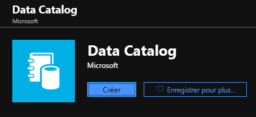
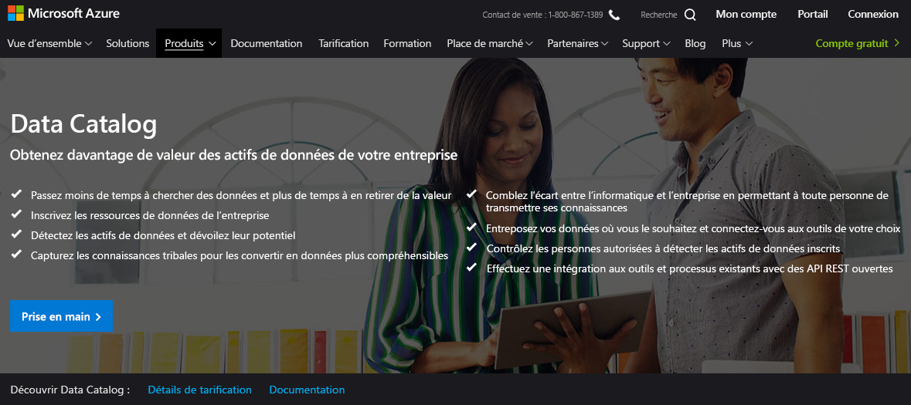
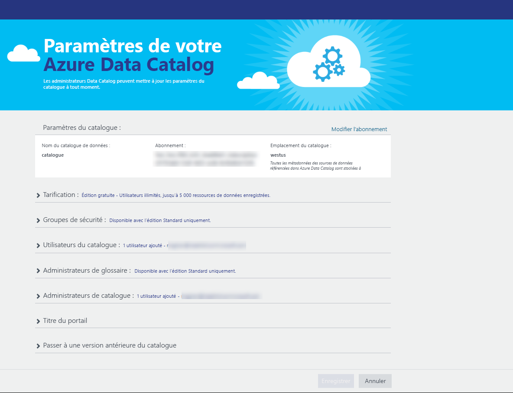
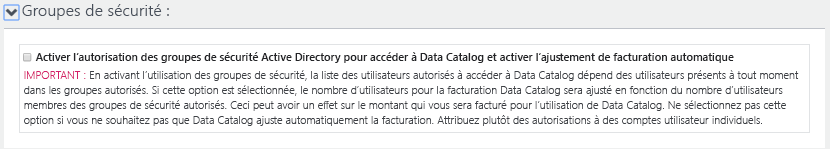
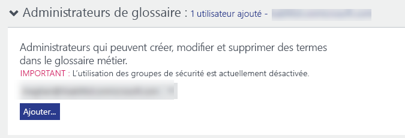
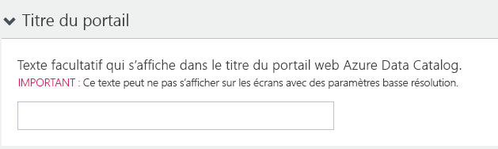
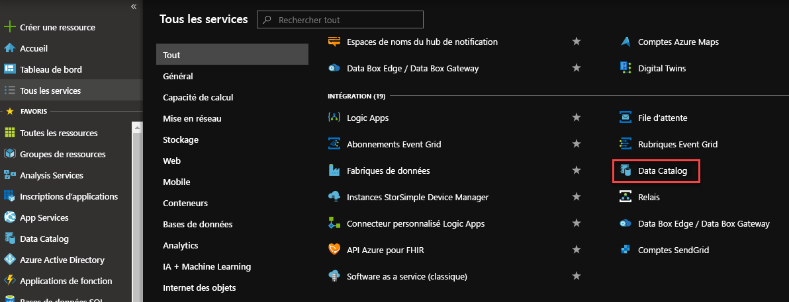
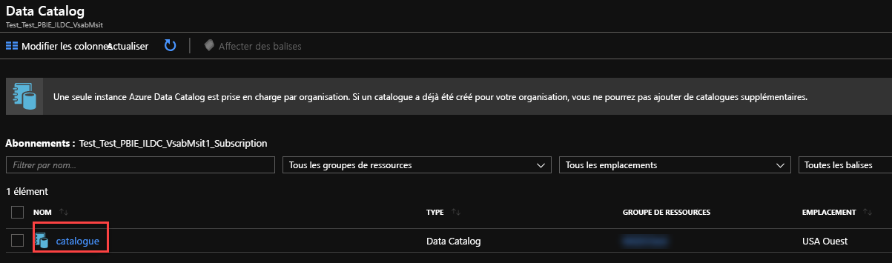
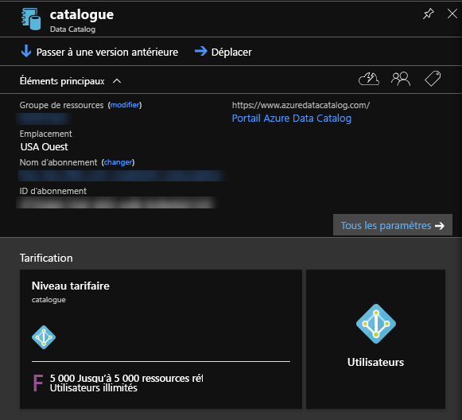
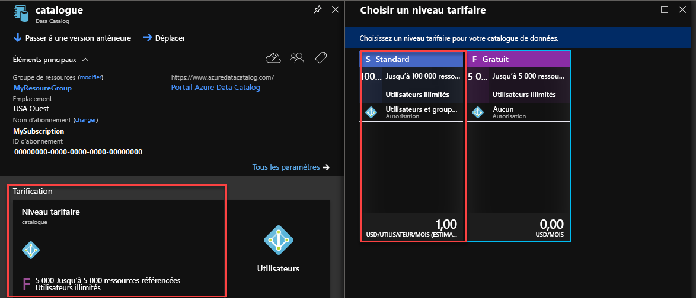

# Démarrage rapide : Créer un catalogue de données Azure

[!INCLUDE [Azure Purview redirect](../../includes/data-catalog-use-purview.md)]

Azure Data Catalog est un service cloud entièrement géré qui sert de système d’inscription et de découverte des ressources de données d’entreprise. Pour une présentation détaillée, consultez l’article [Qu’est-ce qu’Azure Data Catalog ?](overview.md).

Ce guide de démarrage rapide vous guide dans la création d’un catalogue Azure Data Catalog.

Si vous n’avez pas d’abonnement Azure, créez un [compte gratuit](https://azure.microsoft.com/free/?WT.mc_id=A261C142F) avant de commencer.

## Prérequis

> [!Note]
> En raison des exigences de sécurité d’Azure, Azure Data Catalog a appliqué le protocole TLS (Transport Layer Security) 1.2. Les protocoles TLS 1.0 et TLS 1.1 ont été désactivés. Vous pouvez rencontrer des erreurs lors de l’exécution de l’outil d’inscription si votre ordinateur n’est pas mis à jour pour le protocole TLS 1.2. Consultez [Activer le protocole TLS (1.2)](/mem/configmgr/core/plan-design/security/enable-tls-1-2) pour mettre à jour votre ordinateur.

Pour commencer, vous avez besoin des éléments suivants :

* Un abonnement [Microsoft Azure](https://azure.microsoft.com/).
* Vous devez avoir votre propre [locataire Azure Active Directory](../active-directory/fundamentals/active-directory-access-create-new-tenant.md).

Pour configurer Data Catalog, vous devez être le propriétaire ou le copropriétaire d’un abonnement Azure.

## Créer un catalogue de données

Vous ne pouvez approvisionner qu’un seul catalogue de données par organisation (domaine Azure Active Directory). Par conséquent, si le propriétaire ou copropriétaire d’un abonnement Azure qui fait partie de ce domaine Azure Active Directory a déjà créé un catalogue, vous ne pourrez pas en créer un autre, même si vous disposez de plusieurs abonnements Azure. Pour tester si un catalogue de données a été créé par un utilisateur dans votre domaine Azure Active Directory, accédez à la [page d’accueil Azure Data Catalog](http://azuredatacatalog.com) et vérifiez si le catalogue y figure. Ignorez la procédure suivante et passez à la section suivante si un catalogue a déjà été créé pour vous.

1. Accédez au [portail Azure](https://portal.azure.com) > **Créer une ressource**, puis sélectionnez **Data Catalog**.

    

2. Spécifiez un **nom** pour le catalogue de données, l’**abonnement** à utiliser, **l’emplacement** du catalogue, ainsi que le **niveau tarifaire**. Sélectionnez ensuite **Créer**.

3. Accédez à la [page d’accueil Azure Data Catalog](http://azuredatacatalog.com) , puis cliquez sur **Publier des données**.

   

   Vous pouvez également accéder à la page d’accueil de Data Catalog à partir de la [page du service Data Catalog](https://azure.microsoft.com/services/data-catalog), en sélectionnant **Prise en main**.

   

4. Accédez à la page **Paramètres**.

    

5. Développez **Prix appliqués**, puis vérifiez votre **édition** d’Azure Data Catalog (gratuite ou standard).

    

6. Si vous choisissez l’édition *Standard* comme niveau tarifaire, vous pouvez développer **Groupes de sécurité** afin d’autoriser les groupes de sécurité Active Directory à accéder à Data Catalog et de permettre l’ajustement automatique de la facturation.

    

7. Développez **Utilisateurs du catalogue** et cliquez sur **Ajouter** pour ajouter des utilisateurs au catalogue de données. Vous êtes automatiquement ajouté à ce groupe.

    

8. Si vous choisissez l’édition *Standard* comme niveau tarifaire, vous pouvez développer **Administrateurs de glossaire** et cliquer sur **Ajouter** pour ajouter des administrateurs de glossaire. Vous êtes automatiquement ajouté à ce groupe.

    

9. Développez **Administrateurs du catalogue** et cliquez sur **Ajouter** pour ajouter des administrateurs supplémentaires au catalogue de données. Vous êtes automatiquement ajouté à ce groupe.

    

10. Développez **Titre du portail** et ajoutez le texte qui doit être affiché dans le titre du portail.

    

11. Lorsque vous en avez terminé avec la page **Paramètres**, accédez à la page **Publier**.

    

## Rechercher un catalogue de données dans le portail Azure

1. Dans un onglet distinct du navigateur web ou dans une fenêtre de navigateur web distincte, accédez au [portail Azure](https://portal.azure.com) et connectez-vous en utilisant le compte que vous avez utilisé pour créer le catalogue de données à l’étape précédente.

2. Sélectionnez **Tous les services**, puis cliquez sur **Data Catalog**.

    

    Le catalogue de données que vous avez créé s’affiche.

    

3. Cliquez sur le catalogue que vous avez créé. Le panneau **Catalogue de données** s’affiche dans le portail.

   

4. Vous pouvez afficher les propriétés du catalogue de données et les mettre à jour. Par exemple, cliquez sur **Niveau tarifaire** et modifiez l’édition.

    

## Étapes suivantes

Dans ce guide de démarrage rapide, vous avez vu comment créer un catalogue Azure Data Catalog pour votre organisation. Vous pouvez désormais inscrire des sources de données dans votre catalogue de données.

> [!div class="nextstepaction"]
> [Inscrire des sources de données dans Azure Data Catalog](data-catalog-how-to-register.md)