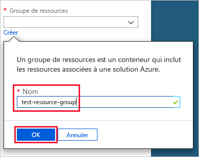
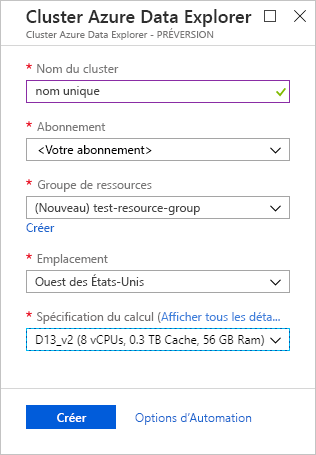
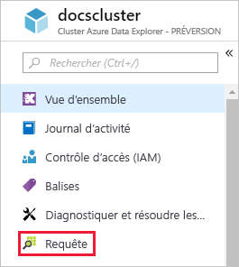
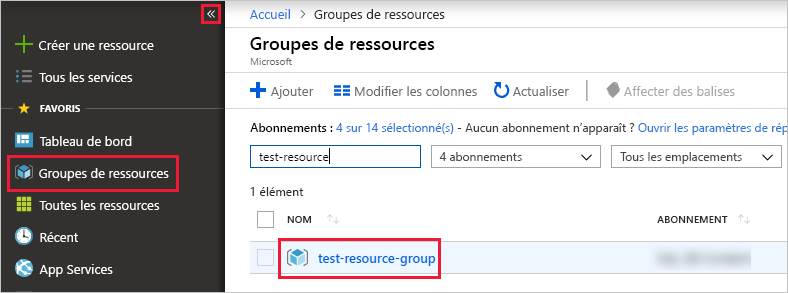

# Démarrage rapide : Créer un cluster et une base de données Azure Data Explorer

L’Explorateur de données Azure est un service d’exploration de données rapide et hautement évolutive pour les données des journaux et les données de télémétrie. Pour utiliser l’Explorateur de données Azure, créez tout d’abord un *cluster*et une ou plusieurs *bases de données* dans ce cluster. Ensuite, *ingérez* (chargez) des données dans une base de données pour pouvoir exécuter des requêtes dessus. Dans ce guide de démarrage rapide, vous allez créer un cluster et une base de données. Dans les articles suivants, nous vous montrons comment ingérer les données.

Si vous n’avez pas d’abonnement Azure, créez un [compte Azure gratuit](https://azure.microsoft.com/free/) avant de commencer.

## Connectez-vous au portail Azure.

Connectez-vous au [Portail Azure](https://portal.azure.com/).

## Créer un cluster

Créez un cluster pour l’Explorateur de données Azure dans un groupe de ressources Azure avec un ensemble défini de ressources de calcul et de stockage.

1. Cliquez sur le bouton **Créer une ressource** (+) dans le coin supérieur gauche du portail.

1. Recherchez *Azure Data Explorer*.

   

1. Sous **Azure Data Explorer**, en bas de l’écran, sélectionnez **Créer**.

1. Entrez un nom unique pour votre cluster, sélectionnez votre abonnement et créez un groupe de ressources nommé *test-resource-group*.

    

1. Renseignez le formulaire avec les informations suivantes.

   

    **Paramètre** | **Valeur suggérée** | **Description du champ**
    |---|---|---|
    | Nom du cluster | Nom de cluster unique | Choisissez un nom unique qui identifie votre cluster. Par exemple, *mytestcluster*. Le nom de domaine *[Région].kusto.windows.net* est ajouté au nom de cluster que vous fournissez. Le nom doit être uniquement composé de lettres minuscules et de chiffres. Il doit comprendre entre 3 et 22 caractères.
    | Abonnement | Votre abonnement | Sélectionnez l’abonnement Azure que vous souhaitez utiliser pour votre cluster.|
    | Groupe de ressources | *test-resource-group* | Créez un groupe de ressources. |
    | Lieu | *USA Ouest* | Pour ce guide de démarrage rapide, sélectionnez *USA Ouest*. Pour un système de production, sélectionnez la région qui répond le mieux à vos besoins.
    | Spécifications de calcul | *D13_v2* | Sélectionnez la spécification du prix le plus bas pour ce guide de démarrage rapide. Pour un système de production, sélectionnez la spécification qui répond le mieux à vos besoins.
    | | |

1. Sélectionnez **Créer** pour provisionner le cluster. En général, le provisionnement prend environ dix minutes. Dans la barre d’outils, sélectionnez **Notifications** pour superviser le processus de provisionnement.

    

1. Lorsque le processus est terminé, sélectionnez **Notifications** et **Accéder à la ressource**.

    

## Créer une base de données

Vous êtes maintenant prêt pour la deuxième étape du processus : la création de la base de données.

1. Sous l’onglet **Vue d’ensemble**, sélectionnez **Créer une base de données**.

    

1. Renseignez le formulaire avec les informations suivantes.

    

    **Paramètre** | **Valeur suggérée** | **Description du champ**
    |---|---|---|
    | Nom de la base de données | *TestDatabase* | Ce nom de base de données doit être unique dans le cluster.
    | Période de rétention | *3650* | Intervalle de temps (en jours) pendant lequel vous avez la garantie d’avoir les données à disposition pour les interroger. Cet intervalle se mesure à partir du moment où les données sont ingérées.
    | Période de cache | *31* | Intervalle de temps (en jours) pendant lequel les données fréquemment interrogées restent disponibles dans le stockage SSD ou la RAM, plutôt que dans un stockage à plus long terme.
    | | | |

1. Sélectionnez **Enregistrer** pour créer la base de données. La création prend généralement moins d’une minute. Lorsque le processus est terminé, revenez à l’onglet **Vue d’ensemble** du cluster.

## Exécuter des commandes simples dans la base de données

Maintenant que vous avez un cluster et une base de données, vous pouvez exécuter des requêtes et des commandes. Vous n’avez encore pas encore de données dans la base de données, mais vous pouvez quand même voir comment les outils fonctionnent.

1. Sous votre cluster, sélectionnez **Requête**.

    

1. Collez la commande suivante dans la fenêtre de requête `.show databases`, puis sélectionnez **Exécuter**.

    

    Le jeu de résultats montre **TestDatabase**, la seule base de données du cluster.

1. Collez la commande suivante dans la fenêtre de requête `.show tables`, puis sélectionnez cette commande dans la fenêtre. Sélectionnez **Exécuter**.

    Cette commande retourne un jeu de résultats vide parce que vous n’avez pas encore de table. Vous ajoutez une table dans l’article suivant de cette série.

## Arrêter et redémarrer le cluster

Vous pouvez arrêter et redémarrer un cluster en fonction des besoins métier.

1. Pour arrêter le cluster, en haut de l’onglet **Vue d’ensemble**, sélectionnez **Arrêter**.

    Lorsque le cluster est arrêté, les données ne sont pas disponibles pour les requêtes et vous ne pouvez pas ingérer de nouvelles données.

1. Pour redémarrer le cluster, en haut de l’onglet **Vue d’ensemble**, sélectionnez **Démarrer**.

    Quand le cluster est redémarré, il faut compter environ dix minutes avant qu’il ne soit disponible (comme quand il a été provisionné la première fois). Comptez aussi du temps pour charger les données dans le cache à chaud.  

## Supprimer des ressources

Si vous envisagez de suivre nos autres tutoriels et guides de démarrage rapide, gardez les ressources que vous avez créées. Dans le cas contraire, nettoyez **test-resource-group** pour éviter des frais.

1. Dans le portail Azure, sélectionnez **Groupes de ressources** tout à gauche, puis sélectionnez le groupe de ressources que vous avez créé.  

    Si le menu de gauche est réduit, sélectionnez le  pour le développer.

   

1. Sous **test-resource-group**, sélectionnez **Supprimer le groupe de ressources**.

1. Dans la nouvelle fenêtre, tapez le nom du groupe de ressources à supprimer (*test-resource-group*), puis sélectionnez **Supprimer**.

## Étapes suivantes

> [!div class="nextstepaction"]
> [Démarrage rapide : Ingérer des données Event Hub dans Azure Data Explorer](ingest-data-event-hub.md)

