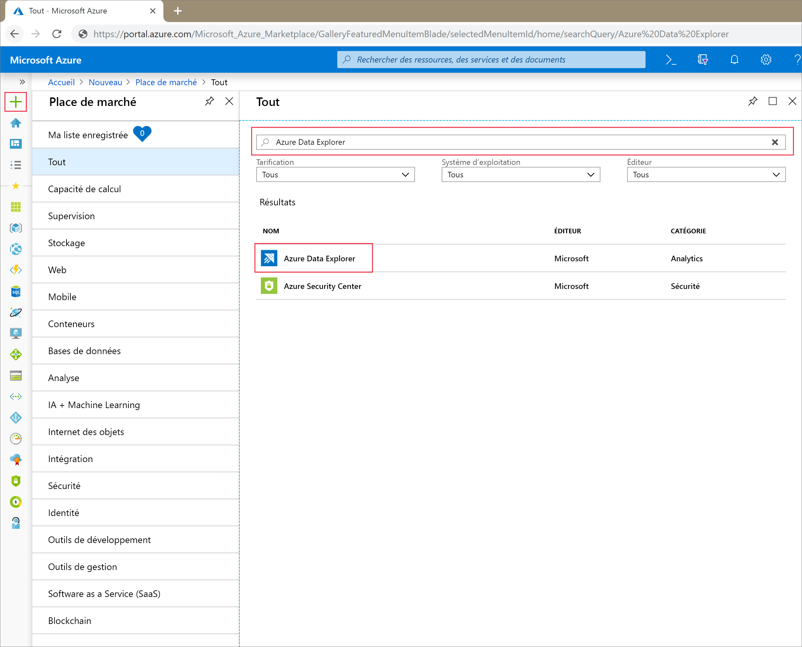
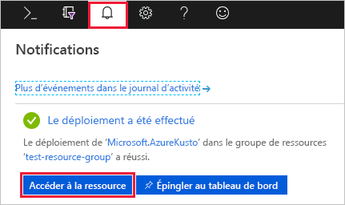
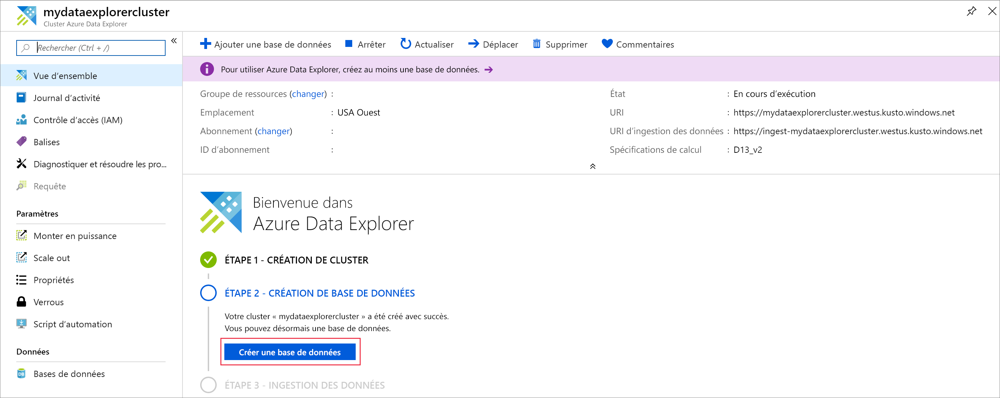
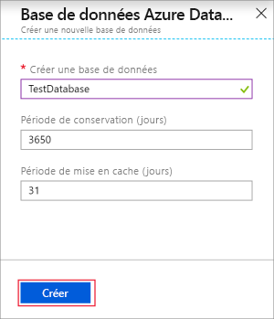

# Démarrage rapide : Créer un cluster et une base de données Azure Data Explorer

> [!div class="op_single_selector"]
> * [Portail](create-cluster-database-portal.md)
> * [INTERFACE DE LIGNE DE COMMANDE](create-cluster-database-cli.md)
> * [PowerShell](create-cluster-database-powershell.md)
> * [C#](create-cluster-database-csharp.md)
> * [Python](create-cluster-database-python.md)
> * [Modèle ARM](create-cluster-database-resource-manager.md)

L’Explorateur de données Azure est un service d’exploration de données rapide et hautement évolutive pour les données des journaux et les données de télémétrie. Pour utiliser Azure Data Explorer, créez tout d’abord un cluster et une ou plusieurs bases de données dans ce cluster. Ensuite, ingérez (chargez) des données dans une base de données pour pouvoir exécuter des requêtes dessus. Dans ce guide de démarrage rapide, vous allez créer un cluster et une base de données.

Si vous n’avez pas d’abonnement Azure, créez un [compte Azure gratuit](https://azure.microsoft.com/free/) avant de commencer.

## Connectez-vous au portail Azure.

Connectez-vous au [portail Azure](https://portal.azure.com/).

## Créer un cluster

Créez un cluster Azure Data Explorer avec un ensemble défini de ressources de calcul et de stockage dans un groupe de ressources Azure.

1. Sélectionnez le bouton **+ Créer une ressource** dans le coin supérieur gauche du portail.

1. Recherchez *Azure Data Explorer*.

   

1. Sous **Azure Data Explorer**, en bas de l’écran, sélectionnez **Créer**.

1. Remplissez les détails du cluster de base avec les informations suivantes.

   

    **Paramètre** | **Valeur suggérée** | **Description du champ**
    |---|---|---|
    | Abonnement | Votre abonnement | Sélectionnez l’abonnement Azure que vous souhaitez utiliser pour votre cluster.|
    | Resource group | Votre groupe de ressources | Utilisez un groupe de ressources existant ou créez-en un. |
    | Nom du cluster | Nom de cluster unique | Choisissez un nom unique qui identifie votre cluster. Le nom de domaine *[Région].kusto.windows.net* est ajouté au nom de cluster que vous fournissez. Le nom doit être uniquement composé de lettres minuscules et de chiffres. Il doit comprendre entre 4 et 22 caractères.
    | Région | *USA Ouest* ou *USA Ouest 2* | Sélectionnez *USA Ouest* ou *USA Ouest 2* (si vous utilisez des zones de disponibilité) pour ce guide de démarrage rapide. Pour un système de production, sélectionnez la région qui répond le mieux à vos besoins.
    | Zones de disponibilité | *1*, *2* et/ou *3* | Placez les instances de cluster dans différentes zones de disponibilité de la même région (facultatif). Les [zones de disponibilité Azure](/azure/availability-zones/az-overview) sont des emplacements physiques uniques au sein de la même région Azure. Elles protègent un cluster et des données Azure Data Explorer contre la défaillance partielle d’une région. Les nœuds de cluster sont créés, par défaut, dans le même centre de données. Le fait de sélectionner plusieurs zones de disponibilité vous permet d’éliminer un point de défaillance unique et de garantir une haute disponibilité. Le déploiement dans les zones de disponibilité est possible uniquement au moment de la création du cluster et ne peut pas être modifié plus tard.
    | Spécifications de calcul | *D13_v2* | Sélectionnez la spécification du prix le plus bas pour ce guide de démarrage rapide. Pour un système de production, sélectionnez la spécification qui répond le mieux à vos besoins.
    | | | |

1. Sélectionnez **Vérifier + créer** pour passer en revue les détails de votre cluster, puis **Créer** pour le provisionner. Le provisionnement prend généralement environ 10 minutes.

1. Une fois le déploiement terminé, sélectionnez **Accéder à la ressource**.

    

## Création d'une base de données

Vous êtes maintenant prêt pour la deuxième étape du processus : la création de la base de données.

1. Sous l’onglet **Vue d’ensemble**, sélectionnez **Créer une base de données**.

    

1. Renseignez le formulaire avec les informations suivantes.

    

    **Paramètre** | **Valeur suggérée** | **Description du champ**
    |---|---|---|
    | Nom de la base de données | *TestDatabase* | Ce nom de base de données doit être unique dans le cluster.
    | Période de rétention | *3650* | Intervalle de temps (en jours) pendant lequel vous avez la garantie d’avoir les données à disposition pour les interroger. Cet intervalle se mesure à partir du moment où les données sont ingérées.
    | Période de cache | *31* | Intervalle de temps (en jours) pendant lequel les données fréquemment interrogées restent disponibles dans le stockage SSD ou la RAM, plutôt que dans un stockage à plus long terme.
    | | | |

1. Sélectionnez **Créer** pour créer la base de données. La création prend généralement moins d’une minute. Lorsque le processus est terminé, revenez à l’onglet **Vue d’ensemble** du cluster.

## Exécuter des commandes simples dans la base de données

Maintenant que vous avez un cluster et une base de données, vous pouvez exécuter des requêtes et des commandes. Vous n’avez encore pas encore de données dans la base de données, mais vous pouvez quand même voir comment les outils fonctionnent.

1. Sous votre cluster, sélectionnez **Requête**. Collez la commande `.show databases` dans la fenêtre de requête, puis sélectionnez **Exécuter**.

    

    Le jeu de résultats montre **TestDatabase**, la seule base de données du cluster.

1. Collez la commande `.show tables` dans la fenêtre de requête et sélectionnez **Exécuter**.

    Cette commande retourne un jeu de résultats vide parce que vous n’avez pas encore de table. Vous ajoutez une table dans l’article suivant de cette série.

## Arrêter et redémarrer le cluster

Vous pouvez arrêter et redémarrer un cluster en fonction des besoins métier.

1. Pour arrêter le cluster, en haut de l’onglet **Vue d’ensemble**, sélectionnez **Arrêter**.

    Lorsque le cluster est arrêté, les données ne sont pas disponibles pour les requêtes et vous ne pouvez pas ingérer de nouvelles données.

1. Pour redémarrer le cluster, en haut de l’onglet **Vue d’ensemble**, sélectionnez **Démarrer**.

    Quand le cluster est redémarré, il faut compter environ 10 minutes avant qu’il ne soit disponible (comme quand il a été provisionné la première fois). Comptez aussi du temps pour charger les données dans le cache à chaud.  

## Nettoyer les ressources

Si vous envisagez de suivre d’autres tutoriels et guides de démarrage rapide, gardez les ressources que vous avez créées. Sinon, nettoyez votre groupe de ressources, pour éviter d’encourir des frais.

1. Dans le portail Azure, sélectionnez **Groupes de ressources** à l’extrême gauche, puis sélectionnez le groupe de ressources qui contient votre cluster Data Explorer.  

1. Sélectionnez **Supprimer le groupe de ressources** pour supprimer la totalité du groupe de ressources. Si vous utilisez un groupe de ressources existant, vous pouvez choisir de ne supprimer que le cluster Data Explorer.

## Étapes suivantes

> [!div class="nextstepaction"]
> [Démarrage rapide : Ingérer des données Event Hub dans Azure Data Explorer](ingest-data-event-hub.md)

