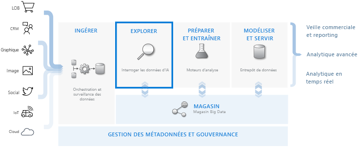
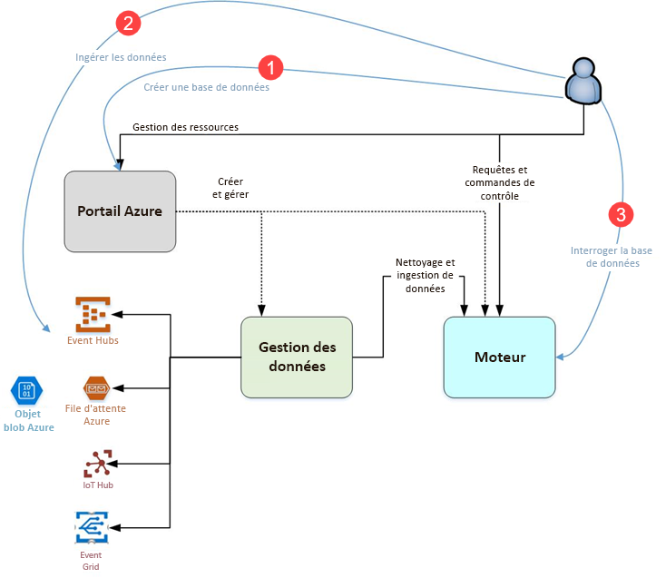

# Qu’est-ce que l’Explorateur de données Azure ?

L’Explorateur de données Azure est un service d’exploration de données rapide et hautement évolutive pour les données des journaux et les données de télémétrie. Il vous aide à gérer les nombreux flux de données émis par les logiciels actuels pour vous permettre de collecter, de stocker et d’analyser les données. L’Explorateur de données Azure est idéal pour analyser des grands volumes de données provenant de n’importe quelle source de données, comme des sites web, des applications, des appareils IoT et plus encore. Ces données sont utilisées pour les diagnostics, la supervision, la création de rapports, l’apprentissage automatique et d’autres fonctionnalités d’analytique. Azure Data Explorer simplifie l’ingestion de ces données et vous permet d’effectuer des requêtes ad hoc complexes sur les données en quelques secondes.

## En quoi l’Explorateur de données Azure est unique ?

- Il gère plusieurs téraoctets de données en quelques minutes, ce qui permet des itérations rapides d’exploration de données qui révéleront des insights utiles.

- Il propose un langage de requête innovant, optimisé pour l’analytique de données haute performance.

- Il prend en charge l’analyse de grands volumes de données hétérogènes (structurées et non structurées).

- Il offre la possibilité de créer et de déployer exactement ce dont vous avez besoin en alliant d’autres services pour fournir une solution d’analytique de données globale, puissante et interactive.

## Workflow d’entreposage des données

L’Explorateur de données Azure s’intègre avec d’autres services majeurs pour fournir une solution de bout en bout qui comprend la collecte, l’ingestion, le stockage, l’indexation, l’interrogation et la visualisation de données. Il occupe un rôle pivot dans l’entreposage des données, car il exécute l’étape **EXPLORATION** du flux sur des téraoctets de données brutes de tout type.

L’Explorateur de données Azure prend en charge plusieurs méthodes d’ingestion, notamment des connecteurs à des services courants comme Event Hub, une ingestion par programmation à l’aide de kits SDK, comme .NET et Python, et un accès direct au moteur à des fins d’exploration. L’Explorateur de données Azure s’intègre avec des services de modélisation et d’analytique pour une plus grande analyse et visualisation des données.

## Flux de l’Explorateur de données Azure

Le diagramme suivant montre les différents aspects de l’utilisation de l’Explorateur de données Azure.

L’utilisation de l’Explorateur de données Azure suit généralement ce schéma :

1. **Créer une base de données :** Créez un *cluster*, puis une ou plusieurs *bases de données* dans ce cluster. [Démarrage rapide : Créer un cluster et une base de données pour l’Explorateur de données Azure](create-cluster-database-portal.md)

1. **Ingérer des données :** Chargez des données dans des tables de base de données pour pouvoir exécuter des requêtes dessus. [Démarrage rapide : Ingérer des données Event Hub dans l’Explorateur de données Azure](ingest-data-event-hub.md)

1. **Interroger la base de données :** Utilisez notre application web pour exécuter, consulter et partager des requêtes et des résultats. Il est disponible dans le portail Azure en tant qu’application autonome. Vous pouvez aussi envoyer des requêtes par programmation (à l’aide d’un kit SDK) ou à un point de terminaison de l’API REST. [Démarrage rapide : Interroger des données dans l’Explorateur de données Azure](web-query-data.md)

## Expérience des requêtes

Une requête dans l’Explorateur de données Azure est une demande en lecture seule qui permet de traiter des données et de retourner les résultats de ce traitement, sans modifier les données ou les métadonnées. Vous continuez à affiner vos requêtes tant que vous n’avez pas terminé votre analyse. Azure Data Explorer simplifie ce processus grâce à son expérience de requête ad hoc très rapide.

L’Explorateur de données Azure gère de grandes quantités de données structurées, semi-structurées (types imbriqués similaires à JSON) et non structurées (texte libre). Il vous permet de rechercher des termes spécifiques, de localiser des événements particuliers et d’effectuer des calculs de style métriques sur des données structurées. L’Explorateur de données Azure fait le lien entre les journaux d’activité texte non structurés et les nombres et dimensions structurés en extrayant les valeurs d’exécution des champs de texte de forme libre. L’exploration des données est simplifiée en combinant l’indexation rapide de texte, le stockage des colonnes et les opérations chronologiques.

Les fonctionnalités Azure Data Explorer sont étendues par d’autres services qui s’appuient sur son puissant langage de requête, notamment les [journaux d’activité Azure Monitor](/azure/log-analytics/), [Application Insights](/azure/application-insights/), [Time Series Insights](/azure/time-series-insights/) et [Windows Defender Advanced Threat Protection](/windows/security/threat-protection/windows-defender-atp/windows-defender-advanced-threat-protection/).

## Commentaires

Nous aimerions beaucoup avoir votre avis sur l’Explorateur de données Azure et son langage de requête via :

- Poser des questions
  - [Stack Overflow](https://stackoverflow.com/questions/tagged/azure-data-explorer)
  - [Microsoft Tech Community](https://techcommunity.microsoft.com/t5/Azure-Data-Explorer/bd-p/Kusto)
  - [MSDN](https://social.msdn.microsoft.com/Forums/en-US/home?forum=AzureKusto)
- [Partager des suggestions produit dans User Voice](https://aka.ms/AzureDataExplorer.UserVoice)

## Étapes suivantes

[Démarrage rapide : Créer un cluster et une base de données pour l’Explorateur de données Azure](create-cluster-database-portal.md)

[Démarrage rapide : Ingérer des données Event Hub dans l’Explorateur de données Azure](ingest-data-event-hub.md)

[Démarrage rapide : Interroger des données dans l’Explorateur de données Azure](web-query-data.md)
