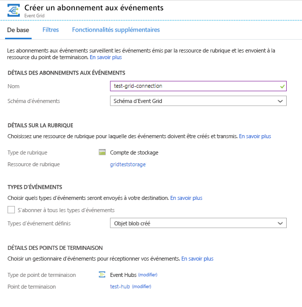
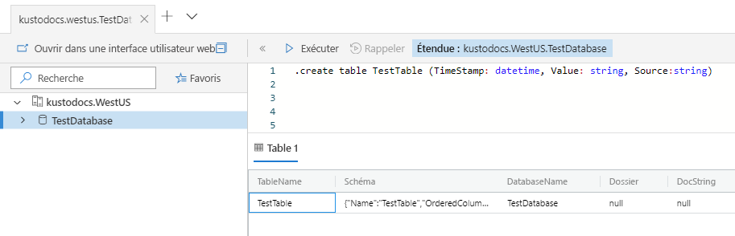
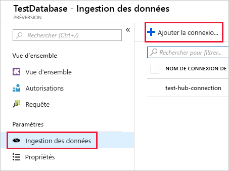
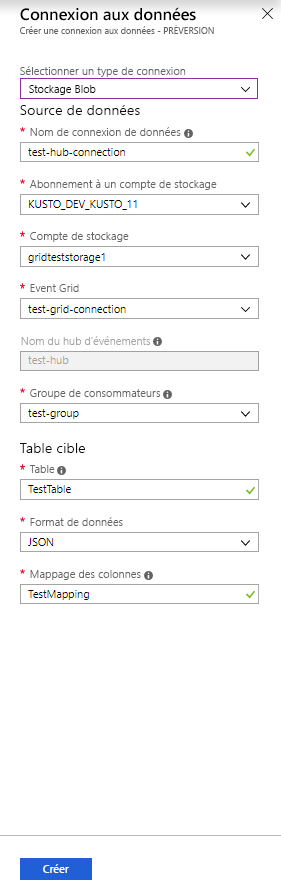
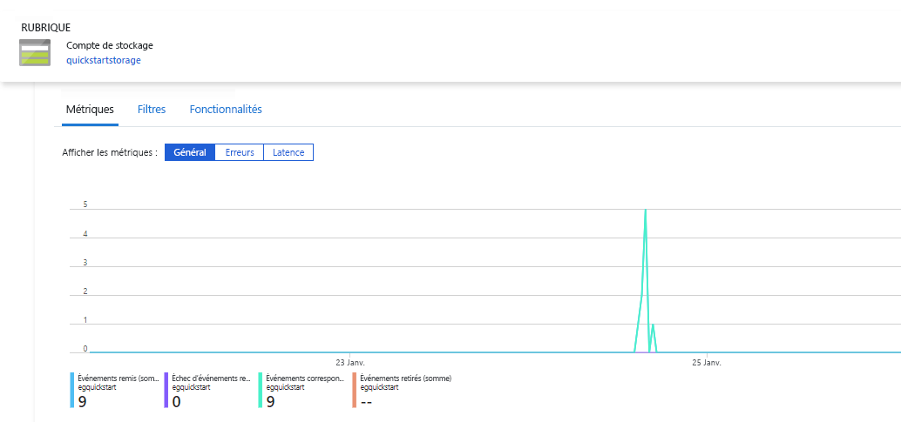
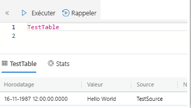

# <a name="quickstart-ingest-azure-blobs-into-azure-data-explorer-by-subscribing-to-event-grid-notifications"></a>Démarrage rapide : Ingérer des objets blob Azure dans Azure Data Explorer en s’abonnant à des notifications Event Grid

L’Explorateur de données Azure est un service d’exploration de données rapide et hautement évolutive pour les données des journaux et les données de télémétrie. Azure Data Explorer offre une ingestion continue (chargement de données) à partir d’objets blob écrits dans des conteneurs d’objets blob. Pour en bénéficier, définissez un abonnement [Azure Event Grid](/azure/event-grid/overview) pour les événements de création d’objets blob et le routage de ces événements vers Kusto via un hub d’événements. Pour ce guide de démarrage rapide, vous devez avoir un compte de stockage avec un abonnement Event Grid qui envoie ses notifications à Event Hub. Vous pouvez alors créer une connexion de données Event Grid et voir les données circuler dans le système.

## <a name="prerequisites"></a>Prérequis

1. Si vous n’avez pas encore d’abonnement Azure, [créez un compte Azure gratuit](https://azure.microsoft.com/free/)
1. [Un cluster et une base de données](create-cluster-database-portal.md)
1. [Un compte de stockage](https://docs.microsoft.com/azure/storage/common/storage-quickstart-create-account?tabs=azure-portal)
1. [Un hub d’événements](https://docs.microsoft.com/azure/event-hubs/event-hubs-create)

## <a name="create-an-event-grid-subscription-in-your-storage-account"></a>Créer un abonnement Event Grid dans votre compte de stockage

1. Dans le portail Azure, accédez à votre compte de stockage.
1. Cliquez sur l’onglet **Événements**, puis sur **Abonnement aux événements**

    

1. Dans la fenêtre **Créer un abonnement aux événements** sous l’onglet **De base**, spécifiez les valeurs suivantes :

    **Paramètre** | **Valeur suggérée** | **Description du champ**
    |---|---|---|
    | Nom | *test-grid-connection* | Nom de la grille d’événement que vous voulez créer.|
    | Schéma d’événement | *Schéma Event Grid* | Le schéma qui doit être utilisé pour la grille d’événements. |
    | Type de rubrique | *Compte de stockage* | Type de rubrique Event Grid. |
    | Ressource de rubrique | *gridteststorage* | nom de votre compte de stockage. |
    | S’abonner à tous les types d’événements | *Décochez la case* | Ne pas être notifié de tous les événements. |
    | Types d’événements définis | *Objet blob créé* | De quels événements spécifiques être notifié. |
    | Type de point de terminaison | *Hubs d'événements* | Type de point de terminaison auquel vous envoyez les événements. |
    | Point de terminaison | *test-hub* | Hub d’événements que vous avez créé. |
    | | |

1. Sélectionnez l’onglet **Fonctionnalités supplémentaires** si vous voulez effectuer le suivi des fichiers d’un conteneur spécifique. Définissez les filtres pour les notifications comme suit :
    * Le champ **Le sujet commence par** est le préfixe *littéral* du conteneur d’objets blob (comme le modèle appliqué est *startswith*, il peut porter sur plusieurs conteneurs). Les caractères génériques ne sont pas autorisés.
     Il *doit* être défini comme suit : *`/blobServices/default/containers/`*[préfixe de conteneur]
    * Le champ **Le sujet se termine par** est le suffixe *littéral* de l’objet blob. Les caractères génériques ne sont pas autorisés.

## <a name="create-a-target-table-in-azure-data-explorer"></a>Créer une table cible dans l’Explorateur de données Azure

Créez une table dans Azure Data Explorer, à laquelle Event Hubs envoie les données. Vous créez la table dans le cluster et la base de données préparés dans **Prérequis**.

1. Dans le portail Azure, sous votre cluster, sélectionnez **Requête**.

    

1. Copiez la commande suivante dans la fenêtre et sélectionnez **Exécuter** pour créer la table (TestTable) qui doit recevoir les données ingérées.

    ```Kusto
    .create table TestTable (TimeStamp: datetime, Value: string, Source:string)
    ```

    

1. Copiez la commande suivante dans la fenêtre et sélectionnez **Exécuter** pour mapper les données JSON entrantes aux types de données et aux noms de colonne de la table (TestTable).

    ```Kusto
    .create table TestTable ingestion json mapping 'TestMapping' '[{"column":"TimeStamp","path":"$.TimeStamp"},{"column":"Value","path":"$.Value"},{"column":"Source","path":"$.Source"}]'
    ```

## <a name="create-an-event-grid-data-connection-in-azure-data-explorer"></a>Créer une connexion de données Event Grid dans Azure Data Explorer

Vous vous connectez maintenant à Event Grid à partir d’Azure Data Explorer, afin que les données circulant dans le conteneur d’objets blob soient envoyées dans la table de test.

1. Sélectionnez **Notifications** dans la barre d’outils pour vérifier que le déploiement du hub d’événements a réussi.

1. Sous le cluster que vous avez créé, sélectionnez **Bases de données** et **TestDatabase**.

    

1. Sélectionnez **Ingestion des données**, puis **Ajouter une connexion de données**.

    

1. Sélectionnez un type de connexion : **Stockage d'objets blob**.

1. Renseignez le formulaire avec les informations suivantes, puis cliquez sur **Créer**.

    

     Source de données :

    **Paramètre** | **Valeur suggérée** | **Description du champ**
    |---|---|---|
    | Nom de la connexion de données | *test-hub-connection* | Nom de la connexion que vous souhaitez créer dans l’Explorateur de données Azure.|
    | Abonnement du compte de stockage | Votre ID d’abonnement | ID d’abonnement où se trouve votre compte de stockage.|
    | Compte de stockage | *gridteststorage* | Nom du compte de stockage que vous avez créé précédemment.|
    | Event Grid | *test-grid-connection* | Nom de la grille d’événement que vous avez créée. |
    | Nom de l’Event Hub | *test-hub* | Hub d’événements que vous avez créé. Ceci est automatiquement renseigné quand vous sélectionnez une grille d’événement. |
    | Groupe de consommateurs | *test-group* | Groupe de consommateurs défini dans le hub d’événements que vous avez créé. |
    | | |

    Table cible :

     **Paramètre** | **Valeur suggérée** | **Description du champ**
    |---|---|---|
    | Table | *TestTable* | Table que vous avez créée dans **TestDatabase**. |
    | Format de données | *JSON* | Les formats pris en charge sont Avro, CSV, JSON, JSON MULTILIGNE, PSV, SOH, SCSV, TSV et TXT. |
    | Mappage de colonnes | *TestMapping* | Le mappage que vous avez créé dans **TestDatabase**, qui mappe les données JSON entrantes dans les colonnes des noms de colonne et les types de données de **TestTable**.|
    | | |

## <a name="generate-sample-data"></a>Générer un exemple de données

Maintenant qu’Azure Data Explorer et le compte de stockage sont connectés, vous pouvez créer des exemples de données et les charger dans le stockage d’objets blob.

Nous allons maintenant utiliser un petit script de shell qui exécute quelques commandes Azure CLI de base pour interagir avec les ressources de Stockage Azure. Tout d’abord, le script crée un nouveau conteneur dans votre compte de stockage, puis télécharge un fichier existant (comme un objet blob) dans ce conteneur. Il liste ensuite tous les objets blob du conteneur. Vous pouvez utiliser [Cloud Shell](https://docs.microsoft.com/azure/cloud-shell/overview) pour exécuter le script directement dans le portail.

Enregistrez les données suivantes dans un fichier et utilisez-les avec le script ci-dessous :

```Json
{"TimeStamp": "1987-11-16 12:00","Value": "Hello World","Source": "TestSource"}
```

```bash
#!/bin/bash
### A simple Azure Storage example script

    export AZURE_STORAGE_ACCOUNT=<storage_account_name>
    export AZURE_STORAGE_KEY=<storage_account_key>

    export container_name=<container_name>
    export blob_name=<blob_name>
    export file_to_upload=<file_to_upload>
    export destination_file=<destination_file>

    echo "Creating the container..."
    az storage container create --name $container_name

    echo "Uploading the file..."
    az storage blob upload --container-name $container_name --file $file_to_upload --name $blob_name

    echo "Listing the blobs..."
    az storage blob list --container-name $container_name --output table

    echo "Done"
```

## <a name="review-the-data-flow"></a>Examiner le flux de données

> [!NOTE]
> ADX a une stratégie d’agrégation (traitement par lot) pour l’ingestion de données, conçue pour optimiser le processus d’ingestion.
Par défaut, la stratégie est configurée sur 5 minutes.
Vous pouvez modifier la stratégie ultérieurement en fonction des besoins. Dans ce guide de démarrage rapide, vous pouvez vous attendre à une latence de quelques minutes.

1. Dans le portail Azure, sous votre grille d’événement, vous voyez le pic de l’activité pendant l’exécution de l’application.

    

1. Exécutez la requête suivante dans votre base de données de test pour vérifier combien de messages sont arrivés dans la base de données jusqu’à présent.

    ```Kusto
    TestTable
    | count
    ```

1. Pour voir le contenu des messages, exécutez la requête suivante dans votre base de données de test.

    ```Kusto
    TestTable
    ```

    Le jeu de résultats doit ressembler à ce qui suit.

    

## <a name="clean-up-resources"></a>Supprimer des ressources

Si vous ne prévoyez pas de réutiliser votre grille d’événement, effacez **test-hub-rg** pour éviter des frais.

1. Dans le portail Azure, sélectionnez **Groupes de ressources** tout à gauche, puis sélectionnez le groupe de ressources que vous avez créé.  

    Si le menu de gauche est réduit, sélectionnez le  pour le développer.

   

1. Sous **test-resource-group**, sélectionnez **Supprimer le groupe de ressources**.

1. Dans la nouvelle fenêtre, tapez le nom du groupe de ressources à supprimer (*test-hub-rg*), puis sélectionnez **Supprimer**.

## <a name="next-steps"></a>Étapes suivantes

> [!div class="nextstepaction"]
> [Démarrage rapide : Interroger des données dans Azure Data Explorer](web-query-data.md)
