# <a name="ingest-data-from-event-hub-into-azure-data-explorer"></a>Ingérer des données Event Hub dans Azure Data Explorer

> [!div class="op_single_selector"]
> * [Portail](ingest-data-event-hub.md)
> * [C#](data-connection-event-hub-csharp.md)
> * [Python](data-connection-event-hub-python.md)
> * [Modèle Azure Resource Manager](data-connection-event-hub-resource-manager.md)

L’Explorateur de données Azure est un service d’exploration de données rapide et hautement évolutive pour les données des journaux et les données de télémétrie. L’Explorateur de données Azure offre une ingestion (chargement de données) à partir d’Event Hubs, plateforme de streaming de big data et service d’ingestion d’événements. [Event Hubs](/azure/event-hubs/event-hubs-about) peut traiter des millions d’événements par seconde en quasi-temps réel. Dans cet article, vous créez un Event Hub, vous vous y connectez à partir d’Azure Data Explorer et vous voyez le flux de données via le système.

## <a name="prerequisites"></a>Conditions préalables requises

* Si vous n’avez pas d’abonnement Azure, créez un [compte Azure gratuit](https://azure.microsoft.com/free/) avant de commencer.
* [Un cluster et une base de données de test](create-cluster-database-portal.md).
* [Un exemple d’application](https://github.com/Azure-Samples/event-hubs-dotnet-ingest) qui génère des données et les envoie à un hub d’événements. Téléchargez l’exemple d’application sur votre système.
* [Visual Studio 2019](https://visualstudio.microsoft.com/vs/) pour exécuter l’exemple d’application.

## <a name="sign-in-to-the-azure-portal"></a>Connectez-vous au portail Azure.

Connectez-vous au [portail Azure](https://portal.azure.com/).

## <a name="create-an-event-hub"></a>Créer un hub d’événements

Dans cet article, vous générez des exemples de données et les envoyez à un Event Hub. La première étape consiste à créer un hub d’événements. Pour cela, utilisez un modèle Azure Resource Manager (ARM) dans le portail Azure.

1. Pour créer un hub d’événements, utilisez le bouton suivant pour démarrer le déploiement. Cliquez avec le bouton droit et sélectionnez **Ouvrir dans une nouvelle fenêtre** pour pouvoir suivre le reste des étapes de l’article.

    [](https://portal.azure.com/#create/Microsoft.Template/uri/https%3A%2F%2Fraw.githubusercontent.com%2FAzure%2Fazure-quickstart-templates%2Fmaster%2F201-event-hubs-create-event-hub-and-consumer-group%2Fazuredeploy.json)

    Le bouton **Déployer sur Azure** vous amène dans le portail Azure pour remplir un formulaire de déploiement.

    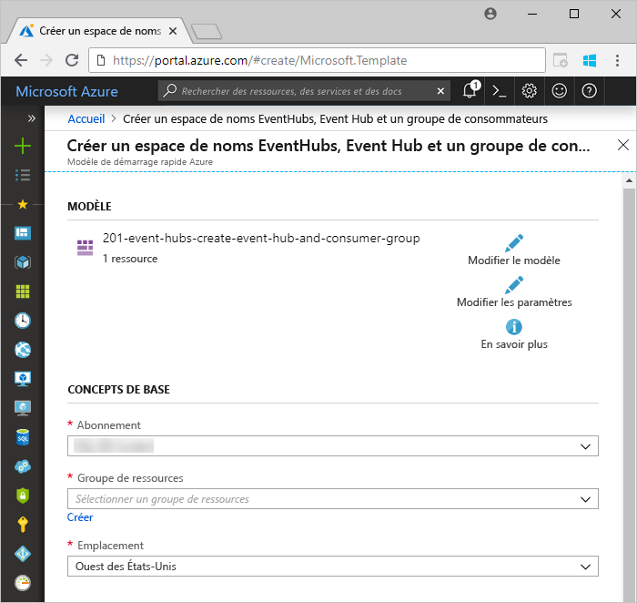

1. Sélectionnez l’abonnement dans lequel vous souhaitez créer le hub d’événements et créez un groupe de ressources nommé *test-hub-rg*.

    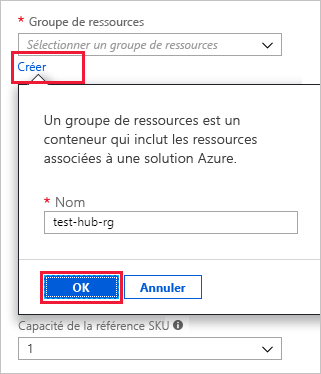

1. Renseignez le formulaire avec les informations suivantes.

    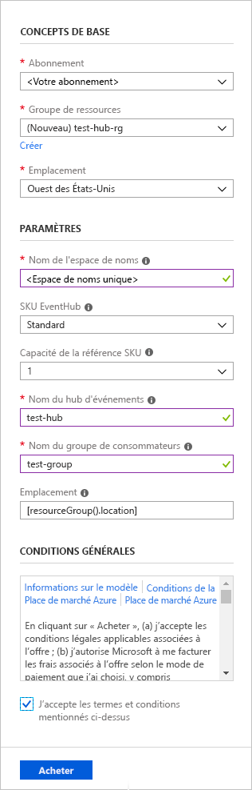

    Utilisez les valeurs par défaut pour tous les paramètres non listés dans le tableau suivant.

    **Paramètre** | **Valeur suggérée** | **Description du champ**
    |---|---|---|
    | Subscription | Votre abonnement | Sélectionnez l’abonnement Azure que vous souhaitez utiliser pour votre hub d’événements.|
    | Resource group | *test-hub-rg* | Créez un groupe de ressources. |
    | Location | *USA Ouest* | Pour cet article, sélectionnez *USA Ouest*. Pour un système de production, sélectionnez la région qui répond le mieux à vos besoins. Pour des performances optimales, créez l’espace de noms Event Hub au même emplacement que le cluster Kusto (en particulier pour les espaces de noms Event Hub ayant un débit élevé).
    | Nom de l’espace de noms | Nom unique de l’espace de noms | Choisissez un nom unique qui identifie votre espace de noms. Par exemple, *mytestnamespace*. Le nom de domaine *servicebus.windows.net* est ajouté au nom que vous fournissez. Le nom ne peut contenir que des lettres, des chiffres et des traits d’union. Le nom doit commencer par une lettre et se terminer par une lettre ou un chiffre. La valeur doit être comprise entre 6 et 50 caractères.
    | Nom du hub d’événements | *test-hub* | Le hub d’événements se trouve sous l’espace de noms, qui fournit un conteneur d’étendue unique. Le hub d’événements doit être unique dans l’espace de noms. |
    | Nom du groupe de consommateurs | *test-group* | Les groupes de consommateurs permettent que chacune des applications de consommation ait une vue distincte du flux d’événements. |
    | | |

1. Sélectionnez **Achat**, ce qui confirme que vous créez des ressources dans votre abonnement.

1. Dans la barre d’outils, sélectionnez **Notifications** pour superviser le processus de provisionnement. Le déploiement peut prendre plusieurs minutes, mais vous pouvez passer à l’étape suivante sans attendre.

    

## <a name="create-a-target-table-in-azure-data-explorer"></a>Créer une table cible dans l’Explorateur de données Azure

Créez maintenant une table dans l’Explorateur de données Azure, à laquelle Event Hubs envoie des données. Créez la table dans le cluster et la base de données provisionnés dans **Prérequis**.

1. Dans le portail Azure, accédez à votre cluster, puis sélectionnez **Requête**.

    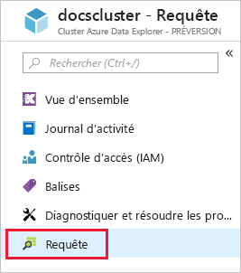

1. Copiez la commande suivante dans la fenêtre et sélectionnez **Exécuter** pour créer la table (TestTable) qui doit recevoir les données ingérées.

    ```Kusto
    .create table TestTable (TimeStamp: datetime, Name: string, Metric: int, Source:string)
    ```

    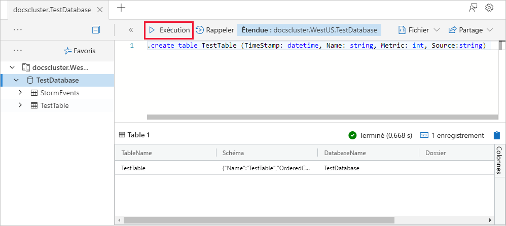

1. Copiez la commande suivante dans la fenêtre et sélectionnez **Exécuter** pour mapper les données JSON entrantes aux types de données et aux noms de colonne de la table (TestTable).

    ```Kusto
    .create table TestTable ingestion json mapping 'TestMapping' '[{"column":"TimeStamp","path":"$.timeStamp","datatype":"datetime"},{"column":"Name","path":"$.name","datatype":"string"},{"column":"Metric","path":"$.metric","datatype":"int"},{"column":"Source","path":"$.source","datatype":"string"}]'
    ```

## <a name="connect-to-the-event-hub"></a>Se connecter au hub d’événements

Vous vous connectez maintenant au hub d’événements depuis l’Explorateur de données Azure. Lorsque cette connexion est en place, les données qui passent dans le hub d’événements sont diffusées vers la table de test que vous avez créée précédemment dans cet article.

1. Sélectionnez **Notifications** dans la barre d’outils pour vérifier que le déploiement du hub d’événements a réussi.

1. Sous le cluster que vous avez créé, sélectionnez **Bases de données** et **TestDatabase**.

    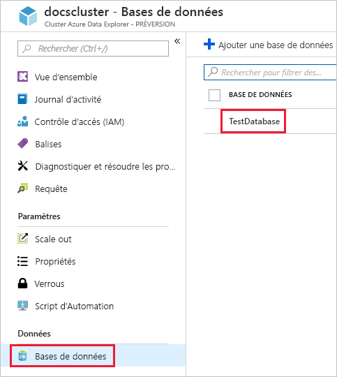

1. Sélectionnez **Ingestion des données**, puis **Ajouter une connexion de données**. Renseignez ensuite le formulaire avec les informations ci-après. Sélectionnez **Créer** lorsque vous avez terminé.

    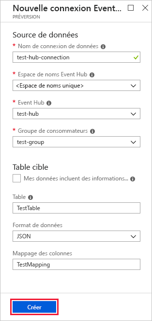

    **Source de données :**

    **Paramètre** | **Valeur suggérée** | **Description du champ**
    |---|---|---|
    | Nom de la connexion de données | *test-hub-connection* | Nom de la connexion que vous souhaitez créer dans l’Explorateur de données Azure.|
    | Espace de noms du hub d’événements | Nom unique de l’espace de noms | Nom choisi précédemment qui identifie votre espace de noms. |
    | Event Hub | *test-hub* | Hub d’événements que vous avez créé. |
    | Groupe de consommateurs | *test-group* | Groupe de consommateurs défini dans le hub d’événements que vous avez créé. |
    | Propriétés du système d’événements | Sélectionner les propriétés pertinentes | [Propriétés système du hub d’événements](/azure/service-bus-messaging/service-bus-amqp-protocol-guide#message-annotations). S’il existe plusieurs enregistrements par message d’événement, les propriétés système sont ajoutées au premier. Lors de l’ajout des propriétés système, [créez](/azure/kusto/management/tables#create-table) ou [mettez à jour](/azure/kusto/management/tables#alter-table-and-alter-merge-table) le schéma de table et le [mappage](/azure/kusto/management/mappings) pour inclure les propriétés sélectionnées. |
    | Compression | *Aucun* | Type de compression de la charge utile des messages Event Hub. Types de compression pris en charge : *Aucun, GZip*.|
    | | |

    **Table cible :**

    Deux options sont disponibles pour le routage des données ingérées : *statique* et *dynamique*. 
    Dans le cadre de cet article, vous utilisez le routage statique, où vous spécifiez le nom de table, le format des données et le mappage. Par conséquent, ne sélectionnez pas **My data includes routing info** (Mes données incluent des informations de routage).

     **Paramètre** | **Valeur suggérée** | **Description du champ**
    |---|---|---|
    | Table de charge de travail | *TestTable* | Table que vous avez créée dans **TestDatabase**. |
    | Format de données | *JSON* | Les formats pris en charge sont Avro, CSV, JSON, MULTILINE JSON, PSV, SOHSV, SCSV, TSV, TSVE, TXT, ORC et PARQUET. |
    | Mappage de colonnes | *TestMapping* | [Mappage](/azure/kusto/management/mappings) que vous avez créé dans **TestDatabase**, qui mappe les données JSON entrantes aux noms de colonne et aux types de données de **TestTable**. Obligatoire pour les formats JSON ou MULTILINE JSON, et facultatif pour les autres formats.|
    | | |

    > [!NOTE]
    > * Sélectionnez **My data includes routing info** pour utiliser le routage dynamique, où vos données incluent les informations de routage nécessaires comme indiqué dans les commentaires de l’[exemple d’application](https://github.com/Azure-Samples/event-hubs-dotnet-ingest). Si à la fois des propriétés statiques et des propriétés dynamiques sont définies, les propriétés dynamiques remplacent les propriétés statiques. 
    > * Seuls les événements mis en file d’attente après que vous avez créé la connexion de données sont ingérés.
    > * Vous pouvez également définir le type de compression via des propriétés dynamiques, comme indiqué dans l’[exemple d’application](https://github.com/Azure-Samples/event-hubs-dotnet-ingest).
    > * Les formats Avro, ORC et PARQUET, ainsi que les propriétés du système d’événements, ne sont pas pris en charge sur la charge utile de compression GZip.

[!INCLUDE [data-explorer-container-system-properties](../../includes/data-explorer-container-system-properties.md)]

## <a name="copy-the-connection-string"></a>Copier la chaîne de connexion

Lorsque vous exécutez l’[application exemple](https://github.com/Azure-Samples/event-hubs-dotnet-ingest) mentionnée dans les composants requis, vous avez besoin de la chaîne de connexion pour l’espace de noms du hub d’événements.

1. Sous l’espace de noms du hub d’événements que vous avez créé, sélectionnez **Stratégies d’accès partagé**, puis **RootManageSharedAccessKey**.

    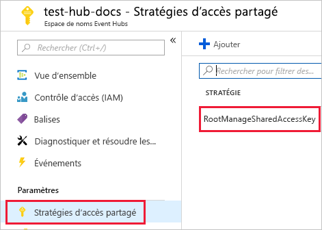

1. Copiez **Chaîne de connexion - Clé primaire**. Collez-la dans la prochaine section.

    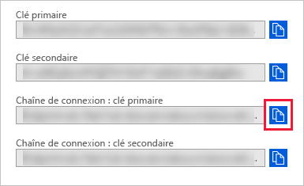

## <a name="generate-sample-data"></a>Générer un exemple de données

Utilisez l’[exemple d’application](https://github.com/Azure-Samples/event-hubs-dotnet-ingest) que vous avez téléchargé pour générer les données.

1. Ouvrez la solution de l’application exemple dans Visual Studio.

1. Dans le fichier *program.cs*, mettez à jour la constante `connectionString` avec la chaîne de connexion que vous avez copiée à partir de l’espace de noms du hub d’événements.

    ```csharp
    const string eventHubName = "test-hub";
    // Copy the connection string ("Connection string-primary key") from your Event Hub namespace.
    const string connectionString = @"<YourConnectionString>";
    ```

1. Générez et exécutez l'application. L’application envoie des messages au hub d’événements et affiche un état toutes les dix secondes.

1. Une fois que l’application a envoyé quelques messages, passez à l’étape suivante : examiner le flux de données dans votre hub d’événements et votre table de test.

## <a name="review-the-data-flow"></a>Examiner le flux de données

Avec l’application générant des données, vous pouvez maintenant voir le flux de données depuis le hub d’événements vers la table dans votre cluster.

1. Dans le portail Azure, sous votre hub d’événements, vous voyez le pic de l’activité pendant l’exécution de l’application.

    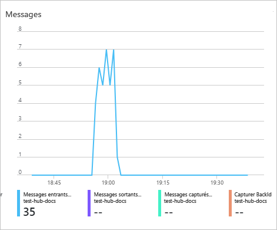

1. Exécutez la requête suivante dans votre base de données de test pour vérifier combien de messages sont arrivés dans la base de données jusqu’à présent.

    ```Kusto
    TestTable
    | count
    ```

1. Exécutez la requête suivante pour voir le contenu des messages :

    ```Kusto
    TestTable
    ```

    Le jeu de résultats doit ressembler à ce qui suit :

    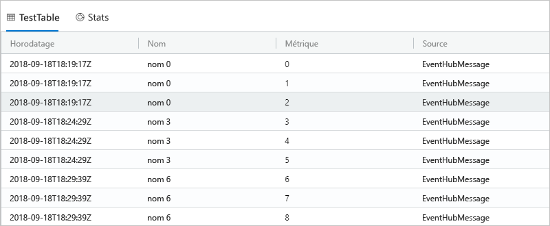

    > [!NOTE]
    > * Azure Data Explorer est associé à une stratégie d’agrégation (traitement par lot) conçue pour optimiser le processus d’ingestion des données. La stratégie est configurée sur 5 minutes ou 500 Mo de données, ce qui peut entraîner une certaine latence. Consultez la [stratégie de traitement par lot](/azure/kusto/concepts/batchingpolicy) pour les options d’agrégation. 
    > * L’ingestion de Event Hub comprend le temps de réponse de Event Hub de 10 secondes ou 1 Mo. 
    > * Configurez votre tableau pour prendre en charge la diffusion en continu et supprimez le décalage dans le temps de réponse. Consultez la [stratégie de diffusion en continu](/azure/kusto/concepts/streamingingestionpolicy). 

## <a name="clean-up-resources"></a>Nettoyer les ressources

Si vous ne prévoyez pas de réutiliser votre hub d’événements, nettoyez **test-hub-rg** pour éviter des frais.

1. Dans le portail Azure, sélectionnez **Groupes de ressources** tout à gauche, puis sélectionnez le groupe de ressources que vous avez créé.  

    Si le menu de gauche est réduit, sélectionnez le  pour le développer.

   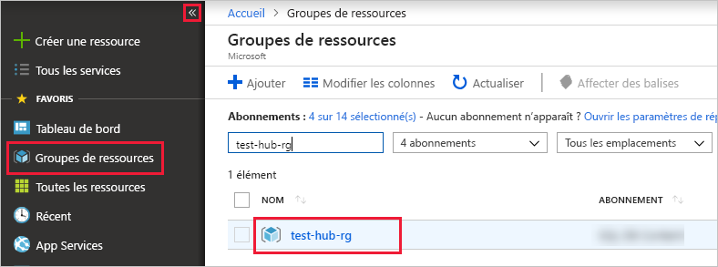

1. Sous **test-resource-group**, sélectionnez **Supprimer le groupe de ressources**.

1. Dans la nouvelle fenêtre, tapez le nom du groupe de ressources à supprimer (*test-hub-rg*), puis sélectionnez **Supprimer**.

## <a name="next-steps"></a>Étapes suivantes

* [Interroger des données dans Azure Data Explorer](web-query-data.md)
