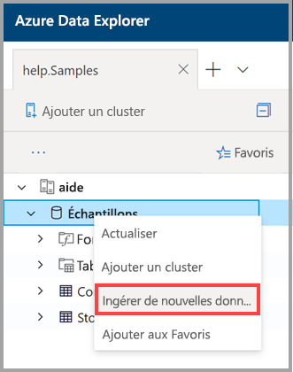

# Utiliser l’ingestion en un clic pour ingérer des données dans Azure Data Explorer

Cet article vous explique comment utiliser l’ingestion en un clic pour ingérer rapidement une nouvelle table au format JSON ou CSV. Les données peuvent être ingérées à partir du stockage ou d’un fichier local dans une table existante ou dans une nouvelle table. Utilisez l’Assistant intuitif d’ingestion en un clic ; vos données sont ingérées en quelques minutes. Ensuite, vous pouvez modifier la table et exécuter des requêtes à l’aide de l’interface utilisateur web d’Azure Data Explorer.

## Prérequis

* Si vous n’avez pas d’abonnement Azure, créez un [compte Azure gratuit](https://azure.microsoft.com/free/) avant de commencer.
* Connectez-vous à [l’application](https://dataexplorer.azure.com/).
* Créez [un cluster et une base de données Azure Data Explorer](create-cluster-database-portal.md).
* Connectez-vous à [l’interface utilisateur web](https://dataexplorer.azure.com/) et [ajoutez une connexion à votre cluster](/azure/data-explorer/web-query-data#add-clusters).
* Créez une source de données dans le stockage Azure.

## Ingérer de nouvelles données

1. Cliquez avec le bouton droit sur la ligne *base de données* ou *table* dans le menu de gauche de l’interface utilisateur web, puis sélectionnez **Ingérer de nouvelles données (préversion)** .

       
 
1. Dans la fenêtre **Ingestion de nouvelles données (préversion)** , sélectionnez l’onglet **Source**, puis renseignez les **Détails du projet** :

    * Pour **Table**, sélectionnez le nom d’une table existante dans le menu déroulant ou sélectionnez **Créer** pour créer une table.
    * Pour **Type d’ingestion**, sélectionnez **À partir du stockage** ou **À partir d’un fichier**.
        * Si vous avez sélectionné **À partir du stockage**, sélectionnez **Lien vers le stockage** pour ajouter l’URL. Utilisez [l’URL SAS d’objet blob](/azure/vs-azure-tools-storage-explorer-blobs#get-the-sas-for-a-blob-container) pour les comptes de stockage privés. 
            * Si vous avez sélectionné **à partir d’un fichier**, sélectionnez **Parcourir**, puis faites glisser le fichier dans la zone.
    * Sélectionnez **Modifier le schéma** pour afficher et modifier la configuration de colonne de votre table.
 
     

    > [!TIP]
    > Si vous sélectionnez **Ingérer de nouvelles données (préversion)** sur une ligne de *table*, le nom de la table sélectionnée s’affiche dans les **Détails du projet**.

1. Si vous avez sélectionné une table existante, la fenêtre **Mapper les colonnes** s’ouvre pour mapper les colonnes des données source aux colonnes de la table cible. 
    * Utilisez **Omettre la colonne** pour supprimer une colonne cible de la table. 
    * Utilisez **Nouvelle colonne** pour ajouter une nouvelle colonne à la table. 

    

1. Sous l’onglet **Schéma** :

    * Sélectionnez **Type de compression** dans le menu déroulant, puis sélectionnez **Non compressé** ou **GZip**.
    * Sélectionnez **Format des données** dans le menu déroulant , puis sélectionnez **JSON**, **CSV**, **TSV**, **SCSV**, **SOHSV**, **TSVE** ou **PSV**. 
        * Si vous sélectionnez le format **JSON**, vous devez également sélectionner **Niveaux JSON**, de 1 à 10. Les niveaux affectent la représentation des données de colonne de la table. 
        * Si vous sélectionnez un autre format que JSON, vous devez cocher la case **Inclure les noms des colonnes** pour ignorer la ligne d’en-tête du fichier.
    * Le **Nom de mappage** est défini automatiquement, mais il peut être modifié.
    * Si vous avez sélectionné une table existante, vous pouvez sélectionner **Mapper les colonnes** pour ouvrir la fenêtre **Mapper les colonnes**.

    

1. Au-dessus du volet **Éditeur**, sélectionnez le bouton **v** pour ouvrir l’éditeur. Dans l’éditeur, vous pouvez afficher et copier les requêtes automatiques générées à partir de vos entrées. 

1.  Dans la table : 
    * Cliquez avec le bouton droit sur les nouveaux en-têtes de colonne pour **Modifier le type de données**, **Renommer la colonne**, **Supprimer la colonne**, **Trier par ordre croissant** ou **Trier par ordre décroissant**. Sur les colonnes existantes, seul le tri des données est disponible. 
    * Double-cliquez sur le nom de la nouvelle colonne à modifier.

1. Sélectionnez **Démarrer l’ingestion** pour créer une table et un mappage et pour commencer l’ingestion de données.

     
 
## Données de requête

1. Dans la fenêtre **Ingestion de données terminée**, les trois étapes sont signalées par des coches vertes si l’ingestion des données se déroule correctement.
 
    

1. Sélectionnez le bouton **v** pour ouvrir la requête. Copiez la requête dans l’interface utilisateur web pour la modifier.

1. Le menu à droite contient les options **Requêtes rapides** et **Outils rapides**. 

    * Les **requêtes rapides** incluent des liens vers l’interface utilisateur web avec des exemples de requêtes.
    * Les **Outils** incluent un lien vers des **commandes Drop** dans l’interface utilisateur web, qui vous permettent de résoudre les problèmes en exécutant les commandes `.drop` appropriées.

    > [!TIP]
    > Des données peuvent être perdues avec les commandes `.drop`. Utilisez-les avec précaution.

## Étapes suivantes

* [Interroger des données dans l’interface utilisateur web Azure Data Explorer](web-query-data.md)
* [Écrire des requêtes pour Azure Data Explorer à l’aide du langage de requête Kusto](write-queries.md)
