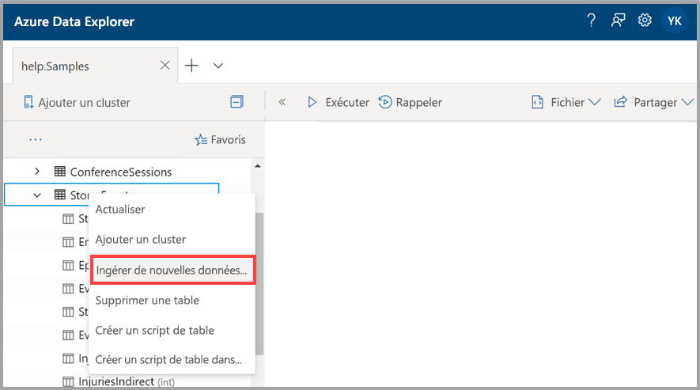
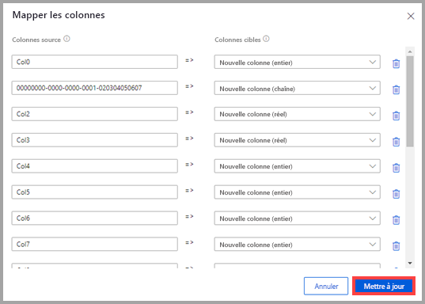
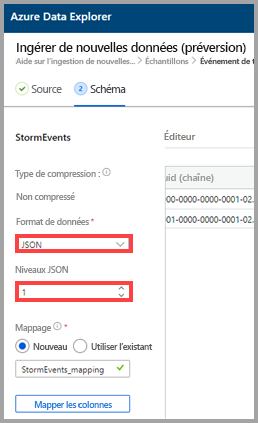
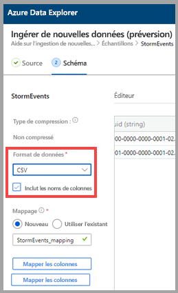
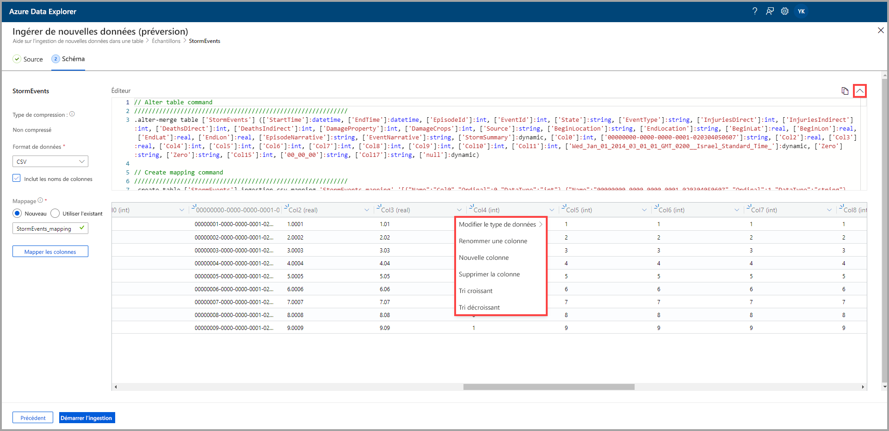
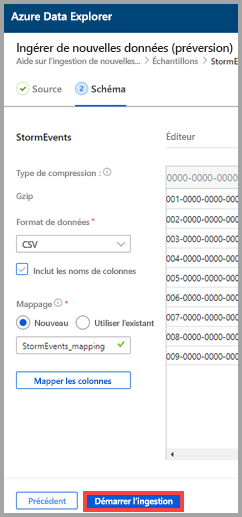
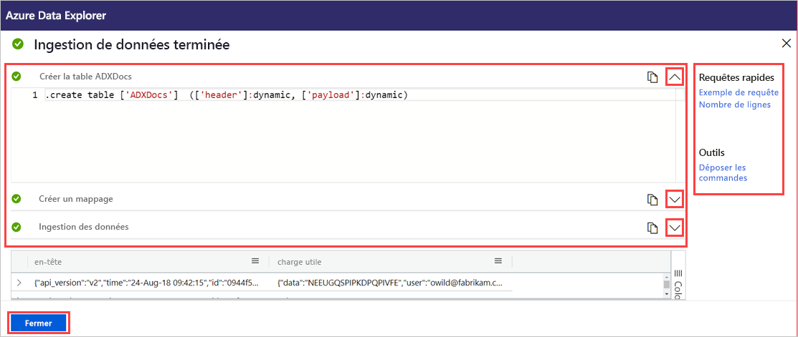

# Utiliser l’ingestion en un clic pour ingérer des données dans une table existante d’Azure Data Explorer

L’ingestion en un clic vous permet d’ingérer rapidement dans une table des données au format JSON, CSV et dans d’autres formats. À l’aide de l’interface utilisateur web d’Azure Data Explorer, vous pouvez ingérer des données à partir du stockage, d’un fichier local ou d’un conteneur. 

Ce document décrit l’utilisation de l’Assistant intuitif Ingestion en un clic pour ingérer des données JSON depuis un fichier dans une table existante. Vous pouvez ensuite modifier la table et exécuter des requêtes avec l’interface utilisateur web d’Azure Data Explorer.

L’ingestion en un clic est particulièrement utile lorsque vous procédez à l’ingestion de données pour la première fois, ou lorsque le schéma de vos données ne vous est pas familier. 

Pour obtenir une vue d’ensemble de l’ingestion en un clic, et la liste des prérequis, consultez [Ingestion en un clic](ingest-data-one-click.md).
Pour plus d’informations sur l’ingestion de données dans une nouvelle table d’Azure Data Explorer, consultez [Ingestion en un clic dans une nouvelle table](one-click-ingestion-new-table.md).

## Ingérer de nouvelles données

1. Dans le menu de gauche de l’interface utilisateur web, cliquez avec le bouton droit sur une *base de données* ou une *table*, puis sélectionnez **Ingérer de nouvelles données (préversion)** .

       
 
1. Dans la fenêtre **Ingérer de nouvelles données (préversion)** , l’onglet **Source** est sélectionné automatiquement.

1. Si le champ **Table** n’est pas renseigné automatiquement, sélectionnez un nom de table existant dans le menu déroulant.
    > [!TIP]
    > Si vous sélectionnez **Ingérer de nouvelles données (préversion)** sur une ligne de *table*, le nom de la table sélectionnée s’affiche dans les **Détails du projet**.

[!INCLUDE [data-explorer-one-click-ingestion-types](../../includes/data-explorer-one-click-ingestion-types.md)]
    
Sélectionnez **Modifier le schéma** pour afficher et modifier la configuration de colonne de votre table.

## Modifier le schéma

1. La boîte de dialogue **Mapper les colonnes** s’ouvre et vous pouvez mapper les colonnes de données sources aux colonnes de la table cible. 
    * Dans les champs **Colonnes sources**, entrez les noms des colonnes à mapper aux **Colonnes cibles**.
    * Pour supprimer un mappage, sélectionnez l’icône de la corbeille.

    

1. Sélectionnez **Update**.
1. Sous l’onglet **Schéma** :
    1. Sélectionnez **Type de compression**, puis sélectionnez **Non compressé** ou **GZip**.

        [!INCLUDE [data-explorer-one-click-ingestion-edit-schema](../../includes/data-explorer-one-click-ingestion-edit-schema.md)]
        
    1. Si vous sélectionnez **JSON**, vous devez également sélectionner **Niveaux JSON**, entre 1 et 10. Les niveaux affectent la représentation des données de colonne de la table.

    

    * Si vous sélectionnez un autre format que JSON, vous pouvez cocher la case **Inclure les noms des colonnes** pour ignorer la ligne d’en-tête du fichier.
        
    

    > [!Note]
    > Les formats tabulaires peuvent ingérer des données de colonne dans une seule colonne de table Azure Data Explorer. 

    * Les nouveaux mappages sont définis automatiquement, mais vous pouvez modifier cette option pour utiliser un mappage existant. 
    * Vous pouvez sélectionner **Mapper les colonnes** pour ouvrir la fenêtre **Mapper les colonnes**.

## Copier et coller des requêtes

1. Au-dessus du volet **Éditeur**, sélectionnez le bouton **v** pour ouvrir l’éditeur. Dans l’éditeur, vous pouvez afficher et copier les commandes automatiques générées à partir de vos entrées. 
1. Dans le tableau : 
    * Sélectionnez les nouveaux en-têtes de colonne pour ajouter une **Nouvelle colonne**, **Supprimer la colonne**, **Trier par ordre croissant** ou **Trier par ordre décroissant**. Sur les colonnes existantes, seul le tri des données est disponible.

    > [!Note]
    > * Vous ne pouvez pas mettre à jour le nom et le type de données des tables existantes.
    > * Les commandes Drop annulent uniquement les modifications apportées par ce flux d’ingestion (nouvelles étendues et colonnes). Aucune autre chose ne sera supprimée.

 

## Démarrer l’ingestion

Sélectionnez **Démarrer l’ingestion** pour créer une table et un mappage et pour commencer l’ingestion de données.

## Ingestion de données terminée

Dans la fenêtre **Ingestion de données terminée**, les trois étapes sont signalées par des coches vertes si l'ingestion des données s'est terminée avec succès.
 

[!INCLUDE [data-explorer-one-click-ingestion-query-data](../../includes/data-explorer-one-click-ingestion-query-data.md)]

## Étapes suivantes

* [Interroger des données dans l’interface utilisateur web Azure Data Explorer](/azure/data-explorer/web-query-data)
* [Écrire des requêtes pour Azure Data Explorer à l’aide du langage de requête Kusto](/azure/data-explorer/write-queries)
