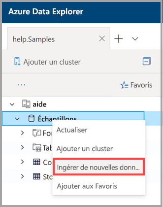
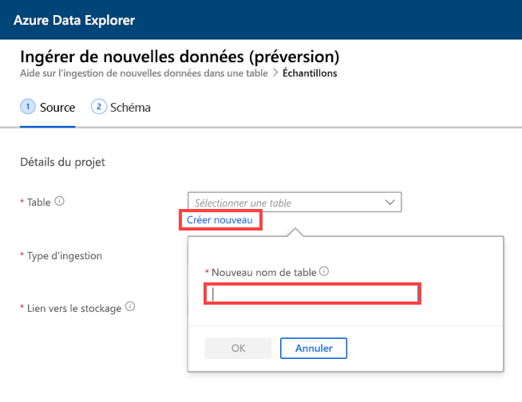
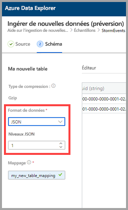
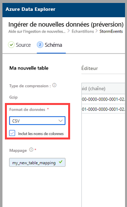
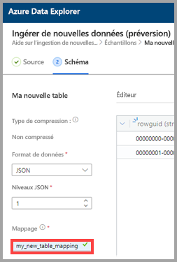
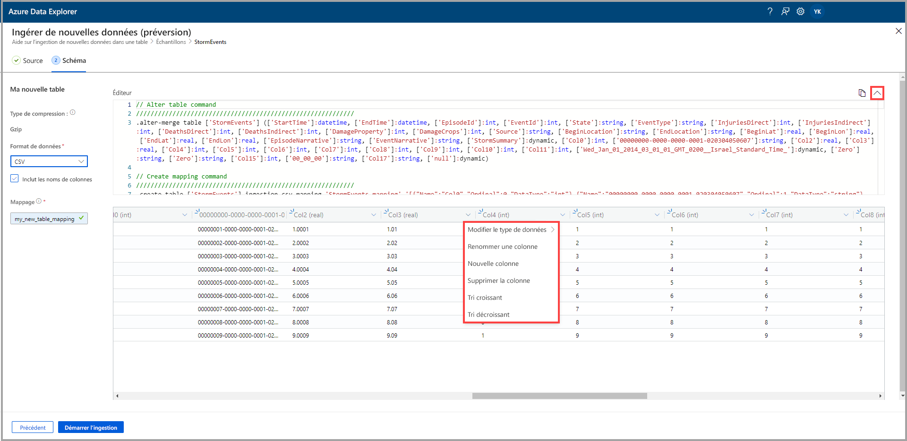
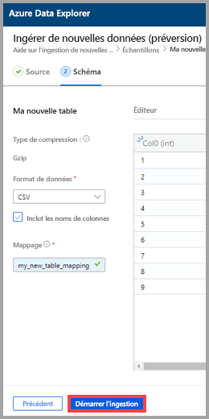
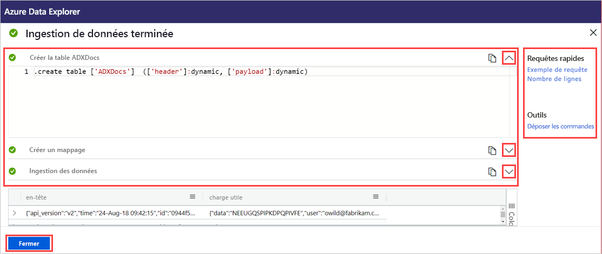

# Utiliser l’ingestion en un clic pour ingérer des données dans une nouvelle table d’Azure Data Explorer

L’ingestion en un clic vous permet d’ingérer rapidement dans une table des données au format JSON, CSV et dans d’autres formats. À l’aide de l’interface utilisateur web d’Azure Data Explorer, vous pouvez ingérer des données à partir du stockage, d’un fichier local ou d’un conteneur. 

Ce document décrit l’utilisation de l’Assistant intuitif Ingestion en un clic pour ingérer des données CSV depuis un conteneur dans une nouvelle table. Vous pouvez ensuite modifier la table et exécuter des requêtes avec l’interface utilisateur web d’Azure Data Explorer. Vous pouvez également définir l’ingestion continue pour ingérer automatiquement des données dans la table lorsque les données sources sont mises à jour.

L’ingestion en un clic est particulièrement utile lorsque vous procédez à l’ingestion de données pour la première fois, ou lorsque le schéma de vos données ne vous est pas familier. 

Pour obtenir une vue d’ensemble de l’ingestion en un clic, et la liste des prérequis, consultez [Ingestion en un clic](ingest-data-one-click.md).
Pour plus d’informations sur l’ingestion de données dans une table existante d’Azure Data Explorer, consultez [Ingestion en un clic dans une table existante](one-click-ingestion-existing-table.md).

## Ingérer de nouvelles données

1. Dans le menu de gauche de l’interface utilisateur web, cliquez avec le bouton droit sur une *base de données*, puis sélectionnez **Ingérer de nouvelles données (préversion)** .

       
 
1. Dans la fenêtre **Ingérer de nouvelles données (préversion)** , l’onglet **Source** est sélectionné automatiquement. 

1. Sélectionnez **Créer une table** et entrez un nom pour la nouvelle table. Vous pouvez utiliser des caractères alphanumériques, des traits d’union et des traits de soulignement. Les caractères spéciaux ne sont pas pris en charge.

 

[!INCLUDE [data-explorer-one-click-ingestion-types](../../includes/data-explorer-one-click-ingestion-types.md)]

Sélectionnez **Modifier le schéma** pour afficher et modifier la configuration de colonne de votre table. Le système sélectionne un des objets blob au hasard, et le schéma est généré en fonction de cet objet blob. En examinant le nom de la source, le service identifie automatiquement s’il est compressé ou non.

## Modifier le schéma

1. Sous l’onglet **Schéma** :

    1. Sélectionnez **Format de données**.

        [!INCLUDE [data-explorer-one-click-ingestion-edit-schema](../../includes/data-explorer-one-click-ingestion-edit-schema.md)]

    1. Si vous sélectionnez **JSON**, vous devez également sélectionner **Niveaux JSON**, entre 1 et 10. Les niveaux affectent la représentation des données de colonne de la table. 

    

    * Si vous sélectionnez un autre format que JSON, vous pouvez cocher la case **Inclure les noms des colonnes** pour ignorer la ligne d’en-tête du fichier.

        
        
1. Dans le champ **Nom du mappage**, entrez un nom de mappage. Vous pouvez utiliser des caractères alphanumériques et des traits de soulignement. Les espaces, les caractères spéciaux et les traits d’Union ne sont pas pris en charge.
    
    

## Copier et coller des requêtes

1. Au-dessus du volet **Éditeur**, sélectionnez le bouton **v** pour ouvrir l’éditeur. Dans l’éditeur, vous pouvez afficher et copier les requêtes automatiques générées à partir de vos entrées. 
1. Dans le tableau : 
    * Double-cliquez sur le nom de la nouvelle colonne à modifier.
    * Sélectionnez de nouveaux en-têtes de colonnes et effectuez une des opérations suivantes :
    
|Action         |Description                                  |
|-----------------|-------------------------------------------|
|Modifier le type de données |Changement du type de données en remplaçant celui que le service a sélectionné automatiquement par l’un des autres [types de données pris en charge](#edit-the-schema)|
|Renommer une colonne    |Changement de nom de la colonne |
|Nouvelle colonne       |Ajout d'une nouvelle colonne|
|Supprimer la colonne    |Suppression de la colonne sélectionnée|
|Tri croissant   |Tri de la table en suivant la colonne sélectionnée, dans l’ordre croissant (colonnes existantes seulement)|
|Tri décroissant  |Tri de la table en suivant la colonne sélectionnée, dans l’ordre décroissant (colonnes existantes seulement) |

> [!Note]
> Pour les formats tabulaires, chaque colonne peut être ingérée dans une colonne dans Azure Data Explorer.
> Vous pouvez créer des colonnes de différents niveaux JSON.

 

## Démarrer l’ingestion

Sélectionnez **Démarrer l’ingestion** pour créer une table et un mappage et pour commencer l’ingestion de données.

## Ingestion de données terminée

Dans la fenêtre **Ingestion de données terminée**, les trois étapes sont signalées par des coches vertes si l'ingestion des données s'est terminée avec succès.
 

[!INCLUDE [data-explorer-one-click-ingestion-query-data](../../includes/data-explorer-one-click-ingestion-query-data.md)]

**Ingestion continue**

L’ingestion continue vous permet de créer une grille d’événement qui écoute le conteneur source. Tout nouvel objet blob qui répond aux critères des paramètres prédéfinis (préfixe, suffixe, etc.) est automatiquement ingéré dans la table de destination.

> [!Note]
> L’ingestion continue n’est pertinente que lors d’une ingestion à partir d’un conteneur.

1. Sélectionnez **Ingestion continue** pour ouvrir le portail Azure. La page de connexion des données s’affiche avec le connecteur de données de la grille d’événement ouvert, et les paramètres source et cible déjà entrés (conteneur source, tables et mappages).

1. Sélectionnez **Créer** pour créer une connexion de données qui écoute toutes les modifications dans ce conteneur. 

## Étapes suivantes

* [Interroger des données dans l’interface utilisateur web Azure Data Explorer](/azure/data-explorer/web-query-data)
* [Écrire des requêtes pour Azure Data Explorer à l’aide du langage de requête Kusto](/azure/data-explorer/write-queries)
