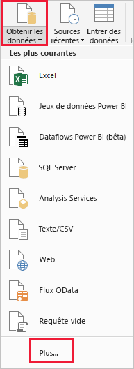
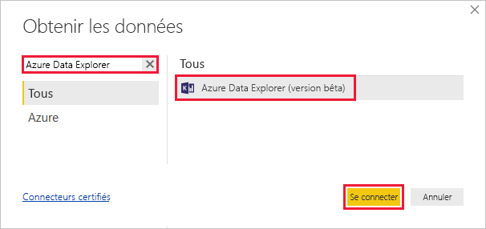
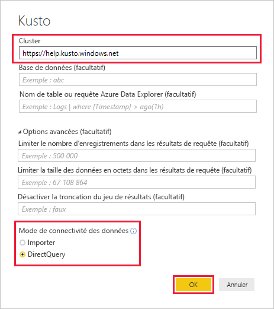
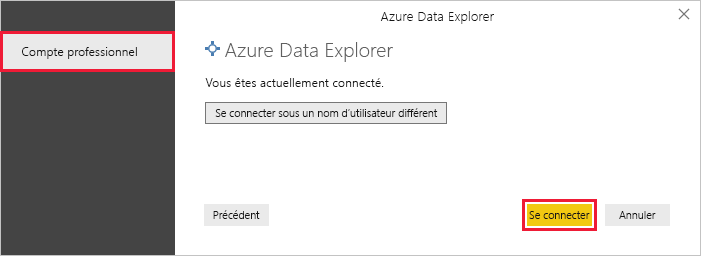
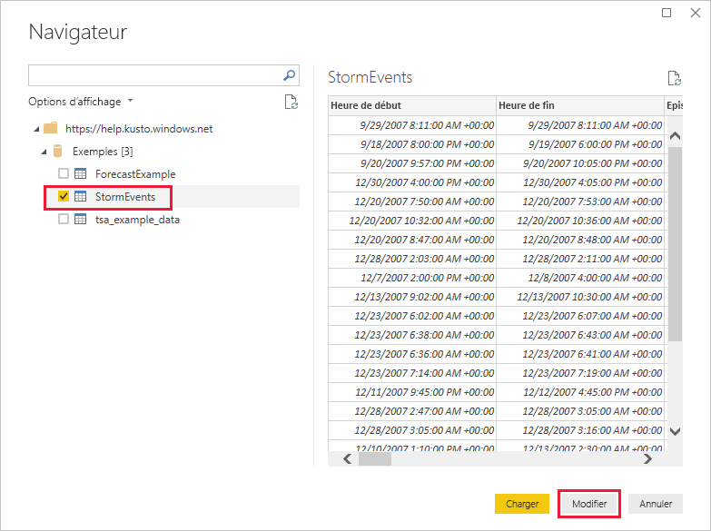
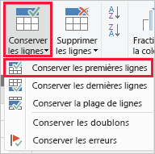
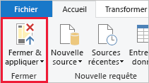

# Démarrage rapide : Visualiser des données à l’aide du connecteur Azure Data Explorer pour Power BI

L’Explorateur de données Azure est un service d’exploration de données rapide et hautement évolutive pour les données des journaux et les données de télémétrie. Power BI est une solution d’analytique métier qui vous permet de visualiser vos données et de partager les résultats dans votre organisation.

Azure Data Explorer offre trois options pour se connecter à des données dans Power BI : utiliser le connecteur intégré, importer une requête depuis Azure Data Explorer ou utiliser une requête SQL. Ce guide de démarrage rapide vous montre comment utiliser le connecteur intégré pour obtenir des données et les visualiser dans un rapport Power BI.

Si vous n’avez pas d’abonnement Azure, créez un [compte Azure gratuit](https://azure.microsoft.com/free/) avant de commencer.

## Prérequis

Vous avez besoin des éléments suivants pour ce guide de démarrage rapide :

* Un compte e-mail professionnel qui est membre d’Azure Active Directory pour pouvoir vous connecter au [cluster help d’Azure Data Explorer](https://dataexplorer.azure.com/clusters/help/databases/samples).

* [Power BI Desktop](https://powerbi.microsoft.com/get-started/) (sélectionnez **TÉLÉCHARGER GRATUITEMENT**)

## Obtenir des données auprès d’Azure Data Explorer

Connectez-vous d’abord au cluster help d’Azure Data Explorer : vous récupérez alors une partie des données de la table *StormEvents*. [!INCLUDE [data-explorer-storm-events](../../includes/data-explorer-storm-events.md)]

1. Dans Power BI Desktop, sous l’onglet **Accueil**, sélectionnez **Obtenir les données**, puis **Plus**.

    

1. Recherchez *Azure Data Explorer*, sélectionnez **Azure Data Explorer (bêta)**, puis **Se connecter**.

    

1. Dans l’écran **Connecteur en préversion**, sélectionnez **Continuer**.

1. Dans l’écran suivant, renseignez le formulaire avec les informations suivantes.

    

    **Paramètre** | **Valeur** | **Description du champ**
    |---|---|---|
    | Cluster | *https://help.kusto.windows.net* | URL pour le cluster help. Pour les autres clusters, l’URL est de la forme *https://\<NomCluster\>.\< Région\>.kusto.windows.net*. |
    | Base de données | Laisser vide | Une base de données qui est hébergée sur le cluster auquel vous vous connectez. Nous la sélectionnerons dans une étape ultérieure. |
    | Nom de la table | Laisser vide | Une des tables de la base de données ou une requête comme <code>StormEvents \| take 1000</code>. Nous la sélectionnerons dans une étape ultérieure. |
    | Options avancées | Laisser vide | Options pour vos requêtes, comme la taille du jeu de résultats. |
    | Mode de connectivité des données | *DirectQuery* | Détermine si Power BI importe les données ou s’il se connecte directement à la source de données. Vous pouvez utiliser l’une ou l’autre des options avec ce connecteur. |
    | | | |

1. Si vous n’avez pas déjà une connexion au cluster help, connectez-vous. Connectez-vous avec un compte professionnel, puis sélectionnez **Se connecter**.

    

1. Dans l’écran **Navigateur**, développez la base de données **Samples**, sélectionnez **StormEvents** puis **Modifier**.

    

    La table s’ouvre dans l’éditeur Power Query, où vous pouvez modifier les lignes et les colonnes avant d’importer les données.

1. Dans l’éditeur Power Query, sélectionnez la flèche en regard de la colonne **DamageCrops**, puis **Tri décroissant**.

    

1. Sous l’onglet **Accueil**, sélectionnez **Conserver les lignes**, puis **Conserver les lignes du haut**. Entrez la valeur *1 000* pour faire apparaître les 1 000 premières lignes de la table triée.

    

1. Sous l’onglet **Accueil**, sélectionnez **Fermer et appliquer**.

    

## Visualiser les données dans un rapport

[!INCLUDE [data-explorer-power-bi-visualize-basic](../../includes/data-explorer-power-bi-visualize-basic.md)]

## Supprimer des ressources

Si vous n’avez plus besoin du rapport que vous avez créé pour ce guide de démarrage rapide, supprimez le fichier Power BI Desktop (.pbix).

## Étapes suivantes

> [!div class="nextstepaction"]
> [Démarrage rapide : Visualiser des données avec une requête importée dans Power BI](power-bi-imported-query.md)
